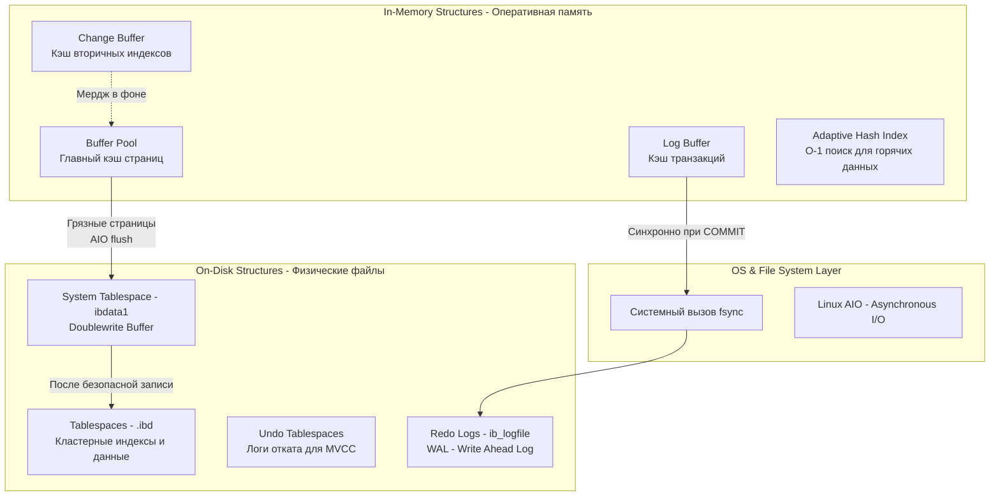

В прошлой статье мы рассмотрели архитектуру MySQL и выяснили, что ядро базы данных делегирует всю работу с диском и транзакциями подключаемым подсистемам (Storage Engines). Сегодня мы погружаемся в **InnoDB** — стандартный и самый мощный движок MySQL. 

Если вы бэкенд-разработчик, пишущий высоконагруженные системы на Go, 99% времени вы будете работать именно с InnoDB. Понимание того, как он раскладывает байты по дискам и оперативной памяти, отличает Senior-инженера от Junior-а, который слепо верит в магию баз данных.

## Анатомия InnoDB: RAM и Disk

InnoDB спроектирован так, чтобы минимизировать узкие места дисковой подсистемы (I/O). Диск (даже NVMe SSD) работает на порядки медленнее оперативной памяти и кэшей CPU. Поэтому философия InnoDB проста: **работать в памяти, а на диск писать асинхронно или большими последовательными блоками (Sequential I/O)**.



---

## 1. Структуры на диске (On-Disk Structures)

### Страницы и экстенты (Pages & Extents)
Вся работа с данными в InnoDB ведется блоками фиксированного размера, которые называются **страницами (Pages)**. По умолчанию размер страницы в InnoDB — **16 KB**. 

> [!info] Под капотом: Mechanical Sympathy и размер страницы
> Операционная система (Linux) обычно оперирует страницами памяти по 4 KB. Твердотельные накопители (SSD) читают и пишут блоками по 4-8 KB. Почему InnoDB использует 16 KB?
> Исторически это было сделано для оптимизации работы с HDD: прочитать 16 KB за один оборот шпинделя выгоднее, чем делать 4 операции поиска по 4 KB. Сегодня, на NVMe SSD, вы можете перекомпилировать или перенастроить InnoDB на размер страницы в 4 KB (`innodb_page_size=4k`), чтобы выровнять базу данных по размеру страницы OS и железа. Это уберет оверхед на чтение лишних байт при случайном доступе (Random Read) и снизит Write Amplification (усиление записи) на SSD.

Страницы группируются в **Экстенты (Extents)** по 64 штуки (1 MB). А экстенты образуют **Табличные пространства (Tablespaces)** — те самые файлы `.ibd`, которые вы видите в директории MySQL.

### Кластерный индекс (Clustered Index)
Это фундаментальное отличие InnoDB от многих других БД (и от MyISAM). В InnoDB **таблица — это и есть индекс**. 
Данные строк физически хранятся в листовых узлах (leaf nodes) B+ дерева первичного ключа. Об этом мы будем детально говорить в статье [[3. Индексы в MySQL]], но для понимания архитектуры важно знать: поиск по первичному ключу (`ID`) в InnoDB невероятно быстр, так как он сразу приводит вас к физической строке на диске (или в кэше), без дополнительных прыжков по памяти.

---

## 2. Структуры в памяти (In-Memory Structures)

### Buffer Pool (Пул буферов)
Это сердце InnoDB. База данных *никогда* не изменяет данные напрямую на диске. Когда вы делаете `SELECT` или `UPDATE`, InnoDB сначала загружает 16 KB страницу с диска в Buffer Pool, а затем работает с ней в оперативной памяти.

Buffer Pool использует модифицированный алгоритм LRU (Least Recently Used). 

> [!tip] Собеседование: Защита от Full Table Scan
> **Вопрос:** Если мы сделаем `SELECT * FROM huge_table` без индексов (Full Table Scan), вымоет ли эта операция все полезные "горячие" данные из Buffer Pool?
> **Ответ:** Нет. В InnoDB LRU-список разделен на две части: "молодую" (New, ~5/8 объема) и "старую" (Old, ~3/8 объема). При чтении с диска страницы попадают в "старую" часть (Midpoint insertion strategy). Если к странице больше не было обращений (как при линейном сканировании), она быстро вытесняется, не затрагивая горячие данные в "молодой" части.

### Change Buffer
Что если мы обновляем строку, и нужно обновить её вторичный индекс, но страницы с этим индексом сейчас нет в Buffer Pool? Читать её с диска (Random I/O) ради изменения пары байт — непозволительная роскошь.
Вместо этого InnoDB записывает информацию об изменении в **Change Buffer** (кэш в RAM). Когда целевая страница индекса всё-таки будет прочитана в Buffer Pool (из-за другого запроса), InnoDB произведет слияние (Merge) изменений. Это превращает медленный Random I/O в быстрые последовательные записи в память.

---

## 3. Транзакционность и ACID: Взаимодействие с ОС

Обеспечение гарантий ACID — самая дорогая операция для любой базы данных, так как она требует принудительной синхронизации данных с диском (системные вызовы ОС).

### Atomicity & Durability: Redo Log и fsync
Как сделать так, чтобы при отключении питания данные не потерялись, но при этом не ждать записи 16 KB страниц на медленный диск при каждой транзакции?

Решение — **WAL (Write-Ahead Logging)**, который в InnoDB называется **Redo Log** (файлы `ib_logfile`).
При `COMMIT` транзакции, InnoDB записывает не саму измененную страницу, а только маленькую дельту (вектор изменений: "на странице X, по смещению Y, записать байты Z") в **Log Buffer** в памяти. 

Затем вызывается системный вызов `fsync`, который приказывает ОС сбросить этот буфер на диск (в Redo Log). Запись в лог идет строго последовательно (Sequential I/O), что работает очень быстро. Измененные страницы данных (Dirty Pages) сбрасываются на диск асинхронно, фоновыми потоками. Если сервер упадет, при рестарте InnoDB прочитает Redo Log и "накатит" (Redo) изменения на старые страницы. Подробнее про это в [[8. WAL. Write Ahead Log]].

> [!warning] Ловушка / Gotcha: innodb_flush_log_at_trx_commit
> Это самый важный параметр конфигурации MySQL для бэкендера.
> * `1` (По умолчанию): Строгий ACID. При каждом `COMMIT` вызывается `fsync`. Максимальная надежность, но низкая пропускная способность по записи (упирается в IOPS диска).
> * `2`: При `COMMIT` данные пишутся в кэш ОС (системный вызов `write`), но `fsync` вызывается раз в секунду фоновым потоком. **Смерть MySQL не приведет к потере данных, но крах самой ОС (или отключение питания сервера) уничтожит транзакции за последнюю секунду.** Производительность возрастает многократно.
> * `0`: `write` и `fsync` раз в секунду. Вы можете потерять данные даже при падении самого процесса MySQL. Используйте только для баз, кэширующих некритичные данные.

### Consistency: Doublewrite Buffer
Мы уже говорили про разницу в размерах страниц (InnoDB: 16 KB, ОС: 4 KB). 
Представьте, что фоновый поток InnoDB сбрасывает "грязную" 16 KB страницу на диск. Для ОС это 4 записи по 4 KB. Во время записи второго блока отключается питание. 
Результат: **Torn Page (Разорванная страница)**. Половина страницы старая, половина новая. Redo Log не сможет её восстановить, потому что он содержит лишь дельты, а для дельты нужна консистентная базовая страница.

Для защиты используется **Doublewrite Buffer** (системная область на диске). Сначала InnoDB пишет 16 KB страницу в Doublewrite Buffer (последовательный I/O, очень быстро), вызывает `fsync`, и только потом пишет эту же страницу на её законное место в файле `.ibd`. Если сервер упадет во время записи в `.ibd`, InnoDB восстановит целую страницу из Doublewrite Buffer.

### Isolation: MVCC и Undo Logs
Для обеспечения изоляции транзакций (чтобы один `SELECT` не блокировал `UPDATE`) InnoDB использует механизм [[7. MVCC. Multi Version Concurrency Control]].
Когда вы изменяете строку, старая версия строки не удаляется. Она копируется в **Undo Log**. 
Каждая физическая строка в InnoDB имеет два скрытых поля:
1. `DB_TRX_ID` (6 байт): ID транзакции, которая последней изменила строку.
2. `DB_ROLL_PTR` (7 байт): Указатель отката — ссылка на старую версию строки в Undo Log.

Благодаря этому, если транзакция A начала читать таблицу, а транзакция B в это время изменяет строки, транзакция A пойдет по указателям `DB_ROLL_PTR` в Undo Log и прочитает старые, консистентные для её снимка времени (Snapshot), версии строк.

> [!tip] Собеседование: Почему `SELECT COUNT(*)` тормозит в InnoDB?
> В MyISAM счетчик количества строк в таблице хранится в метаданных и возвращается за O(1). В InnoDB, из-за MVCC, **не существует единого понятия "количество строк"**. В один и тот же момент времени для транзакции A в таблице может быть 100 строк, а для транзакции B — 105 строк (если она вставила 5 строк и еще не сделала коммит).
> Поэтому на запрос `SELECT COUNT(*)` InnoDB вынужден физически сканировать индекс (обычно самый маленький вторичный индекс) B+ дерева и считать строки, проверяя для каждой `DB_TRX_ID` на видимость в текущей транзакции.

## Практика в Go: Работа с транзакциями

В Go работа с транзакциями, которые обеспечивает InnoDB, инкапсулирована в структуре `sql.Tx` (подробнее в [[1. Работа с БД в Go. database_sql]]). Идиоматичный Go требует строгого соблюдения управления контекстом и гарантии отката транзакции при ошибках.

```go
package repository

import (
	"context"
	"database/sql"
	"fmt"
)

func TransferMoney(ctx context.Context, db *sql.DB, fromID, toID int, amount float64) error {
	// Устанавливаем уровень изоляции (зависит от настроек InnoDB, обычно Repeatable Read)
	tx, err := db.BeginTx(ctx, &sql.TxOptions{Isolation: sql.LevelRepeatableRead})
	if err != nil {
		return fmt.Errorf("begin tx: %w", err)
	}

	// Идиоматичный паттерн Go: defer Rollback(). 
	// Если транзакция уже закоммичена, Rollback() вернет sql.ErrTxDone и ничего не сделает.
	// Это защищает от утечек соединений в пуле при паниках (panic) или ранних return.
	defer tx.Rollback()

	// Списываем (InnoDB захватит Row-level lock на строку fromID, см. [[5. Блокировки. Locking]])
	_, err = tx.ExecContext(ctx, "UPDATE accounts SET balance = balance - ? WHERE id = ?", amount, fromID)
	if err != nil {
		return fmt.Errorf("debit: %w", err)
	}

	// Зачисляем
	_, err = tx.ExecContext(ctx, "UPDATE accounts SET balance = balance + ? WHERE id = ?", amount, toID)
	if err != nil {
		return fmt.Errorf("credit: %w", err)
	}

	// COMMIT: здесь InnoDB инициирует fsync для Redo Log
	if err := tx.Commit(); err != nil {
		return fmt.Errorf("commit tx: %w", err)
	}

	return nil
}
```

## Итог

Архитектура InnoDB — это шедевр компромиссов между консистентностью, надежностью (Durability) и производительностью. Ядро движка постоянно балансирует между удержанием данных в оперативной памяти (Buffer Pool) и необходимостью своевременного сброса логов (Redo Log) на диск с помощью системных вызовов ОС, маскируя дорогой Random I/O асинхронными фоновыми процессами.

В следующей статье мы подробно разберем математическую и физическую структуру, в которой InnoDB хранит данные на диске, и поймем, как правильно проектировать схему данных, зная устройство B+ деревьев: [[3. Индексы в MySQL]].