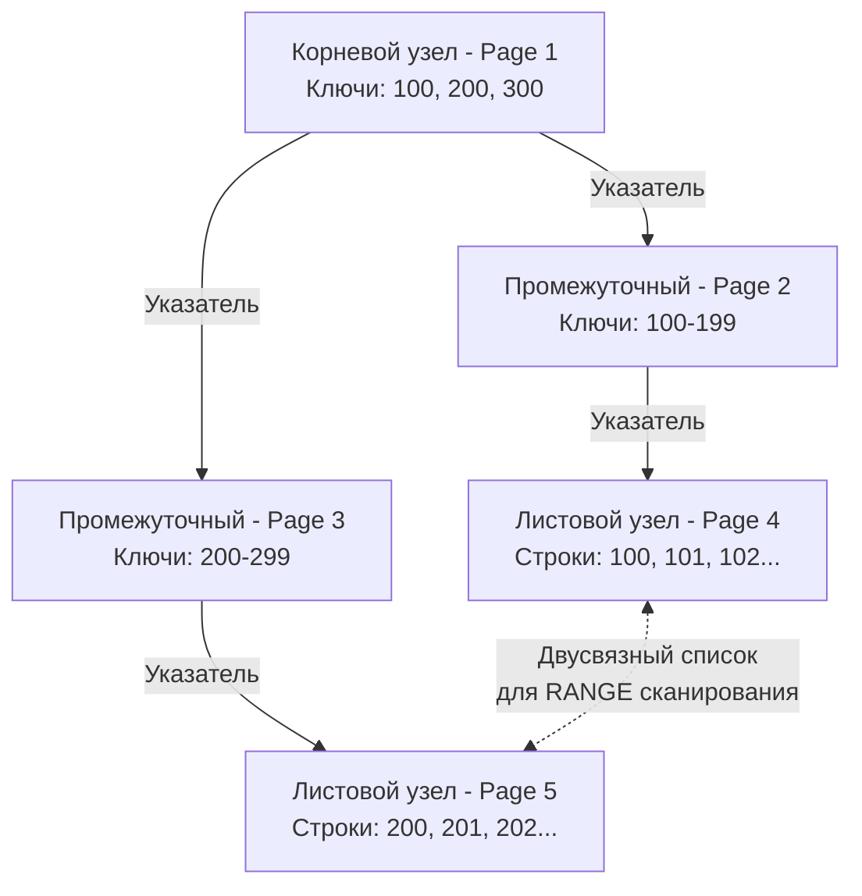

## Индексы в MySQL: B+ Деревья, Page Splits и покрывающие выборки

В прошлой статье [[2. InnoDB storage engine]] мы разобрались, что InnoDB оперирует страницами памяти по 16 KB и старается максимально использовать Buffer Pool (RAM) для минимизации дорогих дисковых операций ввода-вывода (I/O). 

Но как найти нужную строку среди миллиардов записей, не сканируя терабайты данных? Здесь на сцену выходят индексы. Для инженера понимание индексов — это не просто знание синтаксиса `CREATE INDEX`. Это понимание того, как физически располагаются байты на диске и почему порядок колонок в составном индексе может ускорить запрос в 1000 раз или не дать вообще никакого эффекта.

### Структура данных: Почему B+Tree?

InnoDB (как и большинство реляционных БД) использует структуру данных **B+Tree** (B+ дерево). 

> [!info] Под капотом: Отличие B-Tree от B+Tree
> В классическом B-Tree (B-дереве) данные могут храниться в любом узле дерева, включая корень и промежуточные ветви.
> В **B+Tree** данные хранятся **только в листовых узлах (Leaf Nodes)**. Промежуточные узлы (Non-leaf / Branch nodes) содержат только значения ключей и указатели для маршрутизации. Кроме того, все листовые узлы связаны между собой двусвязным списком (Double-linked list).

Почему это важно для Mechanical Sympathy?
Размер страницы в InnoDB жестко фиксирован — 16 KB. Если мы храним в промежуточных узлах только ключи маршрутизации (например, `BIGINT` ID = 8 байт + указатель на страницу = 6 байт), то в одну страницу 16 KB поместится более 1000 указателей. 
Это дает **огромный коэффициент ветвления (Branching Factor)**. 

Дерево глубиной всего в 3 уровня может адресовать: `1000 * 1000 * 1000 = 1 миллиард` строк! 
Чтобы найти одну строку из миллиарда, нужно прочитать всего 3 страницы (3 * 16 KB). Причем корневая страница и промежуточные ветви почти всегда закэшированы в оперативной памяти (в Buffer Pool). Итого: поиск по миллиардной таблице часто требует всего **одного физического чтения с диска** (Random I/O) для загрузки листовой страницы.

Связанный список на уровне листьев решает проблему сканирования диапазонов (`RANGE` запросы). Если вам нужно сделать `SELECT ... WHERE id BETWEEN 100 AND 200`, движок спускается по дереву к ID 100, а затем просто идет вправо по указателям связанного списка, читая страницы последовательно (Sequential I/O), пока не дойдет до 200.



---

## 1. Кластерный индекс (Clustered Index)

В InnoDB **таблица — это и есть индекс**. Это называется кластерным индексом, и он строится вокруг Первичного Ключа (Primary Key).

В листовых страницах кластерного индекса хранятся не просто какие-то указатели, а **полные данные строк** (все остальные колонки таблицы). Физически на диске (в файле `.ibd`) данные отсортированы в порядке возрастания первичного ключа.

> [!warning] Ловушка / Gotcha: Отсутствие Primary Key
> Если вы создаете таблицу без `PRIMARY KEY` и без `UNIQUE NOT NULL` ключей, InnoDB молча сгенерирует скрытый 6-байтовый `ROW_ID` и построит кластерный индекс по нему. Проблема в том, что этот скрытый счетчик — глобальный ресурс с общим мьютексом (mutex) для всей БД. Конкурентная вставка в такие таблицы убьет производительность базы данных из-за contention (борьбы за блокировку). **Всегда явно задавайте Primary Key.**

---

## 2. Вторичные индексы (Secondary Indexes)

Любой индекс, который не является кластерным (например, индекс по `email` или составной индекс по `last_name, first_name`), называется вторичным.

**Критическое отличие:** Листовые узлы вторичного индекса содержат не полные данные строки, а только само проиндексированное значение (например, `test@email.com`) и **значение Первичного Ключа (Primary Key)** для этой строки.

### Цена двойного прохода (Bookmark Lookup)

Если вы делаете запрос:
`SELECT age, phone FROM users WHERE email = 'test@email.com'`

MySQL выполнит следующие шаги:
1. Пройдет по B+Tree вторичного индекса `idx_email`, чтобы найти `test@email.com`.
2. В листовом узле найдет Primary Key (например, `ID = 42`).
3. **Bookmark Lookup**: С этим `ID = 42` пойдет в B+Tree кластерного индекса, пройдет его от корня до листа, чтобы извлечь полные данные строки (`age` и `phone`).


> [!tip] Собеседование: Покрывающий индекс (Covering Index)
> **Вопрос:** Как оптимизировать предыдущий запрос, чтобы избежать второго прохода по кластерному дереву?
> **Ответ:** Использовать **Покрывающий индекс**. 
> Если изменить индекс на `INDEX(email, age, phone)`, то вторичный индекс будет содержать в своих листьях все данные, необходимые для ответа на `SELECT age, phone`. Движок найдет email, сразу возьмет `age` и `phone` из этого же узла и вернет результат. Это называется **Index-Only Scan** (в `EXPLAIN` будет написано `Using index`). Это один из самых мощных способов оптимизации `SELECT` запросов.
> Именно поэтому `SELECT *` — это антипаттерн. Он почти всегда убивает возможность использовать покрывающий индекс, заставляя БД делать тяжелый Bookmark Lookup.

---

## 3. Проблема UUID v4 как Primary Key (Page Splits)

Это классический вопрос для позиций Middle+/Senior, где проверяется понимание структур на диске.

В микросервисной архитектуре на Go часто возникает желание использовать UUID в качестве Primary Key, чтобы генерировать ID на стороне клиента и избегать централизованного счетчика.

Обычный UUID v4 генерируется случайно (Random). B+Tree кластерного индекса требует, чтобы данные вставлялись в **упорядоченном** виде.
Если мы используем автоинкрементный `BIGINT` (Sequential), новые строки всегда дописываются в конец последней страницы (Append-only). Когда страница 16 KB заполняется, InnoDB просто создает новую. Это сверхбыстро.

**Что происходит при вставке случайного UUID v4:**
1. InnoDB спускается по дереву и находит, что новый случайный `UUID: 550e...` должен лежать в середине какой-то существующей страницы, которая была заполнена час назад.
2. Эта страница читается с диска в Buffer Pool (Random I/O).
3. Если на странице нет свободного места (она заполнена), происходит **Page Split (Раскол страницы)**.
4. InnoDB выделяет новую пустую страницу.
5. Берет половину строк из старой страницы и переносит (копирует) их в новую страницу.
6. Вставляет новую строку.
7. Обновляет все указатели в родительских (branch) узлах и перестраивает двусвязный список.

**Последствия:**
* Огромное количество случайных чтений и записей (Write Amplification).
* Сильная фрагментация данных на диске (страницы заполнены только наполовину, что снижает эффективность кэша Buffer Pool).

### Решение на Go: Time-ordered ID
Вместо случайного `uuid` (UUIDv4) используйте сортируемые по времени идентификаторы: **ULID**, **UUID v7** (официально добавлен в спецификацию) или системы вроде Twitter Snowflake. Они содержат временную метку (timestamp) в старших битах, поэтому лексикографически всегда возрастают, сохраняя последовательную вставку (Append-only) для B+Tree, но при этом гарантируют уникальность в распределенных системах.

```go
// Идиоматичный подход для генерации ID в Go для баз данных на InnoDB
package main

import (
	"fmt"
	"math/rand"
	"time"

	"[github.com/oklog/ulid/v2](https://github.com/oklog/ulid/v2)"
)

func GenerateDBEntityID() string {
	entropy := ulid.Monotonic(rand.New(rand.NewSource(time.Now().UnixNano())), 0)
	// Первые 48 бит — время, остальные 80 бит — монотонная энтропия.
	// Идеально сортируется в B+Tree, предотвращая Page Splits.
	id := ulid.MustNew(ulid.Timestamp(time.Now()), entropy)
	return id.String()
}
```

---

## 4. Составные индексы и Правило левого префикса

Индекс можно создать по нескольким колонкам одновременно: `INDEX(a, b, c)`.
Внутри B+Tree данные сортируются сначала по колонке `a`, при равенстве `a` — по колонке `b`, и при равенстве `a` и `b` — по `c`.

Из этого вытекает фундаментальное **Правило левого префикса (Left-most prefix rule)**: БД может использовать индекс только в том случае, если в запросе используются колонки индекса начиная слева направо без пропусков.

| Запрос | Используется ли `INDEX(a, b, c)`? | Почему? |
| :--- | :--- | :--- |
| `WHERE a = 1` | Да (полностью) | Левый префикс соблюден. |
| `WHERE a = 1 AND b = 2` | Да (полностью) | Префикс соблюден. |
| `WHERE a = 1 AND c = 3` | Частично | Индекс используется для `a`, поиск по `c` игнорирует индекс (происходит фильтрация на лету). |
| `WHERE b = 2 AND c = 3` | **НЕТ** (Full Scan) | Нарушен левый префикс (нет `a`). Данные внутри индекса не отсортированы по `b` глобально. |
| `WHERE a > 5 AND b = 2` | Частично | Индекс используется для диапазона `a > 5`. После применения оператора диапазона (`>`, `<`, `BETWEEN`), индекс для последующих колонок (`b`) использовать невозможно. |

> [!info] Под капотом: Index Condition Pushdown (ICP)
> Начиная с MySQL 5.6 (и в актуальных версиях), для запроса `WHERE a = 1 AND c = 3` применяется оптимизация ICP. Вторичный индекс все равно не может быстро перепрыгнуть к `c = 3`, но Storage Engine проверяет условие `c = 3` прямо на уровне прохода по вторичному индексу, *до* того как делать тяжелый Bookmark Lookup в кластерный индекс. Это радикально снижает количество случайных чтений диска.

## Итог

1. **InnoDB** — это B+Tree. Данные кластерного индекса лежат в листовых узлах.
2. Вторичные индексы хранят значения проиндексированных колонок + Primary Key. Извлечение остальных данных требует второго прохода (Bookmark Lookup).
3. **Покрывающий индекс (Covering Index)** позволяет вернуть данные прямо из вторичного индекса, минуя кластерный.
4. **Primary Key должен быть последовательным.** Случайные строки (UUIDv4) вызывают фрагментацию и Page Splits. Используйте ULID или UUIDv7.
5. При использовании составных индексов жестко соблюдайте **Правило левого префикса**.

Понимание структур данных на диске и алгоритмов блокировок — это то, что позволяет инженеру предсказывать поведение базы под высокой нагрузкой. Теперь, когда мы знаем, как данные хранятся и ищутся, самое время разобраться, как MySQL обеспечивает консистентность этих данных при конкурентном доступе из сотен горутин: переходим к [[4. Транзакции в MySQL]].