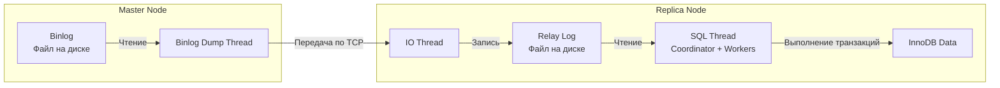

## Преодолевая пределы одного сервера

В прошлой статье [[4. Транзакции в MySQL]] мы увидели, как InnoDB гарантирует ACID на одном узле. Однако в реальном высоконагруженном проекте один сервер базы данных (Master) быстро становится узким местом. У него есть предел по CPU, оперативной памяти (Buffer Pool) и IOPS диска. Более того, единичный сервер — это Single Point of Failure (SPOF). Если сгорит материнская плата, весь проект ляжет.

Для решения этих проблем базы данных используют **Репликацию (Replication)** — процесс копирования данных с одного узла на другие. В мире MySQL репликация исторически является краеугольным камнем архитектуры и де-факто стандартом масштабирования операций чтения (Read Scaling).

## Бинарный лог (Binlog): Источник истины

Прежде чем говорить о сети, нужно понять, *что* именно передается по сети.

> [!tip] Собеседование: Redo Log против Binlog
> **Вопрос:** Зачем MySQL два лога? Почему нельзя реплицировать данные через Redo Log (WAL)?
> **Ответ:** Это вопрос на понимание архитектуры из [[1. Архитектура MySQL]]. 
> * **Redo Log** принадлежит подсистеме хранения InnoDB. Он содержит физические изменения страниц памяти (offset 1024, write bytes 0xFA...). Он нужен только для Crash Recovery конкретного инстанса.
> * **Binlog (Binary Log)** принадлежит уровню Server Layer. Это логический лог изменения данных. Он ничего не знает про страницы по 16 KB. Он нужен для репликации и восстановления данных на определенный момент времени (Point-in-Time Recovery).

Чтобы репликация работала, на мастере должен быть включен `log_bin`. Все транзакции, изменяющие данные (`INSERT`, `UPDATE`, `DELETE`, `ALTER`), после успешного коммита записываются в этот бинарный лог.

### Форматы Binlog'а
1. **Statement-Based Replication (SBL):** В лог пишется сам SQL-запрос (например, `UPDATE users SET status = 1 WHERE age > 18`). 
   * *Плюс:* Лог очень компактный (меньше I/O и сетевого трафика).
   * *Минус:* Недетерминированность. Если запрос содержит функции вроде `NOW()` или `RAND()`, на мастере и реплике получатся разные данные.
2. **Row-Based Replication (RBL):** В лог пишется фактическое изменение каждой строки (образ строки до и после). 
   * *Плюс:* 100% гарантия консистентности (Data Consistency).
   * *Минус:* Write Amplification. Если ваш запрос обновил 100 000 строк, в лог запишутся 100 000 физических изменений, раздувая его размер.
3. **Mixed:** MySQL сама решает, когда использовать Statement, а когда безопасно переключиться на Row (например, при вызове `UUID()`).

*Начиная с MySQL 5.7.7, дефолтным и рекомендуемым форматом является **Row-Based (ROW)***.

---

## Архитектура и потоки репликации: Под капотом

Классическая репликация MySQL работает по модели **Push/Pull** и задействует три основных потока (threads).



1. **Binlog Dump Thread (Master):** Когда реплика подключается к мастеру, на мастере создается этот поток. Он читает локальный Binlog и отправляет его по сети. Если реплика отстала, поток читает старые файлы логов; если реплика догнала мастера, поток засыпает в ожидании новых событий.
2. **IO Thread (Replica):** Этот поток на реплике принимает байты по TCP от мастера и пишет их в свой локальный лог, который называется **Relay Log (Ретрансляционный лог)**. Это чистая последовательная запись на диск (Sequential I/O), поэтому этот этап обычно очень быстрый.
3. **SQL Thread (Replica):** Этот поток читает Relay Log, парсит события (Row-изменения) и применяет их к локальному движку InnoDB. 

---

## Проблема отставания (Replication Lag) и MTS

Исторически **SQL Thread** был однопоточным. 

> [!warning] Ловушка / Gotcha: Бутылочное горлышко реплики
> Представьте: на мастере 100 конкурентных соединений (горутин) одновременно делают тяжелые `UPDATE`. Мастер справляется за счет многоядерности.
> Эти 100 транзакций пишутся в Binlog, прилетают на реплику, и... единственный SQL Thread пытается применить их по очереди, одну за другой. 
> Результат: Реплика начинает безбожно отставать от мастера (`Seconds_Behind_Master` в метриках улетает в космос).

Как решается эта проблема Mechanical Sympathy? Через **MTS (Multi-Threaded Slave)**.
Начиная с MySQL 5.7, SQL Thread был разделен на Coordinator-поток и пул Worker-потоков (настраивается через `slave_parallel_workers`). 

Но как параллельно применять транзакции и не сломать данные (ведь порядок важен)? MySQL использует алгоритм **Logical Clock**. Если группа транзакций успешно закоммитилась на мастере *в одно и то же время* (Group Commit) и они не пересеклись по блокировкам строк, значит, их абсолютно безопасно выполнять параллельно и на реплике. Координатор читает Relay Log и раскидывает независимые транзакции по воркерам.

---

## Режимы синхронизации: Trade-offs

### 1. Asynchronous Replication (По умолчанию)
Когда клиент на Go делает `COMMIT` на мастере, мастер пишет в Binlog, возвращает `OK` клиенту и только потом (в фоне) отправляет данные на реплику.
* **Плюсы:** Максимальная производительность. Мастер не ждет реплику.
* **Минусы:** Возможна потеря данных. Если мастер сгорел через миллисекунду после `OK`, а Binlog Dump Thread не успел отправить пакет по сети, данные закоммичены для пользователя, но навсегда потеряны.

### 2. Semi-Synchronous Replication (Полусинхронная)
Мастер пишет транзакцию в Binlog, отправляет её реплике и **ждет (блокирует поток клиента)**, пока IO Thread реплики не пришлет ACK (подтверждение, что данные записаны в Relay Log на диск реплики). После получения ACK, мастер возвращает `OK` клиенту.
* **Плюсы:** Строгая гарантия, что хотя бы одна реплика имеет копию транзакции в случае смерти мастера.
* **Минусы:** Задержка ответа клиенту увеличивается на сетевой Round-Trip Time (RTT) до реплики плюс время `fsync` Relay Log'а. Требует отличной сети между ДЦ.

---

## Инженерия на Go: Read-After-Write Consistency

Добавление репликации в систему радикально усложняет код бэкенда. Основная проблема — разделение чтения и записи (Read/Write Split). Всю запись мы направляем на Master, а чтение (чтобы разгрузить мастера) балансируем между Репликами.

> [!info] Под капотом: Аномалия Read-After-Write
> 1. Пользователь обновляет свой профиль (запрос уходит на Master).
> 2. Go-приложение возвращает HTTP 200 OK.
> 3. Фронтенд делает редирект и запрашивает страницу профиля.
> 4. Go-приложение делает `SELECT` из Реплики.
> 5. Из-за асинхронной природы репликации данные еще не долетели (lag 50ms).
> 6. Пользователь видит свои СТАРЫЕ данные и в панике кликает "Сохранить" еще раз.

В идиоматичном Go мы решаем это на уровне архитектуры репозитория. Мы создаем обертку, содержащую два пула соединений: один для записи, другой для чтения.

```go
package database

import (
	"context"
	"database/sql"
	"fmt"
)

// DBCluster инкапсулирует логику маршрутизации запросов
type DBCluster struct {
	Master   *sql.DB
	Replicas []*sql.DB
}

// MasterConn возвращает пул для записи
func (c *DBCluster) WriteDB() *sql.DB {
	return c.Master
}

// ReadDB использует Round-Robin или Random для выбора реплики
func (c *DBCluster) ReadDB() *sql.DB {
	// Для простоты примера берем первую (в реальности нужен балансировщик)
	if len(c.Replicas) > 0 {
		return c.Replicas[0]
	}
	// Fallback на мастера, если реплик нет
	return c.Master
}
```

Чтобы решить проблему Read-After-Write, бэкендеры часто используют паттерн **"Sticky Master" (Липкий мастер)**. Если пользователь только что сделал `UPDATE`, мы кладем в его сессию (или JWT токен, или Redis кэш) флаг с timestamp'ом. При последующих `SELECT` запросах в течение ближайших 2-3 секунд мы принудительно маршрутизируем его чтения на Master (`WriteDB()`), игнорируя реплики.

## Итог

1. Репликация в MySQL исторически строится вокруг **Binlog'а**.
2. По умолчанию используется **асинхронная** передача: это быстро, но грозит потерей последних транзакций при крахе мастера. Полусинхронный режим решает эту проблему ценой сетевой задержки (RTT).
3. **Отставание реплики (Replication Lag)** — неизбежное зло. В современных версиях MySQL оно минимизируется за счет параллельного применения логов (MTS - Multi-Threaded Slave).
4. Разработчик на Go должен явно управлять маршрутизацией запросов (Master для Write, Replica для Read) и обрабатывать аномалии консистентности (Read-After-Write) на уровне архитектуры приложения.

MySQL — прекрасная и проверенная временем система, но у нее есть сильный конкурент в мире Open Source. Чтобы стать полноценным System Architect'ом, нужно понимать сильные и слабые стороны обоих гигантов. В следующей статье мы проведем хардкорное сравнение их подкапотных механизмов: [[6. Отличия MySQL и PostgreSQL]].