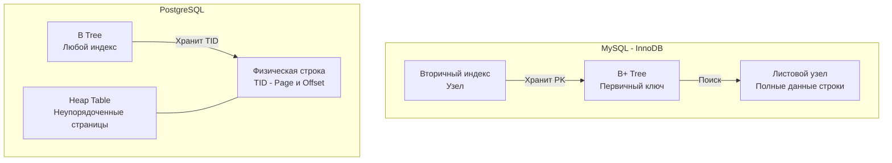

## Священная война бэкенда: MySQL против PostgreSQL

Выбор между MySQL и PostgreSQL — это не просто выбор синтаксиса SQL. Это фундаментальное архитектурное решение, которое определит, как ваша система будет потреблять память, взаимодействовать с диском и вести себя под нагрузкой в сотни тысяч запросов.

Обе базы данных обладают невероятной производительностью и надежностью, но под капотом они исповедуют абсолютно разные инженерные философии. Для Senior/Lead разработчика на Go важно понимать эти различия на уровне операционной системы и железа (Mechanical Sympathy), чтобы выбрать правильный инструмент для конкретного профиля нагрузки.

---

## 1. Модель процессов: Threads против Processes

Первое, с чем сталкивается база данных — это сетевое соединение от вашего Go-приложения. И здесь мы видим радикальное отличие в подходе к операционной системе.

* **MySQL (Thread-per-Connection):** Как мы разбирали в [[1. Архитектура MySQL]], MySQL использует потоки (Threads). При новом подключении вызывается системный вызов `clone` (в Linux). Потоки разделяют общее адресное пространство памяти. Оверхед на одно соединение минимален (около 1-3 МБ на стек потока). Вы можете держать тысячи открытых соединений напрямую к MySQL.
* **PostgreSQL (Process-per-Connection):** PostgreSQL использует классическую многопроцессную архитектуру (подробнее будет в [[1. Архитектура PostgreSQL]]). На каждое соединение вызывается системный вызов `fork`, порождающий полноценный процесс ОС. Каждый процесс имеет изолированную память, свои локальные кэши и потребляет от 5 до 15 МБ оперативной памяти.

> [!warning] Ловушка / Gotcha: OOM в PostgreSQL
> Если ваш Go-бэкенд с дефолтными настройками `database/sql` попытается открыть 2000 соединений к PostgreSQL (создав 2000 процессов ОС), база почти гарантированно уйдет в своп (Swap) или будет убита OOM Killer'ом. 
> **Следствие:** Для PostgreSQL использование пулера соединений (например, **PgBouncer** или **Odyssey**) — это не рекомендация, а жесткая архитектурная необходимость для highload-систем. Для MySQL пулер тоже полезен, но база вполне может жить и без него на средних нагрузках.

---

## 2. Физическое хранение: Clustered Index против Heap

Это самое важное отличие на уровне дисковой подсистемы (IO), определяющее производительность запросов.



### MySQL (InnoDB): Кластерный индекс
Как мы видели в [[2. InnoDB storage engine]], таблица в MySQL — это и есть индекс. Данные жестко привязаны к B+ дереву первичного ключа.
* **Плюс:** Поиск по `Primary Key` невероятно быстр, данные лежат прямо в листьях дерева. Идеально для последовательного чтения (Range Scans) по ID.
* **Минус:** Поиск по вторичному индексу (например, по `email`) требует двойного прохода (Bookmark Lookup) — сначала ищем в индексе `email` значение PK, затем по PK спускаемся в кластерное дерево (см. [[3. Индексы в MySQL]]).

### PostgreSQL: Куча (Heap)
В PostgreSQL нет понятия кластерного индекса в стиле InnoDB. Данные складываются в неупорядоченные файлы данных (Heap). Индексы (любые, включая Primary Key) живут отдельно и хранят **TID (Tuple ID)** — физический адрес строки на диске (номер страницы + смещение).
* **Плюс:** Поиск по любому индексу (первичному или вторичному) одинаково быстр — один спуск по B-Tree и прямой прыжок в Heap по TID.
* **Минус (Write Amplification):** Если вы обновляете строку и она физически перемещается в другую страницу Heap'а, меняется её TID. Это означает, что базе придется обновить **абсолютно все** индексы таблицы, чтобы они указывали на новый TID, даже если проиндексированные колонки не менялись!

> [!info] Под капотом: HOT (Heap-Only Tuples) в PG
> Для борьбы с Write Amplification PostgreSQL ввел оптимизацию HOT. Если `UPDATE` не затрагивает проиндексированные колонки и в текущей странице Heap'а есть свободное место, новая версия строки пишется в ту же страницу. Индексы не обновляются, а старая версия строки просто получает микро-указатель на новую. Поэтому в PostgreSQL критически важно настраивать `fillfactor` (оставлять пустое место в страницах) для таблиц с частыми обновлениями.

---

## 3. Реализация MVCC: Undo Logs против Append-Only

Обе базы поддерживают изоляцию транзакций (MVCC), но делают это диаметрально противоположными способами. Это напрямую влияет на профиль потребления диска.

* **MySQL (Undo Logs):** При выполнении `UPDATE` строка обновляется на месте (In-place update). Старая версия строки копируется в отдельную системную область — Undo Log.
    * **Следствие:** Таблицы не раздуваются от мертвых строк. Долгие транзакции заставляют пухнуть системное табличное пространство (Undo logs), но не саму таблицу.
* **PostgreSQL (Append-Only):**
    В PG строка иммутабельна. `UPDATE` под капотом работает как `DELETE` (строка помечается мертвой) + `INSERT` (создается новая строка в конце Heap'а).
    * **Следствие:** Таблицы стремительно раздуваются (Table Bloat). Мертвые строки остаются в Heap'е до тех пор, пока не придет процесс **VACUUM** и не вычистит их. 

> [!tip] Собеседование: Цена долгих транзакций
> **Вопрос:** Что будет, если в PostgreSQL вы откроете транзакцию (`BEGIN`), сделаете `SELECT` и забудете закрыть её на сутки, пока в базу идет плотный поток `UPDATE` от других клиентов?
> **Ответ:** Это катастрофа. Транзакция держит старый снимок времени (Snapshot). Процесс autovacuum не сможет удалять старые версии строк, так как ваша зависшая транзакция теоретически может их запросить. За сутки таблица физически раздуется на диске в десятки раз. И даже когда вы закроете транзакцию и VACUUM очистит мусор, размер файла таблицы (на уровне ОС) **не уменьшится** (место просто пометится как свободное для будущих вставок). Потребуется тяжелая блокирующая операция `VACUUM FULL`.

---

## 4. Транзакции и блокировки (Locking)

Как обсуждалось в [[4. Транзакции в MySQL]], дефолтные настройки баз сильно отличаются:

* **MySQL:** Уровень изоляции по умолчанию — **Repeatable Read**. Для защиты от фантомных чтений InnoDB агрессивно использует **Gap Locks** (блокировки пустот между строками). Это частая причина взаимных блокировок (Deadlocks) при высокой конкурентности.
* **PostgreSQL:** Уровень изоляции по умолчанию — **Read Committed**. Здесь нет Gap-блокировок. Если вам нужен высший уровень изоляции (**Serializable**), PostgreSQL использует элегантный алгоритм SSI (Serializable Snapshot Isolation), который отслеживает графы зависимостей транзакций в памяти и прерывает их постфактум, не блокируя физические строки так жестко, как это делает MySQL.

---

## 5. Типы данных и расширяемость

Исторически PostgreSQL считается более "продвинутой" (Object-Relational) базой.

* **JSON/JSONB:** Обе базы поддерживают JSON. Но PostgreSQL имеет тип **JSONB** (бинарное представление), который разбирается на этапе вставки, занимает меньше места и, самое главное, индексируется специальными **GIN-индексами** (Generalized Inverted Index). Поиск по ключам внутри JSONB в PG работает на порядки быстрее.
* **Массивы и геоданные:** В PostgreSQL массивы (`TEXT[]`, `INT[]`) являются первоклассными типами. А расширение **PostGIS** делает PostgreSQL абсолютным монополистом в задачах геопространственного поиска (поиск радиусов, пересечений полигонов).
* **MySQL:** Более консервативен. Отлично справляется с классическими реляционными схемами, но для сложной аналитики, массивов и географии подходит хуже.

---

## 6. Идиоматичный Go: Драйверы и взаимодействие

Когда вы пишете код на Go, выбор базы диктует выбор экосистемы.

**Для MySQL:**
Стандартом является драйвер `go-sql-driver/mysql`, который работает поверх стандартной библиотеки `database/sql`. Он стабилен, но ограничен интерфейсами `sql.DB`.

**Для PostgreSQL:**
В мире Go для PostgreSQL доминирует библиотека `github.com/jackc/pgx`. 
Вы можете использовать её как драйвер для `database/sql`, но идиоматичным подходом для хайлоада считается использование её нативного интерфейса (`pgxpool`).

Почему `pgx` лучше стандартного `database/sql` для PG:
1.  **Нативная поддержка типов:** Поддержка массивов Go (`[]string`, `[]int`), JSONB, HSTORE, типов времени и UUID "из коробки" без костылей с имплементацией интерфейса `sql.Scanner`.
2.  **Binary Protocol:** `pgx` активно использует бинарный протокол PostgreSQL, что снижает затраты на парсинг текста на стороне базы и аллокации строк в Go.
3.  **Batching:** Идеальная поддержка отправки пакетов запросов (Batch API), снижающая сетевой RTT.

```go
// Пример использования pgxpool в Go
package database

import (
	"context"
	"fmt"
	
	"[github.com/jackc/pgx/v5/pgxpool](https://github.com/jackc/pgx/v5/pgxpool)"
)

func GetUsersByTags(ctx context.Context, pool *pgxpool.Pool, tags []string) error {
	// В pgx мы можем напрямую передать слайс строк в запрос с массивом
	query := `SELECT id, name FROM users WHERE tags @> $1`
	
	rows, err := pool.Query(ctx, query, tags)
	if err != nil {
		return fmt.Errorf("query users: %w", err)
	}
	defer rows.Close()

	// ... обработка строк
	return nil
}
```

## Итог: Что выбрать?

* **Выбирайте MySQL (InnoDB), если:**
    У вас классическая OLTP-нагрузка с преобладанием простых коротких транзакций, вы жестко упираетесь в производительность одиночных чтений по Primary Key, вам нужна простая и железобетонная репликация (см. [[5. Репликация в MySQL]]), и у вас нет сложных типов данных вроде графов или географии.
* **Выбирайте PostgreSQL, если:**
    У вас сложная доменная модель (нужны массивы, JSONB, ENUM), сложная аналитика с оконными функциями, геоданные (PostGIS), или вы строите систему, где важна строгая консистентность и возможность писать сложную логику на стороне БД (хранимые процедуры, триггеры). Но будьте готовы к тюнингу autovacuum'а и настройке PgBouncer'а.

Мы рассмотрели отличия двух главных игроков. Однако даже MySQL не монолитна — у неё есть мощные ответвления, созданные для закрытия узких мест оригинальной архитектуры. В следующей статье мы разберем главный из них, который является стандартом в энтерпрайзе: [[7. Percona Server]].