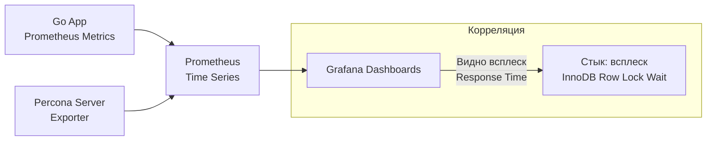

## Percona Server для MySQL: Тюнинг под Enterprise-нагрузки

Когда стандартного дистрибутива MySQL (Community Edition) становится недостаточно для высоконагруженных систем, а переходить на проприетарную Enterprise-версию от Oracle не позволяют бюджеты или убеждения, на сцену выходит **Percona Server**.

Percona Server — это форк MySQL "с открытым исходным кодом, который полностью совместим (drop-in replacement), но включает в себя патчи и оптимизации, которые Oracle обычно оставляет для платных версий или вообще не включает в основную ветку. Для бэкенд-инженера на Go это означает, что вы можете просто поменять Docker-образ базы, не меняя ни строчки кода, и получить существенный прирост в производительности и наблюдаемости (Observability).

---

## 1. Thread Pool: Решение проблемы тысяч соединений

Как мы помним из [[1. Архитектура MySQL]], стандартный MySQL использует модель "один поток на соединение". Если ваше Go-приложение в пике создает 5000 горутин, каждая из которых берет коннект из пула, MySQL начинает задыхаться от переключения контекста (Context Switching) в ядре ОС.

Percona включает в себя **Thread Pool Plugin**, который в Oracle MySQL доступен только в платной Enterprise версии.

> [!info] Под капотом: Как работает Thread Pool
> Вместо того чтобы создавать новый поток ОС для каждого запроса, Percona выделяет фиксированное количество групп потоков (Thread Groups). Запросы от клиентов попадают в очередь. Свободный поток из группы берет запрос из очереди, выполняет его и возвращается за следующим.
> Это очень похоже на работу планировщика Go (G-M-P), где небольшое количество системных тредов (M) обслуживает огромное количество горутин (G). Это предотвращает **Thrashing** — ситуацию, когда CPU тратит больше времени на управление потоками, чем на выполнение SQL-запросов.

---

## 2. XtraDB: Прокачанный InnoDB

Исторически Percona поставлялась с собственным движком **XtraDB**, который является глубоко модифицированным InnoDB. В современных версиях (8.0+) различия в коде сократились, но Percona по-прежнему включает критические патчи для работы с диском и памятью:

* **Улучшенный Buffer Pool Scalability:** В стандартном MySQL работа с Buffer Pool часто упирается в глобальные мьютексы. Percona оптимизирует механизмы очистки страниц (LRU flushing), позволяя лучше утилизировать современные многоядерные процессоры и быстрые NVMe-диски.
* **Doublewrite Buffer Tuning:** Percona позволяет выносить Doublewrite Buffer в отдельные файлы или даже отключать его на файловых системах, поддерживающих атомарную запись (например, на некоторых специфичных SSD или ZFS), что радикально снижает Write Amplification.

---

## 3. Наблюдаемость (Advanced Observability)

Это, пожалуй, главная причина, по которой Senior-инженеры выбирают Percona. Стандартный MySQL довольно скуп на подробности о том, *почему* конкретный запрос тормозит.

### Расширенный Slow Query Log
В Percona Slow Query Log содержит гораздо больше метрик:
* Время ожидания блокировок (Lock time).
* Количество прочитанных и измененных строк.
* Время, проведенное в очередях Thread Pool.
* **Query Plan:** Percona может логировать план выполнения (EXPLAIN) прямо в лог медленных запросов.

### Инструментарий Percona Toolkit
Это набор CLI-утилит (многие написаны на Perl и Go), которые стали стандартом индустрии:
* `pt-online-schema-change`: Позволяет делать `ALTER TABLE` на огромных таблицах без блокировки на чтение и запись. Она создает временную таблицу, вешает триггеры и копирует данные пачками.
* `pt-query-digest`: Анализирует логи и выдает отчет о самых "дорогих" запросах.
* `pt-kill`: Автоматически убивает запросы, которые выполняются слишком долго или потребляют слишком много памяти, защищая базу от падения.

---

## 4. Безопасность и Enterprise-фичи (Бесплатно)

Percona включает функции, за которые Oracle просит тысячи долларов:
* **Audit Log Plugin:** Полный лог того, кто, когда и какой запрос выполнил (необходимо для соблюдения стандартов PCI DSS или HIPAA).
* **Data Masking:** Позволяет маскировать персональные данные (PII) в результатах запросов "на лету".
* **External Authentication:** Интеграция с LDAP или Active Directory для управления доступами.

---

## 5. Взаимодействие с Go: Метрики и PMM

Если вы используете Percona Server, идиоматично будет подключить **PMM (Percona Monitoring and Management)**. Это готовый стек (Prometheus + Grafana + ClickHouse), который визуализирует всё происходящее в БД.

Для Go-разработчика это дает возможность сопоставлять графики из вашего приложения с графиками БД:

> [!tip] Собеседование: Когда предлагать Percona?
> **Вопрос:** Мы уперлись в производительность MySQL на 64-ядерном сервере. Что делать?
> **Ответ:** Помимо тюнинга индексов и запросов, стоит рассмотреть переход на Percona Server. Его Thread Pool позволит эффективнее утилизировать ядра при большом количестве соединений, а расширенные метрики Slow Log помогут найти узкое место в блокировках InnoDB, которые не видны в стандартном MySQL.

## Итог

Percona Server — это MySQL "на стероидах". 
1. **Thread Pool** спасает от оверхеда большого количества коннектов из Go-приложения.
2. **XtraDB** выжимает максимум из NVMe и многоядерных систем.
3. **Toolkit и PMM** дают инженеру "рентгеновское зрение" для отладки производительности.
4. Это **Drop-in replacement**: вы просто меняете бинарник, и всё продолжает работать.

Percona — отличный выбор для традиционных реляционных задач. Но что если нам нужно хранить данные не просто надежно, а обеспечивать их доступность в разных дата-центрах с гарантией автоматического переключения при отказе? Для этого существует другой важнейший форк, который мы разберем далее: [[8. MariaDB]].