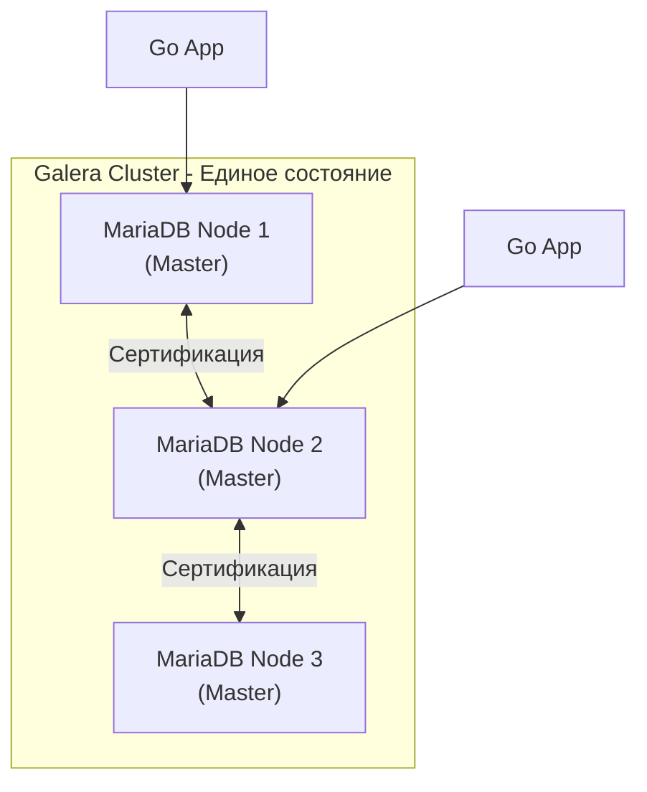

## MariaDB: Больше, чем просто форк

**MariaDB** — это самое известное ответвление MySQL, созданное самим автором оригинального кода Майклом «Монти» Видениусом после покупки MySQL компанией Oracle. Хотя MariaDB начиналась как полная копия (drop-in replacement), сегодня это самостоятельная экосистема, которая во многих аспектах ушла далеко вперед в плане инноваций, новых движков хранения и оптимизатора запросов.

Для Senior-разработчика MariaDB интересна прежде всего своей гибкостью и попыткой решить фундаментальные ограничения MySQL в области аналитики и масштабирования.

---

## 1. Архитектурные отличия: Оптимизатор и Двигатели

В MariaDB используется другой подход к эволюции компонентов Server Layer.

### Оптимизатор запросов (Query Optimizer)
Оптимизатор MariaDB значительно сложнее дефолтного в MySQL. Он включает в себя:
* **Persistent Statistics:** Статистика по индексам в MariaDB более детальная и хранится в таблицах, что позволяет оптимизатору делать более точные предсказания.
* **Engine-Independent Table Statistics:** Сбор статистики не зависит от подсистемы хранения (InnoDB или другой).
* **Subquery Optimizations:** MariaDB гораздо лучше справляется со сложными вложенными подзапросами, которые часто «тупят» в стандартном MySQL.

### Плюрализм движков (Pluggable Storage Engines)
MariaDB поддерживает гораздо больше движков «из коробки», чем MySQL:
1.  **Aria:** Замена MyISAM, которая устойчива к сбоям (crash-safe). Используется для временных таблиц.
2.  **ColumnStore:** Колоночный движок для Big Data и OLAP-аналитики. Позволяет MariaDB работать как ClickHouse (см. [[11. ClickHouse. OLAP база]]).
3.  **MyRocks:** Движок на базе **RocksDB** (LSM-дерево), оптимизированный для сверхплотной записи и экономии места на SSD.

---

## 2. Ключевые фичи для Highload

### Thread Pool (Масштабируемость соединений)
Как и в Percona (см. [[7. Percona Server]]), в MariaDB встроена реализация **Thread Pool**. Это критично для Go-бэкенда, так как позволяет эффективно обрабатывать тысячи одновременных подключений без создания тысяч тяжелых потоков ОС. В MariaDB эта фича доступна бесплатно во всех версиях.

### Виртуальные колонки (Virtual Columns)
MariaDB была пионером в поддержке виртуальных (вычисляемых) колонок.
* **Virtual:** Значение вычисляется на лету при чтении (экономит диск).
* **Persistent:** Значение вычисляется при записи и хранится физически (ускоряет чтение, можно вешать индекс).

> [!tip] Собеседование: Индексация JSON
> **Вопрос:** Как эффективно искать по полям внутри JSON в MariaDB?
> **Ответ:** Создать виртуальную колонку, которая извлекает значение из JSON-поля с помощью `JSON_VALUE()`, и повесить на эту колонку обычный B+Tree индекс. Это позволяет достичь производительности поиска как по обычным полям.

---

## 3. Galera Cluster: Настоящий Multi-Master

Одна из главных причин выбора MariaDB — встроенная поддержка **Galera Cluster**. 

В отличие от классической репликации ([[5. Репликация в MySQL]]), которая является асинхронной, Galera обеспечивает **синхронную репликацию** (Multi-master). 



**Как это работает под капотом:**
1.  Транзакция выполняется на одном узле.
2.  В момент `COMMIT` происходит фаза **сертификации**: транзакция рассылается на все узлы кластера.
3.  Если на всех узлах нет конфликтов блокировок — транзакция фиксируется везде одновременно.
4.  Если на любом узле возник конфликт — транзакция откатывается на всех узлах.

Это дает **High Availability (HA)** из коробки: если один сервер сгорает, остальные продолжают работу с актуальными данными.

---

## 4. Совместимость и миграция

MariaDB долгое время была полностью совместима с MySQL 5.7. Однако с выходом MySQL 8.0 пути разошлись:
* В MySQL 8.0 появились **Invisible Indexes**, **Common Table Expressions (CTE)** и **Window Functions** (MariaDB добавила их раньше, но синтаксис/реализация могут отличаться).
* Формат бинарного лога (binlog) в MariaDB теперь имеет свои расширения, что делает репликацию между MariaDB и MySQL 8.0 «в обе стороны» рискованной затеей.

> [!warning] Ловушка / Gotcha: Default values
> MariaDB более строго относится к SQL-стандартам. Например, поведение `STRICT_TRANS_TABLES` может привести к тому, что запросы, которые молча проходили в старом MySQL (например, вставка пустой строки в `NOT NULL` поле без default), в MariaDB будут вызывать ошибку.

---

## 5. Использование в Go

Для Go-разработчика работа с MariaDB практически не отличается от MySQL. Используется тот же драйвер `github.com/go-sql-driver/mysql`. 

Однако, если вы используете **Galera Cluster**, ваш код в Go должен учитывать специфику Multi-master архитектуры:

```go
// Пример обработки специфичной ошибки Galera Cluster
func (r *Repo) UpdateProfile(ctx context.Context, u *User) error {
    err := r.db.ExecContext(ctx, "UPDATE profiles SET name = ? WHERE id = ?", u.Name, u.ID)
    
    // В Galera транзакция может успешно пройти Exec, но упасть на Commit 
    // из-за конфликта сертификации на другом узле. 
    // Это проявляется как Deadlock error (1213).
    if err != nil {
        if isDeadlock(err) {
            // Идиоматично для Galera — повторить транзакцию (Retry)
            return r.UpdateProfile(ctx, u) 
        }
        return err
    }
    return nil
}
```

## Итог

1.  **MariaDB** — выбор для тех, кто хочет Open Source без контроля корпорации Oracle.
2.  **Движки:** Если нужна аналитика (ColumnStore) или экономия места на диске (MyRocks) в рамках одной базы — это MariaDB.
3.  **Galera:** Это стандарт для построения отказоустойчивых кластеров с синхронной репликацией.
4.  **Производительность:** Продвинутый оптимизатор делает MariaDB более быстрой на сложных запросах с большим количеством JOIN-ов и подзапросов.

MariaDB — мощный инструмент, но он все еще живет в рамках реляционной парадигмы. В следующей статье мы рассмотрим экзотические и облачные форки MySQL, которые были созданы для работы в глобальных масштабах: [[9. AliDB и облачные форки]].