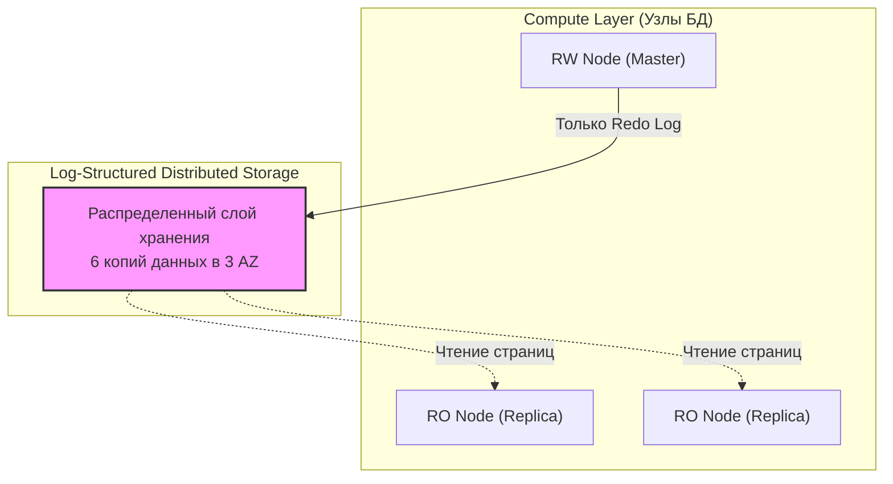

## AliDB и Облачные форки: MySQL в масштабах гиперскейлеров

Когда мы говорим о MySQL в контексте облачных гигантов (Alibaba, AWS, Google), мы выходим за рамки обычного ПО, устанавливаемого на сервер. Здесь MySQL превращается в **Cloud-Native Database**. Облачные провайдеры глубоко переработали внутренности MySQL, чтобы отделить вычислительные ресурсы (Compute) от хранения данных (Storage), обеспечивая практически бесконечную масштабируемость и мгновенное восстановление.

Для Senior-разработчика понимание этих форков важно, так как они меняют правила игры: в облаке многие классические ограничения MySQL (например, размер диска или задержки репликации) перестают существовать.

---

## 1. AliDB (AliSQL): MySQL на службе Alibaba

**AliSQL** — это форк MySQL, разработанный Alibaba Group для обслуживания крупнейших в мире распродаж (Single's Day), где нагрузка достигает миллионов запросов в секунду. 

### Ключевые оптимизации под экстремальный Highload:
* **Inventory Hint (Inventory Hotspot):** В стандартном MySQL обновление одной и той же строки (например, остаток товара на складе) сотнями потоков вызывает огромные очереди на блокировках строк (Row Locks). AliSQL вводит специальные подсказки в SQL, которые позволяют базе данных группировать (batch) обновления одной строки в памяти и фиксировать их одним махом, увеличивая пропускную способность в десятки раз.
* **Query Queue:** Механизм на уровне ядра, который ограничивает количество одновременно исполняемых запросов. Если база перегружена, новые запросы не создают новые потоки (предотвращая падение по OOM), а аккуратно ждут в очереди.
* **Async Update:** Возможность асинхронного обновления индексов, что снижает задержку для пользователя при записи.

---

## 2. Облачная архитектура: Отделение Compute от Storage

Главная инновация облачных форков (AWS Aurora, Google AlloyDB, Alibaba PolarDB) — это отказ от хранения данных в локальных файлах `.ibd` на диске конкретной машины.



### AWS Aurora (MySQL Compatible)
Aurora — самый известный пример облачного форка. 
1. **The Log is the Database:** В отличие от стандартной репликации ([[5. Репликация в MySQL]]), Aurora не передает Binlog или страницы данных. Она передает только **Redo Log** в распределенный слой хранения.
2. **Мгновенные реплики:** Поскольку все узлы (Master и Replicas) смотрят на одни и те же данные в общем хранилище, создание новой реплики занимает секунды, а задержка репликации (Replica Lag) обычно составляет менее 10-20 мс.
3. **Самовосстановление:** Хранилище разбито на сегменты по 10 ГБ, каждый из которых копируется в 6 экземплярах. Если один сегмент поврежден, он мгновенно восстанавливается из других копий без участия основного CPU базы.

---

## 3. Сравнение: Облачные форки vs Стандартный MySQL

| Фича | Стандартный MySQL | Облачный форк (Aurora/PolarDB) |
| :--- | :--- | :--- |
| **Репликация** | Binlog (Логическая) | Redo Log (Физическая на уровне Storage) |
| **Storage** | Локальный диск (EBS/Local SSD) | Виртуальный, бесконечный, распределенный |
| **Failover** | 30-60+ сек (нужен Orchestrator) | < 30 сек (автоматически) |
| **Влияние на Master** | Репликация нагружает CPU Master'а | Почти нулевое влияние на CPU |
| **Макс. размер БД** | Ограничен размером диска | Обычно до 128 ТБ и выше |

---

## 4. Mechanical Sympathy: Цена облачной магии

Для Go-разработчика облачные форки кажутся "черным ящиком", но за их удобство приходится платить:

> [!warning] Ловушка / Gotcha: Стоимость I/O
> В AWS Aurora вы платите за количество операций ввода-вывода (IOPS). Поскольку база постоянно пишет логи в распределенное хранилище, неоптимизированные запросы с большим количеством мелких записей или Full Table Scan могут сделать счет за облако астрономическим.
> **Совет:** В облачных форках индексы важны не только для скорости, но и для экономии денег.

> [!info] Под капотом: Чтение из кэша
> В облачных форках при перезагрузке узла Compute кэш страниц (Buffer Pool) часто выживает, так как он находится в отдельном процессе. Это называется **Survivable Buffer Pool**. После рестарта база сразу готова к работе на полной скорости, ей не нужно "прогреваться", читая данные с диска.

---

## 5. Работа в Go с облачными форками

Драйвер остается прежним (`go-sql-driver/mysql`), но меняется стратегия подключения. Облачные провайдеры предоставляют специальные Endpoint'ы:
* **Cluster Endpoint:** Всегда указывает на текущий Master (RW).
* **Reader Endpoint:** Балансирует запросы между всеми доступными репликами (RO).

```go
// Идиоматичный подход: разделение пулов для облака
func NewCloudDB(ctx context.Context) (*database.DBCluster, error) {
    // Cluster Endpoint для записи
    master, _ := sql.Open("mysql", "admin:pass@tcp(my-cluster.cluster-xyz.us-east-1.rds.amazonaws.com:3306)/db")
    
    // Reader Endpoint для чтения
    replica, _ := sql.Open("mysql", "admin:pass@tcp(my-cluster.cluster-ro-xyz.us-east-1.rds.amazonaws.com:3306)/db")
    
    return &database.DBCluster{
        Master:   master,
        Replicas: []*sql.DB{replica},
    }, nil
}
```

## Итог

1. **AliSQL** — это MySQL для экстремальных пиковых нагрузок (Hotspots, очереди запросов).
2. **Cloud-Native форки** (Aurora, PolarDB) отделяют Compute от Storage, решая проблемы масштабирования диска и задержек репликации.
3. Основной механизм в облаке — репликация на уровне **Redo Log**, что гораздо эффективнее классического Binlog.
4. Для бэкенд-разработчика облако — это удобство HA и масштабирования, но требующее контроля за стоимостью I/O и специфичными параметрами кэширования.

Мы завершили обзор мира MySQL и его форков.