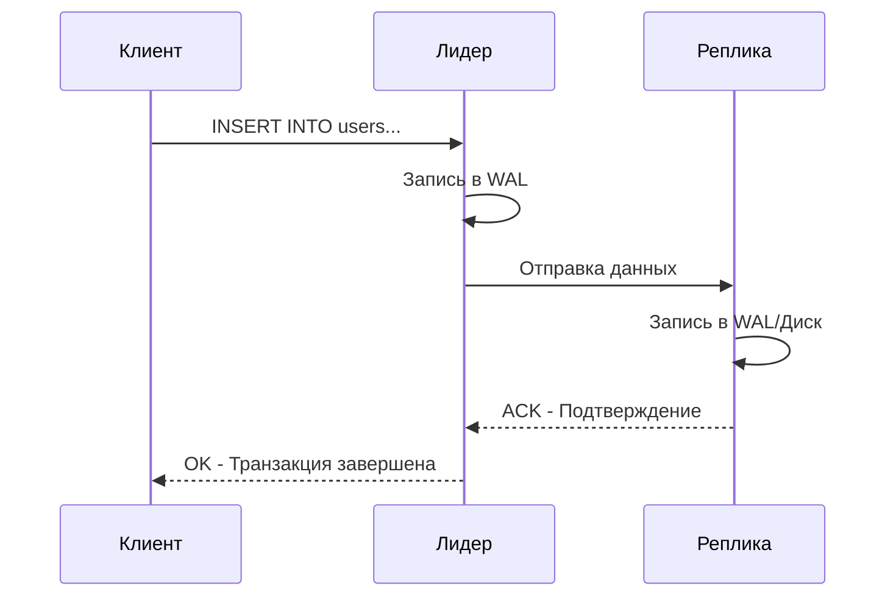
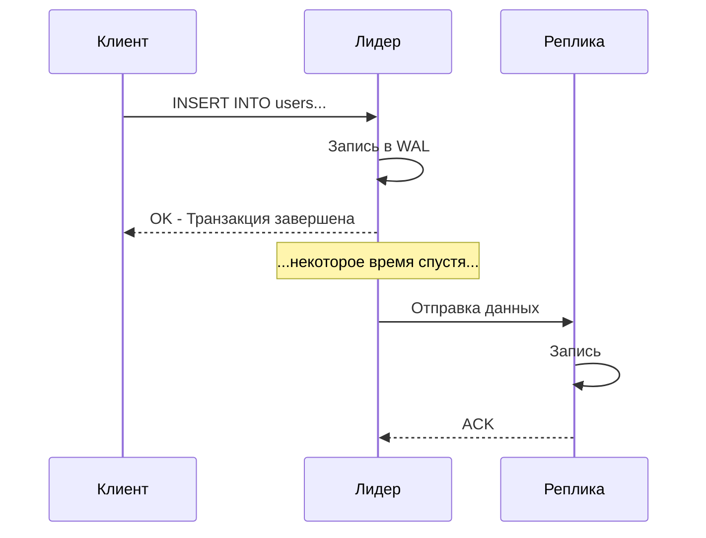

## Введение в репликацию

В современном бэкенде одна машина, даже самая мощная, не может гарантировать ни доступность, ни сохранность данных. Диски выходят из строя, райсеры выдергивают кабели питания, а дата-центры горят. Единственный способ выжить в этом ненадежном мире — **избыточность**.

**Репликация** — это процесс поддержания нескольких копий одних и тех же данных на разных узлах (нодах).

Если вы пришли из мира монолитов на PHP или Java, где база данных часто была «одной большой железкой» (Single Point of Failure), то в распределенных системах репликация — это фундамент, на котором строится High Availability (HA) и масштабирование чтения.

Но репликация не бесплатна. Главный вопрос, который определяет архитектуру вашей системы: **Когда реплика считается «обновленной»?**

Ответ на этот вопрос делит мир репликации на два лагеря: **Синхронную** и **Асинхронную**.

---

## Синхронная репликация (Synchronous)

При синхронной репликации лидер (Leader/Master), получивший запрос на запись, не сообщает клиенту «OK», пока данные не будут успешно записаны хотя бы на одну реплику (Follower/Slave).

### Алгоритм работы

1. Клиент отправляет `INSERT`.
2. Лидер записывает данные в свой WAL (Write Ahead Log).
3. Лидер отправляет данные реплике.
4. Реплика записывает данные и отвечает «Готово».
5. Только после этого лидер отвечает клиенту «OK».



### Mechanical Sympathy: Цена согласованности

С точки зрения операционной системы и сети, синхронная репликация — это дорого.
Чтобы транзакция считалась успешной, данные должны пройти полный путь:
- Сеть (Leader -> Follower).
- Дисковый ввод-вывод на Follower (fsync).
- Сеть обратно (Follower -> Leader).

Это добавляет к задержке (latency) записи **RTT (Round Trip Time)** плюс время дисковой синхронизации удаленной ноды. Если ваши серверы стоят в разных дата-центрах (Cross-DC replication), RTT может составлять десятки или сотни миллисекунд. Для высоконагруженной системы это смерти подобно: запись в 500 мс — это провал по SLA.

> [!tip] Собеседование
> **Вопрос:** Когда оправдана синхронная репликация?
> **Ответ:** Только для критически важных данных, где потеря даже одной транзакции недопустима (финансовые транзакции, биллинг, критичные конфигурации). Часто используют гибридный подход (Semi-Synchronous), где лидер ждет подтверждения только от одной реплики, а не от всех.

---

## Асинхронная репликация (Asynchronous)

При асинхронной репликации лидер записывает данные к себе и **сразу** отвечает клиенту «OK», не дожидаясь репликации. Данные отправляются репликам в фоновом режиме («как только получится»).

### Алгоритм работы

1. Клиент отправляет `INSERT`.
2. Лидер записывает данные и **сразу** отвечает «OK».
3. Спустя какое-то время (миллисекунды или секунды) лидер отправляет данные реплике.



### Проблема Lag-а (Replication Lag)

Асинхронная репликация порождает феномен **Replication Lag** — отставание реплики от лидера. В этот момент система находится в состоянии **Eventual Consistency** (согласованность в конечном счете).

Если клиент прочитает данные с реплики сразу после записи на лидере, он может не увидеть своих изменений. Это называется **чтение несогласованных данных (stale read)**.

> [!warning] Ловушка / Gotcha
> **Сценарий:** Пользователь публикует пост (запись пошла на Leader). Он видит ответ "Created". Сразу же делает запрос на чтение списка постов (который балансировщик направил на Follower).
> **Результат:** Пользователь не видит своего поста. Он думает, что сайт сломался, и жмет кнопку "Опубликовать" еще раз. Это классическая проблема "Read-after-write consistency".
> **Решение в Go:** Для критичных операций чтения (чтение своего профиля, своих постов) маршрутизировать запросы на чтение принудительно на Leader или использовать `SESSION` consistency в драйверах, которые это поддерживают (например, в MongoDB или Cassandra).

---

## Сравнение и выбор стратегии

Выбор между синхронной и асинхронной репликацией — это классический компромисс теории распределенных систем, который часто объясняют через теорему [[7. CAP теорема]].

| Характеристика | Синхронная репликация | Асинхронная репликация |
| :--- | :--- | :--- |
| **Консистентность (Consistency)** | Сильная (Strong). Данные гарантированно на всех нодах. | Слабая (Eventual). Данные могут отставать. |
| **Доступность (Availability)** | Низкая. Падение одной реплики блокирует запись. | Высокая. Лидер работает, даже если реплики нет. |
| **Задержка записи (Write Latency)** | Высокая. Зависит от самой медленной реплики и сети. | Низкая. Определяется скоростью локального диска. |
| **Риск потери данных (RPO)** | Нулевой (RPO=0). | Есть. Потеря данных за время Lag-а. |

### Полусинхронная репликация (Semi-Synchronous)

Чтобы получить «лучшее из двух миров», часто используют полусинхронный режим.
Лидер ждет подтверждения не от *всех* реплик, а хотя бы от *одной*. Если реплика падает, система автоматически переключается в асинхронный режим, чтобы не терять в доступности.

Пример: **PostgreSQL** (streaming replication с `synchronous_commit = remote_write` или `on`) и **MySQL** (после версии 5.5, полусинхронный плагин).

---

## Под капотом: Как данные попадают на реплику?

Независимо от типа (Sync/Async), механизм физической пересылки данных обычно строится на основе журналов предзаписи. Подробнее об этом в статье [[8. WAL. Write Ahead Log]].

Существует два основных подхода:

1.  **Physical Replication (Потоковая репликация):**
    Пересылаются не SQL-команды, а бинарные блоки данных (из WAL).
    *   *Плюсы:* Очень быстро, минимум оверхеда.
    *   *Минусы:* Реплика должна быть бит-в-бит идентична лидеру (та же версия БД, архитектура CPU).
    *   *Пример:* PostgreSQL Streaming Replication.

2.  **Logical Replication (Логическая репликация):**
    Лидер декодирует WAL в логические изменения (например: `INSERT id=1, name='Ivan'`) и отправляет их.
    *   *Плюсы:* Можно реплицировать между разными версиями БД, разными платформами, фильтровать таблицы.
    *   *Минусы:* Выше нагрузка на CPU лидера (нужно парсить WAL).
    *   *Пример:* PostgreSQL Logical Decoding, MySQL Binlog Row-based replication.

---

## Go и репликация: Практика

В Go-приложении вы обычно не управляете репликацией напрямую — это задача DBA и СУБД. Но вы должны правильно конфигурировать **Connection Pool** и драйверы.

Обычно используется паттерн **Master-Replica** в коде:
- Пул соединений для **записи** указывает на Leader.
- Пул соединений для **чтения** указывает на Follower-ы (через балансировщик).

Пример (псевдокод):

```go
type DB struct {
    Master  *sql.DB // Для INSERT, UPDATE, DELETE
    Replica *sql.DB // Для SELECT
}

func NewDB(cfg Config) (*DB, error) {
    // Master DSN
    masterDB, err := sql.Open("pgx", cfg.MasterDSN)
    if err != nil {
        return nil, err
    }
    // Настройки пула для мастера: строгие таймауты
    masterDB.SetMaxOpenConns(10)

    // Replica DSN (может быть балансировщик перед несколькими репликами)
    replicaDB, err := sql.Open("pgx", cfg.ReplicaDSN)
    if err != nil {
        return nil, err
    }
    // Настройки пула для реплик: можно больше коннектов, так как чтений обычно больше
    replicaDB.SetMaxOpenConns(50)

    return &DB{Master: masterDB, Replica: replicaDB}, nil
}

// Пример использования
func (db *DB) GetUser(ctx context.Context, id int) (*User, error) {
    // Читаем из реплики (асинхронная репликация может дать старые данные!)
    // Если нужна актуальность - используем db.Master
    return db.queryUser(ctx, db.Replica, id)
}

func (db *DB) CreateUser(ctx context.Context, u *User) error {
    // Пишем всегда в мастер
    return db.insertUser(ctx, db.Master, u)
}
```

> [!info] Под капотом (Network)
> При синхронной репликации ваш Go-сервис, вызвавший `db.Exec`, просто "зависнет" на время round-trip между дата-центрами. В Go это выглядит как долгая блокировка горутины. Планировщик Go умеет эффективно парковать горутины в таких случаях, но если latency сети будет нестабильной (jitter), это приведет к росту очереди запросов и падению пропускной способности.

---

## Итог

1.  **Синхронная репликация** гарантирует отсутствие потерь данных (RPO=0), но убивает производительность записи и делает систему чувствительной к сбоям сети.
2.  **Асинхронная репликация** дает высокую производительность и доступность, но с риском потери данных и феноменом отставания реплики (Stale Reads).
3.  **Semi-Synchronous** — прагматичный компромисс для большинства Enterprise-систем.
4.  В Go-коде вы обязаны разделять логику работы с Master и Replica, осознавая последствия Eventual Consistency для UX.

Мы обсудили абстрактные понятия синхронности. Но как именно устроена топология? Кто решает, кто лидер, а кто фолловер? В следующей статье мы разберем самую популярную топологию: [[2. Leader Follower]].