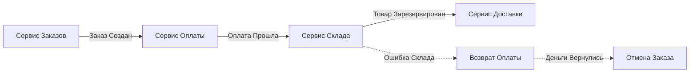

В распределенных системах мы часто сталкиваемся с необходимостью обеспечить атомарность операции, затрагивающей несколько независимых сервисов и баз данных. Как мы выяснили в статье [[8. Distributed transactions]], классический двухфазный коммит [[9. Two Phase Commit]] слишком дорог и плохо масштабируется из-за блокировок.

**Saga Pattern (Паттерн Сага)** — это архитектурный паттерн, который заменяет одну распределенную транзакцию последовательностью локальных транзакций. Каждая локальная транзакция обновляет базу данных и публикует событие или сообщение, инициирующее следующую транзакцию. Если какой-то шаг завершается ошибкой, Сага запускает **компенсирующие транзакции**, чтобы откатить изменения, внесенные предыдущими шагами.

## Анатомия Саги: Прощай, Изоляция

В отличие от ACID-транзакций, Саги не обладают свойством **Isolation** (Изоляция). Это означает, что промежуточные результаты Саги (например, уже списанные со счета деньги, но еще не подтвержденный заказ) видны другим транзакциям. По сути, Сага гарантирует только **ACD** (Atomicity, Consistency, Durability) в конечном счете.

### Типы транзакций в Саге
Для проектирования надежной Саги нужно разделить операции на три типа:
1. **Компенсируемые (Compensatable):** Операции, которые можно «отменить» логически (напр., вернуть деньги).
2. **Поворотная (Pivot):** Точка невозврата. Если эта транзакция прошла успешно, Сага считается выполненной. Она не является ни компенсируемой, ни ретраябельной.
3. **Повторяемые (Retriable):** Транзакции, которые идут *после* поворотной точки и обязаны завершиться успехом (напр., отправка уведомления).

---

## 1. Хореография (Choreography)

В хореографии нет центрального «мозга». Каждый сервис слушает события от других сервисов и решает, какую локальную транзакцию выполнить следующей.

* **Плюсы:** Децентрализация, простота внедрения для 2-3 сервисов.
* **Минусы:** Сложно отслеживать состояние всей цепочки, риск циклических зависимостей («спагетти-события»).



---

## 2. Оркестрация (Orchestration)

Здесь появляется центральный компонент — **Оркестратор** (или Стейт-машина). Он говорит каждому сервису, что делать, и обрабатывает ошибки.

* **Плюсы:** Весь процесс в одном месте, легко дебажить и менять логику, отсутствие циклов.
* **Минусы:** Оркестратор сам может стать Single Point of Failure (SPOF) и требует собственной базы состояний.


---

## Mechanical Sympathy: Outbox и Идемпотентность

Чтобы Сага была по-настоящему надежной, нельзя просто отправить событие в Kafka в середине транзакции Go-сервиса. Если база закоммитит изменения, а Kafka упадет в этот момент, Сага «рассыплется».

### 1. Transactional Outbox
Единственный надежный способ — записывать событие в ту же базу, где лежат данные, в рамках одной локальной транзакции. Подробнее об этом в статье [[11. Outbox pattern]]. 

### 2. Идемпотентность (Idempotency)
В Сагах сетевые ошибки приводят к повторным вызовам (retries). Если сервис оплаты получит событие «Списать 100$» дважды из-за таймаута, он не должен списать 200$. 
* **Решение:** Каждый шаг Саги должен иметь уникальный `SagaID` + `StepID`. Сервис-исполнитель должен проверять эти ID в своей базе перед обработкой. См. [[12. Idempotency и БД]].

---

## Реализация на Go: Принципы

В Go Саги часто реализуются через «координаторы» на базе контекстов или специализированных фреймворков.

```go
// Пример упрощенного оркестратора на Go
func CreateOrderSaga(ctx context.Context, order *Order) error {
    // 1. Локальная транзакция: Создание заказа
    if err := store.Save(order); err != nil {
        return err
    }

    // 2. Вызов сервиса оплаты
    // В реальности это должно идти через Outbox/Message Bus
    paymentErr := paymentService.Charge(order.UserID, order.Amount)
    if paymentErr != nil {
        // ЗАПУСК КОМПЕНСАЦИИ
        _ = store.UpdateStatus(order.ID, "CANCELLED")
        return paymentErr
    }

    // 3. Вызов склада...
    return nil
}
```

> [!warning] Ловушка / Gotcha: Проблема потерянного обновления
> Поскольку изоляции нет, пока ваша Сага «висит» (ждет ответа от склада), другой процесс может попытаться изменить те же данные. 
> **Решение:** Используйте семантическую блокировку. Вместо `status = 'ACTIVE'` ставьте `status = 'PENDING_PAYMENT'`. Другие процессы должны знать, что записи в статусе `PENDING` трогать нельзя.

---

## Инструментарий для Go

Писать Саги вручную на `if-else` — путь к боли. В Go-сообществе доминируют два подхода:
1.  **Temporal.io:** Флагман оркестрации. Вы пишете обычный Go-код, а Temporal гарантирует, что он дойдет до конца, сохраняя состояние каждой переменной в своей БД. Это «Workflow as Code».
2.  **Watermill / ThreeDotsLabs:** Отличные библиотеки для построения событийно-ориентированных Саг (Хореографии) с поддержкой различных брокеров.

> [!tip] Собеседование
> **Вопрос:** Что делать, если компенсирующая транзакция сама упала с ошибкой?
> **Ответ:** Это критическая ситуация. Система должна бесконечно ретраить компенсацию (Retriable). Если и это не помогает (напр., логическая ошибка), необходимо записывать событие в Dead Letter Queue (DLQ) и поднимать алерт для ручного вмешательства администратора. Сага не гарантирует 100% автоматическое восстановление при программных багах в самих компенсациях.

## Итог

1.  **Saga** — это цепочка локальных транзакций с компенсациями в случае ошибок.
2.  **Хореография** хороша для малых систем, **Оркестрация** — для сложных бизнес-процессов.
3.  Саги требуют **Идемпотентности** и использования **Transactional Outbox**.
4.  Отсутствие **Изоляции** нужно компенсировать на уровне бизнес-логики (статусы PENDING).

Саги позволяют строить невероятно масштабируемые системы, но они приносят сложность в отслеживании состояния. Чтобы разные инстансы оркестраторов или сервисов не конфликтовали при обновлении общих ресурсов, нам нужны механизмы координации в распределенной среде. Об этом в следующей статье: [[11. Distributed locks]].