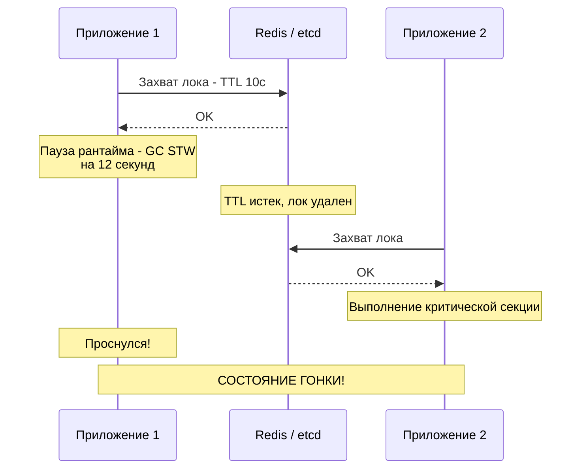
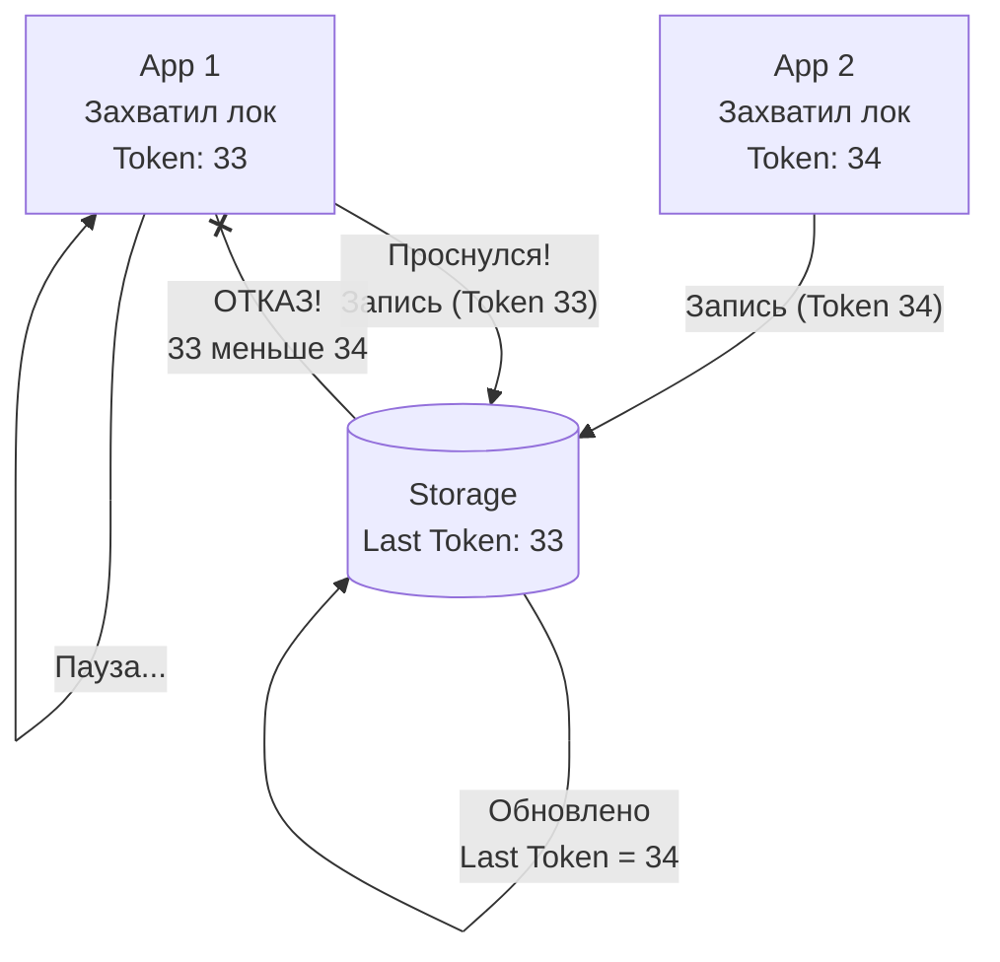

## Распределенные блокировки: Когда одного sync.Mutex недостаточно

В однопоточном приложении или даже в рамках одного инстанса Go мы используем `sync.Mutex` или `sync.RWMutex`. Они работают на уровне разделяемой памяти процесса. Но в распределенной системе, где ваш бэкенд запущен в 10 подах Kubernetes, обычный мьютекс бесполезен. Каждому инстансу нужно гарантировать, что критическую секцию (например, списание бонусов или генерацию сложного отчета) в конкретный момент времени выполняет **ровно один** процесс во всем кластере.

Для этого используются **Распределенные блокировки (Distributed Locks)**. Это механизм координации, который выносит состояние блокировки во внешнее хранилище, доступное всем узлам системы.

---

## 1. Фундаментальная проблема: Время и Паузы

Распределенные блокировки — это гораздо сложнее, чем кажется на первый взгляд. Основная опасность кроется в **Mechanical Sympathy** на уровне ОС и рантайма.

> [!warning] Ловушка / Gotcha: Проблема GC и "Стоп-мир"
> Представьте: горутина захватила лок в Redis на 10 секунд. Сразу после этого в Go-рантайме случается тяжелый **GC (Garbage Collection) Stop The World** или ОС решает приостановить поток (Scheduling pause) на 11 секунд. 
> 1. Пока горутина «спит», TTL лока в Redis истекает.
> 2. Другой инстанс захватывает этот же лок.
> 3. Первая горутина «просыпается» и продолжает работу, считая, что она всё еще владеет локом.
> **Итог:** Нарушение эксклюзивного доступа и повреждение данных.



---

## 2. Стратегии реализации

Существует три основных подхода к хранению состояния лока, каждый из которых соотносится с [[7. CAP теорема]].

### А. Блокировки на базе БД (SQL)
Самый простой вариант. Создается таблица `locks` с уникальным индексом по имени ресурса.
* **Механизм:** `INSERT INTO locks (resource_name) VALUES ('order_123')`. Если вставка успешна — лок ваш. `DELETE` — освобождение.
* **Плюсы:** Не нужно новых инструментов.
* **Минусы:** Плохо масштабируется, требует ручной очистки «протухших» локов, если процесс упал до удаления строки.

### Б. Redis и Redlock
Самый популярный и быстрый вариант. Обычно используется библиотека `redsync`.
* **Механизм:** `SET resource_name my_random_value NX PX 30000` (установить, если нет, с TTL 30с).
* **Алгоритм Redlock:** Попытка захватить лок в N независимых инстансах Redis. Лок считается захваченным, если большинство (N/2 + 1) ответили успехом за время, меньшее чем TTL.
* **Плюсы:** Сверхвысокая производительность.
* **Минусы:** Спорная надежность при сетевых разделениях и системных паузах (критика Мартина Клеппманна).

### В. Консенсус-системы (etcd, Consul, Zookeeper)
Самый надежный (CP) вариант.
* **Механизм:** Использование **Leases** (аренд) и **Watchers**. Клиент создает эфемерный узел. Если клиент пропадает (Keep-Alive не пришел), узел удаляется автоматически.
* **Плюсы:** Строгая консистентность. etcd гарантирует, что лок не будет перехвачен, пока жива сессия.

---

## 3. Решение "проблемы заснувшего клиента": Fencing Tokens

Чтобы защититься от ситуации, когда клиент проснулся после паузы и считает, что лок его, используется механизм **Fencing Tokens** (защитные токены).

Суть проста: каждое получение лока выдает строго возрастающее число (ID транзакции или Epoch). База данных или ресурс, который вы обновляете, должны принимать изменения только в том случае, если присланный токен **больше**, чем последний успешно примененный.



---

## 4. Идиоматичный Go: Реализация на etcd

В Go для работы с распределенными локами лучше всего использовать официальный клиент `etcd/clientv3`. Он предоставляет готовую абстракцию `concurrency`, которая под капотом обрабатывает аренды и продление (keep-alive).

```go
package main

import (
	"context"
	"log"
	"time"

	"go.etcd.io/etcd/client/v3"
	"go.etcd.io/etcd/client/v3/concurrency"
)

func main() {
	cli, _ := clientv3.New(clientv3.Config{Endpoints: []string{"localhost:2379"}})
	defer cli.Close()

	// 1. Создаем сессию с TTL (Lease)
	// Если процесс упадет, etcd удалит лок через 5 секунд
	s, err := concurrency.NewSession(cli, concurrency.WithTTL(5))
	if err != nil {
		log.Fatal(err)
	}
	defer s.Close()

	m := concurrency.NewMutex(s, "/distributed-lock/my-resource")

	// 2. Захват лока
	ctx, cancel := context.WithTimeout(context.Background(), 10*time.Second)
	defer cancel()

	if err := m.Lock(ctx); err != nil {
		log.Fatal("Не удалось захватить лок: ", err)
	}

	// КРИТИЧЕСКАЯ СЕКЦИЯ
	log.Println("Лок захвачен! Работаем...")
	time.Sleep(2 * time.Second)

	// 3. Освобождение
	if err := m.Unlock(context.Background()); err != nil {
		log.Fatal(err)
	}
	log.Println("Лок освобожден")
}
```

> [!tip] Собеседование
> **Вопрос:** Как реализовать лок в Redis так, чтобы его не удалил другой процесс?
> **Ответ:** При установке ключа (`SET NX`) нужно генерировать уникальный `request_id` (например, UUID). При удалении (`DELETE`) нужно использовать **Lua-скрипт**, который сначала проверит, совпадает ли `request_id` в Redis с тем, что у клиента. Это гарантирует атомарность проверки и удаления (защита от ситуации, когда лок истек, его занял другой, а первый пришел и удалил «чужой» ключ).

---

## 5. Выбор инструмента: Шпаргалка

| Инструмент | Скорость | Надежность | Когда использовать |
| :--- | :--- | :--- | :--- |
| **MySQL/Postgres** | Низкая | Средняя | Если нагрузка мала и не хочется тянуть инфраструктуру. |
| **Redis (Redlock)** | Высокая | Средняя | Если важна скорость и кратковременное нарушение эксклюзивности не фатально. |
| **etcd / Consul** | Средняя | Высокая | Для критичных финансовых операций и управления конфигурацией. |

## Итог

1. **Распределенный лок** — это не только про "захватить ключ", но и про "управлять его временем жизни".
2. **Паузы рантайма (STW)** и задержки сети могут привести к тому, что два узла будут считать себя владельцами лока.
3. Используйте **Leases** для автоматической очистки и **Fencing Tokens** для защиты ресурсов.
4. В Go-экосистеме `etcd` является наиболее надежным стандартом для таких задач.

Мы закончили масштабный раздел по распределенным базам данных. Теперь мы переходим к изучению специализированных хранилищ, которые отказываются от SQL ради гибкости и производительности в специфических сценариях: [[1. Что такое NoSQL]].