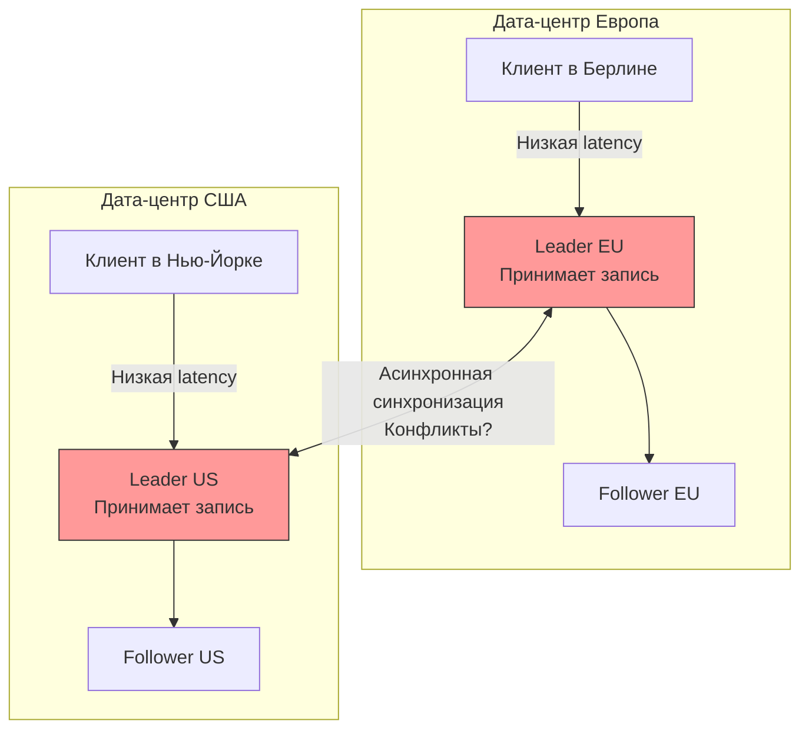

## Масштабирование записи и проблема расстояния

В архитектуре [[2. Leader Follower]] мы столкнулись с фундаментальным ограничением: **только один узел принимает записи**. Это создает узкое место (bottleneck) и географическую проблему.

Представьте, что у вас есть пользователи в Нью-Йорке и в Сингапуре. Если ваш единственный Leader находится в Нью-Йорке:
*   Пользователи в США имеют отличную задержку (latency) на запись (~10-20 мс).
*   Пользователи в Сингапуре страдают от задержки в 200+ мс на каждый `INSERT`/`UPDATE` из-за скорости света и сетевых_hop-ов.

**Multi-Leader репликация** (или Master-Master) решает эту проблему радикально: она позволяет писать на **несколько** узлов одновременно.

---

## Как работает Multi-Leader

В этой топологии у вас есть несколько узлов, которые играют роль Лидеров. Обычно каждый Лидер развернут в своем дата-центре (регионе).

1.  Клиент в регионе А пишет в Leader A.
2.  Клиент в регионе Б пишет в Leader B.
3.  Leader A и Leader B асинхронно обмениваются изменениями и применяют их к своим локальным данным.



### Преимущества
1.  **Производительность записи:** Каждый регион пишет локально. Latency записи определяется расстоянием до локального дата-центра, а не до «главного» сервера на другом континенте.
2.  **Отказоустойчивость дата-центра:** Если целый регион падает или отключается от сети, другой регион продолжает принимать записи. Failover не требуется (для записи), так как лидер уже доступен.

> [!warning] Ловушка / Gotcha
> Несмотря на название "Master-Master", многие системы баз данных не рекомендуют использовать эту схему для записи в одну и ту же таблицу одновременно с обоих мастеров в активном режиме (Active-Active), если вы не готовы к разрешению конфликтов. Часто используют схему Active-Passive, где запись идет только на один мастер, но в любой момент можно переключиться на другой.

---

## Главная проблема: Конфликты записи

Если в Single-Leader архитектуре все запросы на запись выстраиваются в очередь на одном узле, то в Multi-Leader у вас есть две независимые очереди событий. Это неизбежно ведет к конфликтам.

### Сценарий конфликта
В 12:00:00.000 пользователь в Берлине меняет имя пользователя с "Alice" на "Bob".
В 12:00:00.050 пользователь в Нью-Йорке (не видя изменения из Берлина из-за Lag-а) меняет имя с "Alice" на "Charlie".

Оба лидера принимают изменения локально. Через мгновение они обмениваются репликационными логами.
*   Leader EU получает: "Имя = Charlie".
*   Leader US получает: "Имя = Bob".

Это **конфликт записи**. База данных должна решить, какое значение выбрать, иначе данные разойдутся, и репликация сломается.

---

## Стратегии разрешения конфликтов

Разрешение конфликтов — самая сложная часть Multi-Leader репликации.

### 1. Last Write Wins (LWW)
Самый простой и самый опасный метод. Каждой записи присваивается метка времени (Timestamp). Выигрывает запись с *более поздним* временем.

*   **Проблема:** Зависит от синхронизации часов (NTP). Если часы на сервере в Берлине отстают на 100 мс, а в Нью-Йорке спешат, победит Нью-Йорк, даже если запись в Берлине была логически позже.
*   **Результат:** Потеря данных ("Bob" будет перезаписан "Charlie", и вы даже не узнаете об этом).

### 2. Application-level Resolution
База данных не решает, а сохраняет обе версии и отдает ошибку при чтении или записи. Приложение должно обработать конфликт.

Пример в Go (псевдокод логики):
```go
// При сохранении документа, если версия на сервере отличается от той, что мы читали
err := db.Update(doc)
if errors.Is(err, ErrConflict) {
    // Бизнес-логика: объединить поля, показать пользователю, взять серверную версию и т.д.
    resolved := resolveConflict(localCopy, serverCopy)
    db.Update(resolved)
}
```
Это дает самый надежный результат, но усложняет код.

### 3. CRDTs (Conflict-free Replicated Data Types)
Математически доказанные структуры данных, которые *гарантированно* не конфликтуют. Используются в системах вроде **CockroachDB**, **Redis (Active-Active)**, **Riak**.

Пример: Вместо присваивания значения (`SET x = 5`), мы используем счетчик (`INCREMENT x by 1`). Независимо от порядка операций, результат будет предсказуемым.

---

## Под капотом: Векторные часы (Version Vectors)

Как технически определить, что произошел конфликт? Нельзя просто сравнить Timestamp-ы из-за рассинхрона часов. Для этого используются **Векторные часы** (Version Vectors).

Каждая запись помечается не одним числом, а вектором версий от каждого лидера.
`[LeaderEU: 5, LeaderUS: 2]`

Когда LeaderEU записывает данные, он увеличивает свой счетчик: `[LeaderEU: 6, LeaderUS: 2]`.
Когда он получает обновление от LeaderUS, он видит версию от US.

Если LeaderEU видит два события:
1. `[EU: 6, US: 2]` (своё)
2. `[EU: 5, US: 3]` (пришло из US)

Он не может однозначно сказать, какое событие произошло позже, так как `EU:6 > EU:5` (наш новее), но `US:2 < US:3` (их новее). Это **параллельные события** -> **Конфликт**.

Это позволяет системе алгоритмически детектировать конфликты, вместо того чтобы молча терять данные как в LWW.

---

## Топологии Multi-Leader

Как лидеры обмениваются данными?

1.  **Circular (Кольцо):** A -> B -> C -> A.
    *   *Минус:* Один упавший узел разрывает кольцо.
2.  **Star (Звезда):** Один корневой лидер, остальные к нему подключаются.
    *   *Минус:* Single Point of Failure.
3.  **All-to-All (Все ко всем):** Каждый лидер отправляет изменения каждому.
    *   *Плюс:* Максимальная надежность.
    *   *Минус:* Сложность фильтрации дубликатов (если A прислал обновление B, B не должен отправить его обратно A, иначе будет цикл).

---

## Практика в Go: Генерация ID

В Single-Leader базе данных `AUTO_INCREMENT` (1, 2, 3...) работает отлично. В Multi-Leader это катастрофа.

Если Leader EU и Leader US одновременно вставляют строки, они оба сгенерируют ID = 1001. При репликации возникнет конфликт первичного ключа (Duplicate Key Error).

**Решение для Go-разработчика:**
1.  **UUID:** Используйте UUID v7 или v4. Они уникальны глобально без координации.
    ```go
    import "github.com/google/uuid"
    id := uuid.New() // Генерируется на стороне приложения
    ```
2.  **Snowflake ID:** Комбинация Timestamp + ID дата-центра + ID сервера + Sequence number.
    *   *Плюс:* Сортируются по времени (в отличие от UUID v4), занимают 8 байт (вместо 16 у UUID).
3.  **Разделение диапазонов:** Leader EU выдает четные ID, Leader US — нечетные.

> [!tip] Собеседование
> **Вопрос:** Почему PostgreSQL в стандартной репликации не поддерживает Multi-Master?
> **Ответ:** Потому что PostgreSQL опирается на строгую сериализуемость и блокировки (MVCC). Реализация глобальных блокировок между дата-центрами — это слишком дорого и сложно. Для Multi-Master в мире Postgres используются специализированные расширения (например, BDR - Bi-Directional Replication) или переход на NewSQL базы вроде CockroachDB (которые строятся на Raft и CRDT).

---

## Итог

Multi-Leader репликация — это мощный инструмент для географического распределения нагрузки и снижения latency записи, но он продается по цене **сложности обработки конфликтов**.

1.  Используйте её, когда вам действительно нужна запись в нескольких регионах (Active-Active).
2.  Избегайте простых стратегий LWW (Last Write Wins), если вам дороги данные.
3.  В Go-коде откажитесь от автоинкремента в пользу UUID или Snowflake ID.
4.  Помните, что консистентность данных здесь слабее (Eventual Consistency), и ваше приложение должно быть готово к этому.

Мы научились копировать данные и писать в несколько мест. Но что, если данных так много, что они не помещаются на один сервер? В следующей статье мы разберем, как расщеплять данные — [[4. Sharding]].