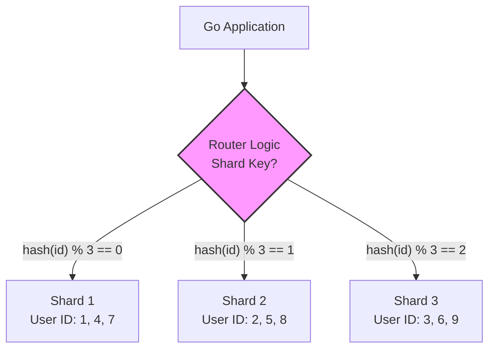

## Пределы масштабирования вертикали

Рано или поздно любой бэкенд-инженер сталкивается со стеной. Вы оптимизировали запросы, настроили индексы, подняли реплики для чтения... но база данных всё равно перегружена.
Почему? Потому что вы уперлись в лимиты **вертикального масштабирования** (Vertical Scaling). Вы не можете бесконечно добавлять RAM, CPU и быстрые SSD в один сервер. Это дорого, а главное — имеет физический предел.

Решение — **Шардинг** (Sharding), или горизонтальное масштабирование. Это архитектурный паттерн, при котором данные разбиваются на части и распределяются по разным физическим узлам (шардам).

В отличие от [[2. Leader Follower]] репликации, где все узлы хранят *одни и те же* данные (копии), при шардинге каждый узел хранит *уникальный кусок* данных.

---

## Как это работает: Ключ шардирования

Чтобы разбить данные, нам нужен критерий. Мы не можем просто случайным образом кидать строки в разные базы, иначе мы никогда не найдем их обратно. Нам нужен **Shard Key** (Ключ шардирования).

Это поле (или набор полей) в вашей таблице, которое определяет, на какой шард попадет запись.

### Основные стратегии шардирования

#### 1. Hash Sharding (Хеширование)
Самый популярный метод. Мы берем значение ключа (например, `user_id`), считаем хеш (например, MD5 или CRC32) и берем остаток от деления на количество шардов.

$$ \text{Shard ID} = \text{hash}(user\_id) \mod N $$

```go
// Пример логики роутинга в Go
func GetShard(userID int64, shards []string) string {
    // Простой мурмур-хеш или CRC64
    hash := crc64.Checksum([]byte(fmt.Sprintf("%d", userID)), crc64.MakeTable(crc64.ISO))
    shardIndex := hash % uint64(len(shards))
    return shards[shardIndex]
}
```

*   **Плюсы:** Данные распределяются равномерно (Random Write). Нет "горячих" шардов.
*   **Минусы:** Диапазонные запросы (`SELECT * FROM users WHERE id > 100 AND id < 200`) становятся адом, так как данные разбросаны по всем шардам.

#### 2. Range Sharding (Диапазонное шардирование)
Мы делим данные по диапазонам значений.
*   Shard 1: `user_id` от 1 до 1,000,000
*   Shard 2: `user_id` от 1,000,001 до 2,000,000

*   **Плюсы:** Эффективные запросы по диапазону.
*   **Минусы:** Неравномерная нагрузка. Если Shard 1 хранит первых пользователей, которые оказались "китами" или старыми аккаунтами, он может перегреться. Часто страдает от горячих точек (Hotspots).

#### 3. Directory Sharding (Справочник)
Мы создаем отдельную таблицу-справочник (Lookup Table), которая мапит ключ на шард.

*   **Плюсы:** Максимальная гибкость. Можно переместить любого пользователя на любой шард.
*   **Минусы:** Таблица-справочник становится SPOF (Single Point of Failure) и узким местом. Требует отдельного кэширования.



---

## Главная боль: Решеардирование (Resharding)

Что происходит, когда Shard 1 переполнился, а Shard 2 и 3 пустуют? Или когда вы решили добавить 4-й шард?

При простом хешировании `hash % N`, добавление одного шарда меняет результат для **почти всех** ключей. Вам придется переместить ~80% данных по сети. Это процесс, который может длиться днями и "положить" продакшн.

> [!info] Под капотом: Consistent Hashing
> Для решения этой проблемы используют **Консистентное хеширование** (Consistent Hashing).
> Вместо `hash % N`, мы отображаем и ключи, и сервера на кольцо хешей (0..2^32-1).
> При добавлении нового сервера он забирает данные только у одного соседа по кольцу. Это сводит перемещение данных к минимуму. Этот подход используется в Cassandra, DynamoDB и Redis Cluster.

---

## Проблемы и ловушки в Go-коде

Шардинг кардинально меняет то, как вы пишете бэкенд.

### 1. Смерть JOIN-ов
В классической монолитной БД `JOIN` — это дешево и удобно. В шардированной среде `JOIN` между таблицами, лежащими на разных серверах, — это **распределенный JOIN**, который база выполнить не может (или делает это очень медленно).

**Решение:**
*   **Denormalization (Денормализация):** Дублируйте данные. Если заказ лежит на шарде пользователя, продублируйте туда имя пользователя, чтобы не джойнить его с таблицей `users` с другого шарда.
*   **Application-side Joins:** Ваш Go-сервис делает два запроса параллельно (к шарду заказов и шарду пользователей) и склеивает данные в памяти.

```go
// Антипаттерн в шардинге (если таблицы на разных шардах)
// SELECT orders.*, users.name FROM orders JOIN users ON orders.user_id = users.id

// Паттерн в Go
func GetOrderWithUser(ctx context.Context, orderID int64) (*Order, error) {
    // 1. Получаем заказ (знаем шард по orderID или userID)
    order, err := orderRepo.GetByID(ctx, orderID)
    
    // 2. Зная order.UserID, идем в шардинг пользователей
    user, err := userRepo.GetByID(ctx, order.UserID)
    
    order.UserName = user.Name
    return order, nil
}
```

### 2. Генерация ID
Как и в [[3. Multi Leader]], автоинкремент (`SERIAL`) здесь не работает. Два шарда сгенерируют одинаковый ID = 105.
Вам необходимы UUID или Snowflake ID (TSO — Timestamp Ordering Oracle).

### 3. Транзакции
Транзакции ACID работают только в рамках одного шарда. Если вам нужно перевести деньги с пользователя А (на шарде 1) на пользователя Б (на шарде 2), классическая транзакция невозможна.
Вам нужны **Распределенные транзакции** (см. [[8. Distributed transactions]] и [[10. Saga pattern]]), которые сложнее, медленнее и требуют компенсирующих действий.

---

## Инструментарий

Реализовывать шардинг вручную в Go-коде (через `map[shard]*sql.DB`) — это путь для смелых (или небольших проектов). В энтерпрайзе используют прослойки:

1.  **Vitess:** Стандарт де-факто для шардинга MySQL. Написан на Go. Он предстает перед вашим приложением как обычный MySQL сервер, а сам делает всю грязную работу по маршрутизации и решеардированию.
2.  **ProxySQL:** Умный прокси для MySQL.
3.  **Redis Cluster:** Встроенный шардинг в Redis.
4.  **MongoDB:** Встроенный шардинг (Mongos router).

> [!warning] Ловушка / Gotcha
> **Hot Partition (Горячий партицион).**
> Если вы выберете неправильный ключ шардирования (например, `created_at` для логов), то все записи за текущий день пойдут на один шард. Он перегреется и умрет, в то время как остальные шарды будут отдыхать.
> *Правило:* Ключ шардирования должен обеспечивать равномерное распределение записей (Write Distribution).

---

## Итог

Шардинг — это "тяжелая артиллерия" масштабирования. Он позволяет хранить петабайты данных, но требует жертв:
1.  Сложность в коде (нет JOIN-ов, ручная маршрутизация).
2.  Слабая консистентность транзакций.
3.  Сложность эксплуатации (решеардирование).

Часто шардинг путают с Партиционированием. Партиционирование — это логическое деление таблицы на куски внутри **одной** инстансы БД. В следующей статье мы разберем [[5. Partitioning]], чтобы расставить точки над i.