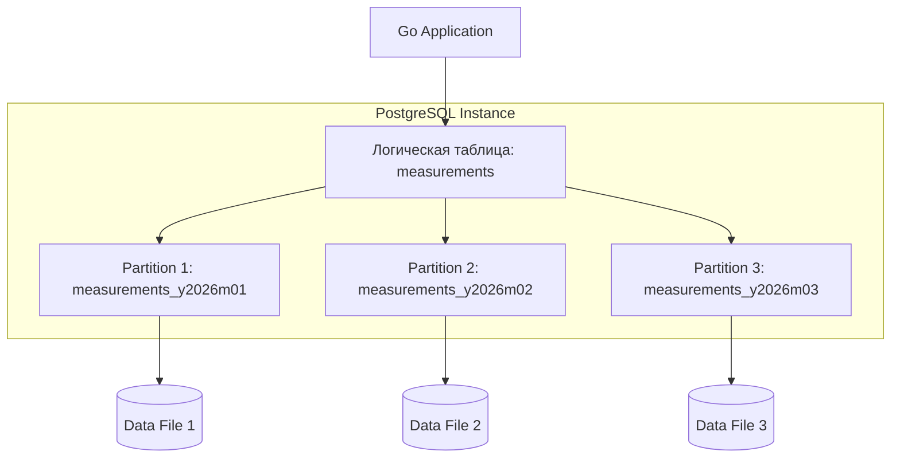

В предыдущих статьях мы обсуждали [[4. Sharding]], где данные физически разносятся по разным серверам. **Партиционирование (Partitioning)** — это родственная, но отличная концепция. Чаще всего под этим термином понимают **Vertical** или **Horizontal Partitioning** внутри *одного* экземпляра базы данных.

Для Senior Go-разработчика партиционирование — это инструмент борьбы с "проклятием больших таблиц". Когда таблица переваливает за сотни миллионов строк, индексы перестают влезать в RAM (`shared_buffers`), а операции обслуживания вроде `VACUUM` или `ALTER TABLE` начинают занимать вечность.

---

## Что такое партиционирование?

**Партиционирование** — это разбиение одной логической таблицы на несколько физических под-таблиц (партиций), которые хранятся отдельно, но управляются базой данных прозрачно для приложения.

Когда ваше Go-приложение делает запрос к родительской таблице `orders`, движок БД сам решает, в какую именно партицию ("секцию") нужно направить запрос.

### Типы партиционирования

1.  **Horizontal Partitioning (Секционирование):** Разделение строк. Например, заказы за 2023 год лежат в одной таблице, за 2024 — в другой. Это самый частый сценарий.
2.  **Vertical Partitioning:** Разделение колонок. Редко используемые или очень "тяжелые" колонки (например, `blob` или длинные тексты) выносятся в отдельную таблицу, связанную 1-к-1. В PostgreSQL это частично реализовано нативно через механизм **TOAST** (см. [[2. Storage engine PostgreSQL]]).

---

## Механизмы распределения данных

Чтобы база знала, куда положить строку, вы определяете **Ключ партиционирования (Partition Key)**.

### 1. Range Partitioning (По диапазонам)
Идеально подходит для временных рядов (Time-series) или логов.
* **Пример:** Секции по месяцам: `Jan_2026`, `Feb_2026`.
* **Плюс:** Очень легко удалять старые данные (просто `DROP TABLE` старой секции вместо тяжелого `DELETE`).

### 2. List Partitioning (По списку)
Данные делятся по конкретным значениям.
* **Пример:** Секции по странам: `orders_ru`, `orders_us`, `orders_eu`.
* **Плюс:** Удобно для локализации данных или соблюдения законодательства (GDPR).

### 3. Hash Partitioning (По хэшу)
Данные распределяются равномерно.
* **Пример:** `hash(user_id) % 4`.
* **Плюс:** Помогает избежать "горячих точек" (Hotspots), когда все пишут в одну последнюю секцию (как в Range).



---

## Mechanical Sympathy: Почему это работает быстрее?

### 1. Partition Pruning (Исключение партиций)
Это главная причина роста производительности. Если вы ищете заказ за `2026-04-20`, планировщик PostgreSQL видит, что этот диапазон покрывается только одной партицией. Он **игнорирует** все остальные партиции и их индексы. 


Вместо того чтобы искать в одном гигантском B-Tree индексе на 100 ГБ (который не лезет в кэш), база ищет в маленьком индексе на 1 ГБ, который полностью лежит в `shared_buffers`.

### 2. Локальность данных
Поскольку каждая партиция — это отдельный файл на диске, вы можете разнести их по разным физическим носителям через **Tablespaces**. Например:
* Актуальные данные за этот месяц — на быстрых **NVMe**.
* Архивные данные за прошлый год — на дешевых **HDD**.

---

## Реализация в PostgreSQL: Declarative Partitioning

Начиная с версии 10, в Postgres появилось декларативное партиционирование.

```sql
-- Создаем родительскую таблицу
CREATE TABLE measurements (
    city_id         int not null,
    logdate         date not null,
    peaktemp        int
) PARTITION BY RANGE (logdate);

-- Создаем конкретную партицию
CREATE TABLE measurements_y2026m04 PARTITION OF measurements
    FOR VALUES FROM ('2026-04-01') TO ('2026-05-01');
```

> [!tip] Собеседование
> **Вопрос:** В чем разница между Partitioning и Sharding?
> **Ответ:** Partitioning — это разделение таблицы внутри одного сервера (одного инстанса БД). Sharding — это разделение данных между разными серверами (инстансами). Часто они используются вместе: данные шардируются по `user_id` между 10 серверами, и на каждом сервере таблица партиционируется по `created_at` для ускорения поиска.

---

## Проблемы и ограничения

1.  **Глобальные индексы:** В PostgreSQL индексы создаются для каждой партиции отдельно. Нельзя создать уникальный индекс, который бы проверял уникальность по всей логической таблице (если ключ партиционирования не входит в этот индекс).
2.  **Foreign Keys:** Ссылки на партиционированные таблицы могут иметь ограничения в зависимости от версии БД.
3.  **Maintenance:** Нужно вовремя создавать новые партиции. Если придет запись для диапазона, которого еще нет — база выдаст ошибку. Бэкенд-разработчики часто пишут воркеры на Go, которые заранее (через `cron`) создают таблицы на следующий месяц.

> [!warning] Ловушка / Gotcha: Индексный взрыв
> Если у вас 1000 партиций и вы делаете запрос без указания ключа партиционирования в `WHERE`, база будет вынуждена просканировать **1000 индексов**. Это может быть медленнее, чем поиск по одной большой непартиционированной таблице.
> **Правило:** Ключ партиционирования всегда должен присутствовать в запросе.

## Использование в Go

Для вашего кода на Go партиционирование должно быть прозрачным. Вы продолжаете работать с родительской таблицей:

```go
// Код остается прежним, база сама найдет нужную партицию
query := "SELECT peaktemp FROM measurements WHERE logdate = $1 AND city_id = $2"
row := db.QueryRow(ctx, query, "2026-04-24", 77)
```

Однако при проектировании моделей (structs) и API, вы должны учитывать, что `logdate` в данном примере — критически важное поле. Если вы его не передадите, производительность рухнет.

## Итог

1.  **Partitioning** помогает управлять огромными таблицами, разбивая их на части.
2.  **Partition Pruning** значительно ускоряет `SELECT`, отсекая ненужные файлы данных.
3.  Это лучший способ реализации **Data Retention** (удаление старых данных через `DROP TABLE`).
4.  Всегда включайте ключ партиционирования в `WHERE`, чтобы избежать сканирования всех секций.

Мы разобрались, как делить данные внутри одного узла и между узлами. Но как обеспечить согласованность этих данных, когда у нас несколько копий или шардов? Об этом мы поговорим в следующей статье: [[6. Consistency модели]].