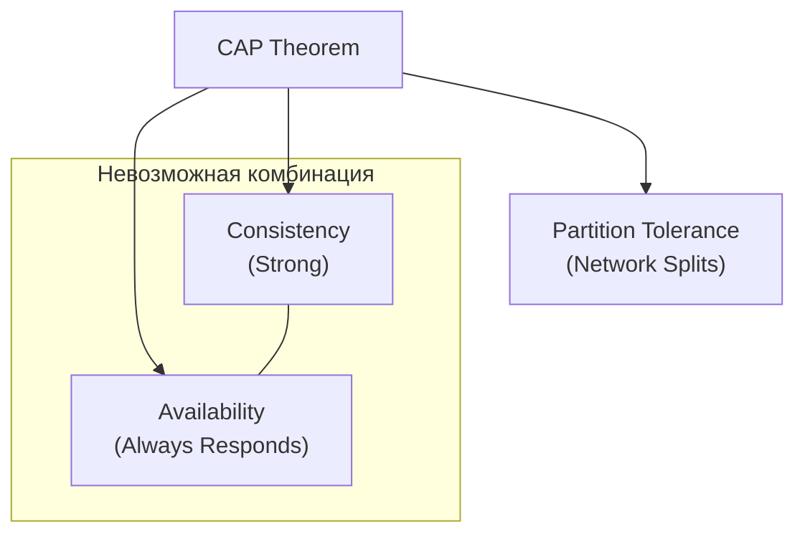

В распределенных системах на Go, когда мы выходим за пределы одного сервера БД ([[11. Репликация в PostgreSQL]]), мы сталкиваемся с фундаментальной проблемой: **данные не могут мгновенно оказаться везде**. Пока пакет с данными летит по сети от Лидера к Фолловеру, система находится в состоянии неопределенности.

**Консистентность (Согласованность)** в распределенных системах — это не про ACID (целостность данных внутри одной БД), а про то, **какой порядок событий и какую свежесть данных видит клиент** (ваше Go-приложение), обращаясь к разным узлам кластера.

---

## Проблема: Иллюзия единого времени

В распределенной системе нет "единых часов". Если две горутины в разных дата-центрах пишут данные в БД, база должна решить, какая запись была "первой". Модели консистентности — это набор правил (контрактов), которые гарантируют определенное поведение системы.

### 1. Строгая консистентность (Strong Consistency / Linearizability)
Самая мощная модель. Система ведет себя так, будто данных существует всего одна копия, а все операции выполняются мгновенно и атомарно.
* **Гарантия:** Если операция записи успешно завершена, любой последующий `SELECT` с любого узла обязан вернуть это значение или более новое.
* **Цена:** Огромные задержки (Latency). Для записи нужно дождаться подтверждения от большинства узлов (Quorum), а на время записи чтение может блокироваться.
* **Примеры:** Google Spanner, алгоритмы консенсуса (Raft, Paxos).

### 2. Eventual Consistency (Согласованность в конечном счете)
Самая слабая и дешевая модель.
* **Гарантия:** Если в систему перестанут поступать новые записи, через некоторое время все узлы придут к одному состоянию.
* **Поведение:** Вы записали пост, получили `200 OK`, обновили страницу и... поста нет. Обновили еще раз — пост появился. Вы просто попали на разные реплики.
* **Примеры:** DNS, Cassandra, DynamoDB, асинхронная репликация Postgres.

---

## Модели, ориентированные на пользователя

Для бэкенд-разработчика на Go часто важна не абстрактная "строгость", а конкретный пользовательский опыт (User Experience).

### 3. Read Your Writes (Чтение своих записей)
Это критическая модель для большинства веб-приложений. 
* **Проблема:** Пользователь меняет аватар. Приложение перенаправляет его на страницу профиля. Если профиль читается с асинхронной реплики, пользователь увидит старый аватар.
* **Решение в Go:** 1. Использовать `Stickiness`: направлять пользователя на тот же узел, где была запись.
    2. Передавать `LSN` (Log Sequence Number). Приложение говорит реплике: "Дай мне данные, но только если ты уже применила транзакцию №123".

### 4. Monotonic Reads (Монотонное чтение)
* **Гарантия:** Если вы один раз увидели значение $X$, вы никогда в будущем не увидите более старое значение.
* **Проблема без этой модели:** Вы читаете ленту новостей. Видите пост. Обновляете страницу — пост исчез (попали на медленную реплику). Обновляете еще раз — появился. Это сбивает с толку.

### 5. Causal Consistency (Причинная согласованность)
Система гарантирует порядок только для причинно-связанных событий.
* **Пример:** Пост и комментарий к нему. Нельзя увидеть комментарий, не увидев сам пост. Это "сильнее", чем Eventual, но "слабее" и быстрее, чем Strong.

---

## Теорема CAP: Выбор инженера

Все эти модели существуют в рамках **CAP-теоремы**. В распределенной системе при возникновении сетевого разделения (**P** - Partition tolerance) вы обязаны выбрать что-то одно:
1. **CP (Consistency + Partition Tolerance):** Система жертвует доступностью. Если узлы не могут договориться, они выдают ошибку. (Пример: MongoDB, Raft).
2. **AP (Availability + Partition Tolerance):** Система всегда отвечает, но может вернуть старые данные. (Пример: Cassandra, CouchDB).

> [!tip] Собеседование
> **Вопрос:** Мы используем PostgreSQL с асинхронной репликацией. Какую модель консистентности мы имеем и как гарантировать Read-Your-Writes?
> **Ответ:** Мы имеем Eventual Consistency. Чтобы гарантировать Read-Your-Writes, мы можем:
> 1. Временно (на 5-10 секунд) после записи направлять все `SELECT` этого пользователя на Master-узел.
> 2. Использовать куки с меткой времени последней записи и сравнивать её с `Replication Lag` на реплике.

---

## Mechanical Sympathy: Кворум (Quorum)

В распределенных БД консистентность часто настраивается через формулу кворума:
$$W + R > N$$
Где:
* $N$ — общее количество узлов.
* $W$ — количество узлов, подтвердивших запись.
* $R$ — количество узлов, участвующих в чтении.

Если $N=3$, и вы настроили $W=2$ и $R=2$, то вы гарантированно получите Strong Consistency, так как множества узлов записи и чтения обязательно пересекутся хотя бы на одном узле с актуальными данными.

> [!warning] Ловушка / Gotcha: Последняя запись побеждает (LWW)
> В моделях с Eventual Consistency (например, в Cassandra) часто используется стратегия **Last Write Wins (LWW)**. Если два клиента на разных узлах одновременно обновляют одно поле, база оставит то, чья метка времени (Timestamp) больше. 
> **Проблема:** Часы на серверах никогда не синхронизированы идеально. Из-за дрейфа часов (Clock Drift) запись, которая физически случилась позже, может быть стерта "старой" записью.

## Итог

1. **Strong Consistency** — надежно, но медленно и может отказать в обслуживании при сбое сети.
2. **Eventual Consistency** — быстро и доступно, но перекладывает сложность обработки "старых данных" на плечи Go-разработчика.
3. Для большинства бизнес-задач достаточно **Read-Your-Writes** и **Monotonic Reads**.
4. Всегда учитывайте **CAP-теорему** при выборе БД для проекта.

Понимание моделей консистентности подводит нас к самой известной теоретической базе распределенных систем. В следующей статье мы разберем её во всех деталях: [[7. CAP теорема]].