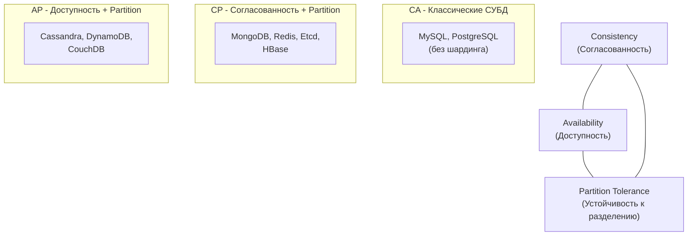

## CAP-теорема: Фундаментальный предел распределенных систем

При переходе от одиночного сервера MySQL к распределенным кластерам (о которых мы говорили в разделах про [[5. Репликация в MySQL]] и [[8. MariaDB]]), мы сталкиваемся с жесткими физическими ограничениями. В 1998 году Эрик Брюэр сформулировал теорему, которая стала «законом сохранения» для архитекторов бэкенда.

**CAP-теорема** утверждает, что в любой распределенной системе, работающей над общими данными, невозможно одновременно обеспечить более двух из трех следующих свойств:

1.  **Consistency (Согласованность/Консистентность):** Все узлы системы в любой момент времени видят одни и те же данные. Если мы записали значение `X` на один узел, любой последующий запрос на чтение с любого другого узла вернет `X`.
2.  **Availability (Доступность):** Каждый запрос к работающему узлу системы завершается успешным ответом (без ошибки), даже если другие узлы вышли из строя.
3.  **Partition Tolerance (Устойчивость к разделению):** Система продолжает работать, даже если связь между узлами потеряна (сетевое разделение или «Split Brain»).



---

## 1. Разбор свойств: Что они значат на самом деле

Многие разработчики путают термины CAP с терминами ACID. Важно различать их.

### Consistency (C) в CAP != Consistency в ACID
В ACID консистентность означает соблюдение правил бизнеса (инвариантов). В CAP это **Linearizability** (линеаризуемость) — гарантия того, что чтение всегда возвращает самую свежую запись. Если данные реплицируются асинхронно, свойство **C** нарушается.

### Availability (A)
Это не просто «uptime сервера». Это гарантия того, что если узел жив, он *обязан* ответить на запрос, не дожидаясь подтверждения от других узлов. Если узел отвечает «я не знаю, у меня нет связи с мастером», свойство **A** нарушено.

### Partition Tolerance (P)
Это суровая реальность сетей. Роутеры падают, кабели рвутся, задержки (latency) растут. В распределенной системе **P — это не выбор, это обязанность**. 

> [!warning] Ловушка / Gotcha: Выбор "CA"
> В учебниках часто рисуют треугольник, где можно выбрать сторону CA. **В реальном мире это невозможно.** Сетевые сбои случатся рано или поздно. Если вы выбираете CA, ваша система просто «упадет» при первом же разрыве связи между серверами. Поэтому реальный выбор всегда стоит между **CP** и **AP** в момент сетевого разделения.

---

## 2. CP против AP: Жизнь во время сбоя

Представьте кластер из двух узлов, связь между которыми прервалась. Приходит запрос на запись.

### Сценарий CP (Consistency + Partition Tolerance)
Система жертвует доступностью ради данных. 
* Если узел не может подтвердить запись на другой узел (или убедиться, что он всё еще является лидером), он возвращает **ошибку**. 
* Данные защищены, но ваш бэкенд на Go получит 500 Internal Server Error.
* **Примеры:** `etcd`, `ZooKeeper`, `MongoDB` (в режиме большинства).

### Сценарий AP (Availability + Partition Tolerance)
Система жертвует согласованностью ради работы.
* Узел принимает запись локально и отвечает «OK», надеясь синхронизироваться позже.
* Результат: пользователи на разных узлах видят разные данные (**Eventual Consistency**).
* **Примеры:** `Cassandra`, `CouchDB`, `Amazon DynamoDB`.

---

## 3. PACELC: Расширение CAP

Теорема CAP описывает поведение системы только в момент сбоя. Но системы работают без сбоев 99.9% времени. Для этого случая придумали **PACELC**.

**P** (при разделении) выбирай между **A** и **C**, **E** (иначе, в нормальной работе) выбирай между **L** (Latency — задержка) и **C** (Consistency).

> [!info] Под капотом: Цена консистентности
> Даже если сеть работает идеально, синхронная репликация (обеспечение **C**) увеличивает **Latency**. Мастер должен ждать подтверждения от реплик (RTT сети), прежде чем ответить Go-приложению. Если вы хотите минимальную задержку (**L**), вам придется использовать асинхронную репликацию, временно жертвуя **C**.

---

## 4. Практика в Go: Как это влияет на код

Как бэкенд-разработчик, вы должны обрабатывать поведение системы в зависимости от её типа.

### Работа с CP-системой (например, etcd или Consul)
Ваш код должен быть готов к отказам даже при живых серверах. Используйте паттерн **Retries** с экспоненциальным бэком (backoff).

```go
// Использование библиотеки с поддержкой ретраев для CP систем
func SetConfig(ctx context.Context, key, val string) error {
    for i := 0; i < 3; i++ {
        err := kvStore.Put(ctx, key, val)
        if err == nil {
            return nil
        }
        // Если ошибка "no leader" или сетевой таймаут - ждем и повторяем
        time.Sleep(time.Duration(i+1) * time.Second)
    }
    return fmt.Errorf("system unavailable due to partition")
}
```

### Работа с AP-системой (например, Cassandra или Redis с репликацией)
Ваш код должен уметь разрешать конфликты (Conflict Resolution), так как два пользователя могли одновременно обновить одни и те же данные на разных узлах.

> [!tip] Собеседование: CAP и микросервисы
> **Вопрос:** Мы строим систему заказов. Что выбрать: CP или AP?
> **Ответ:** Зависит от бизнес-кейса. 
> * Для **инвентаризации (остатки товара)** лучше **CP**. Мы не хотим продать товар, которого нет. Лучше выдать ошибку «сервис временно недоступен», чем обмануть покупателя.
> * Для **ленты новостей или лайков** лучше **AP**. Никто не умрет, если увидит лайк на секунду позже, но лента должна открываться всегда.

## Итог

1.  **CAP** — это фундаментальное ограничение: нельзя быть одновременно идеально быстрым, всегда доступным и на 100% согласованным в распределенной сети.
2.  **P (Partition Tolerance)** — обязательное свойство для любого кластера.
3.  Выбор **CP** гарантирует точность данных, но увеличивает риск отказов в обслуживании.
4.  Выбор **AP** гарантирует живучесть системы, но перекладывает на разработчика задачу борьбы с «разъезжающимися» данными.

Понимание CAP-теоремы позволяет осознанно выбирать инструменты. Если вам нужна строгая консистентность в распределенной среде, вы неизбежно придете к алгоритмам консенсуса, которые мы разберем в следующей статье: [[8. Distributed transactions]].