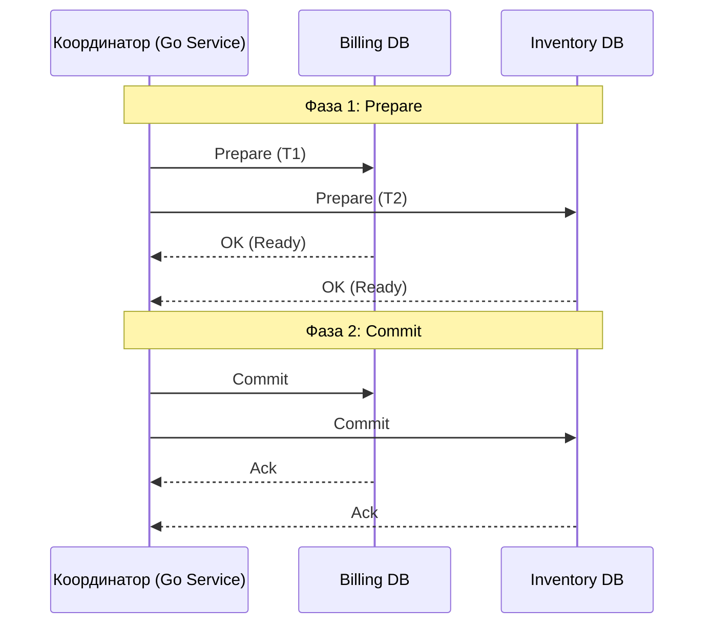

Разработка распределенных систем на Go неизбежно приводит к ситуации, когда одна бизнес-операция должна затронуть несколько независимых баз данных или микросервисов. Например, при оформлении заказа нам нужно:
1. Заблокировать деньги в сервисе биллинга (PostgreSQL).
2. Списать товар в сервисе склада (MySQL).
3. Начислить кэшбэк в сервисе лояльности (MongoDB).

В монолитной архитектуре мы бы просто открыли `BEGIN` и `COMMIT` в одной БД, полагаясь на ACID. В распределенной среде классические транзакции не работают, так как у каждой базы свой журнал [[8. WAL. Write Ahead Log]] и свой менеджер транзакций.

**Распределенная транзакция** — это механизм, обеспечивающий выполнение набора операций на нескольких узлах сети так, чтобы соблюдались свойства атомарности и консистентности.

---

## Проблема: Частичные отказы

В распределенной системе всё, что может пойти не так, пойдет не так:
* Сеть может моргнуть между шагом 1 и 2.
* Сервис склада может упасть из-за OOM (Out Of Memory) прямо в момент списания.
* База данных лояльности может отклонить запрос из-за нарушения уникального ключа.

Если мы просто последовательно вызываем HTTP/gRPC методы, мы рискуем оставить систему в **несогласованном состоянии**: деньги сняты, а товара нет.

---

## Стратегия 1: Атомарная фиксация (2PC)

**Two-Phase Commit (Двухфазный коммит)** — это классический протокол, который пытается перенести опыт локальных транзакций в распределенную среду. В нем появляется новая роль — **Координатор**.

### Фазы 2PC:
1. **Prepare (Подготовка):** Координатор спрашивает все узлы: «Готовы ли вы закоммитить изменения?». Узлы проверяют ограничения, блокируют строки и отвечают «Да» или «Нет».
2. **Commit / Rollback (Фиксация или Откат):** - Если **все** ответили «Да», координатор рассылает команду на коммит.
   - Если хотя бы **один** ответил «Нет» или не ответил вовремя, координатор рассылает команду на откат.

> [!warning] Ловушка / Gotcha: Блокировки и SPOF
> 2PC — это **блокирующий** протокол. Пока узлы ждут вторую фазу, они держат блокировки на строки БД. Если координатор упадет между фазами, все участвующие базы останутся заблокированными ("зависшие транзакции"), пока координатор не поднимется. Из-за этого 2PC крайне плохо масштабируется и редко используется в Highload микросервисах.

---

## Стратегия 2: Sagas (Саги)

В современной микросервисной архитектуре на Go стандартом де-факто является паттерн **Saga**. Сага — это последовательность локальных транзакций. Если одна из транзакций завершается неудачей, Сага запускает **компенсирующие транзакции**, чтобы откатить изменения, внесенные предыдущими шагами.

### Виды Саг:
1. **Choreography (Хореография):** Сервисы обмениваются событиями (через Kafka/NATS). Каждый знает, что делать дальше.
2. **Orchestration (Оркестрация):** Центральный сервис (Оркестратор) управляет логикой и вызывает методы других сервисов.

> [!tip] Собеседование
> **Вопрос:** В чем разница между откатом (Rollback) в БД и компенсацией в Саге?
> **Ответ:** Откат в БД — это физическое удаление данных из WAL до того, как их кто-то увидел. Компенсация в Саге — это **новая запись**, которая логически отменяет предыдущую (например, возврат денег на счет). Система проходит через промежуточное неконсистентное состояние, которое видно другим пользователям.

---

## Mechanical Sympathy: Идемпотентность

В распределенных транзакциях сетевые повторы (retries) неизбежны. Если ваш Go-сервис переповторяет запрос на списание денег из-за таймаута, он должен быть уверен, что деньги не спишутся дважды.

Это достигается через **Идемпотентность**. Каждый запрос должен нести уникальный `Request-ID` (или `Transaction-ID`), который база проверяет перед выполнением.

---

## Сравнение подходов

| Характеристика | 2PC (Two-Phase Commit) | Saga Pattern |
| :--- | :--- | :--- |
| **Изоляция** | Высокая (ACID-like) | Низкая (состояние видно всем) |
| **Доступность** | Низкая (блокировки) | Высокая |
| **Сложность** | Реализовано в БД (XA) | Нужно писать код компенсации |
| **Консистентность** | Strong | Eventual |

## Реализация на Go: Инструментарий

Для реализации надежных распределенных транзакций в Go-сообществе принято использовать специализированные движки, которые берут на себя логику ретраев и хранения состояний:
* **Temporal.io / Cadence:** Самый мощный инструмент для оркестрации саг. Позволяет писать логику транзакции как обычный Go-код, обеспечивая его выполнение даже при падении серверов.
* **DTM (Distributed Transaction Manager):** Легковесный менеджер транзакций специально для Go, поддерживающий TCC, Saga и 2PC.

## Итог

1. **Распределенные транзакции** сложнее локальных, так как не имеют общей памяти и часов.
2. **2PC** гарантирует строгую консистентность, но убивает производительность блокировками.
3. **Saga** — основной выбор для облачных систем, полагающийся на компенсирующие транзакции и [[6. Consistency модели|Eventual Consistency]].
4. **Идемпотентность** — обязательное условие для любого узла, участвующего в распределенной транзакции.

Одной из самых популярных реализаций атомарной фиксации является протокол, который мы упомянули лишь вскользь. Чтобы понять, почему он считается "золотым стандартом" классических систем и почему от него отказываются в пользу Саг, мы разберем его отдельно: [[9. Two Phase Commit]].