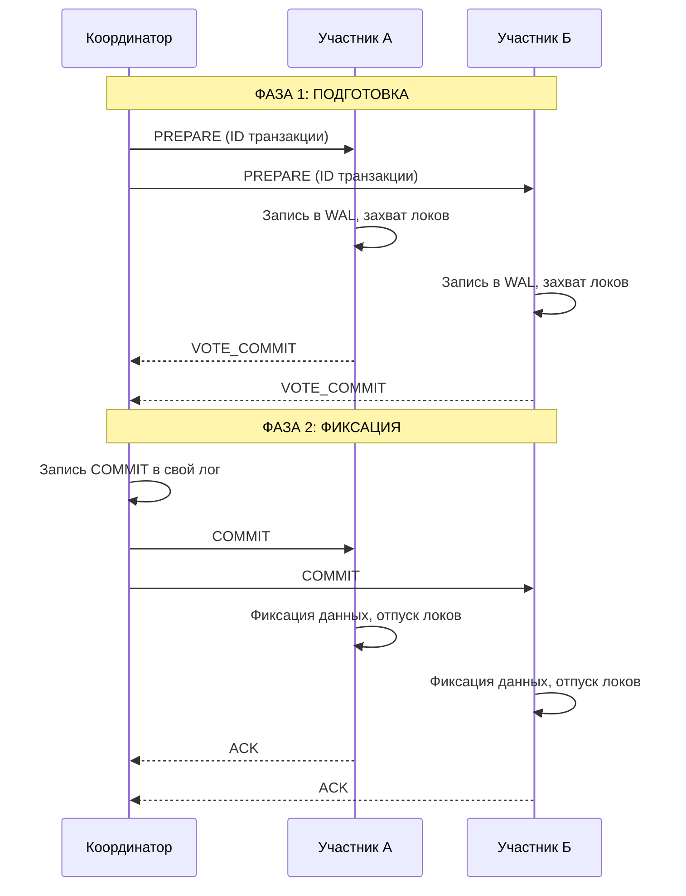

## Two-Phase Commit (2PC): Классика распределенного консенсуса

В прошлой статье [[8. Distributed transactions]] мы обсудили теоретическую сложность атомарности в распределенных системах. Сегодня мы разберем «золотой стандарт» (и одновременно «старое проклятие») системного дизайна — протокол **Двухфазной фиксации (Two-Phase Commit, 2PC)**.

Если вам нужно, чтобы транзакция либо применилась на всех узлах (например, в PostgreSQL и Kafka одновременно), либо не применилась нигде, 2PC — это первое, что приходит в голову архитектору. Но за эту гарантию приходится платить огромную цену в виде задержек (Latency) и риска полной блокировки системы.

---

## 1. Роли и сценарий

В протоколе 2PC участвуют две стороны:
1.  **Координатор (Coordinator):** Узел, который инициирует транзакцию и управляет её жизненным циклом.
2.  **Участники (Participants / Cohorts):** Ресурсы (БД, очереди сообщений), которые должны выполнить работу.

Протокол разделен на две фазы, что отражено в его названии.

### Фаза 1: Голосование (Prepare Phase)
Координатор отправляет всем участникам запрос `PREPARE`. Каждый участник проверяет, может ли он зафиксировать транзакцию:
* Проверяет ограничения (constraints).
* Записывает данные в свой локальный лог (WAL), но **не коммитит**.
* Удерживает все необходимые блокировки (Locks).
* Отвечает `VOTE_COMMIT` (готов) или `VOTE_ABORT` (ошибка).

### Фаза 2: Завершение (Commit Phase)
Координатор собирает голоса:
* **Если ВСЕ ответили «ДА»:** Координатор пишет финальное решение в свой лог и отправляет команду `COMMIT` всем участникам. Участники фиксируют изменения и отпускают блокировки.
* **Если ХОТЯ БЫ ОДИН ответил «НЕТ» (или таймаут):** Координатор отправляет команду `ROLLBACK`.



---

## 2. Под капотом: Механика надежности

2PC — это **CP-система** по [[7. CAP теорема]]. Она выбирает консистентность любой ценой. Чтобы протокол пережил падение любого узла, он опирается на логирование.

> [!info] Под капотом: Лог Координатора
> Самый критичный момент — запись решения координатором в свой лог перед отправкой фазы 2. Как только координатор записал `COMMIT` на диск, транзакция считается завершенной. Даже если координатор упадет сразу после записи, при рестарте он прочитает лог и «дожмет» участников, отправив им `COMMIT` повторно. Без этого лога система превратилась бы в неконсистентный хаос.

### XA Transactions
В мире энтерпрайза 2PC часто реализуется через стандарт **XA (eXtended Architecture)**. Большинство реляционных БД (MySQL, PostgreSQL, Oracle) поддерживают XA. Это позволяет вашему Go-приложению выступать в роли менеджера транзакций, связывая две разные базы данных.

---

## 3. Главная проблема: Блокировки и "Точка отказа"

Почему 2PC называют «протоколом-убийцей производительности»?

1.  **Длительные блокировки:** Участники держат блокировки строк с момента получения `PREPARE` до получения `COMMIT/ROLLBACK`. В распределенной системе это время включает в себя сетевые задержки (RTT). Если сеть мигнет, вся база будет стоять на блокировках, ожидая решения.
2.  **Проблема падения Координатора:** Если координатор упал *после* того, как участники ответили «ДА», но *до* того, как разослал решение, участники оказываются в «подвешенном» состоянии. Они не знают, чем закончился коммит, и **не могут отпустить блокировки**, так как это нарушит атомарность.

> [!tip] Собеседование: Блокирующий протокол
> **Вопрос:** Является ли 2PC блокирующим протоколом?
> **Ответ:** Да. Это его главный недостаток. В случае падения координатора в определенный момент времени, участники вынуждены ждать его восстановления, блокируя ресурсы. Это радикально снижает доступность (**Availability**) системы.

---

## 4. Mechanical Sympathy: Цена сетевых раундов

Для бэкенд-инженера важно понимать физику: 2PC требует как минимум два полных сетевых раунда (Round-trips) между координатором и всеми участниками. 

Если задержка между ДЦ составляет 20мс, то только на «общение» уйдет минимум 80мс. В это время CPU простаивает в ожидании сетевого IO, а горутины в Go висят, занимая память. В высоконагруженных системах это приводит к исчерпанию пула соединений БД и лимитов на дескрипторы файлов.

---

## 5. 2PC против Sagas

Когда мы проектируем микросервисы на Go, мы часто выбираем между 2PC и [[10. Saga pattern]].

| Характеристика | Two-Phase Commit (2PC) | Saga Pattern |
| :--- | :--- | :--- |
| **Консистентность** | Строгая (ACID) | В конечном счете (Eventual) |
| **Изоляция** | Высокая (локи на уровне БД) | Низкая (эффект «грязного чтения») |
| **Сложность** | На уровне инфраструктуры (XA) | На уровне бизнес-логики |
| **Производительность** | Низкая (из-за блокировок) | Высокая (асинхронно) |

> [!warning] Ловушка / Gotcha: 2PC в микросервисах
> Использование 2PC между микросервисами через HTTP/gRPC — это архитектурный антипаттерн. 2PC требует «доверия» на уровне ресурсов. Если один сервис упадет и не поднимется, он заблокирует базу данных другого сервиса. В микросервисной среде всегда отдавайте предпочтение паттерну **Saga** или **Outbox pattern**.

## Практика в Go

Стандартная библиотека `database/sql` не поддерживает распределенные транзакции XA «из коробки» (нет метода `Prepare()`). Для реализации 2PC в Go обычно требуются специализированные драйверы или внешние менеджеры транзакций (например, **dtm** — Distributed Transaction Manager).

```go
// Пример концептуальной реализации (требуется поддержка драйвера)
func DistributedTx(db1, db2 *sql.DB) error {
    // 1. Начинаем XA транзакции на обеих БД
    _, _ = db1.Exec("XA START 'tx123'")
    _, _ = db2.Exec("XA START 'tx123'")

    // 2. Выполняем работу...

    // 3. Фаза 1: PREPARE
    _, err1 := db1.Exec("XA PREPARE 'tx123'")
    _, err2 := db2.Exec("XA PREPARE 'tx123'")

    if err1 == nil && err2 == nil {
        // 4. Фаза 2: COMMIT
        db1.Exec("XA COMMIT 'tx123'")
        db2.Exec("XA COMMIT 'tx123'")
    } else {
        // Или ROLLBACK
        db1.Exec("XA ROLLBACK 'tx123'")
        db2.Exec("XA ROLLBACK 'tx123'")
    }
    return nil
}
```

## Итог

1.  **2PC** обеспечивает строгую атомарность в распределенной среде через две фазы: Голосование и Фиксация.
2.  Это **синхронный и блокирующий** протокол, который плохо масштабируется и чувствителен к сетевым задержкам.
3.  Главная уязвимость — «зависание» участников при падении координатора.
4.  В современном облачном бэкенде 2PC заменяется более гибким паттерном **Saga**, который мы разберем в следующей статье: [[10. Saga pattern]].

Мы закончили с классическими методами консенсуса. Теперь пора переходить к тому, как современные распределенные системы решают проблему атомарности без жестких блокировок, используя событийную модель. В следующей статье: [[10. Saga pattern]].