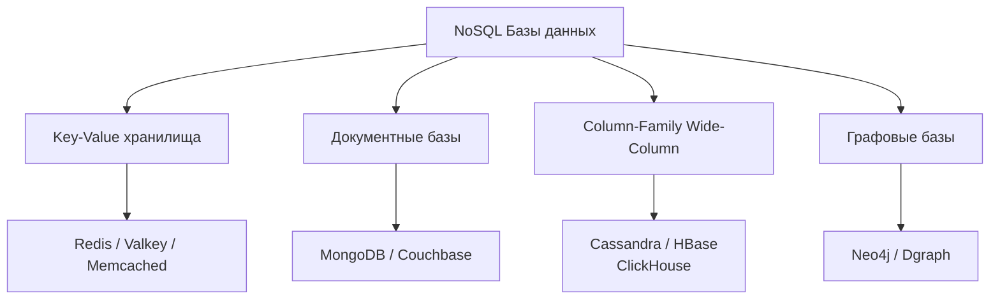

NoSQL — это одно из самых неправильно понимаемых понятий в бэкенд-разработке. Многие воспринимают его как «нет SQL, давайте хранить JSON как попало». На самом деле **NoSQL = Not Only SQL** — это семейство технологий, решающих задачи, с которыми классические реляционные базы справляются плохо или не справляются вовсе.

Когда вы проектируете систему на Go, которая должна обслуживать миллионы запросов в секунду, хранить петабайты логов или работать с динамической схемой данных, вы неизбежно приходите в мир NoSQL.

## Исторический контекст: почему SQL стало "not only"

Реляционные СУБД доминировали десятилетиями и прекрасно решают задачи [[3. Типы баз данных. OLTP vs OLAP|OLTP]] и OLAP, когда данные структурированы, связи заранее известны, а бюджет позволяет вертикальное масштабирование (покупка «железа» помощнее). Но в середине 2000-х интернет-гиганты (Google, Amazon, Facebook) столкнулись с тремя фундаментальными проблемами:

1. **Масштаб.** Реляционные базы проектировались под вертикальное масштабирование (больше RAM, CPU на одном сервере). Горизонтальное масштабирование (распределение данных по сотням дешевых нод) требовало жертвовать частью гарантий ACID (см. [[1. ACID. Основы]]), в первую очередь консистентностью в реальном времени.
2. **Скорость разработки.** Agile-команды меняли модель данных каждые две недели. Жёсткая схема и миграции ([[4. Миграции базы данных]]) стали бутылочным горлышком.
3. **Разнообразие данных.** Появились неструктурированные данные (социальные графы, логи, сессии пользователей, full-text поиск), для которых реляционная модель с джойнами и [[9. Нормализация. Введение|нормализацией]] была избыточна или неэффективна.

В ответ на это сообщество начало создавать базы данных, отказывающиеся от SQL-интерфейса, строгой схемы и полной ACID-транзакционности в пользу масштабируемости, гибкости и производительности на конкретных типах нагрузок. Сейчас большинство из них уже вернули себе SQL-подобные языки запросов и некоторый уровень транзакционности, но философия осталась.

> [!info] Под капотом
> Ключевое отличие NoSQL-движков от классического InnoDB/PostgreSQL storage engine лежит в структурах хранения. Вместо строгой row-based модели со страницами фиксированного размера и B-Tree-индексами вы получаете либо LSM-Tree (Cassandra, RocksDB), либо inverted index (Elasticsearch), либо хранение в оперативной памяти (Redis). Каждая структура оптимизирована под конкретный паттерн доступа к диску и памяти. С точки зрения Go-рантайма это означает совершенно разный профиль syscall-ов и работу с памятью, когда вы, например, держите соединение с Redis или MongoDB.

## Классификация NoSQL-баз

Чтобы не путаться в зоопарке технологий, их делят на четыре фундаментальных типа по модели данных:

### 1. Key-Value (Ключ-значение)
Простейшая модель: каждому уникальному ключу соответствует некоторое значение — строка, сериализованный объект, blob. Никакой схемы, никаких связей между ключами.  
- **Представители:** [[3. Redis. Архитектура и применение|Redis]], [[5. Memcached|Memcached]], [[6. Valkey|Valkey]], etcd.
- **Типичные сценарии:** кэширование, сессии пользователей, хранение конфигураций, очереди, rate limiting.
- **Преимущество:** предсказуемая latency, так как данные часто лежат полностью в памяти (Redis) и запрос — это простой поиск по хеш-таблице. Подробнее в [[2. Key Value базы]].

### 2. Document (Документные)
Хранят документы — самодостаточные структуры данных, обычно в JSON- или BSON-подобном формате. У документов есть первичный ключ, а внутри они могут содержать вложенные объекты и массивы. База понимает структуру документа и позволяет делать запросы по полям внутри него.  
- **Представители:** [[7. Document базы. MongoDB|MongoDB]], Couchbase, Amazon DocumentDB.
- **Типичные сценарии:** каталоги товаров, контент-менеджмент, пользовательские профили с меняющимся набором полей, хранение логов.
- **Важное отличие от реляций:** документ объединяет то, что в SQL лежало бы в нескольких таблицах и собиралось JOIN-ом. Это даёт выигрыш на чтении за счёт денормализации. Отличная статья по теме — [[14. Денормализация и когда она оправдана]].

### 3. Column-Family (Колоночные / Wide-Column)
Данные организованы не по строкам, а по колонкам. Строки могут иметь произвольный набор колонок, которые динамически добавляются. Таблицы группируются в Column Families. Эта модель оптимизирована для записи огромных потоков данных и эффективного чтения только нужных колонок.  
- **Представители:** [[9. Column базы. Cassandra|Cassandra]], HBase, ScyllaDB, и отчасти [[11. ClickHouse. OLAP база|ClickHouse]] (хотя ClickHouse скорее аналитическая колоночная СУБД).
- **Типичные сценарии:** хранение временных рядов, IoT-телеметрия, системы рекомендаций, event sourcing (см. [[9. Event sourcing и базы]]).
- **Под капотом:** Cassandra, например, использует LSM-Tree для невероятно быстрой записи на диск — данные пишутся в memtable в памяти и последовательно сбрасываются в SSTables на диске, избегая случайного I/O.

### 4. Graph (Графовые)
Данные и связи между ними — это сущности первого класса. Идеально, когда важнее не сами объекты, а то, как они связаны.  
- **Представители:** Neo4j, Dgraph, AWS Neptune.
- **Типичные сценарии:** социальные сети (кто с кем дружит), рекомендательные системы («люди, купившие это, также купили...»), обнаружение мошенничества (графы транзакций), knowledge graphs.
- **Язык запросов:** Cypher, SPARQL, Gremlin вместо SQL. В Go-экосистеме популярен Dgraph с GraphQL-подобным API.

## ACID vs BASE: другая философия консистентности

Революция NoSQL базируется на теореме [[7. CAP теорема|CAP]] (о которой мы поговорим детальнее в распределённых системах), которая утверждает, что в распределённой системе при наличии разделения сети (Partition) вы обязаны выбрать между Consistency и Availability. NoSQL-системы, как правило, жертвуют строгой согласованностью (strong consistency) в пользу доступности и устойчивости к разделению.

Вместо ACID ([[1. ACID. Основы]]) здесь принято говорить о **BASE**:
- **B**asically **A**vailable — система всегда отвечает (пусть даже не самыми свежими данными).
- **S**oft state — состояние системы может меняться со временем даже без новых входных данных (из-за механизмов eventual consistency).
- **E**ventual consistency — если в систему перестанут поступать обновления, через некоторое время все реплики придут к согласованному состоянию.

> [!warning] Ловушка / Gotcha
> Eventual consistency совсем не означает, что у вас нет никаких гарантий, и данные могут теряться. Большинство современных NoSQL-баз предоставляют настраиваемые уровни консистентности для каждой операции (например, Cassandra: `QUORUM` на запись и чтение даёт строгую согласованность). Проблема в том, что по умолчанию эти настройки часто щадящие, и новички попадают в ситуацию, когда read-after-write не работает. В Go-клиентах к Cassandra (gocql) эта конфигурация управляется через `Consistency.One` / `Consistency.Quorum`.

## Mechanical Sympathy: как NoSQL работает с железом

С точки зрения Go-разработчика, понимающего [[1. Архитектура компьютера|архитектуру процессора]] и устройство ОС, выбор NoSQL-движка — это выбор профиля использования системных ресурсов.

- **Redis / Memcached** — pure in-memory база. Все данные живут в куче процесса в оперативной памяти. Системный вызов `read` вообще не вызывается для получения данных (кроме восстановления из RDB/AOF). Это даёт субмиллисекундную задержку, но требует огромных объёмов RAM.
- **MongoDB (до v4.0)** использовал mmap для отображения файлов БД в виртуальную память, полагаясь на page cache ОС. Это означало, что при холодном старте и чтении с диска процесс уходит в major page fault — дорогой syscall, блокирующий поток ОС. В Go-драйвере mongo-go-driver это влияет на то, как планировщик горутин обрабатывает блокирующие вызовы.
- **Cassandra** и подобные LSM-движки, напротив, оптимизированы под последовательную запись на диск. Последовательный I/O на NVMe дисках даёт пропускную способность гигабайты в секунду при минимуме `fdatasync` и переключений контекста. Это хорошо коррелирует с принципами написания высокопроизводительного Go-кода: буферизация и пакетная запись.

> [!tip] Собеседование
> **Вопрос:** Почему MongoDB может быть быстрее PostgreSQL на одном типе нагрузки и медленнее на другом, даже если индексы настроены правильно?
> **Ответ:** MongoDB хранит документ как единое целое (обычно последовательно на диске в BSON-формате внутри коллекции). Если ваш паттерн доступа — «получить пользователя со всеми его адресами и последними заказами», вы читаете один документ (скорее всего, один IO-промах, если нет индекса). В PostgreSQL те же данные из-за нормализации потребуют трёх JOIN-ов и множества случайных чтений страниц. Однако если вам нужен только email пользователя, MongoDB прочитает весь документ (включая большие вложенные массивы), тратя пропускную способность памяти и шины данных. PostgreSQL же аккуратно прочитает только нужный столбец через Index-Only Scan ([[6. Covering индекс]]). Именно поэтому говорят: «NoSQL не лучше и не хуже — он другой».

## Go и NoSQL: готовимся к практике

Стандартная библиотека Go, а именно `database/sql` (см. [[1. Работа с БД в Go. database_sql]]), не предназначена для NoSQL-баз. Она спроектирована вокруг концепции реляционного драйвера, строгой типизации столбцов через `Scan` и management-команд типа `BEGIN/COMMIT`.

Для NoSQL вы будете использовать нативные драйверы сообщества:
- **Redis:** `github.com/redis/go-redis/v9`
- **MongoDB:** `go.mongodb.org/mongo-driver`
- **Cassandra:** `github.com/gocql/gocql`
- **ClickHouse:** `github.com/ClickHouse/clickhouse-go/v2`
- **Neo4j:** `github.com/neo4j/neo4j-go-driver/v5`

Эти драйверы реализуют собственные пулы соединений ([[2. Connection pool]]), протоколы сериализации (RESP, MongoDB Wire Protocol) и кластерную маршрутизацию. Обратите внимание: `database/sql` не управляет этими соединениями — используйте настройки самих драйверов.

## Когда выбирать NoSQL, а когда нет

Ниже — прямое практическое руководство, которое стоит держать в голове перед стартом нового сервиса на Go.

**Выбирайте NoSQL, если:**
- Схема данных меняется быстро или не определена заранее (динамические документы).
- Вам нужна запись с огромной скоростью (логи, события, IoT) — смотрите в сторону Cassandra или ClickHouse.
- Доступ всегда идёт по ключу, без сложных аналитических запросов (сессии, кэш) — Redis.
- Данные естественно денормализованы и представляют собой агрегат — документные БД.
- Важнее доступность и работа в условиях сетевых разделов, чем строгая консистентность в реальном времени.

**Выбирайте реляционные БД (PostgreSQL/MySQL), если:**
- Данные строго структурированы и связи критичны (финансы, учёт товаров).
- Нужны сложные ACID-транзакции с участием нескольких таблиц.
- Присутствует развитая аналитика с ad-hoc запросами, JOIN-ами и оконными функциями.
- Команда ещё не готова работать с eventual consistency и хочет гарантий «запрос-ответ» без сюрпризов.

Часто в реальных highload-проектах (см. [[13. Highload базы данных]]) используется комбинация: PostgreSQL как основной источник истины и NoSQL как специализированные прослойки — Redis для кэша ([[7. Кэширование поверх БД]]), Elasticsearch для полнотекстового поиска, Cassandra для быстрой записи событий.

## Итог

NoSQL не замена реляционным базам, а расширение арсенала бэкенд-инженера. Каждая категория — key-value, document, column-family, graph — решает конкретную проблему масштаба, скорости или гибкости. Понимание внутреннего устройства этих систем (LSM-Tree, in-memory структуры, mmap) напрямую влияет на способность писать на Go действительно производительные, стабильные и предсказуемые системы.

В следующих статьях мы будем последовательно погружаться в каждый тип NoSQL, начиная с самого простого и невероятно мощного — key-value хранилищ. Мы начнём с обзора архитектуры и применения, а затем залезем под капот самых известных реализаций.

[[2. Key Value базы]]