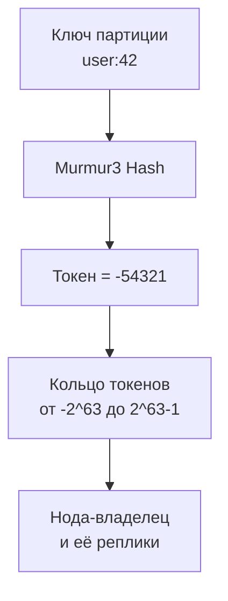
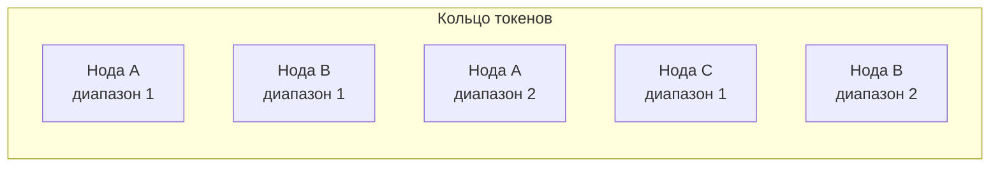
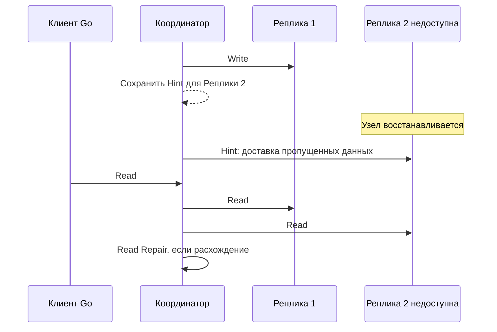

## Введение

В [[9. Column базы. Cassandra|предыдущей статье]] мы рассмотрели Cassandra как представителя колоночных (wide-column) NoSQL-систем, изучили модель данных, LSM-дерево и границы применимости. Теперь мы погрузимся в её архитектуру — топологию кластера, механизмы репликации, координации и восстановления. Понимание этих элементов абсолютно необходимо Senior Go-инженеру, проектирующему высоконагруженные сервисы, где ставки на доступность и линейную масштабируемость превыше немедленной строгой консистентности.

Cassandra не просто распределённая база данных — это децентрализованная система без единой точки отказа, где каждый узел равноправен и способен обслужить запрос. Её архитектура воплощает принципы Amazon Dynamo и Google Bigtable, сплавленные в единое целое.

## Кольцо и consistent hashing

В основе распределения данных в Cassandra лежит концепция **consistent hashing**. Все узлы кластера логически располагаются на кольце, охватывающем весь диапазон хеш-значений (от -2^63 до 2^63-1 при использовании Murmur3Partitioner).



- **Partitioner** (по умолчанию Murmur3Partitioner) вычисляет 64-битный хеш от partition key. Это даёт равномерное распределение и минимизирует «горячие» диапазоны.
- **Token** — значение хеша, определяющее позицию на кольце.
- **Нода отвечает за непрерывный диапазон токенов** от предыдущей ноды (исключительно) до своего токена включительно.
- **Virtual Nodes (vnodes)** — каждый физический узел может владеть несколькими (по умолчанию 256) малыми диапазонами токенов, разбросанными по всему кольцу. Это упрощает перебалансировку при добавлении/удалении нод и улучшает равномерность распределения данных и нагрузки.



Для Go-драйвера `gocql` это знание критично: драйвер получает метаданные топологии (карту токенов и узлов) и может отправлять запрос напрямую на реплику, владеющую данными (**TokenAwareHostPolicy**). Это устраняет лишний сетевой прыжок через координатор и снижает latency.

## Репликация: фактор и стратегии

Каждая партиция хранится на нескольких узлах — фактор репликации (`replication_factor`, RF) определяет количество копий. Доступны две главные стратегии размещения реплик:

- **SimpleStrategy**: Реплики размещаются на последовательных узлах кольца, двигаясь по часовой стрелке. Используется для одно-датацентровых кластеров.
- **NetworkTopologyStrategy**: Позволяет указать количество реплик в каждом дата-центре (DC) и стойке (rack). Реплики распределяются так, чтобы обеспечить живучесть при выходе из строя целого DC или стойки.

```go
// Пример создания keyspace в Go
cql := `CREATE KEYSPACE myks WITH replication = {
    'class': 'NetworkTopologyStrategy',
    'DC1': 3,
    'DC2': 2
}`
```

При записи координатор отправляет запрос всем репликам и ждёт подтверждений в соответствии с указанным consistency level. Внутренне Cassandra использует **Gossip-подобный протокол** для мониторинга состояния узлов и быстрого обнаружения отказов.

## Gossip-протокол и обнаружение сбоев

Узлы Cassandra постоянно общаются между собой с помощью gossip-протокола (вариант Scuttlebutt). Каждую секунду узел случайно выбирает один-два других узла и синхронизирует с ними состояние кластера:
- Кто жив, кто мёртв.
- Версия схемы.
- Распределение токенов.

Для детектирования отказов используется **Phi Accrual Failure Detection** — адаптивный алгоритм, который не бинарно «жив/мёртв», а вычисляет вероятность отказа, что даёт устойчивость к кратковременным сетевым флуктуациям. Если подозрение превышает порог (phi > 8), узел помечается как down.

> [!info] Под капотом
> Gossip реализован через класс `Gossiper` и обмен сообщениями через `MessagingService`. Состояние каждого узла хранится в `EndpointState`, включающем `HeartBeatState` и `ApplicationState`. Для Go-разработчика это важно, потому что драйвер подписывается на события статуса узлов и автоматически исключает мёртвые ноды из пула соединений.

## Hinted Handoff и Read Repair

Даже при временном отказе отдельных реплик Cassandra гарантирует, что данные в итоге станут консистентными, благодаря двум механизмам:

**Hinted Handoff:** Когда координатор не может доставить запись на одну из реплик (узел down), он сохраняет hint (подсказку) локально в системной таблице `system.hints`. Как только узел снова появляется, hint доставляется, и данные восстанавливаются. Время хранения hint ограничено (по умолчанию 3 часа).

**Read Repair:** При чтении координатор сравнивает ответы от реплик. Если обнаружены расхождения (устаревшие версии), он отправляет свежие данные отставшим репликам. Вероятность выполнения read repair управляется параметром `read_repair_chance` (по умолчанию 0.1 — 10% запросов).



С точки зрения Mechanical Sympathy, hinted handoff — это фоновый процесс, генерирующий дополнительный сетевой трафик и дисковые записи (hints пишутся на диск). В высоконагруженных Go-сервисах важно следить за накоплением hints (метрика `pending_hints`) — их большой объём говорит о долговременной недоступности узлов и может забить диск.

## Compaction: как LSM-дерево оптимизирует хранение

Как мы обсуждали в [[9. Column базы. Cassandra|предыдущей статье]], данные записываются в Memtable и сбрасываются в SSTable на диск. Но со временем накапливаются десятки и сотни SSTable, что замедляет чтение. **Compaction** объединяет эти файлы, удаляя устаревшие версии данных и освобождая место. Выбор стратегии влияет на производительность кардинально.

### SizeTiered Compaction Strategy (STCS)
По умолчанию. SSTable группируются по размеру (примерно одинаковые). Когда в группе набирается достаточно файлов (по умолчанию 4), они сливаются в один большой. 
- **Плюсы:** Отличная производительность записи, мало системных вызовов слияния.
- **Минусы:** Во время слияния может потребоваться до 2x дискового пространства, чтение может замедляться при большом количестве SSTable.

### Leveled Compaction Strategy (LCS)
SSTable организованы в уровни. Уровень L1 в 10 раз больше L0, L2 в 10 раз больше L1 и т.д. Слияния происходят небольшими порциями.
- **Плюсы:** Более стабильная производительность чтения (меньше файлов для проверки), меньше дискового пространства для временных данных.
- **Минусы:** Выше write amplification, может не справляться с очень интенсивной записью.

### TimeWindow Compaction Strategy (TWCS)
Оптимизирована для временных рядов с TTL. Данные группируются по временным окнам (например, 1 день). Устаревшие окна удаляются целиком, без слияния. Идеальна для сенсорных данных, логов, метрик.

> [!warning] Ловушка / Gotcha
> Выбор неправильной стратегии может привести к катастрофическому падению производительности. Например, STCS при активном чтении с большим количеством SSTable вызывает read amplification. В Go-сервисах это проявляется как рост 99-го перцентиля latency до секунд при среднем времени в миллисекундах. Всегда тестируйте компaction под реальный профиль нагрузки.

## Внутренние индексы и вторичные индексы

Cassandra не поддерживает B-Tree индексы в стиле PostgreSQL. Вместо этого:
- **Primary Index** — встроен в хранение: данные физически отсортированы по partition key + clustering columns.
- **Secondary Index (2i)** — индексы по отдельным колонкам, хранятся на тех же узлах, что и основные данные. Подходят для низко-кардинальных полей, но не для высоко-кардинальных, так как require scatter-gather запросы.
- **SASI (SSTable Attached Secondary Index)** — улучшенные вторичные индексы, реализованные внутри SSTable, с поддержкой LIKE, range запросов. В Go-драйвере для использования нужно просто объявить индекс при создании таблицы и добавлять условие WHERE.

Однако, в отличие от SQL, запросы с вторичным индексом всё равно требуют обхода всех партиций, что на больших кластерах неприемлемо. Оптимальный путь — денормализация и проектирование нескольких таблиц под разные запросы.

## Легковесные транзакции (Lightweight Transactions)

Cassandra обеспечивает сравнительно слабые гарантии по умолчанию (eventual consistency). Для сценариев, где нужна строгая атомарность и изоляция (например, регистрация уникального пользователя), введены легковесные транзакции (LWT) на основе протокола **Paxos**.

```
INSERT INTO users (id, name) VALUES (uuid(), 'Alice') IF NOT EXISTS;
```

Под капотом выполняется серия раундов голосования между репликами, что гарантирует линеаризуемость операции. Это значительно дороже обычной записи (в 3–10 раз медленнее), поэтому их используют точечно.

В Go-коде через gocql можно выполнить LWT:

```go
var applied bool
err := session.Query(
    `INSERT INTO users (id, name) VALUES (?, ?) IF NOT EXISTS`,
    id, name).ScanCAS(&applied, nil)
if !applied {
    // пользователь уже существует
}
```

> [!tip] Собеседование
> **Вопрос:** Почему Cassandra не использует двухфазный коммит (2PC) для транзакций, а выбрала Paxos?
> **Ответ:** 2PC требует координатора, который становится единой точкой отказа во время блокировки. В децентрализованной системе без master-узла 2PC сложно реализовать надёжно. Paxos же не требует выделенного координатора вне реплик данных и может быть встроен в сам процесс принятия решения между репликами, что соответствует философии Cassandra.

## Mechanical Sympathy: влияние архитектуры на Go-сервис

Рассмотрим физическую картину запроса от Go-сервиса до кластера Cassandra:

1. **Драйвер gocql** инициализируется с набором начальных узлов и подписывается на события топологии. Периодически он обновляет карту токенов, что создаёт небольшой фоновый сетевой трафик.
2. При вызове `session.Query(...).Iter()` драйвер выбирает оптимальную ноду по TokenAwareHostPolicy. Создаётся TCP-соединение (берётся из пула), формируется CQL-запрос, отправляется через `write`. Горутина паркуется, ожидая ответа.
3. Нода-координатор (если это не реплика данных) перенаправляет запрос на нужную реплику, либо отвечает сама. Внутри ноды выполняется поиск в Memtable и SSTable. Благодаря Bloom filter большинство ненужных SSTable пропускаются без дисковых операций. Если всё же требуется чтение с диска, происходит `pread` — горутина на стороне сервера не блокируется (Cassandra внутри асинхронна).
4. Ответ возвращается клиенту. Горутина Go пробуждается, драйвер десериализует результат в структуры.

Основные факторы, влияющие на производительность Go-сервиса:
- Размер пула соединений: слишком маленький пул создаёт контенцию, слишком большой — перегружает сервер. gocql по умолчанию использует 2 соединения на ноду для записи и 1 для чтения, но рекомендуется тонкая настройка.
- Выбор consistency: `ONE` даст микросекундную задержку, но риск устаревших данных, `QUORUM` — более высокая latency, особенно при пересечении DC.
- Размер страницы (`fetchSize`): при сканировании больших диапазонов не тяните всё сразу, иначе GC Go получит гигантские слайсы.

## Итог

Архитектура Cassandra — это реализация принципов распределённых систем: consistent hashing, gossip, hinted handoff и настраиваемая консистентность. Она позволяет строить truly линейно-масштабируемые, устойчивые к сбоям кластеры для записи колоссальных объёмов данных. Для Go-разработчика владение этими механизмами означает возможность точно выбирать consistency level, проектировать денормализованные таблицы под запросы и предвидеть поведение системы при сетевых разделениях.

Освоив wide-column мир, мы двинемся к другому краю спектра — аналитическим колоночным базам, оптимизированным для сложных запросов над огромными массивами данных. Начнём с эталонного представителя этого класса: [[11. ClickHouse. OLAP база]].