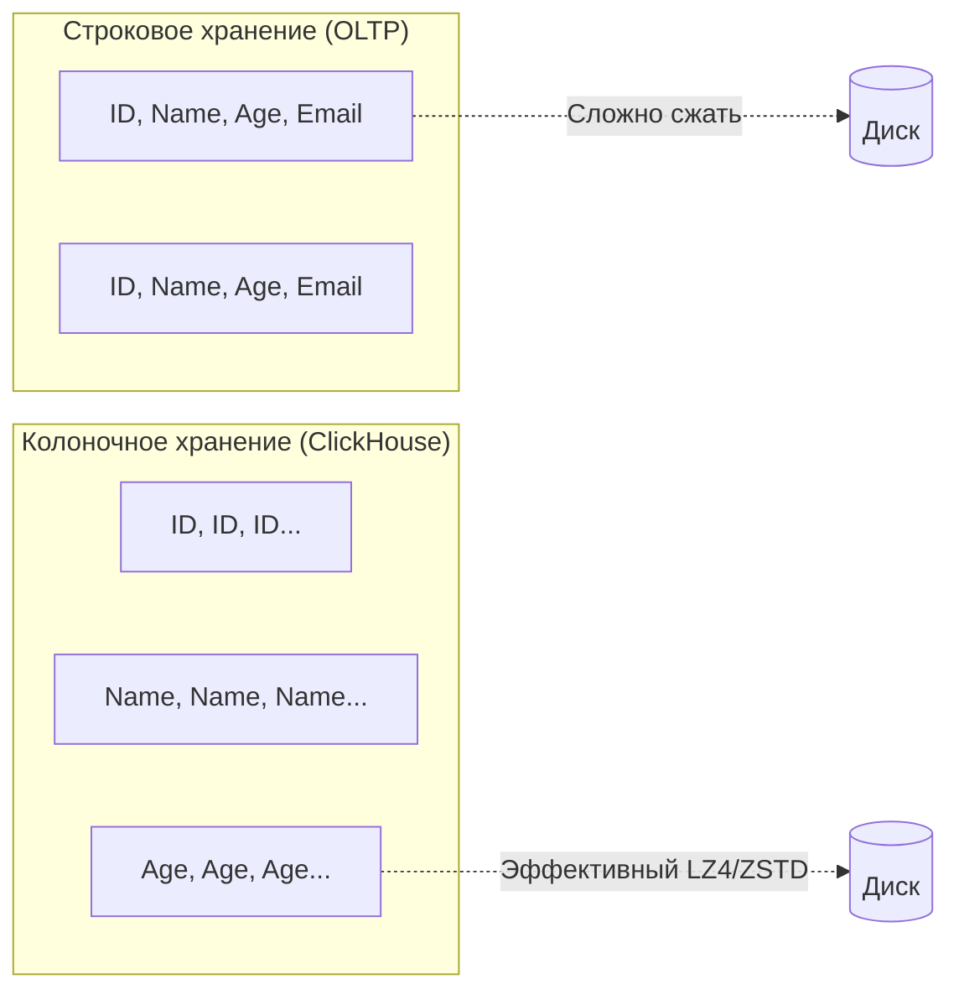

При разработке высоконагруженных систем мы привыкли к PostgreSQL или MySQL. Это отличные инструменты для **OLTP (Online Transactional Processing)** — задач, где нужно быстро обновлять баланс пользователя или искать один заказ по ID. Но как только бизнес просит: «Посчитай средний чек за последние 3 года для всех пользователей из Берлина, использующих iPhone», реляционные базы начинают «умирать» под тяжестью Sequential Scan.

Для таких задач существует **ClickHouse** — колоночная (column-oriented) СУБД, созданная для **OLAP (Online Analytical Processing)**. Если Postgres — это точный скальпель для точечных операций, то ClickHouse — это промышленная дробилка, способная перемалывать терабайты данных в секунду.

## Column-oriented vs Row-oriented

Фундаментальное различие между ClickHouse и классическими БД заключается в том, как данные физически укладываются на диск (Mechanical Sympathy).

В PostgreSQL данные хранятся строками. Одна строка (Tuple) содержит все колонки подряд. Чтобы прочитать одну колонку, база обязана прочитать всю строку целиком из 8-килобайтной страницы ([[2. Storage engine PostgreSQL]]).

В ClickHouse данные хранятся **колонками**. Каждая колонка — это отдельный набор файлов.


**Почему это дает колоссальный буст в аналитике?**
1. **I/O Efficiency:** Если в вашей таблице 100 колонок, а запрос использует только 3, ClickHouse прочитает с диска только файлы этих 3 колонок. Это сокращает объем дискового чтения в десятки раз.
2. **Сжатие (Compression):** Данные в одной колонке имеют одинаковый тип. Например, колонка `timestamp` содержит похожие числа, а `status` — повторяющиеся строки. Это позволяет сжимать данные на диске в 10–100 раз эффективнее, чем при строковом хранении.
3. **Vectorized Execution:** ClickHouse обрабатывает данные не по одной строке, а блоками (пачками). Это позволяет использовать **SIMD-инструкции** процессора для параллельной обработки множества значений за один такт CPU.



---

## Движок MergeTree: Сердце ClickHouse

Самый важный и часто используемый движок в ClickHouse — это **MergeTree**. Он похож на LSM-дерево (как в NoSQL базах), но адаптирован под аналитику.

### Особенности MergeTree:
* **Сортировка по первичному ключу:** Данные на диске физически отсортированы по `PRIMARY KEY`. Это позволяет быстро находить диапазоны значений.
* **Разбиение на партиции:** Вы можете указать `PARTITION BY`, например, по месяцам. Это позволяет ClickHouse мгновенно отсекать ненужные файлы при поиске ([[5. Partitioning]]).
* **Разреженный индекс (Sparse Index):** В отличие от B-Tree в Postgres, где индекс хранит ссылку на *каждую* строку, ClickHouse хранит отметку только для начала каждого блока данных (например, для каждой 8192-й строки). Это позволяет индексу быть крошечным и целиком помещаться в RAM.

> [!warning] Ловушка / Gotcha: Primary Key в ClickHouse не уникален!
> В OLTP-базах Primary Key гарантирует уникальность. В ClickHouse `PRIMARY KEY` — это просто указание, как **сортировать** данные на диске. Вы можете вставить 10 строк с одинаковым ID, и ClickHouse их сохранит. Если вам нужна уникальность, используйте движок `ReplacingMergeTree`.

---

## Когда использовать ClickHouse (и когда нет)

ClickHouse — это специализированный инструмент. Использование его не по назначению — частая причина архитектурных провалов.

### Идеальные сценарии (Use Cases):
* **Логирование и Телеметрия:** Хранение миллиардов событий из ваших Go-микросервисов.
* **Рекламная аналитика:** Подсчет кликов, показов, конверсий в реальном времени.
* **E-commerce аналитика:** Построение сложных воронок продаж по гигантским массивам данных.

### Когда ClickHouse НЕ подходит:
1. **Точечные UPDATE/DELETE:** ClickHouse не умеет эффективно изменять одну строку. Любой `UPDATE` — это тяжелая операция перезаписи целого куска данных на диске.
2. **Транзакции:** В ClickHouse нет полноценного ACID и многошаговых транзакций.
3. **Точечный поиск по ID:** Если вам нужно найти профиль одного юзера из миллиона, Postgres сделает это быстрее за счет B-Tree индекса.

> [!tip] Собеседование
> **Вопрос:** Можем ли мы использовать ClickHouse как основную базу данных для хранения профилей пользователей?
> **Ответ:** Нет. Профили требуют частых точечных обновлений (смена ника, аватара) и строгой консистентности. ClickHouse предназначен для неизменяемых (immutable) данных, которые дописываются в конец (append-only).

---

## Работа с ClickHouse в Go

Для Go существует отличный нативный драйвер `github.com/ClickHouse/clickhouse-go`. Главное правило при работе с ClickHouse из Go — **никогда не вставляйте данные по одной строке**.

### Правило Batching (Пакетирования)
Каждый `INSERT` в ClickHouse создает новый файл (part) на диске. Если вы будете делать 1000 вставок в секунду по одной строке, ClickHouse «умрет» под нагрузкой на файловую систему и фоновые слияния (merges).

**Идиоматичный подход в Go:**
Накапливайте данные в памяти (буфере) и делайте одну вставку раз в 1-5 секунд или при достижении порога в 10-50 тысяч строк.

```go
// Пример пакетной вставки через clickhouse-go v2
func saveBatch(ctx context.Context, conn driver.Conn, events []Event) error {
    batch, err := conn.PrepareBatch(ctx, "INSERT INTO events (id, name, timestamp)")
    if err != nil {
        return err
    }

    for _, e := range events {
        if err := batch.Append(e.ID, e.Name, e.Timestamp); err != nil {
            return err
        }
    }

    return batch.Send()
}
```

---

## Mechanical Sympathy: Почему ClickHouse такой быстрый?

1. **Отсутствие блокировок чтения:** Читатели никогда не блокируются, так как данные почти никогда не меняются на месте.
2. **Агрессивное использование RAM:** ClickHouse старается использовать всю доступную память для кэширования промежуточных результатов.
3. **Low-level оптимизации:** Код ClickHouse написан на C++ с использованием специфических инструкций процессора (SSE 4.2, AVX, AVX-512). Он знает, как работает кэш-линия CPU и старается не допускать промахов кэша (Cache Misses).

> [!info] Под капотом
> ClickHouse не использует стандартный `malloc` для аллокации памяти в критических местах. У него свои аллокаторы, оптимизированные под временные буферы огромных размеров, что минимизирует накладные расходы рантайма.

## Итог

ClickHouse — это мощнейшее оружие для аналитики, которое дополняет вашу основную БД.
* Используйте его для **Immutable** данных: логов, метрик, событий.
* Всегда вставляйте данные из Go **пачками (batches)**.
* Помните, что `PRIMARY KEY` здесь нужен для сортировки и ускорения `SELECT`, а не для уникальности.
* Если вам нужно быстро считать `COUNT`, `SUM`, `AVG` по миллиардам строк — ClickHouse нет равных.

В этой статье мы разобрали ClickHouse с точки зрения архитектуры и применения. Чтобы понимать, как именно он умудряется читать данные быстрее скорости света, в следующей статье мы заглянем еще глубже: [[12. ClickHouse под капотом]].