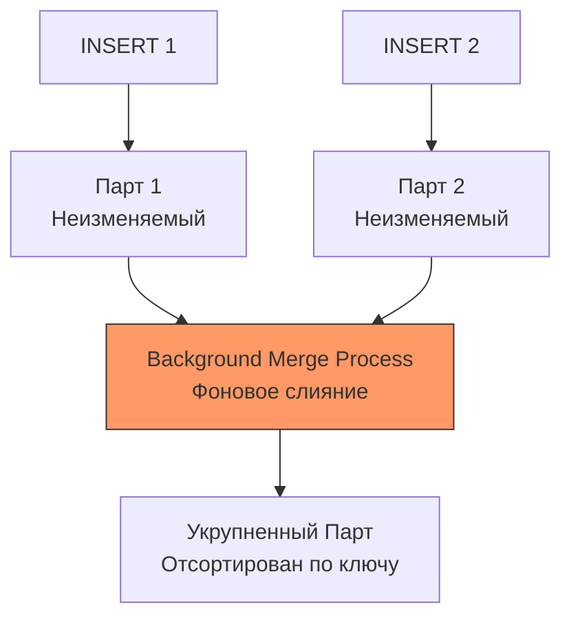

## ClickHouse под капотом: Почему он такой быстрый?

Если MySQL и PostgreSQL — это надежные «рабочие лошадки» для OLTP, то **ClickHouse** — это болид формулы-1 для OLAP (Online Analytical Processing). Когда нам нужно мгновенно агрегировать миллиарды строк, обычные реляционные базы «умирают» в попытках прочитать терабайты данных с диска. 

Секрет ClickHouse не в магии, а в экстремальном следовании принципам **Mechanical Sympathy**. Он выжимает максимум из каждого такта CPU, каждой кэш-линии и пропускной способности SSD.

---

## 1. Колоночное хранение: Mechanical Sympathy в действии

В традиционных БД (MySQL/PostgreSQL) данные хранятся **строками**. Одна строка — один блок на диске. 
В ClickHouse данные хранятся **колонками**. Все значения колонки `UserAge` лежат вместе, один за другим.


> [!info] Под капотом: Влияние на CPU Cache
> При выполнении запроса `SELECT avg(Age) FROM users`, ClickHouse читает с диска **только** колонку `Age`. 
> 1. **Минимизация I/O:** Мы не читаем ненужные `email`, `bio` или `address`.
> 2. **L1/L2 Cache Efficiency:** Данные одной колонки (например, `Int32`) лежат плотно. Процессор загружает их в кэш целыми линиями (64 байта). Это позволяет обрабатывать данные массивами, не провоцируя промахи кэша (cache misses).
> 3. **SIMD (Single Instruction, Multiple Data):** ClickHouse использует векторные инструкции процессора (SSE/AVX), чтобы одной инструкцией сложить сразу 8 или 16 чисел.

---

## 2. MergeTree: Сердце системы

Основной движок ClickHouse — **MergeTree**. Его архитектура напоминает LSM-деревья, используемые в NoSQL (см. [[2. Key Value базы]]), но адаптирована под аналитику.

### Гранулы и Разреженный индекс (Sparse Index)
ClickHouse не строит индекс на каждую строку (это бы заняло терабайты). Вместо этого данные разбиваются на **Гранулы (Granules)** — по умолчанию 8192 строки.


Индекс хранит значения первичного ключа только для **начала** каждой гранулы.
* **Как работает поиск:** ClickHouse по индексу находит диапазон гранул, где могут быть данные, и читает их целиком. 
* **Результат:** Индекс занимает считанные мегабайты и полностью помещается в RAM даже для таблиц на триллионы строк.

### Парты и Слияния (Merge Process)
Когда вы делаете `INSERT`, ClickHouse создает новый **Парт (Part)** — набор файлов на диске (по файлу на колонку).




В фоне ClickHouse объединяет маленькие парты в большие, пересортировывая данные. Это позволяет поддерживать данные в порядке без блокировок на запись.

---

## 3. Сжатие данных

Поскольку данные в колонке однотипны (например, много дат или цен), они отлично сжимаются.
* **LZ4 / ZSTD:** Стандартные алгоритмы сжатия.
* **Delta / DoubleDelta:** Хранение только разницы между соседними числами (идеально для временных меток).
* **Gorilla:** Специальное сжатие для Float-чисел.
Сжатые данные не только экономят место, но и ускоряют работу: прочитать сжатые 100 МБ и распаковать их в CPU быстрее, чем прочитать 1 ГБ несжатых данных из-за ограничений шины данных.

---

## 4. Векторное исполнение запросов

ClickHouse не интерпретирует запрос по одной строке (как это делает классический MySQL). Он оперирует **блоками** (векторами).
Если нужно выполнить `price * 0.2`, ClickHouse берет кусок колонки `price` (например, 65536 значений) и прогоняет их через цикл, оптимизированный под конвейер процессора. Это исключает накладные расходы на вызовы функций для каждой строки.

---

## 5. Практика в Go: ClickHouse-драйвер и Batching

Самая большая ошибка при работе с ClickHouse из Go — вставлять данные по одной строке. 

> [!warning] Ловушка / Gotcha: Смерть от мелких инсертов
> Каждый `INSERT` создает новый "парт" на диске. Если вы будете вставлять 1000 раз в секунду по 1 строке, ClickHouse быстро превысит лимит на количество партов и перестанет принимать данные ("Too many parts").

Идиоматичный подход в Go — использование **Batching**.

```go
package main

import (
	"context"
	"log"
	"time"

	"[github.com/ClickHouse/clickhouse-go/v2](https://github.com/ClickHouse/clickhouse-go/v2)"
)

func main() {
	conn, err := clickhouse.Open(&clickhouse.Options{
		Addr: []string{"127.0.0.1:9000"},
		Auth: clickhouse.Auth{Database: "default"},
	})
	if err != nil {
		log.Fatal(err)
	}

	// Создаем Batch
	batch, err := conn.PrepareBatch(context.Background(), "INSERT INTO events (user_id, event_time, score)")
	if err != nil {
		log.Fatal(err)
	}

	// Набиваем батч данными в памяти (аллокация в куче Go)
	for i := 0; i < 100_000; i++ {
		err := batch.Append(uint32(i), time.Now(), float64(i)*0.5)
		if err != nil {
			log.Fatal(err)
		}
	}

	// Отправляем всё одним сетевым пакетом и одним "партом" на диск
	if err := batch.Send(); err != nil {
		log.Fatal(err)
	}
}
```

> [!tip] Собеседование
> **Вопрос:** В чем разница между Primary Key в MySQL и в ClickHouse?
> **Ответ:** В MySQL PK — это B-Tree, он уникален и служит для быстрого точечного поиска. В ClickHouse PK **не гарантирует уникальность**, он является разреженным и служит для физической сортировки данных на диске, чтобы эффективно пропускать ненужные гранулы при сканировании диапазонов.

## Итог

1. **Колоночность** сводит I/O к минимуму.
2. **MergeTree** обеспечивает эффективную запись и фоновую сортировку.
3. **Векторизация** и **SIMD** делают вычисления невероятно быстрыми на уровне железа.
4. В Go всегда используйте **PrepareBatch**, стремясь к размеру батча от 10к до 100к строк.

Мы разобрали, как ClickHouse доминирует в аналитике. Но что если нам нужна база, которая сочетает в себе реляционную мощь SQL и горизонтальное масштабирование NoSQL? Переходим к следующей главе: [[13. NewSQL. CockroachDB]].