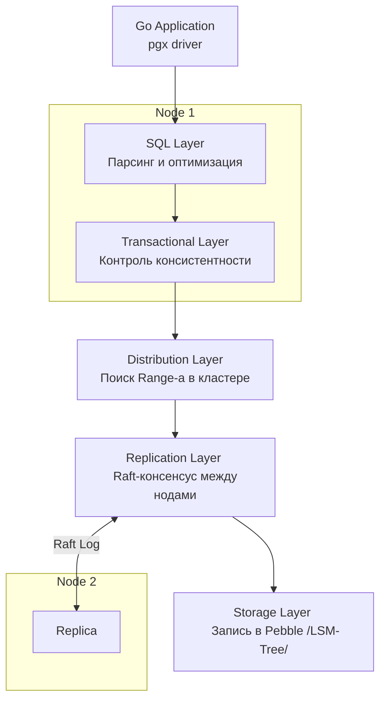

Мир баз данных долгое время был расколот на два лагеря: **SQL** (строгая консистентность, ACID, но плохая горизонтальная масштабируемость) и **NoSQL** ([[1. Что такое NoSQL]] — бесконечный масштаб, но слабая консистентность и отсутствие JOIN). 

**NewSQL** — это современная попытка взять лучшее от обоих миров. **CockroachDB (CRDB)** — пожалуй, самый яркий представитель этого класса. Это распределенная SQL-база данных, которая из коробки дает вам честный **Serializable ACID**, но при этом масштабируется так же легко, как Cassandra, просто добавлением новых узлов (нод).

Для бэкенд-разработчика CockroachDB интересен тем, что он «прикидывается» обычным PostgreSQL (совместим по протоколу), но внутри работает как гигантское распределенное Key-Value хранилище.

---

## Архитектура CockroachDB: Слоеный пирог

В отличие от монолитного Postgres, архитектура CRDB разделена на 5 четких слоев. Понимание этого разделения — ключ к прохождению интервью на позицию Senior/Lead.

1.  **SQL Layer:** Принимает запрос от вашего Go-приложения, парсит его и строит план.
2.  **Transactional Layer:** Гарантирует атомарность и изоляцию.
3.  **Distribution Layer:** Разбивает данные на куски (Ranges) и знает, на каких нодах они лежат.
4.  **Replication Layer:** Синхронизирует данные между нодами через алгоритм консенсуса **Raft**.
5.  **Storage Layer:** Физическая запись байтов на диск (используется Pebble — форк RocksDB, написанный на Go).



---

## Mechanical Sympathy: SQL на стероидах Key-Value

Самое изящное решение в CockroachDB — это то, как реляционные таблицы превращаются в ключи и значения. Под капотом CRDB нет никаких «таблиц» — там только один огромный, отсортированный массив Key-Value пар.

Когда вы создаете таблицу, CRDB мапит её строки в KV следующим образом:
* **Key:** `/TableID/IndexID/PrimaryKeys...`
* **Value:** `ColumnFamily/ColumnValues...`

> [!info] Под капотом
> Если у вас есть таблица `users` с `id=10, name='Alice'`, на диске она превратится в запись:
> Ключ: `/users/primary/10`
> Значение: `Alice`
> 
> Благодаря тому, что ключи **отсортированы**, запросы по диапазонам (`WHERE id > 100 AND id < 200`) превращаются в эффективное последовательное чтение из LSM-дерева в Storage Layer.

---

## Распределение и Raft: Как она выживает?

CockroachDB получила свое название («Таракан») за невероятную живучесть. Данные разбиваются на **Ranges** (обычно по 512 МБ). Каждый Range реплицируется минимум на 3 узла.

Для управления репликацией используется **Raft**. Любая запись считается успешной только тогда, когда **большинство** реплик (Quorum) подтвердили запись в свой лог. 

* Если одна нода падает — кластер продолжает работать без пауз (если реплик было 3+).
* Если данные на одной ноде становятся слишком «горячими», CRDB автоматически переносит Range на менее нагруженную ноду или разделяет его (Split).

---

## Консистентность: Serializable по умолчанию

Это «киллер-фича» CRDB. В то время как в PostgreSQL по умолчанию стоит `Read Committed`, и вам нужно вручную следить за аномалиями, CockroachDB всегда работает в режиме **Serializable** — самом строгом уровне изоляции.

Это достигается за счет использования **HLC (Hybrid Logical Clocks)** — комбинации физического времени сервера и логических счетчиков. Это позволяет CRDB упорядочивать транзакции в распределенной системе без использования дорогостоящих атомных часов (как в Google Spanner).

> [!warning] Ловушка / Gotcha: Transaction Retries
> Из-за строгого уровня Serializable конфликты транзакций в CRDB неизбежны. Вместо блокировок (Locking), как в Postgres, CRDB часто использует оптимистичный подход. Если две транзакции конфликтуют, одна из них будет отменена базой.
> **Ваш Go-код ОБЯЗАН уметь делать ретраи (retries) транзакций.** Драйверы обычно предоставляют готовые хелперы для этого.

---

## Использование с Go

Поскольку CockroachDB поддерживает протокол PostgreSQL, вы можете использовать идиоматичный драйвер `pgx`.

```go
import (
    "context"
    "[github.com/jackc/pgx/v5/pgxpool](https://github.com/jackc/pgx/v5/pgxpool)"
)

func main() {
    // Строка подключения почти такая же, как для Postgres
    // Единственное отличие - порт 26257 по умолчанию
    dsn := "postgresql://root@localhost:26257/defaultdb?sslmode=disable"
    pool, _ := pgxpool.New(context.Background(), dsn)

    // Важно: CockroachDB рекомендует использовать логику ретраев
    // pgx не делает это автоматически для Serializable конфликтов!
}
```

> [!tip] Собеседование
> **Вопрос:** Почему в CockroachDB не рекомендуется использовать случайные UUIDv4 в качестве Primary Key?
> **Ответ:** Поскольку данные физически отсортированы по ключу (LSM-Tree), вставка случайных UUID приведет к записи в случайные места по всему кластеру (Write Amplification). Это создает нагрузку на все ноды сразу. Лучше использовать **Sequential UUID** или `int64` (если нет шардирования), чтобы запись шла в один «конец» Range-а, что эффективнее для дискового IO и кэша.

---

## Когда выбирать CockroachDB?

1.  **Гео-распределенность:** Вам нужно, чтобы данные пользователей из Европы лежали в Европе, а из США — в США, но при этом база выглядела как единое целое.
2.  **Нулевой простой:** Вам нужна база, которая не падает, когда вы выключаете целый дата-центр.
3.  **Горизонтальный масштаб:** Когда вы понимаете, что один инстанс Postgres уже не тянет, а [[4. Sharding]] вручную на уровне приложения — это архитектурный ад.

## Итог

1.  **CockroachDB** — это NewSQL, дающий масштаб NoSQL и гарантии SQL.
2.  Внутри это **Распределенное Key-Value хранилище**, где SQL-строки мапятся в байтовые ключи.
3.  Для обеспечения консистентности используются **Raft** и **Hybrid Logical Clocks**.
4.  Ваш Go-код должен быть готов к **Serializable Retries** — это цена за строгую согласованность.

Мир баз данных движется в сторону специализации. Мы разобрали реляционные, колоночные и NewSQL системы. Но с развитием ИИ и поиска по сходству появился совершенно новый класс баз, которые оперируют не числами и строками, а многомерными векторами. Об этом в следующей статье: [[14. Векторные базы данных]].

Следующая статья: [[14. Векторные базы данных]].
У тебя остались вопросы по архитектуре распределенного консенсуса в CRDB?