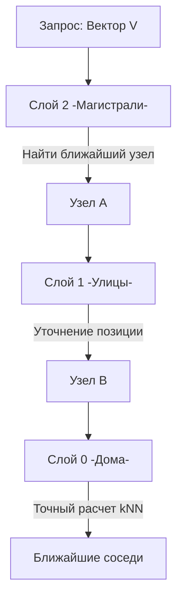

## Векторные базы данных: Поиск смысла в многомерном пространстве

Традиционные базы данных, такие как [[6. PostgreSQL]] или [[1. Архитектура MySQL]], оптимизированы для работы со структурированными данными: числами, строками и датами. Они отлично справляются с запросом `WHERE price < 100`, но пасуют перед задачей «найди мне товары, похожие на этот по стилю».

С расцветом Large Language Models (LLM) и нейросетей возникла необходимость хранить и быстро искать **эмбеддинги (embeddings)** — высокоразмерные векторы чисел, которые представляют собой сжатый «смысл» объекта (текста, картинки или аудио).

---

## 1. Что такое векторный поиск?

Векторная база данных хранит не сами объекты, а их представления в виде векторов в многомерном пространстве (обычно от 384 до 1536+ измерений).


Основная задача векторного поиска — найти **K ближайших соседей (K-Nearest Neighbors, kNN)** для целевого вектора. Близость определяется не совпадением символов, а математическим расстоянием между точками.

### Основные метрики расстояния:
1.  **L2 (Euclidean Distance):** Обычное геометрическое расстояние. Чем меньше, тем лучше. Чувствительно к величине векторов.
2.  **Cosine Similarity:** Измеряет косинус угла между векторами. Фокусируется на направлении, а не на длине. Идеально для текстов.
3.  **Inner Product (Dot Product):** Скалярное произведение. Часто используется, если векторы нормализованы.

---

## 2. Mechanical Sympathy: Почему нельзя просто использовать циклы?

Если у вас 10 миллионов векторов по 1536 измерений, то простой перебор (Flat Search) потребует $10^7 \times 1536$ операций умножения и сложения для каждого поискового запроса.

> [!info] Под капотом: SIMD и пропускная способность памяти
> Расчет расстояния — это классическая задача для **SIMD (Single Instruction, Multiple Data)** инструкций процессора (AVX-512, NEON). Процессор может за один такт выполнить операцию над несколькими элементами вектора.
> Однако главной проблемой становится **Memory Wall**. Векторы слишком велики, чтобы целиком поместиться в L1/L2 кэши. Скорость поиска часто упирается в пропускную способность шины памяти (RAM Bandwidth), а не в частоту CPU.

---

## 3. Алгоритмы индексации: Как работает магия

Чтобы поиск был быстрым, используются алгоритмы **Approximate Nearest Neighbors (ANN)**. Мы жертвуем 1% точности ради ускорения в 1000 раз.

### IVFFlat (Inverted File Index)
Пространство делится на кластеры (ячейки Вороного). При поиске мы сначала находим ближайшие центроиды кластеров, а затем ищем только внутри этих кластеров.

### HNSW (Hierarchical Navigable Small World)
На текущий момент это стандарт индустрии. Он строит граф, где узлы — это векторы. 


* **Иерархия:** На верхних слоях графа узлов мало, и «прыжки» между ними длинные (как магистрали между городами).
* **Спуск:** Мы находим ближайшую точку на верхнем слое, спускаемся на слой ниже и уточняем поиск (как улицы внутри города).
* **Сложность:** Поиск в HNSW имеет логарифмическую сложность $O(\log N)$.



---

## 4. Архитектура векторных СУБД

Существует два подхода к реализации:
1.  **Vector-native (Qdrant, Milvus, Weaviate, Pinecone):** Написаны с нуля (часто на Rust или Go) для максимальной производительности векторных операций.
2.  **Vector-plugins (pgvector для Postgres, Elasticsearch):** Добавляют поддержку векторов в знакомые системы. Удобно, но часто медленнее и хуже масштабируется при миллиардах векторов.

> [!warning] Ловушка / Gotcha: Проклятие размерности (Curse of Dimensionality)
> С ростом количества измерений расстояние между любыми двумя случайными точками в пространстве становится почти одинаковым. Это делает индексацию крайне сложной. Если ваша модель генерирует векторы слишком высокой размерности без реальной необходимости, точность поиска будет катастрофически падать.

---

## 5. Практика в Go: Работа с pgvector

Go отлично подходит для работы с векторными БД благодаря своей производительности и типизации. Рассмотрим пример использования `pgvector` через `sqlx`.

```go
package main

import (
	"context"
	"[github.com/jmoiron/sqlx](https://github.com/jmoiron/sqlx)"
	_ "[github.com/lib/pq](https://github.com/lib/pq)"
	"[github.com/pgvector/pgvector-go](https://github.com/pgvector/pgvector-go)"
	"log"
)

type Document struct {
	ID        int             `db:"id"`
	Content   string          `db:"content"`
	Embedding pgvector.Vector `db:"embedding"` // Вектор в Go
}

func GetSimilarDocs(db *sqlx.DB, queryEmbedding []float32) ([]Document, error) {
	// Используем оператор <-> для L2 расстояния или <=> для Cosine
	query := `SELECT id, content FROM items 
              ORDER BY embedding <=> $1 
              LIMIT 5`

	var docs []Document
	// Конвертируем []float32 в формат pgvector
	err := db.Select(&docs, query, pgvector.NewVector(queryEmbedding))
	if err != nil {
		return nil, err
	}
	return docs, nil
}
```

> [!tip] Собеседование
> **Вопрос:** Что такое квантование (Product Quantization) в векторных базах?
> **Ответ:** Это метод сжатия векторов. Мы разбиваем вектор на несколько под-векторов и заменяем каждый под-вектор на ID ближайшего к нему центроида из заранее обученного словаря. Это позволяет хранить векторы в 10-100 раз компактнее и проводить предварительный поиск в L1 кэше CPU, не обращаясь к RAM.

---

## Итог

1.  **Векторные БД** решают задачу семантического поиска через поиск ближайших соседей (kNN).
2.  **HNSW** — самый эффективный алгоритм для быстрого поиска по графу.
3.  **Mechanical Sympathy:** Векторный поиск критически зависит от SIMD-инструкций и скорости работы с памятью.
4.  **Сжатие (Квантование):** Необходимый инструмент при работе с Big Data, чтобы не разориться на оперативной памяти.

Мы разобрали, как хранить и искать смыслы. Теперь пора применить это на практике и понять, как интегрировать векторный поиск в реальные AI-продукты: [[15. Поиск по embedding и AI use cases]]