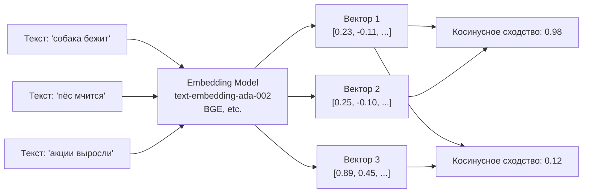
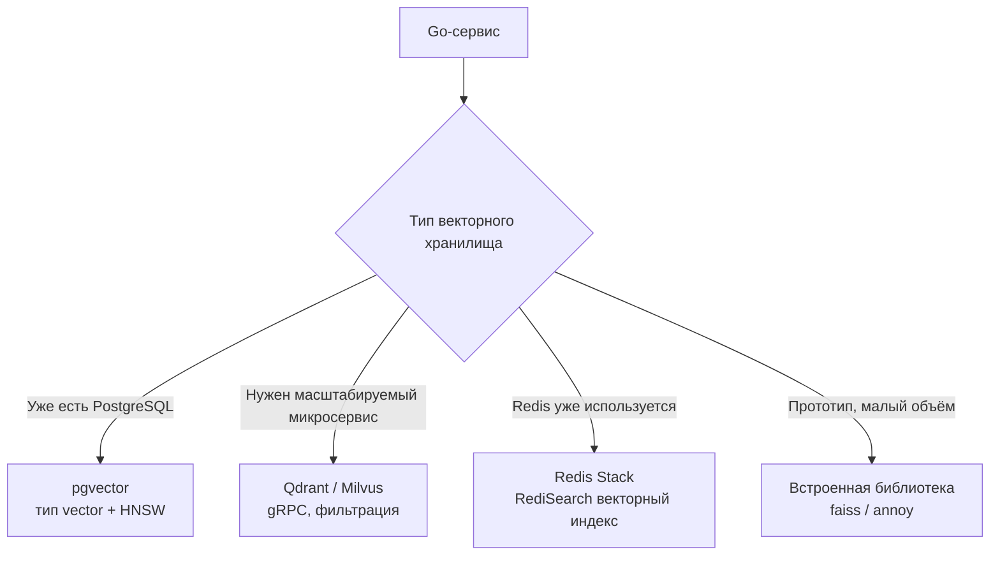
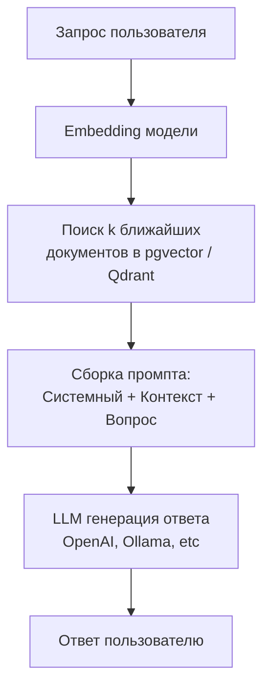

## Введение

В предыдущих статьях мы разобрали четыре классических типа NoSQL: key-value ([[2. Key Value базы]]), документные ([[7. Document базы. MongoDB]]), колоночные ([[9. Column базы. Cassandra]]) и графовые (выходят за рамки текущего подраздела, но архитектурно близки). Теперь мы входим в относительно новый, но взрывной по значимости класс — **векторные базы данных и поиск по embedding**.

Современные AI-модели (LLM, генеративные, рекомендательные) не работают с сырыми строками или числами напрямую. Они преобразуют текст, изображения, аудио — в **эмбеддинги (embeddings)** — плотные векторы чисел плавающей запятой, где семантическая близость объектов отражается как геометрическая близость векторов в многомерном пространстве. Хранить и молниеносно искать эти векторы — задача, для которой классические SQL и даже документные NoSQL не приспособлены без дополнительной надстройки.

Для Go-инженера, который сегодня строит бэкенды с RAG (Retrieval-Augmented Generation), семантическим поиском, рекомендательными системами или детекцией аномалий, понимание векторных хранилищ становится обязательной компетенцией.

## Что такое эмбеддинг (embedding) и зачем он нужен

**Эмбеддинг** — это отображение объекта произвольной природы (слово, предложение, изображение, пользователь) в вектор фиксированной размерности, обычно 384, 768, 1536 или 4096 чисел float32. Модель обучается так, чтобы похожие по смыслу объекты получали близкие векторы (по косинусному расстоянию или евклидовому расстоянию).



В поиске по embedding вы не ищете точное совпадение ключевых слов — вы ищете «самые похожие по смыслу» записи. Это открывает принципиально новые возможности: вопрос пользователя на естественном языке преобразуется в вектор, и база возвращает документы, близкие по контексту, даже если слова не совпадают.

## Типы баз данных для векторного поиска

Можно выделить три категории хранилищ, способных обслуживать векторные нагрузки:

### 1. Специализированные векторные базы данных
Разработаны исключительно для хранения и поиска по векторам. Внутри используют продвинутые алгоритмы приближённого поиска ближайших соседей (ANN — Approximate Nearest Neighbors):
- **Pinecone** (облачный SaaS, закрытый исходный код)
- **Weaviate** (open-source, GraphQL, гибридный поиск)
- **Milvus** / **Zilliz** (open-source, C++ под капотом, хорошая Go-поддержка)
- **Qdrant** (написан на Rust, высокая производительность, gRPC API)
- **Chroma** (легковесная, для прототипирования)
- **Redis** с модулем RediSearch (векторный индекс с Redis Query Engine) — см. [[3. Redis. Архитектура и применение]]

### 2. Расширения существующих СУБД
Многие разработчики не хотят поднимать отдельный сервис и добавляют векторные индексы в знакомые базы:
- **pgvector** — расширение PostgreSQL ([[6. PostgreSQL]]), добавляет типы `vector` и индексы IVFFlat / HNSW. Даёт весь ACID, JOIN и богатство SQL.
- **MongoDB Atlas Vector Search** — позволяет строить векторные индексы поверх документов, возвращать ближайшие документы вместе с их полями.
- **Elasticsearch / OpenSearch** с плагинами k-NN — гибридный поиск (BM25 + векторное сходство).

### 3. Библиотеки и in-process решения
Для легковесных сценариев, где не нужен отдельный сервер, используют библиотеки, работающие в процессе Go-приложения:
- **faiss** (Facebook AI Similarity Search) — C++ библиотека с Go-биндингами, оптимизирована до предела: использует SIMD-инструкции, квантование, GPU.
- **annoy** (Spotify) — легковесное решение с memory-mapped файлами.



## Под капотом: как работает поиск по вектору

Точный поиск k ближайших соседей (k-NN) в лоб требует сравнения запросного вектора со всеми N векторами в базе, что при миллионах записей и размерности 1536 даёт недопустимую задержку. Поэтому используют **приближённый поиск (ANN)**, жертвуя долей процента точности ради тысячократного ускорения.

### Алгоритмы ANN

**HNSW (Hierarchical Navigable Small World):** Строит многослойный граф. На верхнем уровне мало узлов и длинные рёбра (быстрое перемещение в нужную область), на нижнем — густой граф для точного поиска. Поиск начинается с верхнего уровня, спускается вниз, обходя граф. В среднем O(log N) шагов. HNSW блестяще работает в оперативной памяти, но потребляет её заметно.

**IVF (Inverted File Index):** Векторы сначала кластеризуются (k-means). При поиске сравниваются не все векторы, а только те, что принадлежат нескольким ближайшим кластерам. Гораздо компактнее, но требует периодического перестроения индекса.

**Квантование (Product Quantization, PQ):** Сжимает векторы, разбивая их на сегменты и представляя каждый сегмент индексом в кодовой книге. Это позволяет хранить миллиарды векторов в RAM, жертвуя точностью.

> [!info] Под капотом
> В Qdrant под капотом используется HNSW, оптимизированный на Rust с параллелизмом и контролем памяти. Milvus предлагает выбор из IVF, HNSW, DiskANN и других, автоматически балансируя между RAM и SSD. pgvector в PostgreSQL реализует HNSW через background worker-процессы, что позволяет не блокировать основные запросы, но индекс строится оффлайн и влияет на VACUUM.

### Метрики сходства

- **Косинусное сходство** — наиболее популярно для текстовых эмбеддингов, так как не зависит от длины вектора.
- **Евклидово расстояние (L2)** — используется, когда важна абсолютная величина вектора.
- **Скалярное произведение (dot product)** — для рекомендательных систем, где оценка релевантности пропорциональна величине.

## Go и векторы: рабочий пример

Допустим, мы строим семантический поиск по статьям базы знаний. Используем pgvector — расширение PostgreSQL, потому что у нас уже есть PostgreSQL с ACID и полнотекстовым поиском.

### Шаг 1: Схема данных с pgvector

```sql
CREATE EXTENSION vector;

CREATE TABLE articles (
    id          SERIAL PRIMARY KEY,
    title       TEXT,
    body        TEXT,
    embedding   VECTOR(1536)  -- размерность эмбеддинга
);
CREATE INDEX ON articles USING hnsw (embedding vector_cosine_ops);
```

### Шаг 2: Генерация эмбеддинга в Go

Используем OpenAI API (или локальную модель через Ollama, HuggingFace) для получения вектора из текста:

```go
import (
    "context"
    "github.com/sashabaranov/go-openai"
)

func getEmbedding(ctx context.Context, text string) ([]float32, error) {
    client := openai.NewClient(apiKey)
    resp, err := client.CreateEmbeddings(ctx, openai.EmbeddingRequest{
        Model: openai.AdaEmbeddingV2,
        Input: []string{text},
    })
    if err != nil {
        return nil, err
    }
    return resp.Data[0].Embedding, nil
}
```

### Шаг 3: Запись в базу

```go
import "github.com/pgvector/pgvector-go"

embedding := pgvector.NewVector(embeddingSlice)
_, err := db.ExecContext(ctx,
    `INSERT INTO articles (title, body, embedding) VALUES ($1, $2, $3)`,
    title, body, embedding)
```

### Шаг 4: Поиск ближайших статей

```go
func searchSimilar(ctx context.Context, db *sql.DB, queryEmbedding []float32, limit int) ([]Article, error) {
    embedding := pgvector.NewVector(queryEmbedding)
    rows, err := db.QueryContext(ctx,
        `SELECT id, title, body, embedding <=> $1 AS distance
         FROM articles
         ORDER BY distance
         LIMIT $2`,
        embedding, limit)
    if err != nil { return nil, err }
    defer rows.Close()
    // ... сканирование строк
}
```

Оператор `<=>` в pgvector — косинусное расстояние (cosine distance). Можно использовать `<->` для L2 или `<#>` для dot product. Индекс HNSW автоматически задействуется планировщиком запросов PostgreSQL (см. [[10. План выполнения запроса. EXPLAIN|EXPLAIN]]), обеспечивая суб-10мс поиск по миллионам векторов.

## Mechanical Sympathy: цена векторного поиска

Векторный поиск — это CPU- и память-интенсивная операция, непохожая на классические индексы.

- **Размер данных:** Каждый вектор 1536 float32 = 6.14 КБ. 1 миллион векторов = 6.1 ГБ только на векторы, плюс накладные расходы индекса (HNSW может требовать дополнительно 100-300% памяти на граф). Если рабочий набор не влезает в RAM, начинаются дисковые чтения, и задержка взлетает. В отличие от дисковых B-Tree, HNSW плохо дружит с диском (хотя DiskANN в Milvus решает эту проблему).
- **SIMD-инструкции:** Эффективный поиск по векторам задействует векторные расширения процессора (AVX2, AVX-512), чтобы за одну инструкцию умножать/складывать несколько пар чисел. Go-код через cgo может вызывать библиотеки faiss, написанные на C++ с ручной SIMD-оптимизацией. Чистый Go без ассемблерных вставок будет проигрывать в разы.
- **Влияние на GC:** Частые операции со слайсами `[]float32` создают мусор. При высоком RPS переиспользуйте буферы (`sync.Pool`) для эмбеддингов, особенно если вы вызываете модель локально.

> [!warning] Ловушка / Gotcha
> **pgvector и транзакции:** Индексы HNSW в pgvector не поддерживают WAL-логирование в полной мере. При сбое PostgreSQL после создания/обновления индекса HNSW может потребоваться его перестроение. Кроме того, вставка множества векторов в транзакции с построением индекса может вызывать блокировки. Рекомендуется вставлять данные пачками без индекса и строить индекс после загрузки.

## AI Use Cases: от теории к архитектуре

Понимая механику векторных баз, посмотрим на целостные сценарии, в которых Go-сервис выступает оркестратором AI-пайплайна.

### 1. RAG (Retrieval-Augmented Generation)

Пользователь задаёт вопрос. Система ищет релевантные документы из векторной базы, вставляет их в промпт LLM, и та генерирует ответ, опираясь на факты.



**Go-реализация:** HTTP-endpoint принимает вопрос, вызывает embedding, делает поиск по pgvector, формирует prompt, вызывает OpenAI API, стримит ответ обратно через WebSocket или SSE.

### 2. Семантический поиск по товарам

В e-commerce каталог товаров индексируется эмбеддингами названий и описаний. Когда пользователь вводит «уютный шерстяной свитер», поиск находит «вязаный джемпер из мериноса», даже если слова не совпадают. Дополнительно фильтруется по цене, категории через обычные WHERE в той же базе (гибридный поиск).

### 3. Рекомендательные системы

Пользователям, похожим по поведению, можно рекомендовать контент, используя эмбеддинги их профилей. Либо эмбеддинги товаров можно использовать в моделях коллаборативной фильтрации.

### 4. Поиск по изображениям и мультимодальность

С помощью CLIP-подобных моделей можно получить векторные представления и текста, и изображений в одном пространстве. Запрос «красное платье» найдёт картинки с красными платьями. В Go это реализуется через вызов нейросети (например, через Python sidecar или ONNX Runtime) и последующее сохранение вектора в ту же pgvector.

### 5. Чат-боты с памятью

Долгосрочная память агента хранится в векторной базе: факты о пользователе, история бесед с эмбеддингами фраз. При новом вопросе агент подбирает релевантные воспоминания и подставляет их в контекст.

## Выбор векторного решения: практические критерии

Для Go-разработчика, принимающего архитектурное решение:

| Критерий                        | pgvector (PostgreSQL)             | Qdrant                | Milvus                    | Redis Stack           |
|---------------------------------|-----------------------------------|-----------------------|---------------------------|-----------------------|
| Зависимость от PostgreSQL       | Да                                | Нет                   | Нет                       | Только Redis          |
| Транзакции ACID                 | Полные                            | Нет                   | Нет                       | Нет                   |
| Гибридный поиск + фильтры      | SQL (WHERE, JOIN, FTS)            | JSON-фильтры          | Свои выражения            | RediSearch команды    |
| Скорость (миллионы векторов)    | Средняя (HNSW в постгре)          | Очень высокая (Rust)  | Высочайшая (C++, GPU)     | Высокая               |
| Горизонтальное масштабирование  | Через шардирование PostgreSQL     | Да, кластер           | Да, распределённый        | Redis Cluster         |
| Порог входа                     | Минимальный, если есть PostgreSQL | Средний               | Высокий (отдельный сервис) | Низкий (если есть Redis) |

Для старта и средних объёмов pgvector часто достаточно и он радикально снижает количество движков. Для продакшена с сотнями миллионов векторов и требованием миллисекундных задержек рассматривают Qdrant или Milvus с gRPC-интерфейсом, который в Go реализуется стандартными средствами (protobuf-stub).

## Security и управление

При работе с эмбеддингами помните о безопасности (см. [[17. Безопасность. AppSec в Go]]):
- Embedding-модели могут содержать PII, если в них попадают персональные данные. Удаление вектора из базы — идемпотентная операция, но обученные модели могут хранить следы.
- При использовании OpenAI API данные уходят вовне. Для приватных данных используйте локальные модели (через Ollama, HuggingFace TGI).
- SQL-инъекция через операторы поиска? В pgvector вы параметризуете вектор как переменную, что безопасно. Но если вы вставляете текст в SQL для гибридного фильтра — следуйте [[21. SQL Injection]].

## Итог

Векторный поиск и эмбеддинги — не хайп, а фундаментальный сдвиг в том, как приложения обрабатывают неструктурированную информацию. Для Go-разработчика это означает появление в арсенале четвёртого «измерения» данных (после ключей, строк и документов) — семантических векторов, и необходимость интеграции новых хранилищ или расширений в архитектуру. Понимание алгоритмов ANN, потребления памяти и ограничений PostgreSQL в этом контексте отделяет инженера, который «что-то слышал про AI», от того, кто способен построить надёжный продакшен-пайплайн.

На этом мы завершаем обзор подраздела «NoSQL базы данных».