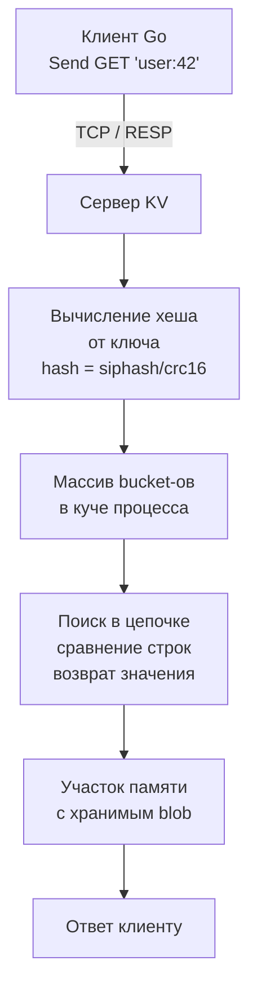

## Введение

Key-Value (KV) хранилище — это простейшая и одновременно одна из самых мощных абстракций в мире NoSQL. Всё вращается вокруг единственной операции: по заданному уникальному ключу получить значение. Никаких схем, никаких связей, никаких сложных языков запросов. Именно эта простота позволяет добиться экстремальной производительности и предсказуемости, которые недостижимы в реляционных или даже документных базах.

В экосистеме Go key-value хранилища занимают центральное место: от кэширования ответов API до распределённых блокировок и координации сервисов. Понимание их внутреннего устройства необходимо для архитектора, проектирующего высоконагруженные системы.

## Модель данных

Математически KV-хранилище — это ассоциативный массив (map, dictionary), где:
- **Ключ** — уникальный идентификатор, обычно строка (но может быть бинарным).
- **Значение** — произвольный набор байтов. Хранилище не интерпретирует значение: для него это opaque blob. Вся логика работы с данными (сериализация, schema-on-read) лежит на приложении.

```go
// Пример мысленной модели KV в Go
store := make(map[string][]byte)
store["user:session:abc123"] = []byte(`{"user_id":42,"expires":"2026-04-25T12:00:00Z"}`)
```

Такая простота устраняет целые классы сложности: нет необходимости в парсере SQL, планировщике запросов, оптимизаторе join’ов, транзакциях на уровне нескольких записей (хотя атомарность для одного ключа часто предоставляется). Взамен мы получаем O(1) доступ по ключу, который можно реализовать практически без накладных расходов.

## Типы Key-Value хранилищ

Хотя модель одна, реализации резко отличаются по области применения. Полезно разделять их по двум осям.

### 1. Основное хранилище данных
- **In-memory** — весь набор данных находится в оперативной памяти. Примеры: [[3. Redis. Архитектура и применение|Redis]], [[5. Memcached|Memcached]], [[6. Valkey|Valkey]]. Скорость доступа измеряется микросекундами. Персистентность опциональна (снапшоты, AOF) и не гарантирует долговечность каждой записи.
- **Persistent (на диске)** — данные живут на SSD/HDD. Примеры: RocksDB, LevelDB (встраиваемые библиотеки), Amazon DynamoDB (облачный сервис). Используют LSM-Tree или B-Tree для организации данных на диске. Скорость ниже, но объёмы могут превышать RAM.

### 2. Архитектура развёртывания
- **Embedded** — база работает как библиотека внутри вашего процесса. Нет сетевого стека, нет сериализации. Вызов — это прямой вызов функции, работающий с локальной памятью/диском. Go-порты: bbolt, badger. Идеально для локальных хранилищ, например, хранения метаданных на одном хосте.
- **Client-server** — выделенный процесс (или кластер), к которому подключаются клиенты по сети (TCP). Примеры: Redis, Memcached. Добавляется latency сети, но даёт разделение ответственности, масштабирование и переиспользование данных многими сервисами.

В бэкенд-разработке на Go абсолютно доминирует client-server подход с in-memory хранилищами, поэтому именно им мы и посвятим основной фокус.

## Под капотом: как реализована O(1) магия

С точки зрения Mechanical Sympathy, главное, что нужно понять о быстрых KV-хранилищах — это как они организуют данные в памяти, чтобы процессор находил их почти мгновенно.

### Хеш-таблица — фундамент

Внутри Redis, Memcached, Valkey и многих других используется классическая хеш-таблица с цепочками (chaining) или открытой адресацией.



Разберём ключевые моменты.

**Хеш-функция.** Используются быстрые некриптографические функции: SipHash (в Redis), MurmurHash, CityHash. Они спроектированы так, чтобы за несколько десятков тактов CPU давать равномерное распределение по бакетам, избегая коллизий. Для Go-разработчика, знающего [[Устройство и работа ОС]], важно, что вычисление хеша происходит в user space, без syscall’ов, и полностью ложится на АЛУ процессора.

**Массив бакетов.** Ядро таблицы — это непрерывный кусок памяти, выделенный через `malloc` (в C-реализации Redis) или аналогичный механизм. Обращение по индексу — это O(1) с использованием L1/L2 кэша процессора. Именно поэтому KV-хранилище может обслуживать ~100 000 операций в секунду на одно ядро: данные, нужные для поиска, помещаются в кэш-линии.

**Коллизии.** Когда два ключа попадают в один бакет, Redis использует связанный список (до Redis 7) или skip list для упорядоченных данных, а Memcached — свою slab-аллокацию с цепочками в пределах одного slab'а. Детали специфичны, но общая идея: переход от O(1) к O(N) по длине цепочки. Поэтому важно не допускать слишком длинных цепочек (решается рехэшированием при росте таблицы).

> [!info] Под капотом
> В Redis хеш-таблица — это `dictht`, содержащая массив `dictEntry*`. При рехэшировании Redis использует инкрементальный подход: операция переноса ключей из старой таблицы в новую выполняется понемногу при каждом обращении к базе, чтобы не блокировать сервер на длительный период. Это классический пример избегания «stop-the-world» пауз в конкурентной среде.

### Структуры данных для значений

В отличие от Memcached, который хранит только плоские строки, Redis и Valkey предлагают богатые структуры: строки, списки, множества, хеши, sorted sets. Но с точки зрения KV-модели — значение остаётся единым blob’ом. Тип структуры — это метаданные, которые говорят серверу, как интерпретировать байты, чтобы выполнить операции вроде `LPUSH` или `ZADD`.

Для Go-разработчика это означает, что даже самый сложный объект нужно сериализовать перед отправкой в KV-хранилище. Чаще всего выбирают JSON, MessagePack, Protobuf. При этом нужно помнить о влиянии на кучу Go: большие аллокации увеличивают давление на GC. Рассмотрите возможность переиспользования буферов через `sync.Pool` при частой сериализации.

## Протоколы взаимодействия: как Go общается с KV-хранилищем

Когда ваш Go-сервис выполняет `client.Get(ctx, "key")`, происходит цепочка событий, включающая сокеты, системные вызовы и парсинг.

**RESP (REdis Serialization Protocol).** Классический протокол Redis, используемый также Valkey и многими другими. Он текстовый и бинарно-безопасный. Запрос выглядит как `*2\r\n$3\r\nGET\r\n$7\r\nuser:42\r\n`. Ответ — либо bulk string, либо число, либо ошибка. Парсинг RESP — один из самых горячих путей в драйвере go-redis. Именно здесь нужно проявлять осторожность с аллокациями: наивный парсинг может порождать тысячи временных слайсов. Библиотека go-redis/v9 использует пул буферов и zero-copy парсинг, чтобы снизить нагрузку на GC.

**Memcached протокол.** Более простой, текстовый. Команды: `get key\r\n`, `set key flags exptime length\r\n<data>\r\n`. Здесь нет вложенных структур, всё очень линейно.

**Соединения и пулы.** В Go для общения с KV-хранилищем драйверы управляют пулом TCP-соединений. В отличие от `database/sql` с его строгой моделью, в go-redis используется собственная реализация пула на основе каналов. Важный нюанс: при использовании пайплайнов (pipelining) клиент может отправлять несколько команд по одному соединению, не дожидаясь ответа. Это снижает latency за счёт устранения round-trip времени. Но нужно быть осторожным: если одна команда в пайплайне вызовет ошибку, последующие всё равно выполнятся, и нужно корректно разбирать ответы.

```go
pipe := rdb.Pipeline()
getCmd := pipe.Get(ctx, "key1")
setCmd := pipe.Set(ctx, "key2", "val", 0)
_, err := pipe.Exec(ctx)
if err != nil {
    // ошибка на уровне соединения, а не отдельных команд
}
// Теперь можно проверить отдельные команды
if err := getCmd.Err(); err != nil {
    // ...
}
```

## Паттерны использования и Mechanical Sympathy

Давайте взглянем на KV-хранилище глазами процессора, планировщика горутин и ядра ОС.

### Кэширование — самый горячий сценарий

Ваш Go-сервис обращается к PostgreSQL за данными пользователя, запрос занимает 5 мс (дисковый ввод-вывод, парсинг, передача по сети). Если вы сохраните результат в Redis с TTL 60 секунд, последующие запросы будут выполняться за 0.1–0.3 мс (сетевая задержка + поиск в памяти). Разница в 20–50 раз.

С точки зрения процессора: вместо тысяч тактов на ожидание `preadv` (чтение страниц с диска), вы тратите несколько тактов на хеш-функцию и проверку указателя в таблице. Горутина, ожидающая ответ от Redis, блокируется на сетевом I/O (syscall `epoll_wait`), но это уже не дисковое ожидание, а управляемая асинхронная операция, переиспользующая тот же системный вызов, что и встроенный netpoller Go. Подробнее о взаимодействии с ОС — в разделе [[Устройство и работа ОС]].

### Распределённые блокировки и координация

Redis с командой `SET NX EX` или Redlock (несмотря на критику) часто применяется для распределённых блокировок. Когда десятки экземпляров Go-сервиса борются за право выполнить задачу, они обращаются к Redis. Здесь критична не только скорость, но и атомарность: `SETNX` (set if not exists) выполняется на сервере как одна инструкция без гонок.

> [!warning] Ловушка / Gotcha
> Наивная реализация блокировки: проверить `GET lock`, потом `SET lock` — это классическая race condition. Всегда используйте атомарные команды Redis (`SET NX PX`) или Lua-скрипты, чтобы избежать «разрыва» между проверкой и установкой. В Go клиенте это оборачивается в `client.SetNX(ctx, "lock", "value", expiration)`.

### Rate limiting

Алгоритм Token Bucket или Sliding Window Log легко реализуется с помощью команд `INCR` и `EXPIRE`. За счёт того, что инкремент — атомарная операция, работающая полностью в памяти Redis, он идеально подходит для ограничения запросов на уровне сотен тысяч RPS. Если бы вы попытались делать это в PostgreSQL, каждая проверка оборачивалась бы в транзакцию с `UPDATE ... WHERE` и блокировками — нагрузка, убийственная для базы.

### Очереди задач

Redis позволяет строить простые очереди через `LPUSH` / `BRPOP`. Но для продакшена обычно используют [[13. Очереди, брокеры сообщений и оркестраторы|выделенные брокеры]], так как Redis не гарантирует надёжную доставку при сбоях. Тем не менее, для легковесных задач он прекрасен.

## Ограничения и компромиссы

Платой за скорость и простоту становится потеря возможностей, привычных по SQL.

1. **Отсутствие ad-hoc запросов.** Нельзя сделать `SELECT * WHERE name LIKE '%foo%'`. Доступ возможен только по ключу. Если нужно искать по значению, придётся строить вторичные индексы вручную (например, использовать Redis Search, команды `SADD` для множеств и пересечений). Это переносит сложность из базы данных в приложение.
2. **Объём данных.** Память дороже диска. Огромный in-memory KV требует огромного количества RAM, что напрямую влияет на стоимость инфраструктуры. В Go-мире нужно чётко рассчитывать бюджет: хранение 100 млн ключей по 200 байтов — это уже 20 ГБ плюс накладные расходы.
3. **Отсутствие транзакций над несколькими ключами.** Можно собрать пайплайн или Lua-скрипт, который будет выполнен атомарно, но откатить изменения при падении средины скрипта нельзя. ACID не гарантируется. Это фундаментально отличает KV от PostgreSQL с полноценными транзакциями и уровнями изоляции ([[3. Read Committed, Repeatable Read, Serializable]]).
4. **Согласованность в кластере.** В режиме кластера Redis или в распределённых KV (Dynamo) нарушается линеаризуемость. Появляются сценарии, когда прочитанные данные не совпадают с последней записью. См. [[8. Distributed transactions]], [[6. Consistency модели]].

## Ключевые представители: куда смотреть дальше

Теперь, когда у вас есть фундаментальное понимание, можно углубляться в конкретные технологии, которые используются в реальных проектах.

- [[3. Redis. Архитектура и применение]] — самая популярная in-memory KV-база, экосистема структур данных, pub/sub, streams.
- [[4. Redis под капотом]] — внутренности: event loop, сжатие, персистентность, сценарии репликации.
- [[5. Memcached]] — легковесный, многопоточный, идеален для простого кэширования без навороченных структур.
- [[6. Valkey]] — форк Redis под управлением Linux Foundation, полностью совместимый, с открытой моделью разработки.

## Итог

Key-Value хранилища — это квинтэссенция NoSQL: они сводят задачу к простейшей абстракции, позволяя процессору и памяти работать на пределе возможностей. Для Go-разработчика это означает несколько сценариев, где вы получаете максимальную отдачу: кэши, сессии, координация, счётчики, очереди. Но за скорость и простоту вы расплачиваетесь гибкостью запросов, транзакционностью и стоимостью RAM. Понимание того, как внутри устроены хеш-таблицы, как парсится RESP и как ваш код взаимодействует с сетью через netpoller — это основа для принятия правильных архитектурных решений.

В следующей статье мы начнём детальный разбор самого известного представителя этого семейства — [[3. Redis. Архитектура и применение|Redis]], рассмотрим его архитектуру, богатый набор структур данных и типовые сценарии применения в Go-проектах.