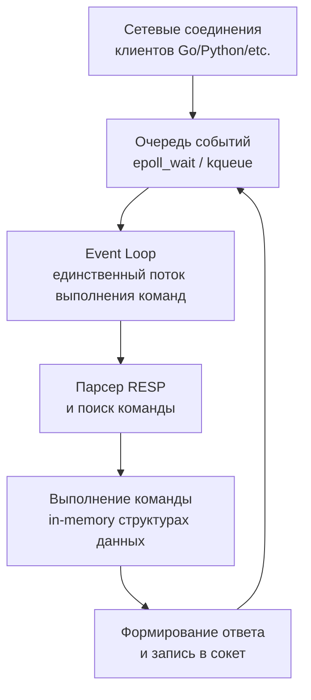

## Введение

Redis (Remote Dictionary Server) — это не просто key-value хранилище, а **структурированный сервер данных в памяти**, который по духу гораздо ближе к «инструментальному ящику» распределённого бэкенда, чем к классической базе данных. Если Memcached даёт вам голый `map[string][]byte`, то Redis предлагает десятки структур данных, транзакции, pub/sub, стримы, гео-индексы и модульную экосистему.

В Go-разработке Redis — стандартный фундамент для кэширования, координации сервисов, rate limiting, очередей и управления состоянием, требующего микросекундной задержки. Чтобы использовать его идиоматично и без катастроф в продакшене, нужно понимать не только команды, но и как Redis устроен под капотом, как он взаимодействует с ОС и как ваш Go-код взаимодействует с ним.

Мы уже обсудили общую концепцию KV-хранилищ в статье [[2. Key Value базы]] — сейчас пришло время детально разобрать лидера этого класса.

## Архитектура Redis: однопоточный event loop

С момента появления и по сей день (с важными нюансами) Redis использует модель **однопоточного event loop** для выполнения команд. Это одно из тех архитектурных решений, которые удивляют новичков, но дают колоссальные преимущества.



**Как это работает:**
- Redis регистрирует все клиентские сокеты в **epoll** (Linux), kqueue (macOS/BSD) или IOCP (Windows).
- Главный поток блокируется на `epoll_wait`, ожидая событий на сокетах.
- Когда приходят данные, поток читает запрос, парсит RESP, выполняет команду (операции в памяти) и пишет ответ обратно в сокет.
- Следующий запрос от другого клиента обрабатывается только после завершения текущей команды.

**Почему это быстро:** 
- Нет накладных расходов на блокировки, мьютексы и конкуренцию за память.
- Данные живут в оперативной памяти, доступ — O(1) через хеш-таблицу и прямые указатели.
- Выполнение команды — это обычно десятки-сотни наносекунд (хеш-функция и разыменование указателей).

> [!info] Под капотом
> Начиная с Redis 6.0 добавлен **многопоточный I/O**: чтение запросов и запись ответов могут выполняться в нескольких потоках, но **само выполнение команд остаётся строго однопоточным**. Это позволило разгрузить CPU, когда узким местом была сетевая пропускная способность, не жертвуя атомарностью операций.
> 
> Для Go-разработчика это важно: ваш драйвер go-redis может использовать конвейеризацию (pipelining), посылая пачки команд без ожидания ответа, и Redis обработает их последовательно, атомарно, без вмешательства других клиентов.

## Структуры данных: больше чем просто ключ-значение

Redis заслужил звание «швейцарского ножа» благодаря встроенным структурам, каждая из которых оптимизирована под определённые паттерны.

### Strings (строки)
Базовый тип, может хранить бинарные данные до 512 МБ. Используется для кэширования HTML, JSON-блобы, счётчики (через `INCR`, атомарный инкремент).

```go
// Go: кэшируем ответ API на 60 секунд
val, err := rdb.Get(ctx, "api:user:42").Bytes()
if errors.Is(err, redis.Nil) {
    user := fetchUserFromDB(42)
    data, _ := json.Marshal(user)
    rdb.Set(ctx, "api:user:42", data, 60*time.Second)
    // ...
}
```

### Lists (списки)
Связанный список (реализован как quicklist — гибрид ziplist и обычного списка). Идеален для очередей (`LPUSH` + `RPOP`) и ленты активности.

```go
// Постановка задачи в очередь
rdb.LPush(ctx, "task_queue", taskData)
```

### Sets (множества) и Sorted Sets (упорядоченные множества)
- **Set** — неупорядоченная коллекция уникальных строк, операции объединения, пересечения.
- **Sorted Set** — элементы имеют score (float64), упорядочены по нему. Внутри — skip list + хеш-таблица. Лидерборды, задержки, приоритетные очереди.

```go
// Обновление рейтинга в лидерборде
rdb.ZAdd(ctx, "leaderboard", redis.Z{Score: 1523, Member: "user:42"})
// Топ-10
top, _ := rdb.ZRevRangeWithScores(ctx, "leaderboard", 0, 9).Result()
```

### Hashes (хеши)
Хранит поля и значения, как `map[string]string`. Отлично подходит для объектов типа «пользователь», когда не нужна сериализация всего объекта целиком.

```go
// Хранение отдельных полей, атомарное обновление
rdb.HSet(ctx, "user:42", "name", "Alice", "email", "alice@example.com")
// Инкремент счётчика внутри хеша
rdb.HIncrBy(ctx, "user:42", "login_count", 1)
```

### Streams
Аппенд-онли лог, похожий на Apache Kafka, но легковесный. Группы потребителей, подтверждение обработки. Прекрасен для легковесных событийных потоков и используется в библиотеках наподобие `watermill`.

### Прочие
- **Bitmaps / HyperLogLog** — для аналитики уникальных посетителей.
- **Geospatial** — `GEOADD`, `GEORADIUS` для координат, под капотом sorted set с Geohash.
- **Redis Stack:** Модули RedisJSON, RediSearch, TimeSeries расширяют возможности до документной и полнотекстовой БД.

## Модель персистентности: память vs долговечность

Redis — in-memory база, что порождает компромисс между скоростью и сохранностью данных при перезапуске. Реализовано два механизма.

### RDB (Redis Database)
Снапшоты всей базы данных в файл `dump.rdb`. Redis вызывает `fork()`, и дочерний процесс обходит структуры, записывая их на диск. Благодаря copy-on-write родительский процесс может продолжать изменять данные, не влияя на дочерний.

**Плюсы:** Компактный формат, быстрое восстановление.
**Минусы:** Данные между снапшотами могут быть потеряны.

### AOF (Append-Only File)
Журнал всех операций записи, в точности как WAL в PostgreSQL (см. [[8. WAL. Write Ahead Log|Write Ahead Log]] в подразделе транзакций). Каждая команда записывается синхронно или асинхронно в лог. При перезагрузке — повторное проигрывание команд.

**Плюсы:** Максимальная сохранность данных (при `appendfsync always` теряется не более одной операции).
**Минусы:** Файл лога растёт, может быть больше, чем RDB. Redis делает периодическое сжатие AOF (rewrite).

> [!warning] Ловушка / Gotcha
> По умолчанию Redis настроен на производительность, а не на сохранность. `save` и `appendfsync` могут быть отключены. Многие новички теряют данные при перезапуске контейнера или сбое сервера, не настроив персистентность под свою нагрузку. Всегда явно выбирайте стратегию, исходя из того, является ли Redis для вас кэшем (можно потерять) или важным хранилищем.

## Репликация и кластеризация

Redis предоставляет несколько уровней масштабирования.

### Master-Replica
Асинхронная репликация: все записи на мастере воспроизводятся на одной или нескольких репликах. Чтение можно распределять по репликам. Если мастер падает, можно вручную или через Sentinel повысить реплику.

### Sentinel
Отдельный процесс, который следит за состоянием серверов Redis, осуществляет автоматический failover и уведомляет клиентов о новом мастере. Go-драйвер go-redis умеет подключаться к Sentinel и автоматически обнаруживать мастер.

### Redis Cluster
Шардирование данных по N нодам. Ключи распределяются в 16384 хеш-слотов. Каждая нода отвечает за диапазон слотов. Клиент определяет нужную ноду по хешу ключа и обращается напрямую. При добавлении/удалении нод слоты мигрируют. Жертвуем транзакциями, охватывающими ключи в разных слотах, но получаем горизонтальное масштабирование на сотни нод.

Для Go-разработчика важно включить `route by latency` и `route randomly` в драйвере кластера, чтобы балансировать запросы.

## Паттерны использования в Go

### Кэширование
Самый частый сценарий. Кэшируем результаты запросов к PostgreSQL, ответы внешних API, вычисленные значения. Используем TTL и инвалидацию по ключам или префиксам. Подробнее — [[7. Кэширование поверх БД]].

```go
func GetUser(ctx context.Context, id int) (*User, error) {
    key := fmt.Sprintf("user:%d", id)
    data, err := rdb.Get(ctx, key).Bytes()
    if err == nil {
        var user User
        json.Unmarshal(data, &user)
        return &user, nil
    }
    // Cache miss
    user, err := db.QueryUser(id)
    if err != nil { return nil, err }
    serialized, _ := json.Marshal(user)
    rdb.Set(ctx, key, serialized, 10*time.Minute)
    return user, nil
}
```

### Распределённые блокировки
Паттерн Redlock (с оговорками) или более простой вариант для не критичных по консистентности задач. Атомарный `SET lock_name random_value NX PX 5000`. При освобождении — Lua-скрипт, проверяющий значение, чтобы не снять чужую блокировку.

```go
lockKey := "lock:process_invoices"
token := randomHex(16)
acquired, _ := rdb.SetNX(ctx, lockKey, token, 30*time.Second).Result()
if !acquired {
    return fmt.Errorf("another instance is processing")
}
defer func() {
    // Гарантированно снимаем только свою блокировку
    script := redis.NewScript(`
        if redis.call("GET", KEYS[1]) == ARGV[1] then
            return redis.call("DEL", KEYS[1])
        else
            return 0
        end
    `)
    script.Run(ctx, rdb, []string{lockKey}, token)
}()
```

### Rate Limiting
Используем sliding window или token bucket. Простой вариант: `INCR user:api:count:123` и `EXPIRE` на окно ограничения. Если значение превысило лимит — отказ. Более точный алгоритм с помощью sorted sets. Связано с темой [[12. Idempotency и БД]], так как защищает от повторных запросов и злоупотребления.

### Публикация/Подписка (Pub/Sub)
Для real-time уведомлений, инвалидации кэша, обновлений на клиенте. Go-драйвер предоставляет канал `*redis.PubSub`. Подписываемся на канал и получаем сообщения в горутине.

```go
pubsub := rdb.Subscribe(ctx, "cache_invalidation")
ch := pubsub.Channel()
go func() {
    for msg := range ch {
        invalidateLocalCache(msg.Payload)
    }
}()
```

### Сессии пользователей
Хранение сессий с TTL. Гибкая структура: хеш, где поля — детали сессии.

## Mechanical Sympathy: Redis с точки зрения процессора и ОС

Понимание физического взаимодействия Go-сервиса с Redis критично для достижения высокой производительности.

1. **Сетевое взаимодействие.** Когда вы делаете `rdb.Get()`, драйвер go-redis отправляет команду RESP через TCP-сокет. Эта операция использует **неблокирующий I/O** внутри Go (netpoller, epoll). Горутина, ожидающая ответа, не занимает тред ОС — она паркуется, и планировщик Go может использовать тот же тред для другой горутины. Как только данные приходят, netpoller пробуждает горутину. С точки зрения ОС это минимум переключений контекста.
2. **Работа с памятью в Redis.** Все структуры данных лежат в куче процесса Redis. Команды выполняются в потоке, который «бегает» по памяти, разыменовывая указатели. Это очень CPU-friendly: L1/L2 кэши утилизируются максимально. Нет дисковых операций во время запроса (если не считать фоновых сохранений).
3. **Влияние на Go-рантайм.** Парсинг ответа от Redis — это работа с байтовыми слайсами. Драйвер go-redis аккуратно минимизирует аллокации, используя `sync.Pool` для буферов. Однако при частой десериализации JSON в большие структуры количество мусора растёт, GC загружается. Рекомендация: используйте более лёгкие форматы, такие как `msgpack` или Protobuf, если нужно кэшировать миллионы объектов в секунду. Также рассмотрите переиспользование структур через `sync.Pool`.
4. **Syscalls при персистентности.** Во время сохранения RDB Redis делает `fork()`. В Linux используется Copy-on-Write: пока память не модифицируется, страницы разделяются между родительским и дочерним процессами. Как только родитель пишет в страницу, ядро копирует её. Это может привести к внезапному удвоению потребления памяти, если база часто обновляется. Для Go-сервиса это может означать, что Redis потребляет в два раза больше RAM в моменты снапшотов — критично для планирования ресурсов.

> [!tip] Собеседование
> **Вопрос:** Почему Redis быстрее, чем кэш в памяти вашего Go-приложения, если оба работают в RAM?
> **Ответ:** Во-первых, Redis написан на C и максимально оптимизирован под операции со строками и указателями, без накладных расходов на GC, который есть в Go. Во-вторых, Redis использует специализированные, очень компактные структуры данных (сжатые списки, intsets), уменьшающие объём данных и улучшающие локальность кэша. В-третьих, будучи отдельным процессом, Redis изолирует кэш от циклической сборки мусора Go-приложения, которая может вызывать задержки (stop-the-world паузы). Поэтому в микросервисной архитектуре кэш на Redis часто предпочтительнее, чем in-memory кэш внутри сервиса.

## Типичные ловушки и как их избежать

> [!warning] Ловушка / Gotcha
> 1. **Блокировки без TTL.** Если приложение упадёт, удерживая блокировку, она навсегда останется в Redis. Решение: всегда `SET ... NX PX`.
> 2. **Использование `KEYS *` в продакшене.** Эта команда блокирует весь сервер на время обхода ключей. Если ключей миллионы — сервер «зависает». Заменяйте на `SCAN` с курсором.
> 3. **Забыть про memory limit.** Без `maxmemory` Redis может занять всю доступную RAM и уронить систему. Настройте лимит и политику вытеснения (`allkeys-lru`, `volatile-lru`).
> 4. **Рассчитывать на сильную консистентность.** По умолчанию репликация асинхронна, мастер может ответить клиенту до того, как данные попали на реплику. При падении мастера запись может быть потеряна. Для критичных данных используйте `WAIT`, но это снизит производительность.
> 5. **Неверная инвалидация кэша.** Когда вы обновляете запись в PostgreSQL и сбрасываете кэш в двух разных операциях, возникает гонка: другая горутина может прочитать старые данные из БД и заполнить кэш до сброса. Паттерн Cache-Aside с удалением кэша перед обновлением БД помогает, но не полностью. В некоторых сценариях лучше использовать [[14. Денормализация и когда она оправдана|денормализацию]] и идемпотентные обновления.

## Итог

Redis для Go-разработчика — это гораздо больше, чем кэш. Это координационный центр распределённых систем, обеспечивающий предсказуемую микросекундную задержку, атомарные структуры и богатую экосистему. Понимание однопоточной модели, механизма персистентности, структуры памяти и сетевого взаимодействия с Go-рантаймом позволяет вам не просто «вызывать команды», а системно проектировать high-performance решения, избегая классических ошибок.

Далее мы нырнём ещё глубже и изучим внутренние структуры данных Redis, его менеджмент памяти и работу GC внутри самого Redis — всё то, что отличает эксперта от просто пользователя:

[[4. Redis под капотом]]