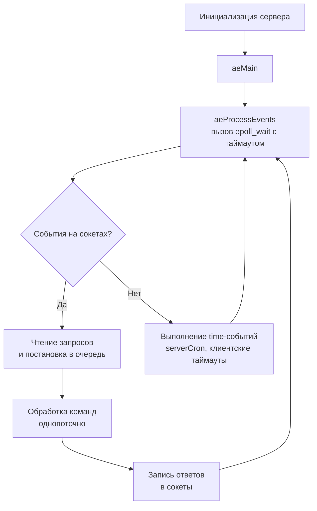

## Введение

В [[3. Redis. Архитектура и применение|прошлой статье]] мы рассмотрели Redis с высоты птичьего полёта: event loop, структуры данных и паттерны применения. Теперь пришло время открыть крышку и понять, что происходит внутри процесса Redis в те микросекунды, пока обрабатывается ваш запрос. Для Go-разработчика это знание критически важно: оно объясняет, почему одни паттерны дают 100k RPS без усилий, а другие внезапно вызывают задержки и раздувание памяти.

Вся архитектура Redis держится на трёх китах:
- Эффективнейший менеджмент оперативной памяти и компактные структуры данных;
- Однопоточный (с нюансами) асинхронный event loop;
- Тщательно продуманный компромисс между персистентностью и скоростью через fork и copy-on-write.

Разберём каждый из этих слоёв.

## Память и аллокатор: почему jemalloc

Redis агрессивно использует динамическую память, создавая миллионы маленьких объектов: строки, записи хеш-таблиц, элементы списков. Стандартный аллокатор `glibc malloc` имеет склонность к фрагментации и высоким накладным расходам при таком профиле. Поэтому Redis с самого начала использует **jemalloc** — аллокатор, изначально написанный для FreeBSD и оптимизированный для многопоточных приложений с огромным количеством всех размеров аллокаций.

**Что даёт jemalloc:**
- Thread-caching (tcache) — каждый поток держит пул предвыделенных блоков, чтобы избежать глобальных блокировок. Даже в однопоточном Redis это ускоряет повторные аллокации того же размера.
- Низкая фрагментация благодаря «аренам» и продуманному механизму рециклинга.
- Минимальный оверхед на малые блоки — Redis активно использует SDS (Simple Dynamic String) с малым размером, и jemalloc возвращает блоки почти без wasted bytes.

Для Go-разработчика здесь важна параллель с ареной кучи Go: рантайм Go тоже избегает фрагментации, выделяя большие куски памяти из ОС и раздавая их горутинам. Если вы запускаете Redis рядом с Go-сервисом на одной машине, убедитесь, что jemalloc не конфликтует с аллокатором Go — обычно проблем нет, но при использовании тюнинга `cgroup` нужно следить за memory limits.

## Типы данных под микроскопом

В отличие от Memcached, где всё — плоская строка, Redis имеет несколько внутренних представлений для каждого типа, переключаясь между ними в зависимости от размера данных, чтобы экономить память и процессор.

### SDS (Simple Dynamic String)

Практически все строки в Redis — это не `char*` из C, а структура `sdshdr`:

```c
struct __attribute__ ((__packed__)) sdshdr8 {
    uint8_t len;   // длина строки
    uint8_t alloc; // выделено памяти (без учёта заголовка и null-терминатора)
    unsigned char flags;
    char buf[];    // гибкий массив
};
```

Это даёт O(1) получение длины строки, бинарную безопасность (в середине могут быть нули) и исключает переполнение буфера за счёт хранения выделенного размера. С точки зрения CPU это укладывается в одну-две кэш-линии, обеспечивая очень быстрый доступ.

### Хеш-таблица (словарь)

Сердце Redis — это глобальный словарь `server.db[i].dict`, хранящий все ключи. Устройство такое же, как описано в [[2. Key Value базы]], но с уникальной деталью: **инкрементальное рехэширование**.

```c
typedef struct dict {
    dictType *type;
    dictEntry **ht_table[2]; // две хеш-таблицы: старая и новая
    unsigned long ht_used[2];
    long rehashidx;          // -1 если рехэш не активен, иначе позиция, до которой перенесены бакеты
    ...
} dict;
```

При росте таблицы Redis не блокирует весь сервер на перемещение миллионов ключей. Вместо этого с каждым последующим обращением к словарю (чтение, запись, даже `SCAN`) выполняется порция переноса ключей из таблицы 0 в таблицу 1. Это обеспечивает предсказуемый latency ценой временного двойного расхода памяти.

> [!info] Под капотом
> Во время активного рехэша `rehashidx != -1`, и каждый вызов `dictAdd`, `dictFind` и других функций выполняет `_dictRehashStep`, перемещая один бакет. Redis также может выполнять рехэш «миллисекундами» в цикле, чтобы быстро завершить процесс, не останавливаясь надолго.

### Компактные структуры: ziplist, listpack, intset

Чтобы хранить мелкие списки, хеши и множества, Redis использует не классические связные списки, а супер-компактные сериализованные массивы.

**ziplist (исторически):** непрерывный кусок памяти, где элементы упакованы друг за другом с кодировкой длины. Не требует указателей `prev/next`, что экономит память (вместо 3–4 указателей по 8 байтов только 2–3 байта на элемент). Однако обновление элемента в середине требует сдвига памяти, а при превышении размера (по умолчанию 8 КБ для хеша) Redis конвертирует его в обычную хеш-таблицу.

**listpack (с Redis 7.0):** эволюция ziplist, лишённая некоторых уязвимостей цепных обновлений. Используется для Streams, а также для мелких хешей и списков. В Valkey и новых Redis команда `DEBUG` позволяет проверить тип кодировки.

**intset:** если множество состоит только из целых чисел, Redis хранит их в отсортированном массиве фиксированной битности (int16, int32, int64). Добавление — O(N), но для малых множеств (до 512 элементов по умолчанию) это быстрее и во много раз компактнее, чем дикт.

**quicklist:** для списков Redis долгое время использовал `quicklist` — связный список ziplist'ов (каждый узел — ziplist). Это даёт компромисс между эффективностью обновлений и экономией памяти. С Redis 7.0 постепенно заменяется на listpack.

### Sorted Set: skiplist + dict

Упорядоченное множество одновременно использует skip list (для операций по score) и dict (для поиска по member за O(1)). Элемент занимает память один раз, а структуры содержат указатели на него. Это классический пример trade-off «память за скорость». Для огромных лидербордов (миллионы записей) это означает, что каждый элемент обходится примерно в 64 байта (три указателя в skip list + dict entry + score).

## Event Loop и сетевая подсистема

### ae event library

Redis использует собственную абстракцию `ae`, которая под капотом подключает лучший механизм для платформы: `epoll` на Linux, `kqueue` на BSD, `/dev/poll` на Solaris. Цикл выглядит так:



**serverCron** — это функция, вызываемая сотни раз в секунду (настраивается `hz`). Она делает всё: удаление истёкших ключей, инкрементальный рехэш, сжатие AOF, переподключение реплик, снятие статистики. Если снизить `hz`, latency операций с истечением возрастает.

> [!tip] Собеседование
> **Вопрос:** Почему длительная Lua-команда или `KEYS *` убивают производительность всего сервера?
> **Ответ:** Потому что они выполняются в том же единственном потоке event loop без прерываний. Пока идёт итерация по миллиону ключей или сложный скрипт, никакие другие команды (даже от других клиентов) не обслуживаются. Решение — использовать `SCAN`, разбивать Lua-скрипты на части или использовать Redis Functions, позволяющие `yield`.

### Многопоточный I/O (Redis 6.0+)

Чтобы утилизировать несколько ядер при высоком сетевом трафике, Redis выделяет потоки, которые могут параллельно читать запросы из сокетов и записывать ответы. Однако сама обработка команд всегда происходит в главном потоке. Потоки используют тот же event loop, но без выполнения команд. Это позволяет удвоить пропускную способность на мощных серверах.

## Протокол RESP и его парсинг в Go-драйвере

Redis общается по протоколу RESP. Запросы — это массивы bulk strings, ответы — строки, числа, ошибки. Внутри Redis парсер работает в контексте каждого клиента: буфер накапливает данные от сокета, и конечный автомат разбирает кадр. Если данные получены не полностью, парсинг приостанавливается.

В Go-драйвере `go-redis` реализован похожий подход: данные читаются из `net.Conn`, и с помощью пула буферов (`sync.Pool`) парсятся без лишних аллокаций. Пайплайнинг (посылка нескольких команд подряд) позволяет драйверу не блокироваться на каждом ответе, а отправлять пачку и затем разбирать ответы. Под капотом это уменьшает количество системных вызовов `write`/`read` и снижает latency за счёт объединения пакетов в один TCP-сегмент.

## Персистентность: танец с fork и COW

Redis хранит данные в памяти, но может сохранять их на диск в двух режимах: RDB и AOF. Нас интересует, как это работает на уровне ОС.

### RDB (Snapshots)

Когда срабатывает правило `save 900 1` или клиент вызывает `BGSAVE`:
1. Redis вызывает `fork()`. Ядро создаёт копию процесса (child) с общей памятью.
2. Благодаря Copy-on-Write, пока родитель не изменяет страницы, дочерний процесс читает те же физические страницы.
3. Дочерний процесс обходит структуры данных и записывает их на диск в компактном бинарном формате.
4. В это время родитель продолжает обслуживать запросы. Когда он изменяет ключ, ядро копирует изменённую страницу памяти для родителя, но дочерний продолжает видеть старую копию.

Объём памяти удваивается в худшем случае, если родитель интенсивно изменяет множество страниц. На практике при активной записи использование памяти может вырасти в 1.5–2 раза. Это критично учитывать при настройке лимитов памяти в Kubernetes: лимит должен быть минимум в два раза больше ожидаемого датасета, или нужно выключать RDB и полагаться на AOF.

### AOF (Append-Only File)

Каждая операция записи может журналироваться в файл. Политики `fsync`:
- **always** — после каждой команды `fsync()`, что вызывает syscall и реальную запись на диск. Максимальная сохранность, но катастрофическая производительность (системный вызов на каждый запрос, см. [[Прерывая покой процессора]] — как дорогой syscall).
- **everysec** — буферизация внутри Redis и `fsync` раз в секунду фоновым потоком. Компромисс: можно потерять 1 секунду данных.
- **no** — отдаём управление ОС, полагаясь на периодический сброс page cache.

При срабатывании AOF rewrite Redis снова делает `fork`, и дочерний процесс пишет сжатую версию лога, а родитель накапливает новые команды в буфере.

> [!warning] Ловушка / Gotcha
> Использование AOF с `appendfsync always` в продакшене превращает Redis из молниеносного кэша в медленное хранилище с миллионами syscall'ов в секунду. Производительность может упасть на порядок. Всегда смотрите на latency и количество fsync.

## Репликация: как данные попадают на реплики

Redis использует асинхронную репликацию master → replica. При начальном подключении:
1. Replica отправляет `PSYNC ? -1` (полная синхронизация).
2. Master делает `fork` и начинает фоновое сохранение RDB. Параллельно он записывает все новые команды в **replication backlog** (циклический буфер).
3. После сохранения RDB отправляется на реплику и загружается в её память.
4. Затем передаются накопленные команды из backlog'а.
5. Далее идёт непрерывный поток команд.

Для Go-приложений это означает, что чтение с реплики может вернуть устаревшие данные. Если нужна сильная консистентность, можно использовать `WAIT` с количеством реплик, но это увеличивает задержку. Либо вынести строго консистентные операции на мастер, а чтение с реплик — для некритичных данных.

## Кластер: разделение ключей

В кластерном режиме 16384 хеш-слотов распределены между нодами. Ключ хешируется алгоритмом CRC16, и берётся модуль 16384. Нода, владеющая слотом, обрабатывает запрос. Если ключ принадлежит другой ноде, клиент получает `MOVED <slot> <ip:port>`. Go-драйвер `go-redis` кэширует соответствие слотов и автоматически перенаправляет запросы.

Ноды общаются через gossip-протокол, обмениваясь информацией о состоянии кластера. При добавлении новой ноды слоты мигрируют. В процессе миграции команды, касающиеся мигрирующего ключа, могут получить `ASK`-редирект.

Здесь важно понимать, что транзакции, затрагивающие ключи в разных слотах, не поддерживаются — их нужно проектировать так, чтобы все ключи были в одном слоте (например, через hash tags `{user:42}:...`).

## Pub/Sub, Streams и Lua

### Pub/Sub под капотом

При `SUBSCRIBE` клиент помещается в словарь `pubsub_channels`. Когда кто-то делает `PUBLISH`, сообщение рассылается всем подписанным клиентам (в их выходные буферы). Если клиент не успевает читать, буфер растёт. Когда буфер достигает лимита `client-output-buffer-limit`, Redis отключает медленного клиента. Это классическая проблема backpressure.

### Streams

Потоки используют структуру `rax` (radix tree) для хранения ID сообщений и listpack для самих данных. Группы потребителей используют дополнительные структуры с последним доставленным ID. При подтверждении (`XACK`) запись удаляется из pending lists. Всё это в памяти, что ограничивает размер стримов объёмом RAM.

### Lua-скрипты

Скрипты выполняются в главном потоке, монопольно. Redis использует одну Lua VM для всех скриптов. При репликации, если скрипт использует случайные функции или зависит от времени, это может привести к расхождению данных на мастере и реплике. Поэтому Redis реплицирует сам скрипт (или сгенерированный набор команд в redis 7+), а не результат. `redis.replicate_commands()` позволяет реплицировать только команды записи, созданные скриптом.

## Mechanical Sympathy для Go-разработчика

Разберём цепочку выполнения команды `GET` из Go-сервиса, чтобы увидеть физику:

1. Горутина вызывает `rdb.Get(ctx, "user:42")`.
2. Драйвер берёт соединение из пула (переиспользуемый TCP-сокет).
3. Формирует RESP-строку `*2\r\n$3\r\nGET\r\n$7\r\nuser:42\r\n` в буфере (аллокация, которая может быть из `sync.Pool`).
4. Делает `conn.Write(data)` — системный вызов `write`. В ядре данные копируются в send buffer сокета.
5. Горутина паркуется (планировщик Go убирает её из виртуального ядра).
6. Событие `epoll_wait` в главном потоке Redis сигнализирует о данных. Redis читает запрос (`read`), парсит RESP, выполняет поиск в словаре (несколько разыменований указателей), формирует ответ и пишет его в сокет (`write`).
7. На стороне Go сетевой поллер обнаруживает данные в recv buffer, пробуждает горутину.
8. Драйвер читает ответ, парсит RESP, возвращает слайс байтов.

Вся операция заняла десятки микросекунд, из которых подавляющее время — ожидание сети и epoll. Доля Redis в этом — несколько микросекунд на поиск ключа.

Чтобы снизить сетевые обмены, используйте `MGET`/`MSET` (или пайплайны) для объединения операций. Тогда несколько команд упаковываются в один TCP-сегмент, что уменьшает количество syscall'ов и повышает throughput.

## Опасности: большие ключи и медленные операции

> [!warning] Ловушка / Gotcha
> **Big keys.** Если хеш или список содержит миллионы элементов, команда `HGETALL` или `LRANGE 0 -1` может выделить гигантский буфер в памяти сервера и «заморозить» event loop на секунды. Redis — однопоточный, другие клиенты ждут.
> **Лонг-ран Lua.** Скрипт с циклом на миллион итераций без `yield` — это катастрофа. Redis 7.0 ввёл `FUNCTION` с прерыванием, но старые Lua-движки не прерываются.
> **Свопинг ОС.** Если система свопит память Redis на диск, производительность падает в тысячи раз. Всегда отключайте swap или настраивайте `maxmemory` и политики вытеснения.

В Go это нужно отслеживать через метрики latency и мониторинг Redis ([[17. Мониторинг баз данных]]).

## Итог

Внутренности Redis — это учебник по эффективному использованию памяти, асинхронного I/O и управлению fork. Каждая деталь, от SDS до listpack, от jemalloc до инкрементального рехэша, служит одной цели: минимальная задержка при максимальной утилизации ресурсов. Для Go-инженера понимание этого «подкапотного» устройства напрямую влияет на выбор структур данных ключей, стратегию пайплайнинга и настройку персистентности.

Теперь, вооружившись этим знанием, мы двинемся к другому легендарному in-memory хранилищу — легковесному, многопоточному и специализированному на кэшировании. [[5. Memcached]]