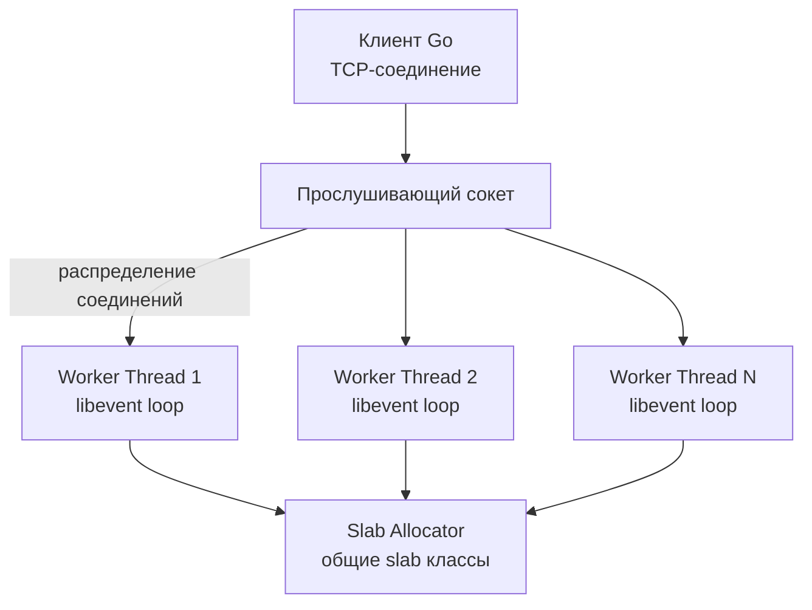
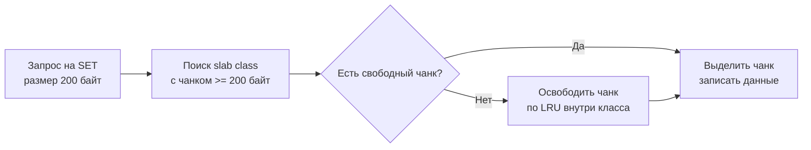

## Введение

В предыдущих статьях мы изучили архитектуру и внутреннее устройство [[3. Redis. Архитектура и применение|Redis]] — самого многофункционального in-memory хранилища. Теперь пришло время рассмотреть его более легковесного, но не менее мощного собрата — **Memcached**. Если Redis — это швейцарский нож с десятками структур данных, персистентностью и кластеризацией, то Memcached — остро заточенный монолезвийный клинок: чистый кэш, только строки, только скорость и максимальная утилизация многоядерных процессоров.

Memcached был создан в 2003 году Брэдом Фитцпатриком для LiveJournal и с тех пор стал стандартом де-факто для простого кэширования в веб-архитектуре. Его философия — «никаких излишеств, только O(1) операции и отсутствие блокировок там, где это возможно». Для Go-разработчика понимание Memcached важно в ситуациях, когда нужна максимальная пропускная способность на многоядерном сервере, а сложные структуры данных или персистентность не требуются.

## Архитектура: многопоточный event loop

Главное архитектурное отличие Memcached от Redis — **многопоточная обработка запросов с самого рождения**. Redis исторически однопоточный (лишь с 6.0 появился многопоточный I/O), в то время как Memcached изначально проектировался для использования всех доступных ядер CPU.



**Как это работает:**
- При запуске Memcached создаёт master-поток и заданное число worker-потоков (по умолчанию 4, настраивается через `-t`).
- Все потоки слушают те же TCP/UDP порты через общий сокет, используя `SO_REUSEPORT`.
- Входящее соединение прикрепляется к одному из worker’ов. Внутри каждого worker’а работает собственный event loop на базе `libevent`.
- Запросы на запись/чтение обрабатываются на том же worker’е, включая поиск в хеш-таблице и работу с памятью.

Это даёт **настоящий параллелизм** без координации команд из одного потока: каждый worker абсолютно независим и не ждёт других. Блокировки нужны только для синхронизации доступа к глобальным структурам — кэшу и слабам, но они спроектированы так, чтобы быть крайне короткими.

> [!info] Под капотом
> Для синхронизации потоков Memcached использует спин-блокировки (`pthread_spinlock_t`) либо лёгкие мьютексы на критические секции работы со slab-аллокатором. Длительные операции вроде выделения памяти делаются вне блокировок. 
> 
> С точки зрения Go-рантайма, эта архитектура напоминает модель GOMAXPROCS > 1, где несколько P (виртуальных процессоров) обрабатывают горутины параллельно. Только здесь каждый worker — это отдельный системный поток ОС.

## Slab allocator: управление памятью без фрагментации

Если в Redis память выделяется через jemalloc для каждого объекта, то Memcached использует **slab allocator**, радикально снижающий фрагментацию и накладные расходы на частое выделение/освобождение.

### Как устроен Slab

1. **Страница** (page) — минимальный блок, запрашиваемый у ОС. Обычно 1 МБ.
2. **Slab class** — класс, объединяющий чанки (chunks) одного размера. Например, класс 1 — чанки по 80 байт, класс 2 — 100 байт, класс 3 — 128 байт и так далее с ростом фактором (по умолчанию 1.25). Каждый класс содержит несколько страниц, разбитых на чанки.
3. **Chunk** — элементарный контейнер для хранения одного объекта (ключа, значения, метаданных). Размер чанка фиксирован для класса.

Когда приходит команда `set`:
- Вычисляется общий размер элемента (ключ + значение + overhead структуры `item`).
- Подбирается ближайший сверху slab class, чей размер чанка вмещает элемент.
- Внутри класса просматривается список свободных чанков. Если свободных нет — ищется страница, где можно выделить новый чанк или вытесняется старый элемент (LRU).



### Почему slab эффективен

С точки зрения **Mechanical Sympathy**, slab allocator даёт несколько важных преимуществ:

1. **Отсутствие фрагментации.** Все чанки в классе одного размера, поэтому никогда не возникает проблемы «внешней» фрагментации, когда свободная память есть, но подходящего блока нет. Память утилизируется как идеальный массив.
2. **Локальность кэша.** Чанки одного класса лежат в непрерывных страницах. При обслуживании запросов, обращающихся к ключам близкого размера, CPU загружает в L1/L2 кэши соседние чанки, ускоряя доступ.
3. **Предсказуемость аллокаций.** Выделение чанка — это всего лишь перемещение указателя свободного списка или инкремент счётчика внутри страницы. Никакого поиска по куче, как в `malloc`. Это занимает считанные десятки тактов CPU.
4. **Минимизация блокировок.** Каждый slab class имеет свой мьютекс. Потоки, работающие с разными размерами данных, не блокируют друг друга.

> [!warning] Ловушка / Gotcha
> **Slab-фрагментация.** Хотя внешней фрагментации нет, возможна внутренняя: если ваш объект имеет размер 210 байт, а ближайший чанк — 256 байт, то 46 байт пропадают. При миллионах объектов это может составлять гигабайты потерянной памяти. Поэтому для Memcached очень важно подбирать фактор роста slab’ов (`-f`) и помнить, что хранить одновременно много объектов с сильно разными размерами неэффективно.
> 
> Также Memcached **не дефрагментирует** память автоматически: если в классе 10 страниц, и только одна заполнена, память не вернётся ОС. Она останется зарезервированной для этого класса. В Go это полезно помнить при настройке памяти контейнера — лимит может быть исчерпан даже при половине реальных данных.

## Структура элемента (item)

Каждый объект в Memcached представлен структурой `item`, которая размещается в начале чанка и управляет LRU-связями:

```c
typedef struct _stritem {
    struct _stritem *next;      // следующий в хеш-таблице (chaining)
    struct _stritem *prev;
    struct _stritem *h_next;    // следующий в хеш-списке
    rel_time_t      time;       // время последнего доступа / создания
    rel_time_t      exptime;    // время истечения
    int             nbytes;     // длина значения
    unsigned short  refcount;
    uint8_t         nsuffix;    // длина суффикса (флаги + ключ)
    uint8_t         it_flags;
    uint8_t         slabs_clsid; // ID slab class
    uint8_t         nkey;       // длина ключа
    union {
        uint64_t cas;
        char end;
    } data[];
    // Далее идут: флаги, ключ, суффикс, значение
} item;
```

Элемент содержит и ключ, и значение, и флаги внутри одного блока памяти — никаких дополнительных указателей на разрозненные буферы. Это улучшает локальность данных и сокращает количество аллокаций. Для сравнения: Redis хранит ключ в SDS, а значение — отдельным объектом внутри value-структуры.

## Хеш-таблица и поиск ключей

Глобальная хеш-таблица Memcached — это массив указателей на цепочки `item`. Хеш-функция по умолчанию — **Jenkins one-at-a-time** (может быть заменена на murmur3 в новых версиях). Размер таблицы динамически увеличивается, но в отличие от Redis, **рехэширование не инкрементальное**. При росте таблицы Memcached выделяет новую, большую таблицу и за один проход переносит все элементы, **блокируя весь кэш** на время переноса. Это — одна из причин, почему Memcached не рекомендуется для сценариев с сотнями миллионов ключей. Однако разработчики пошли на это, так как в типичных нагрузках таблица перестраивается редко и быстро.

> [!tip] Собеседование
> **Вопрос:** В чём разница подхода к рехэшированию в Redis и Memcached, и как это влияет на выбор между ними?
> **Ответ:** Redis использует инкрементальное рехэширование — таблицы перестраиваются по чуть-чуть во время обычных операций, избегая длительных пауз. Memcached же делает блокирующее рехэширование: когда порог заполнения превышен, все операции замораживаются, ключи переносятся в новую таблицу одним махом. Для очень больших таблиц (сотни миллионов ключей) это может вызвать заметную задержку. Поэтому Redis предпочтительнее, когда количество ключей огромно и недопустимы паузы. Memcached же быстрее «в устойчивом режиме» за счёт более простого кода и меньшего оверхеда на проверки при каждом обращении.

## Управление временем жизни и вытеснение

Memcached не удаляет просроченные ключи немедленно. Вместо этого используется ленивый подход, дополненный фоновым потоком.

- **Ленивое удаление:** Когда клиент запрашивает ключ через `get`, проверяется `exptime`. Если время вышло, элемент удаляется и клиент получает ответ «не найдено».
- **Фоновый сборщик (crawler):** Начиная с версии 1.4.25, в Memcached появился фоновый поток, который периодически обходит LRU-списки каждого slab class и удаляет истекшие элементы. Это позволяет освобождать память без ожидания обращений к «мёртвым» ключам.

Вытеснение (eviction) происходит **только внутри того slab class**, в котором закончились свободные чанки. Используется LRU: удаляется самый старый по времени последнего доступа элемент из хвоста двойного связного списка. Это означает, что если у вас активный класс с чанками 256 байт переполнен, а соседний класс 1 МБ пустует — вытесняться будут только 256-байтовые элементы, и память не переиспользуется между классами. Отсюда вытекает необходимость тщательно планировать распределение размеров ключей.

## Персистентность и надёжность

Memcached **не имеет персистентности от слова «совсем»**. Нет ни RDB, ни AOF, ни даже опции dump на диск. Рестарт Memcached = полная потеря всех данных. Его философия — «кэш должен быть легкозаменяемым и восстанавливаемым из основного источника данных». Это упрощает код, не требует fork и не создаёт нагрузки на диск, что даёт ещё больший прирост производительности.

В Go-экосистеме это означает, что вы должны проектировать систему, где падение Memcached или его перезапуск не вызывают деградацию бизнес-логики, кроме временного повышения latency из-за cache miss. Обычно это решается запасным инстансом или деградацией к прямому запросу в PostgreSQL (см. [[7. Кэширование поверх БД]]).

## Протокол взаимодействия

Memcached поддерживает два протокола: текстовый и бинарный.

**Текстовый протокол** — это ASCII строки:
```
get mykey\r\n
VALUE mykey 0 5\r\n
hello\r\n
END\r\n
```
Команды `set`, `add`, `replace`, `append`, `prepend`, `incr`, `decr`, `delete`. Простой, удобный для отладки `telnet`.

**Бинарный протокол** — фиксированные заголовки, компактные байты. Устраняет некоторые проблемы текстового (например, невозможность отправлять бинарные данные в ключе без экранирования). Но он всё равно крайне прост.

В Go наиболее популярна библиотека `github.com/bradfitz/gomemcache/memcache`. Она работает с текстовым протоколом, предоставляя удобные методы и управление пулом соединений.

```go
import "github.com/bradfitz/gomemcache/memcache"

mc := memcache.New("10.0.0.1:11211", "10.0.0.2:11211")
mc.Set(&memcache.Item{
    Key:        "user:session:abc123",
    Value:      []byte(`{"user_id":42}`),
    Expiration: 300, // 5 минут
})

item, err := mc.Get("user:session:abc123")
if err == memcache.ErrCacheMiss {
    // Пересоздать сессию
} else if err != nil {
    // Обработка ошибки соединения
}
```

> [!info] Под капотом
> Клиентская библиотека на Go использует внутренний пул TCP-соединений и распределяет ключи по серверам через консистентное хеширование. Важно, что Memcached не имеет встроенной репликации или кластеризации — шардирование полностью на стороне клиента.

## Сравнение Memcached и Redis

Держите в голове эту таблицу, когда выбираете инструмент:

| Характеристика               | Memcached                                | Redis                                        |
| ---------------------------- | ---------------------------------------- | -------------------------------------------- |
| Модель обработки             | Многопоточная (несколько worker’ов)      | Однопоточная (с опциональным многопоточным I/O) |
| Структуры данных             | Только строки (плоские значения)         | Строки, списки, множества, хеши, потоки ...  |
| Память                       | Slab allocator, только RAM               | Jemalloc, RAM с персистентностью на диск     |
| Персистентность             | Отсутствует                              | RDB, AOF                                     |
| Репликация                   | Нет                                      | Master-Replica, Sentinel, Cluster            |
| Expire                       | Ленивая + фоновый crawler                | Ленивая + активная (serverCron)              |
| Поддержка Lua                | Нет                                      | Есть                                         |
| Макс. размер значения        | 1 МБ (настраивается)                     | 512 МБ                                       |
| Сетевая модель               | libevent, TCP/UDP                        | Собственный ae, TCP                         |
| Подходит для                 | Простое кэширование, высокий RPS         | Кэширование, координация, очереди, стримы    |

**Когда выбирают Memcached:**
- Нужна максимально возможная пропускная способность на ноду, и данные — простые строки.
- Память дорога, а размер объектов предсказуем (чтобы избежать slab-фрагментации).
- Нет требований к сохранности данных.

**Когда выбирают Redis:**
- Нужны сложные структуры данных (лидерборды, очереди).
- Нужна персистентность и восстановление после сбоев.
- Требуется репликация и автоматический failover.

В современной Go-разработке Memcached всё чаще вытесняется Redis/Valkey из-за их универсальности, но в высоконагруженных системах (например, доставка контента CDN, где кэшируются миллионы мелких HTML-сниппетов) Memcached всё ещё король.

> [!tip] Собеседование
> **Вопрос:** Может ли Memcached использоваться для хранения сессий пользователей так же надёжно, как Redis?
> **Ответ:** Технически да, но с оговорками. При падении сервера Memcached все сессии теряются, в то время как Redis можно настроить с AOF и репликацией для сохранности. Если ваш бизнес терпит перелогин пользователей при сбое кэша, Memcached подходит. В противном случае выбирайте Redis с персистентностью. Часто в Go-проектах комбинируют: Redis для важных сессий, Memcached для некритичных фрагментов.

## Mechanical Sympathy: Memcached на голом железе

Рассмотрим физический путь запроса `GET` из Go-сервиса до Memcached и обратно.

1. **Сетевое взаимодействие:** `mc.Get()` выполняет `conn.Write()` → syscall `write`, который копирует запрос в буфер сокета и отправляет TCP-сегмент. Горутина Go паркуется, ожидая ответа. Memcached worker, используя `epoll`, получает событие и читает запрос (`read`).
2. **Поиск:** Worker вычисляет хеш ключа, захватывает мьютекс хеш-таблицы (спин-блокировка) и идёт по цепочке. Найдя `item`, проверяет `exptime` и обновляет LRU-список, двигая элемент в голову. Мьютекс освобождается.
3. **Ответ:** Worker формирует заголовок `VALUE ...` и пишет данные в сокет клиента. Все операции с памятью происходят в рамках одного чанка, без лишних копирований. На стороне Go горутина пробуждается через netpoller, читает ответ и возвращает байты.

Благодаря slab’ам, данные чанка находятся в непрерывном блоке памяти, и процессор подгружает их в L1/L2 кэши с высокой вероятностью попадания. Многопоточность позволяет параллельно обслуживать столько запросов, сколько ядер, без координации. Именно поэтому Memcached достигает 1+ миллионов GET’ов в секунду на одном мощном сервере.

## Типичные проблемы и ловушки

> [!warning] Ловушка / Gotcha
> 1. **Размер значения > 1 МБ.** По умолчанию значение обрезается. Необходимо перекомпилировать Memcached с увеличенным `POWER_LARGEST` или использовать другой инструмент. В Go это проявляется как ошибка `SERVER_ERROR object too large for cache`.
> 2. **Отсутствие аутентификации.** Memcached открыт для всех, кто может подключиться к порту 11211. В production обязательно закрывайте его файрволом или используйте аутентификацию через SASL (редко применяется).
> 3. **Текстовый протокол и мультигет.** Если вы запрашиваете много ключей в одном `get`, ответ может перемежаться. В Go-библиотеке это обрабатывается корректно, но нужно помнить о timeouts.
> 4. **Слэбы и «горячие» ключи.** Если у вас 99% запросов — к ключам размером 200 байт, а остальные — к 1 МБ, slab class для 200 байт будет постоянно вытеснять данные, в то время как класс 1 МБ — простаивать. Память не перераспределяется. Это может привести к преждевременному вытеснению нужных данных при обилии свободной RAM.
> 5. **CAS (Check-and-Set).** Memcached поддерживает CAS для оптимистистичного контроля конкурентности. Однако в Go-библиотеке нужно вручную следить за `cas_unique`. Забытая проверка может привести к потерянным обновлениям в многопоточной среде.

## Итог

Memcached — это чистейший пример in-memory кэша, доведённого до совершенства. Его многопоточная архитектура и slab-аллокатор позволяют выжать максимум из многоядерных процессоров при кэшировании простых строк. Отсутствие персистентности, структур данных и сложной кластеризации делает его неподходящим для задач, требующих долговременного хранения или сложных запросов, но даёт непревзойдённую скорость и предсказуемость.

Для Go-разработчика Memcached — это инструмент, который стоит знать и держать в своём арсенале, особенно если вы проектируете высоконагруженные системы, где кэшируются небольшие однородные объекты на выделенных серверах с десятками ядер.

Следующим мы рассмотрим современный форк Redis, совместимый и развиваемый под эгидой Linux Foundation — [[6. Valkey]], который перенимает лучшие черты Redis, решая некоторые его проблемы управления и лицензирования.