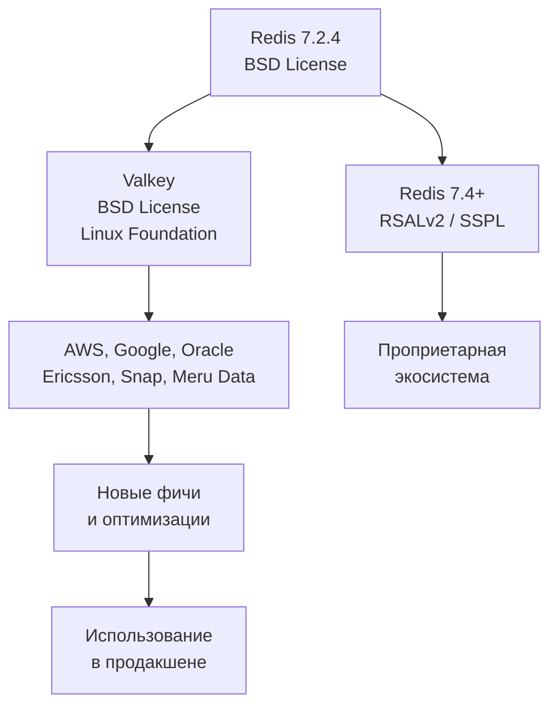

## Введение

В марте 2024 года мир in-memory хранилищ пережил тектонический сдвиг. Redis Ltd., коммерческая компания за самой популярной key-value базой, объявила о смене лицензионной модели: начиная с Redis 7.4 исходный код перестал распространяться под свободной BSD-лицензией и перешёл на двойную схему RSALv2 / SSPL. Для крупных облачных провайдеров и open-source сообщества это стало сигналом к действию. Так родился **Valkey** — прямой форк Redis, переданный под крыло Linux Foundation и развиваемый силами AWS, Google Cloud, Oracle, Ericsson и других.

Valkey — это не просто «ещё один клон». Это полноценная замена Redis, сохраняющая 100% совместимость по API, протоколу RESP и экосистеме, но с независимым управлением, открытой лицензией (BSD 3-Clause) и амбициозными планами на будущее. Для Go-разработчика, чьи сервисы полагаются на Redis, понимание Valkey критически важно для долгосрочного планирования инфраструктуры.

## История и предпосылки: почему Redis перестал быть «открытым»

Redis изначально создавался Сальваторе Санфилиппо (antirez) как BSD-лицензированный проект. После ухода antirez в 2020 году управление перешло к Redis Ltd., которая постепенно вводила ограничения: сначала вставка проприетарных модулей (Redis Stack) с RSAL, затем с версии 7.4 — полное лицензионное перекрытие основного кода.

**Последствия для экосистемы:**
- Облачные провайдеры, строившие управляемые сервисы на Redis (Amazon ElastiCache, Google Cloud Memorystore), оказались перед риском юридических разбирательств.
- Контрибьюторы, не связанные с Redis Ltd., теряли возможность влиять на развитие.
- Open-source дистрибутивы Linux (Debian, Fedora) заявили о невозможности включать новые версии Redis в репозитории.

В ответ 28 марта 2024 года группа компаний под эгидой Linux Foundation объявила о создании Valkey — форка от последней свободной версии Redis 7.2.4, с открытым управлением, BSD-лицензией и техническим комитетом из представителей облачных гигантов и старожилов сообщества.



## Архитектура и совместимость

Валькей унаследовал архитектуру Redis 7.2 в точности: однопоточный event loop, все структуры данных (строки, хеши, списки, множества, sorted sets, streams), модель G-M-P внутри сервера (в контексте потоков — main thread + I/O threads), jemalloc-аллокатор, RDB и AOF персистентность. Все внутренние механизмы, которые мы разобрали в [[4. Redis под капотом]], актуальны для Valkey без изменений.

**Совместимость:**
- Протокол RESP (Redis Serialization Protocol) — без изменений.
- Все команды Redis 7.2 поддерживаются.
- Конфигурационные файлы и команды `CONFIG SET/GET` идентичны.
- Модули Redis (Redis Stack) могут работать, но Valkey планирует развивать собственную модульную экосистему с открытой лицензией.

Для Go-разработчика это означает, что **весь существующий код, использующий `go-redis/v9` или `rueidis`, будет работать с Valkey без малейших правок.** Достаточно изменить адрес подключения на Valkey-инстанс.

```go
import "github.com/redis/go-redis/v9"

// Этот код работает как с Redis, так и с Valkey
rdb := redis.NewClient(&redis.Options{
    Addr: "valkey-host:6379",
})
```

## Ключевые улучшения и планы

Хотя Valkey начался как идентичный форк, его независимость позволила сообществу быстро вносить изменения, которые давно ждали, но не могли пройти через бюрократию Redis Ltd.

### Уже реализованные улучшения (на момент 2024-2025)
- **Ускорение репликации:** оптимизация передачи RDB-файлов и первичной синхронизации, снижение latency при полном ресинхронизации.
- **Улучшенные сжатие и производительность:** ряд исправлений в SDS и парсере RESP.
- **Улучшенная работа с памятью:** более агрессивный возврат памяти ОС через `jemalloc` при снижении объёма данных.
- **IPv6 и TLS:** полноценная поддержка современных сетевых стеков, включая mTLS для клиент-серверного взаимодействия и межузлового общения в кластере.

### В планах (Roadmap)
- **Многопоточная обработка команд:** эксперименты с настоящим многопоточным выполнением, не только I/O. Это потребует переосмысления модели атомарности, но сулит кратное увеличение throughput на многоядерных машинах.
- **Улучшенное кластерное перебалансирование:** автоматическое перераспределение слотов с минимальным прерыванием обслуживания.
- **Новый протокол дискового хранения:** собственный движок для tiered storage (данные, вытесняемые на SSD).
- **Расширенные структуры данных:** поисковые индексы и JSON с открытой лицензией.

С точки зрения Mechanical Sympathy, Valkey продолжает философию Redis: держать данные в памяти, минимизировать системные вызовы, опираться на эффективный аллокатор, но открытость позволяет внедрять оптимизации уровня ядра свободнее.

## Valkey и экосистема Go

Для Go-экосистемы Valkey — это бесшовная замена. Библиотеки `go-redis`, `rueidis`, `redigo` уже добавили поддержку Valkey-специфичных команд (по мере их появления) или просто воспринимают Valkey как Redis 7.2. Клиенты знают, как общаться с кластером Valkey, Sentinel и репликами.

> [!tip] Собеседование
> **Вопрос:** Нужно ли менять код на Go при миграции с Redis на Valkey?
> **Ответ:** Нет, если вы используете стандартные клиенты. Valkey полностью совместим по протоколу RESP. Однако при использовании модулей Redis Stack (RedisJSON, RediSearch) может потребоваться проверка: Valkey предоставляет собственные открытые реализации или совместимые обёртки. Также стоит следить за анонсами новых команд Valkey, которые могут улучшить производительность ваших паттернов (например, `ZRANGESTORE BYLEX` и т.п.).

## Сравнение с Redis и Memcached

| Характеристика          | Valkey                                   | Redis (7.4+)                         | Memcached                        |
|-------------------------|------------------------------------------|--------------------------------------|----------------------------------|
| Лицензия                | BSD 3-Clause                             | RSALv2 / SSPL                        | BSD                              |
| Модель управления       | Linux Foundation, открытый комитет        | Redis Ltd. (единолично)             | Сообщество (Dormando)            |
| Протокол                | RESP, совместим с Redis 7.2               | RESP                                 | Текстовый / бинарный             |
| Структуры данных        | Все Redis 7.2 + новые                     | Все, но модули могут быть платными  | Только строки                    |
| Персистентность         | RDB, AOF                                  | RDB, AOF                              | Нет                              |
| Репликация / Кластер    | Да, улучшается                            | Да, но часть enterprise              | Нет                              |
| Многопоточность         | I/O threads (главный поток один)          | I/O threads (главный поток один)     | Полная многопоточность           |
| Для Go-разработчика     | Полная совместимость с go-redis          | Совместимость, но риск лицензии      | Подходит для простого кэша       |

> [!warning] Ловушка / Gotcha
> **Лицензионная ловушка Redis.** Если ваша компания использует Redis в облачном сервисе, предоставляемом клиентам (SaaS), версии Redis 7.4+ под SSPL могут потребовать открытия исходного кода вашего сервиса. Valkey свободен от этих ограничений. Для стартапов и крупных провайдеров это решающий фактор. Однако учтите: если вы уже завязаны на проприетарные модули Redis Stack, переход на Valkey потребует замены их на открытые аналоги.

## Mechanical Sympathy: Valkey под капотом и Go

С точки зрения работы на уровне железа Valkey не меняет основ Redis: данные в RAM, хеш-таблица с инкрементальным рехэшем, jemalloc, event loop на epoll. Однако независимое развитие позволяет сообществу реагировать на проблемы быстрее. Например, исправления, касающиеся уменьшения числа копирований памяти при записи в сокет или оптимизации парсинга RESP, напрямую снижают нагрузку на CPU в Go-сервисах, делающих миллионы `GET` в секунду.

Рассмотрим физический профиль: Valkey-инстанс на 32-ядерном сервере обрабатывает 1.2 млн RPS. Go-сервис с пулом из 100 горутин шлёт запросы на Valkey. Благодаря тому, что Valkey теперь активно использует `SO_REUSEPORT` с несколькими event loop'ами (в экспериментальных сборках), он может масштабироваться на ядра лучше, чем классический Redis. Это означает, что при пиковой нагрузке вам может понадобиться меньше инстансов Valkey, чем Redis, для обслуживания того же трафика, экономя сетевые обмены и память.

## Итог

Valkey — это не просто вынужденный форк, а стратегический шаг сообщества к сохранению действительно открытого in-memory хранилища. Для Go-разработчика это означает:
- Нулевые изменения кода при переходе с Redis.
- Гарантию долгосрочной BSD-совместимости.
- Более быстрый цикл инноваций и исправлений, особенно в области производительности и безопасности.

Valkey уже используется в Amazon ElastiCache и Google Cloud Memorystore, что доказывает его enterprise-готовность. Если вы проектируете новые сервисы на Go или планируете миграцию, Valkey — это осознанный выбор в пользу открытости и управляемости.

На этом мы завершаем обзор ключевых игроков в мире key-value хранилищ. Впереди — совершенно иной подход к хранению данных, где мы отказываемся от плоских значений и переходим к работе с богатыми документами. Следующая статья: [[7. Document базы. MongoDB]]