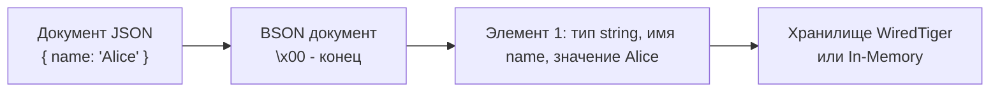
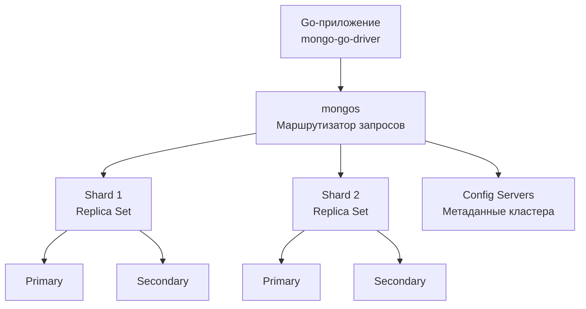

## Введение

Документные базы данных — это второй по популярности класс NoSQL-систем после key-value хранилищ. Если в [[2. Key Value базы|key-value]] вы оперируете непрозрачным blob’ом по ключу, а в реляционных базах раскладываете данные по строго типизированным строкам и столбцам, то документная модель предлагает промежуточный подход: вы храните **самодостаточные документы** — обычно JSON-подобные структуры, которые база данных понимает и может индексировать.

MongoDB — безусловный лидер среди документных СУБД, и именно с ним чаще всего сталкивается Go-разработчик, когда проект требует гибкой схемы, горизонтального масштабирования и высокой скорости разработки. В этой статье мы разберём архитектуру MongoDB, модель данных, ключевые механизмы и то, как он взаимодействует с Go-рантаймом на уровне процессора и операционной системы.

## Модель данных: документы и коллекции

В отличие от реляционной модели, где данные нормализованы (см. [[9. Нормализация. Введение]]) и распределены по нескольким таблицам, в MongoDB вы храните связанные данные вместе — в одном документе.

- **Документ** — это иерархическая структура, аналог JSON-объекта, но хранимая в бинарном формате **BSON** (Binary JSON). Документ содержит поля и значения, включая вложенные документы и массивы.
- **Коллекция** — аналог таблицы, но без обязательной схемы. Документы в одной коллекции могут иметь разные наборы полей.
- **База данных** — контейнер коллекций.

```go
// Пример документа в представлении Go
type User struct {
    ID        primitive.ObjectID `bson:"_id,omitempty"`
    Name      string             `bson:"name"`
    Email     string             `bson:"email"`
    Addresses []Address          `bson:"addresses,omitempty"`
    // Можно иметь разный набор полей в разных документах
}

type Address struct {
    Street string `bson:"street"`
    City   string `bson:"city"`
}
```

> [!info] Под капотом
> Каждый документ имеет служебное поле `_id`, которое индексируется автоматически. По умолчанию это ObjectId — 12-байтовое значение, генерируемое драйвером и кодирующее временную метку, идентификатор машины, PID процесса и счётчик. Это позволяет избежать централизованного генератора ключей при шардинге.

### Денормализация как философия

В реляционных базах вы бы разнесли пользователя, адреса и заказы в три таблицы и собрали бы их JOIN’ами. В MongoDB типичный паттерн — встроить адреса прямо в документ пользователя. Это предвосхищает паттерн [[14. Денормализация и когда она оправдана|денормализации]], оправданный для оптимизации чтения ценой усложнения обновлений и увеличения размера документа.

Однако MongoDB поддерживает и ссылки между коллекциями (manual references, DBRef), что позволяет в некоторых случаях возвращаться к «реляционному» стилю. Выбор между встраиванием и ссылками — одна из главных проектировочных дилемм.

## BSON: как документы хранятся и передаются

BSON — это бинарная запись JSON-подобных структур. Формат спроектирован для быстрого сканирования: строгая типизация (различает int32, int64, double, string, datetime, ObjectId и т.д.), length-префиксы, отсутствие необходимости полного парсинга для извлечения одного поля.



С точки зрения Go-драйвера `mongo-go-driver`, при выполнении `collection.InsertOne(ctx, doc)` сериализация в BSON происходит на стороне клиента, используя рефлексию (или кодогенерацию с тегами `bson`). Это важнейший момент для производительности: BSON-энкодинг может создавать множество временных слайсов и объектов, увеличивая давление на GC. Рекомендуется переиспользовать структуры и по возможности применять `bson.M{}` только для прототипирования.

## Архитектура MongoDB: от процесса до кластера

Процесс `mongod` — это основной демон, обслуживающий запросы, управляющий хранением и индексами. Он работает как многопоточный сервер с собственным менеджментом памяти и журналированием.



- **Replica Set** — группа из нескольких `mongod`-процессов, обеспечивающая отказоустойчивость. Данные реплицируются на все узлы с помощью oplog (журнал операций). Выборы Primary происходят по протоколу Raft. Клиент может читать с Secondary для распределения нагрузки.
- **Sharding** — горизонтальное масштабирование: коллекции разбиваются на диапазоны по shard key. Компонент `mongos` выступает прозрачным прокси, направляя запросы в нужные шарды. Config-серверы хранят карту распределения данных.
- **Многопоточность**: начиная с версии 4.0, MongoDB использует пул потоков для выполнения операций, а WiredTiger внутри использует свои потоки для сжатия и контрольных точек.

Go-драйвер знает топологию кластера, обнаруживает Primary через `isMaster` и автоматически переключается при сбоях. Пул соединений настраивается через `options.ClientOptions`.

## Индексы в MongoDB

Без индексов MongoDB сканирует всю коллекцию (collection scan). Но в отличие от реляционных БД, здесь вы можете индексировать не только скалярные поля, но и вложенные поля, элементы массивов (multikey индексы), гео-координаты и текст.

Основные типы индексов:
- **Single Field / Compound** — аналоги B-Tree индексам в PostgreSQL (см. [[2. B Tree индекс под капотом|B Tree индекс под капотом]]).
- **Multikey** — создаётся автоматически, когда поле — массив. Каждый элемент массива индексируется отдельно.
- **Text** — для полнотекстового поиска, основан на инвертированном индексе.
- **Wildcard** — индексирует все поля документа динамически, полезен для гетерогенных коллекций.
- **TTL** — автоматическое удаление документов по времени.
- **Hashed** — хеш-индекс для равномерного распределения при шардинге.

С точки зрения производительности индексы в MongoDB хранятся в том же storage engine (WiredTiger) и работают через B-Tree с оптимизациями для сжатия. Как и в реляционных БД, индексы ускоряют чтение, но замедляют запись и потребляют RAM для кэша.

## Транзакции и ACID

Долгое время MongoDB поддерживала атомарность только в рамках одного документа — и это было достаточным для многих сценариев. С версии 4.0 появились мультидокументные транзакции с гарантиями ACID ([[1. ACID. Основы|ACID]]), распространяющиеся на целые replica sets, а с 4.2 — и на шардированные кластеры.

Транзакции в MongoDB работают на основе snapshot isolation, аналогично MVCC в PostgreSQL ([[7. MVCC. Multi Version Concurrency Control|MVCC]]). Однако они имеют ограничения: максимальное время выполнения (по умолчанию 60 секунд), и они не заменяют грамотного моделирования данных — к транзакциям прибегают только тогда, когда встраивание документов не решает проблему.

```go
session, err := client.StartSession()
defer session.EndSession(ctx)
err = mongo.WithSession(ctx, session, func(sc mongo.SessionContext) error {
    if err := session.StartTransaction(); err != nil {
        return err
    }
    // операции с разными коллекциями
    if err := collection1.InsertOne(sc, doc1); err != nil {
        session.AbortTransaction(sc)
        return err
    }
    if err := collection2.UpdateOne(sc, filter, update); err != nil {
        session.AbortTransaction(sc)
        return err
    }
    return session.CommitTransaction(sc)
})
```

## Mechanical Sympathy: как MongoDB работает с железом

В основе MongoDB лежит storage engine WiredTiger (опционально — In-Memory). Понимание его работы важно для прогнозирования производительности Go-сервиса.

- **Формат хранения**: документы и индексы хранятся в B-Tree файлах. WiredTiger кэширует часто используемые страницы в RAM, используя собственный cache (не полагаясь полностью на page cache ОС). При чтении, если данные не в кэше, происходит syscall `pread` для загрузки страницы с диска. Это дорого, как и в случае PostgreSQL, поэтому размер кэша WiredTiger должен быть соизмерим с рабочим набором данных.
- **Сжатие**: WiredTiger по умолчанию сжимает данные алгоритмом snappy — это уменьшает дисковый I/O ценой CPU. Влияние на Go-рантайм: при извлечении документов Mongo-драйвер получает уже распакованные BSON-данные, так что на стороне клиента экономится сетевой трафик, но CPU на сервере MongoDB тратится на распаковку.
- **Journal (WAL)**: Все операции записи сначала попадают в journal (аналог [[8. WAL. Write Ahead Log|WAL]]). fsync журнала происходит с настраиваемым интервалом. Это критично для долговечности: по умолчанию данные в journal сбрасываются каждые 100 мс, но можно настроить более агрессивный flush.
- **Влияние на аллокации в Go**: BSON парсинг — это CPU-интенсивная задача. Каждый полученный документ преобразуется в структуру или `bson.M`, что аллоцирует память в куче. Чтобы не перегружать GC, используйте потоковую обработку (`cursor.All()` вычитывает сразу все документы, что может привести к огромному слайсу). Лучше итерироваться курсором: `for cursor.Next(ctx) { cursor.Decode(&doc) }`.

### Пример с курсором и снижением аллокаций

```go
cursor, err := collection.Find(ctx, bson.D{{"status", "active"}})
if err != nil {
    // обработка
}
defer cursor.Close(ctx)
for cursor.Next(ctx) {
    var user User
    if err := cursor.Decode(&user); err != nil {
        // log
        continue
    }
    // обрабатываем user, не накапливая все в памяти
}
```

## Паттерны использования в Go

### CRUD операции

Основные методы драйвера:
- `InsertOne`, `InsertMany`
- `Find`, `FindOne`
- `UpdateOne`, `UpdateMany`
- `DeleteOne`, `DeleteMany`
- `Aggregate` — мощный конвейер обработки данных на стороне сервера.

```go
filter := bson.D{{"email", "alice@example.com"}}
update := bson.D{{"$set", bson.D{{"status", "verified"}}}}
result, err := collection.UpdateOne(ctx, filter, update)
if err != nil {
    // ...
}
```

### Агрегация

Агрегационный конвейер — это цепочка стадий (`$match`, `$group`, `$sort`, `$project` и др.), выполняемых на сервере. Это очень эффективно, так как данные не гоняются по сети. В Go это выглядит как слайс `bson.D`:

```go
pipeline := mongo.Pipeline{
    {{"$match", bson.D{{"status", "active"}}}},
    {{"$group", bson.D{{"_id", "$city"}, {"count", bson.D{{"$sum", 1}}}}}},
    {{"$sort", bson.D{{"count", -1}}}},
}
cursor, err := collection.Aggregate(ctx, pipeline)
// обработка курсора
```

### Смена схемы и миграции

Из-за отсутствия строгой схемы миграции в MongoDB менее формализованы, чем в реляционном мире ([[4. Миграции базы данных]]). Но это не значит, что их нет: вы пишете скрипты (на Go или JS), которые проходят по документам и обновляют их. Популярны библиотеки `migrate` для MongoDB, которые отслеживают применённые миграции в специальной коллекции.

## Ловушки и собеседование

> [!warning] Ловушка / Gotcha
> **NoSQL Injection**: При использовании пользовательского ввода в построении фильтров можно открыть дыру. Никогда не подставляйте строки извне в ключи BSON напрямую. Используйте типизированные фильтры и валидацию.
> 
> **Потеря данных при записи без подтверждения**: По умолчанию драйвер ожидает подтверждения от сервера, но в настройках можно указать `w: 0` — и тогда запись может потеряться при сбое без уведомления.
> 
> **Проблема «большого документа»**: Документы ограничены 16 МБ. Если массив внутри документа бесконтрольно растёт (например, все заказы пользователя), это приведёт к ошибкам и деградации. Нужно либо выносить вложенные сущности в отдельные коллекции, либо использовать ссылки.
> 
> **N+1 запросов**: При использовании ссылок между коллекциями ваше приложение может попасть в классическую ловушку N+1, когда для каждого родительского документа делается отдельный запрос за связанным. Используйте агрегацию с `$lookup` (аналог LEFT JOIN) или предварительную денормализацию.

> [!tip] Собеседование
> **Вопрос:** Чем транзакции в MongoDB отличаются от транзакций в PostgreSQL, и когда их стоит использовать?
> **Ответ:** Обе обеспечивают ACID, но в MongoDB транзакции появились позже и несут больший оверхед, так как требуют координации между нодами (особенно в шардированном кластере). В PostgreSQL транзакции — основа всего. В MongoDB рекомендуется в первую очередь моделировать данные так, чтобы атомарность достигалась в пределах одного документа. Мультидокументные транзакции приберегают для случаев, когда это невозможно, и они должны быть короткими.

## MongoDB против PostgreSQL против Key-Value

| Сценарий                                                   | MongoDB                                       | PostgreSQL                           | Redis / Valkey                             |
|------------------------------------------------------------|-----------------------------------------------|--------------------------------------|--------------------------------------------|
| Гибкая, часто меняющаяся схема                             | ✅                                             | ❌ (нужны миграции)                  | ✅ (opaque blob)                           |
| Сложные ACID-транзакции через несколько таблиц/коллекций   | ⚠️ (возможно, но дорого)                     | ✅                                   | ❌ (кроме Lua-скриптов)                    |
| Скорость чтения по ключу без JOIN                         | ✅                                             | ✅ (с индексом)                      | ✅✅ (микросекунды)                        |
| Аналитические ad-hoc запросы                              | ⚠️ (агрегации гибкие, но без полноценного SQL) | ✅ (SQL, оконные функции, CTE)       | ❌                                         |
| Полнотекстовый поиск                                      | ✅ (Text Index)                                | ✅ (GIN, tsvector)                   | ❌ (требует Redis Stack)                   |
| Хранение огромного количества простых ключей              | ⚠️                                            | ⚠️                                  | ✅✅                                       |
| Поддержка в Go                                            | Отличная (драйвер mongo-go-driver)             | Отличная (database/sql, pgx)         | Отличная (go-redis)                        |

## Итог

MongoDB — это зрелая документная СУБД, которая позволяет быстро разрабатывать приложения за счёт гибкой схемы, богатых возможностей вложенных документов и горизонтального масштабирования. Для Go-разработчика она предоставляет зрелый драйвер с поддержкой пула соединений, сессий и конвейерной обработки. Однако выбор MongoDB должен быть осознанным: вместе с гибкостью приходит ответственность за правильное моделирование данных, управление индексами и аккуратное использование транзакций.

В следующей статье мы залезем под капот MongoDB и разберём его внутреннее устройство: как работает WiredTiger, oplog, шардинг и MVCC на уровне исходного кода и структур на диске.

[[8. MongoDB под капотом]]