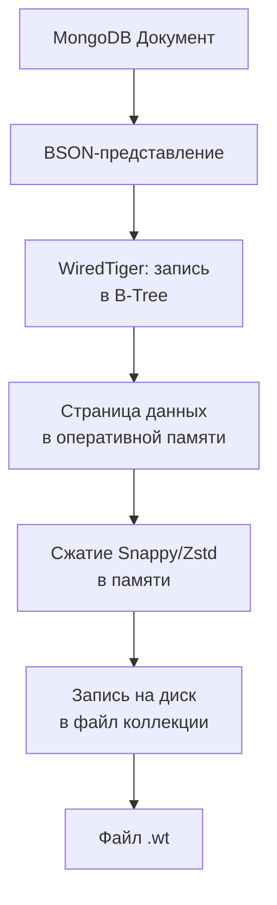
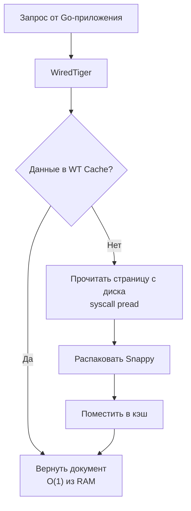

## Введение

В [[7. Document базы. MongoDB|прошлой статье]] мы разобрали MongoDB с позиции разработчика: модель документа, CRUD-операции, транзакции и паттерны применения. Теперь настало время спуститься на этаж ниже и понять, как именно MongoDB хранит данные на диске, управляет памятью, обеспечивает атомарность и реплицирует состояние. Это знание необходимо Senior Go-инженеру, чтобы прогнозировать поведение системы под нагрузкой и избегать ситуаций, когда база «внезапно» упирается в диск или уходит в латентность.

Все современные версии MongoDB (начиная с 3.2) используют **WiredTiger** в качестве storage engine по умолчанию. Именно его внутреннее устройство мы и будем препарировать.

## WiredTiger: B-Tree, страницы и сжатие

WiredTiger — это самостоятельный storage engine, разработанный ещё до поглощения MongoDB Inc. и оптимизированный для смешанных нагрузок OLTP. Он хранит данные в **B+-деревьях**, где каждый узел — это страница фиксированного размера (обычно 4–32 КБ).

### Структура на диске

- Каждая коллекция и каждый индекс — это отдельное B-Tree в отдельном файле с суффиксом `.wt`.
- Файл делится на **extents** (непрерывные блоки), внутри которых лежат страницы.
- Страницы типов: **leaf pages** (собственно данные), **internal pages** (указатели на другие страницы) и **overflow pages** (для значений, не поместившихся в листовую страницу, например, крупные массивы).

Размер страницы и размер блока дискового ввода-вывода настраиваются (`allocation_size`, `internal_page_max`, `leaf_page_max`). Подбор этих параметров под рабочую нагрузку может дать десятки процентов прироста throughput.

### Сжатие

Чтобы снизить дисковый I/O, WiredTiger по умолчанию сжимает страницы перед записью (snappy), а также опционально сжимает данные в памяти (in-memory compression). Это даёт выигрыш в объёме диска и в эффективности кэша: в тот же объём RAM помещается больше распакованных страниц при использовании in-memory сжатия. Однако ценой является расход CPU как на сервере MongoDB, так и косвенно на клиенте (меньше данных гоняется по сети).

Для Go-разработчика это означает: документ, полученный из MongoDB, уже распакован, и вы не видите разницы, но планирование ресурсов CPU на сервере должно учитывать нагрузку на сжатие, особенно при записи больших документов.

## Управление памятью: WiredTiger Cache

Самое важное, что нужно понимать про производительность MongoDB — это её **внутренний кэш**, отделённый от page cache операционной системы.

- По умолчанию размер кэша — **50% доступной RAM минус 1 ГБ**, либо настраивается через `storage.wiredTiger.engineConfig.cacheSizeGB`.
- Кэш хранит несжатые страницы данных и индексов.
- Когда кэш заполняется, WiredTiger запускает **eviction** (вытеснение): фоновые потоки выталкивают старые страницы на диск, предварительно сжав их. Если запись грязных страниц не успевает за поступлением новых данных, операция записи может быть заблокирована до завершения вытеснения — это вызывает знаменитые «MongoDB лаги».

> [!warning] Ловушка / Gotcha
> Если размер рабочего набора данных (тех документов, к которым реально обращаются) превышает размер кэша WiredTiger, MongoDB начинает читать с диска, и задержки резко возрастают (в сотни раз). В отличие от Redis, который просто вытесняет ключи (evicts keys) и держит всё в RAM, MongoDB не отказывается от данных, а лезет на диск. При планировании инфраструктуры для Go-сервиса всегда считайте рабочий набор и убеждайтесь, что он помещается в RAM, отведённую под кэш.

### Journal и долговечность

WiredTiger пишет изменения сначала в **journal** (WAL, аналог [[8. WAL. Write Ahead Log|WAL]]), а уже потом в основные файлы данных. Это гарантирует восстановление после краша.

- Journal — это отдельные файлы, по умолчанию сжатые snappy, записываются с настраиваемой периодичностью fsync (по умолчанию 100 мс). Для полной долговечности (`writeConcern: "majority"`, `j: true`) требуется дождаться fsync journal’а на большинстве узлов, что увеличивает latency.
- При сбое питания journal проигрывается, возвращая данные к последней контрольной точке (checkpoint). Контрольные точки делаются каждые 60 секунд (или по объёму данных).

## MVCC и транзакции под капотом

MongoDB с версии 4.0 добавила мультидокументные транзакции, базирующиеся на **Snapshot Isolation** внутри WiredTiger (подобно MVCC в PostgreSQL, см. [[7. MVCC. Multi Version Concurrency Control]]). Однако есть важные нюансы.

- **Snapshot Isolation**: Каждый документ может иметь несколько версий в памяти/на диске, помеченных временной меткой транзакции. Читающая операция видит последнюю зафиксированную версию, которая была до начала транзакции.
- **Хранение версий**: WiredTiger использует update list в страницах: при обновлении документа старая версия остаётся в цепочке до тех пор, пока все читатели, которым она нужна, не завершатся. Это может приводить к увеличению размера кэша и дискового пространства, если транзакции долгие.
- **Сборка мусора**: Фоновый процесс удаляет старые версии, когда они больше не нужны. Это аналогично VACUUM в PostgreSQL, но встроено в движок.

Для Go-разработчика это означает: если ваш сервис держит долгую транзакцию (например, обновляет много документов в цикле с задержками), вы накапливаете мультиверсионный мусор и можете спровоцировать рост кэша и усиление eviction. Всегда стремитесь к коротким транзакциям и перемежайте их коммитами.

## Oplog — сердце репликации

**Oplog** (operations log) — это ограниченная коллекция (capped collection), в которую Primary пишет все операции изменения данных в порядке их выполнения. Secondary ноды непрерывно читают oplog и применяют изменения к своим копиям.

- Записи в oplog **идемпотентны** (вставляются с полным состоянием документа или операцией `$set` с конкретными значениями), чтобы повторное применение не испортило данные.
- Размер oplog настраивается через `oplogSizeMB`. Если Secondary отстаёт настолько, что нужная запись уже выпала из oplog, требуется полная ресинхронизация (initial sync) — дорогая операция, копирующая все данные.
- В шардированном кластере каждая реплика-группа шарда имеет свой oplog. `mongos` не участвует в репликации.

**Mechanical Sympathy**: чтение oplog Secondary нодами — это потоковая передача данных по сети, похожая на чтение Kafka-топика. Нагружает диск Primary (если данные не в кэше) и сеть. Для Go-драйвера важна настройка read preference: если вы шлёте чтение на Secondary, драйвер учитывает `maxStalenessSeconds`, чтобы не читать с сильно отставшей ноды.

## Индексы под капотом: B-Tree в WiredTiger

Все индексы в MongoDB — это B-Tree в том же WiredTiger, аналогично [[2. B Tree индекс под капотом|B-Tree индексам в PostgreSQL]], но с особенностями.

- Индексы хранят ключ (значения полей) + указатель на документ (RecordId). Для покрывающих индексов (covering index) значения запрошенных полей включаются прямо в индекс, экономя чтение документа.
- Multikey индексы для массивов: для каждого элемента массива создаётся отдельная запись в индексе, указывающая на тот же документ.
- Индексы сжаты (префиксное сжатие ключей), что уменьшает их размер.
- При вставке документа обновляются все индексы, что увеличивает write amplification. Поэтому важно не индексировать все поля бездумно — это замедлит запись и увеличит кэш.

## Шардинг: как данные разлетаются по узлам

MongoDB реализует горизонтальное масштабирование через шардинг на основе диапазонов (range‑based) или хеша (hashed).

- **Shard Key**: поле (или поля), по которому распределяются документы. Диапазоны значений ключа делятся на чанки (chunks), которые равномерно распределяются между шардами.
- **Chunk Migration**: когда балансировщик видит дисбаланс, он перемещает чанки между шардами. Это происходит онлайн, но может создавать дополнительную нагрузку на сеть и диск.
- **Config Servers**: хранят метаданные о том, какой чанк на каком шарде лежит. Их три (replica set) для отказоустойчивости.
- **Клиентская маршрутизация**: Драйвер (в т.ч. Go-драйвер) кэширует карту чанков и направляет запросы прямо на нужный шард, минуя `mongos` (после начального получения метаданных). Однако все операции записываются/читаются через `mongos` в большинстве архитектур, упрощая логику.

Для Go-разработчика это значит: правильный выбор shard key критически важен, чтобы избежать hot shard (неравномерной нагрузки). Избегайте монотонно возрастающих полей (например, ObjectId) для range-шардинга, используйте hashed-шардинг.

## Mechanical Sympathy: MongoDB и Go-рантайм

Когда ваш Go-сервис выполняет `collection.FindOne(ctx, filter)`, происходит следующая физическая картина:

1. **Драйвер берёт соединение из пула** (управляемого внутри `mongo.Client`). Это TCP-сокет, подключённый к `mongod` или `mongos`.
2. **Формируется BSON-запрос** (сериализация фильтра в бинарный формат) — аллокация в куче Go. Использование тегов `bson` и кодогенерации снижает рефлексию и аллокации по сравнению с `bson.M{}`.
3. **Системный вызов `write`** отправляет запрос в сокет. Горутина паркуется (планировщик Go передаёт управление другой горутине).
4. **На сервере MongoDB** `epoll_wait` обнаруживает событие, поток обрабатывает запрос: поиск в WiredTiger Cache. Если промах — `pread` для чтения страницы с диска, распаковка snappy. Затем формируется BSON-ответ.
5. **На стороне Go** `epoll_wait` пробуждает горутину, драйвер читает ответ, десериализует в структуру (аллокация памяти под строки, слайсы).
6. **GC в Go** будет собирать временные буферы запроса/ответа и промежуточные объекты десериализации. При большом потоке ответов рекомендуется переиспользовать структуры (например, через `sync.Pool`), чтобы снизить давление.

Если MongoDB начинает читать с диска, драйвер может столкнуться с увеличением времени ответа до десятков миллисекунд вместо микросекунд. Горутины зависают в ожидании сети, но так как это сетевой ввод-вывод, поток ОС не блокируется (благодаря netpoller). Однако планировщик Go может создать дополнительные потоки ОС для других готовых горутин, что нужно учитывать при настройке `GOMAXPROCS`.

## Ловушки и оптимальные практики

> [!warning] Ловушка / Gotcha
> 1. **Рост oplog без контроля**: При массовой вставке или обновлении размер oplog может резко вырасти (если не capped). Но он capped, старые записи удаляются. Опасность в том, что если Secondary не успевает прочитать до удаления — он «отвалится». Следите за lag репликации.
> 2. **TTL-индексы и eviction**: TTL-индексы запускают фоновый поток, который удаляет просроченные документы. Это создаёт нагрузку на диск и кэш. Если удаление массивное, может вызвать лаги. Рассмотрите удаление небольшими порциями.
> 3. **Слишком большие документы (16 МБ)**: MongoDB не любит большие документы. Они забивают кэш, вызывают долгие сетевые передачи и замедляют репликацию. Проектируйте документы так, чтобы часто используемые данные были отделены от редко используемых, возможно, с выносом в отдельные коллекции.
> 4. **Нет явной настройки write concern / read concern**: По умолчанию write concern может быть `{w: 1}`, что означает подтверждение только Primary. При сбое Primary до репликации данные могут потеряться. Для важных операций используйте `{w: "majority"}`. Для чтения — `readConcern: "majority"`, чтобы избежать чтения «грязных» данных (феномен «read your own writes» может не работать без majority).
> 5. **Медленные запросы из-за отсутствия индексов или неверного порядка полей в compound-индексах**. Используйте `explain()` и профилировщик.

> [!tip] Собеседование
> **Вопрос:** Как устроен механизм "write concern majority" в MongoDB и как он гарантирует, что данные не потеряются?
> **Ответ:** Majority означает, что операция записи должна быть зафиксирована в journal большинства членов replica set (включая primary). Внутри используется протокол на основе oplog: Primary пишет в свой oplog и ждёт, пока Secondary скопируют эту запись и подтвердят. Только после этого клиенту возвращается успех. Это защищает от потери данных при краше Primary, так как новый Primary, избранный большинством, будет иметь эту запись в своём oplog.

## Итог

MongoDB под капотом — это гармоничное сочетание B-Tree storage engine (WiredTiger), сжатия на лету, MVCC и распределённых механизмов репликации и шардинга. Понимание этих механизмов позволяет Go-разработчику осознанно выбирать размер кэша, конфигурацию write/read concern, проектировать схему данных, минимизирующую дисковые операции, и писать код, который не перегружает GC лишними аллокациями.

Теперь, освоив документную модель, мы переходим к следующему крупному классу NoSQL — колоночным (wide-column) базам, которые оптимизированы для записи и хранения временных рядов и событий. [[9. Column базы. Cassandra]]