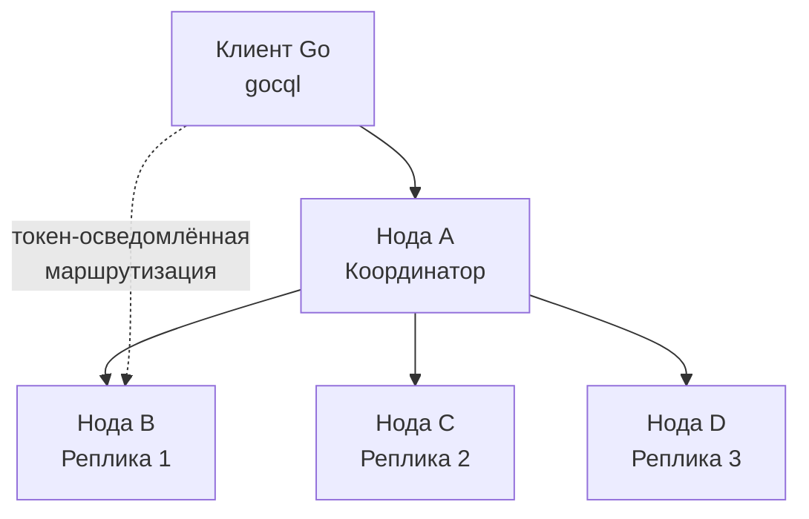
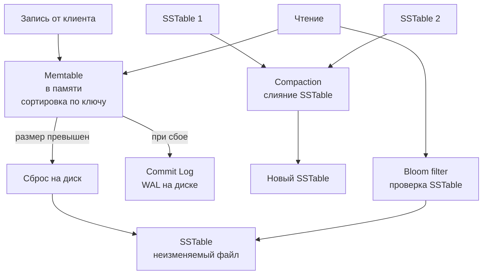

## Введение

После погружения в key-value хранилища ([[2. Key Value базы]]) и документные базы данных ([[7. Document базы. MongoDB]]), мы переходим к третьему крупному классу NoSQL — **колоночным (wide-column) базам**. Если key-value оперирует непрозрачными блобами, а документные — самодостаточными JSON-объектами, то колоночные базы оптимизированы для сценариев, где данные естественно организованы в строки с динамическим набором колонок, а запросы часто читают не всю строку, а лишь несколько колонок из огромного диапазона.

**Apache Cassandra** — флагман этого класса, разработанный Facebook и позже перешедший в Apache Software Foundation. Он проектировался для решения задач, в которых традиционные реляционные СУБД пасовали: хранение входящих сообщений, ленты активности, события IoT и временные ряды с требованием записи сотен тысяч операций в секунду на кластер.

Для Go-разработчика Cassandra — это выбор, когда необходима линейная масштабируемость записи, работа без единой точки отказа и устойчивость к разделению сети, а строгая консистентность в реальном времени не является абсолютным приоритетом.

## Модель данных: от bigtable к Column Family

Cassandra заимствует модель данных у Google Bigtable, но адаптирует её к распределённой архитектуре. Основные понятия:

- **Keyspace** — аналог базы данных в реляционном мире или namespace. Определяет репликацию (число реплик, стратегию размещения).
- **Таблица (Column Family)** — контейнер строк. В Cassandra одна таблица часто называется **Column Family** (историческое название).
- **Строка** — идентифицируется первичным ключом (`PRIMARY KEY`). Ключ может быть составным: `PRIMARY KEY (partition_key, clustering_column1, clustering_column2)`.
- **Колонка** — пара имя/значение + временная метка. В отличие от реляционных баз, имена колонок могут быть динамическими, и строки в одной таблице могут иметь совершенно разный набор колонок. Это и есть **wide-column** концепция: строки разрежены.

```sql
Пример CQL таблицы для хранения событий с датчиков:
CREATE TABLE sensor_events (
    sensor_id    UUID,
    event_time   TIMESTAMP,
    event_type   TEXT,
    value        DOUBLE,
    PRIMARY KEY (sensor_id, event_time)
);
```
Здесь `sensor_id` — partition key (определяет, на каком узле хранится строка), `event_time` — clustering column (упорядочивает строки внутри партиции). Подобная модель позволяет эффективно выбирать все события конкретного сенсора за временной диапазон.

> [!info] Под капотом
> Внутри Cassandra каждая строка хранится в виде отсортированного по имени колонкам набора значений в рамках одной партиции. Физически на диске партиция — это последовательность колонок, упакованных в SSTable. Благодаря сортировке по clustering key, чтение диапазона — это последовательное сканирование, минимизирующее случайные дисковые операции и эффективно использующее page cache.

## Архитектура Cassandra: равноправные узлы и consistent hashing

Cassandra — это децентрализованная система без master-узлов. Все ноды равноправны, любая может принять запрос (координатор), найти нужные реплики и выполнить операцию. Это достигается благодаря **consistent hashing** и протоколу gossip.



- **Распределение партиций**: Каждая нода получает диапазон токенов (хеш от partition key). По умолчанию используется хеш-функция Murmur3, которая равномерно распределяет данные. Реплики размещаются на последовательных нодах кольца (с учётом стоек и дата-центров).
- **Gossip-протокол**: Ноды обмениваются информацией о состоянии кластера (жива/мертва, версия схемы) каждые несколько миллисекунд. Это позволяет системе самоорганизовываться.
- **Hinted Handoff**: Если одна из реплик временно недоступна, координатор сохраняет запись (hint) локально и доставляет её, когда нода возвращается.
- **Read Repair**: При чтении координатор может сравнить данные с нескольких реплик и исправить расхождение на лету.

## Под капотом: LSM-дерево и путь записи

В отличие от B-Tree, используемых в PostgreSQL и MongoDB, Cassandra (как и многие другие wide-column системы) основана на **LSM-Tree** (Log-Structured Merge-Tree). Это фундаментально влияет на производительность.



1. **Запись** моментально попадает в **CommitLog** (WAL, аналог [[8. WAL. Write Ahead Log|WAL]]), обеспечивающий долговечность при крахе, и в **Memtable** — сбалансированное дерево (или skip list) в оперативной памяти, где данные сортируются по ключу.
2. Когда Memtable заполняется, он **сбрасывается на диск** в неизменяемый файл **SSTable** (Sorted String Table). SSTable — это последовательный набор отсортированных ключей с соответствующими значениями. Запись на диск — чисто последовательная, что даёт максимальную пропускную способность диска (сотни МБ/с без случайного I/O).
3. **Чтение** объединяет данные из Memtable и нескольких SSTable (с учётом временных меток, чтобы отдать последнее значение). Для ускорения поиска по SSTable используется **Bloom filter** — вероятностная структура, быстро определяющая, может ли ключ находиться в этом файле. Это радикально снижает количество дисковых чтений.
4. **Compaction** — фоновый процесс, сливающий несколько SSTable в одну, удаляя устаревшие версии и освобождая место. Выбор стратегии (SizeTiered, Leveled, TimeWindow) критичен для производительности.

### Mechanical Sympathy LSM

С точки зрения процессора и ОС, LSM-дерево даёт идеальный профиль записи:
- Запись в Memtable — чистая работа с памятью, без syscall’ов.
- CommitLog — синхронная запись на диск. При использовании batch-режима (group commit) Cassandra накапливает несколько записей и делает один `fsync`, что амортизирует стоимость переключений контекста.
- Сброс Memtable — большой последовательный `write`, который даже на HDD даёт отличную скорость, а на SSD использует всю полосу.
- Чтение, напротив, может потребовать обхода нескольких SSTable, что генерирует несколько системных вызовов `pread`. Однако Bloom filter сводит вероятность лишних чтений к минимуму.

> [!warning] Ловушка / Gotcha
> **Compaction может убить производительность.** Если compaction не успевает за темпом записи, накапливаются тысячи SSTable, и чтения становятся катастрофически медленными (read amplification). Настройка стратегии и мониторинг pending compactions обязательны. В Go-сервисах это проявляется как рост 95-го перцентиля latency без видимых причин.

## Консистентность: настраиваемая и eventual

Cassandra известна своей моделью **tunable consistency**. Для каждой операции клиент (и Go-драйвер) может указать желаемый уровень консистентности:
- `ONE` — достаточно ответа от одной реплики. Минимальная задержка, но можно прочитать устаревшие данные.
- `QUORUM` — требуется ответ от большинства реплик (RF/2 + 1). Обеспечивает сильную консистентность при условии QUORUM на чтение и запись.
- `ALL` — должны ответить все реплики. Надёжно, но любая недоступная нода блокирует операцию.
- `LOCAL_QUORUM`, `EACH_QUORUM` — для мульти-DC конфигураций.

Это напрямую связано с [[6. Consistency модели|моделями согласованности]] и теоремой [[7. CAP теорема|CAP]]. Cassandra — это AP-система (доступность + устойчивость к разделению) с возможностью настройки в сторону CP через консистентность.

```go
// Пример с gocql: выбор консистентности
session, _ := cluster.CreateSession()
query := session.Query(`SELECT value FROM sensor_events WHERE sensor_id = ?`, id)
query.Consistency(gocql.LocalQuorum)
iter := query.Iter()
// ...
```

> [!tip] Собеседование
> **Вопрос:** Когда Cassandra с QUORUM обеспечивает строгую консистентность, а когда нет?
> **Ответ:** Если и запись, и чтение выполняются с QUORUM, и число реплик равно 3, то гарантируется, что читатель увидит последнюю запись (поскольку пересечение кворумов содержит хотя бы одну ноду с актуальными данными). Однако из-за eventual согласованности реплик в пределах кворума возможны ситуации, когда read-repair не успел исправить расхождения, но следующее чтение уже вернёт правильные данные. Для полной линеаризуемости требуется `SERIAL` консистентность (легковесные транзакции через Paxos), что дороже.

## Cassandra и Go: драйвер gocql

Основной драйвер для Go — `github.com/gocql/gocql`. Он управляет пулом соединений, автоматически обнаруживает топологию кластера (через события `TOPOLOGY_CHANGE`) и выполняет маршрутизацию запросов к нужным нодам. Драйвер поддерживает token-aware политику, что позволяет обращаться напрямую к реплике, владеющей данными, минуя лишний прыжок координатора.

```go
cluster := gocql.NewCluster("10.0.0.1", "10.0.0.2")
cluster.Keyspace = "my_keyspace"
cluster.Consistency = gocql.Quorum
cluster.PoolConfig.HostSelectionPolicy = gocql.TokenAwareHostPolicy(gocql.RoundRobinHostPolicy())
session, err := cluster.CreateSession()
// ...
```

**Особенности работы с драйвером:**
- Запросы компилируются в CQL и отправляются по TCP. Драйвер переиспользует буферы для снижения аллокаций.
- Итератор по результатам (`Iter`) лениво подкачивает страницы, управляя `fetchSize` для избегания перегрузки клиента. Для эффективной обработки больших объемов всегда используйте постраничное чтение.
- Типы данных Cassandra (UUID, timeuuid, blob) требуют правильной Go-типизации. Драйвер предоставляет собственные обёртки.

## Когда выбирать Cassandra

Cassandra блестяще подходит для:
- **Временных рядов и IoT**: огромный поток записи, запросы по партициям (например, все события датчика за день).
- **Хранения логов, событий, метрик** (с ограниченным сроком хранения — TTL).
- **Систем рекомендаций и персонализации**, где нужна денормализация и запись > чтения.
- **Глобальных, мульти-датацентровых систем**, где важна доступность при сетевых разделениях.

**Не подходит для:**
- Сложных ad-hoc запросов с JOIN и произвольными WHERE (нет полноценного SQL, только CQL).
- Приложений с частыми обновлениями одних и тех же строк (LSM-tree неэффективен для overwrite-нагрузок).
- Финансовых операций, требующих строгой ACID-транзакционности (лёгкие транзакции есть, но дороги).

В сравнении с [[11. ClickHouse. OLAP база|ClickHouse]], который тоже колоночный, но ориентирован на аналитику (чтение больших диапазонов колонок), Cassandra оптимизирована под оперативную запись и точечное чтение.

## Итог

Колоночные базы данных, и Cassandra в частности, — это ответ на вызовы горизонтального масштабирования, колоссального объёма записи и динамической схемы. Их внутреннее устройство на LSM-дереве, распределённая архитектура без единой точки отказа и настраиваемая консистентность делают их мощным, но требовательным к пониманию инструментом. Для Go-разработчика владение Cassandra открывает возможность строить системы, обрабатывающие миллионы событий в секунду с линейной масштабируемостью.

В следующей статье мы детально рассмотрим архитектуру Cassandra: топологию кластера, механизмы репликации, выбор лидера и стратегии размещения, чтобы ещё глубже понять, как проектировать надёжные сервисы с её использованием.

[[10. Cassandra архитектура]]