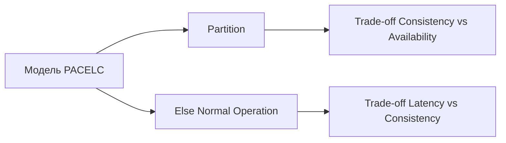
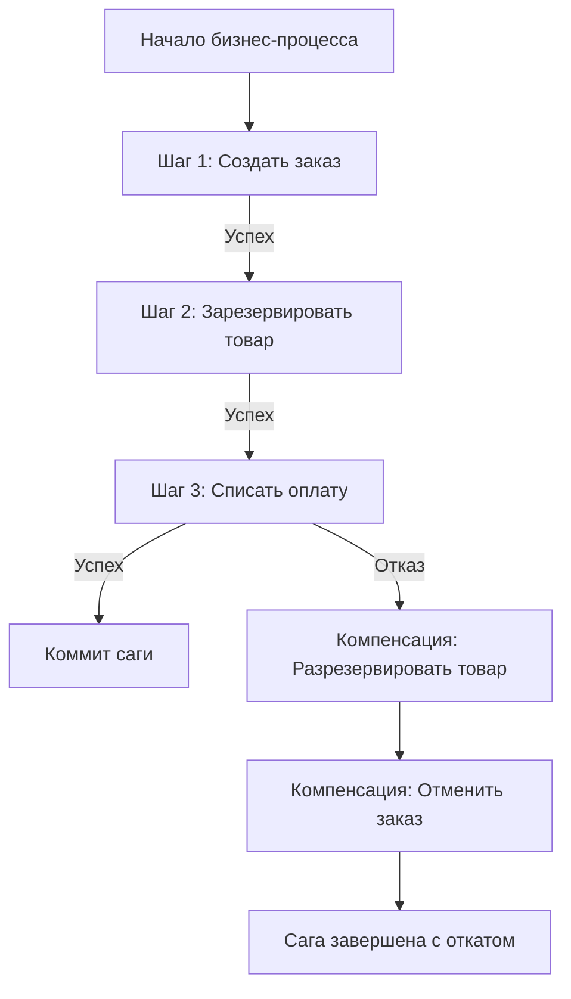

## Введение: Фундаментальная проблема распределенного состояния

В монолитной архитектуре согласованность данных гарантируется локальной транзакцией СУБД (свойства ACID). Когда система разбивается на микросервисы, каждый из которых владеет собственной базой данных, транзакции перестают быть атомарными на уровне всего бизнес-процесса. Сетевой вызов между сервисами может завершиться ошибкой, зависнуть или вернуть частичный результат. В этот момент распределенное состояние переходит в неконсистентный режим.

Для инженера уровня Senior/Lead обеспечение согласованности в микросервисах — это не выбор библиотеки, а архитектурная дисциплина, требующая явного моделирования отказов, понимания сетевой физики и проектирования компенсирующих механизмов. Попытка скрыть распределенную природу системы за «магическими» фреймворками всегда заканчивается тихим разрушением данных под реальной нагрузкой.

В этой статье мы разберем:
*   Теоретические ограничения распределенных систем: от CAP до современной модели PACELC.
*   Механику работы сетевых вызовов в рантайме Go: как `netpoll`, `epoll` и парковка горутин влияют на таймауты и ретраи.
*   Паттерны обеспечения согласованности: почему 2PC (Two-Phase Commit) не подходит для веба, и как Saga заменила его в облачных архитектурах.
*   Идиоматичную реализацию оркестратора Saga в Go с сохранением состояния, обработкой частичных отказов и компенсациями.
*   Стратегии идемпотентности и дедупликации как единственный путь к детерминированному поведению.
*   Типичные ловушки, антипаттерны и каверзные вопросы с хардовых собеседований.

> [!info] Под капотом
> Распределенная согласованность упирается в отсутствие глобальных часов и гарантированную задержку передачи информации между узлами. Любая попытка синхронизировать состояние через сеть требует как минимум одного дополнительного раунд-трипа (RTT). В Go это означает, что горутина переходит в состояние `waiting`, паркуется планировщиком, а системный тред возвращается в пул для выполнения другой работы. Цена ожидания измеряется не только латентностью, но и аллокациями буферов под контекст запроса, которые создают давление на Garbage Collector при масштабировании ретраев.

## Теоретический фундамент: CAP, PACELC и переход к BASE

Классическая теорема CAP утверждает, что распределенная система может гарантировать одновременно только два из трех свойств:
*   **Consistency (Согласованность):** Все узлы видят одни и те же данные в один момент времени.
*   **Availability (Доступность):** Каждый запрос получает ответ, успешный или ошибочный.
*   **Partition Tolerance (Устойчивость к разделению):** Система продолжает работать при потере связи между узлами.

В современных облачных средах сетевые разделения неизбежны (`P` гарантированно присутствует). Выбор сводится к `C` или `A`. Большинство высоконагруженных бэкендов выбирают `AP` или ослабленную согласованность `BASE` (Basically Available, Soft state, Eventual consistency).



> [!tip] Собеседование
> **Вопрос:** Почему модель CAP упрощена и что такое PACELC?
> **Ответ:** CAP рассматривает только сценарий сетевого разделения. В штатном режиме (без разделения) система сталкивается с другим выбором: **задержка (Latency)** или **согласованность (Consistency)**. Модель PACELC формализует это: `If Partition, trade Consistency vs Availability; Else, trade Latency vs Consistency`. Для микросервисов на Go это означает, что даже при стабильной сети вы часто выбираете синхронные вызовы (высокая задержка, строгая согласованность) или асинхронные события (низкая задержка, итоговая согласованность).

## Под капотом: Сетевые вызовы, netpoll и цена ожидания в рантайме Go

Когда оркестратор Saga вызывает внешний сервис через HTTP/gRPC, в рантайме Go происходит сложная цепочка событий:

1.  **Системный вызов:** Горутина вызывает `read()` или `write()` на сокете.
2.  **Переход в netpoll:** Если данные не готовы (например, ожидание ответа от удаленного сервиса), драйвер `net` регистрирует файловый дескриптор в `epoll` (Linux) или `kqueue` (macOS).
3.  **Парковка горутины:** Планировщик (`runtime.scheduler`) меняет состояние горутины на `waiting`, снимает её с `M` (системного треда) и ставит в очередь ожидания `pollDesc`. Тред `M` освобождается для других горутин.
4.  **Пробуждение:** Когда `epoll` сигнализирует о готовности данных, рантайм перемещает горутину обратно в глобальную или локальную очередь (`runq`), и она продолжает выполнение с того же места.

> [!info] Под капотом
> **Влияние на GC и аллокации при ретраях**
> При сетевых ошибках (таймаут, `connection reset`, `503`) Go-приложение обычно выполняет повторные попытки (retry). Каждый ретрай создает:
> *   Новый объект `http.Request` / gRPC metadata.
> *   Буферы для сериализации тела запроса.
> *   Таймерные объекты для `context.WithTimeout` или exponential backoff.
> При интенсивных ретраях (например, во время каскадного отказа зависимого сервиса) это создает **волновой эффект аллокаций**. Миллионы короткоживущих объектов заполняют `Generation 0` кучи, заставляя GC работать чаще и потреблять больше CPU. В тяжелых случаях это приводит к `GC CPU throttle` и деградации всей ноды.
> **Защита:** Используйте circuit breakers, ограничивайте количество одновременных ретраев, применяйте `sync.Pool` для переиспользования структур запросов.

## Паттерны согласованности: Почему 2PC умер, а Saga стала стандартом

### Two-Phase Commit (2PC)
Координатор запрашивает у всех участников готовность (`Prepare`), затем рассылает `Commit` или `Rollback`.
*   **Минусы для веба:** Блокирующий протокол, единая точка отказа (координатор), долгое удержание блокировок в БД, несовместимость с микросервисной автономией.
*   **Где используется:** Внутри одной СУБД, в распределенных транзакциях банковских ядер с аппаратными HSM, но не в HTTP-микросервисах.

### Saga
Длинная транзакция разбивается на последовательность локальных транзакций. После каждого шага публикуется событие. При отказе любого шага запускаются **компенсирующие транзакции** в обратном порядке.
*   **Плюсы:** Не блокирует ресурсы, поддерживает автономность сервисов, работает поверх асинхронных шин, естественно ложится на Go-конкурентность.
*   **Минусы:** Сложность проектирования компенсаций, eventual consistency, необходимость сохранения состояния саги.



> [!warning] Ловушка / Gotcha
> **Компенсация != Откат транзакции БД**
> Компенсирующая транзакция — это новая бизнес-операция, которая семантически обращает изменения, но не использует `ROLLBACK`. Например, если при оплате товар уже физически отгружен со склада, компенсация `Вернуть товар на склад` может быть невозможна. В этом случае сага переходит в состояние `Manual Intervention` или требует асинхронного арбитражного процесса. Проектируйте компенсации так, чтобы они были идемпотентными и учитывали внешние состояния.

## Идиоматичная реализация оркестратора Saga в Go

Оркестратор управляет последовательностью шагов, сохраняет промежуточное состояние и вызывает компенсации при ошибках. Ниже приведен минимальный, но производственный паттерн.

```go
package saga

import (
	"context"
	"errors"
	"fmt"
	"log"
	"sync"
)

// StepFn функция шага саги. Должна быть идемпотентной.
type StepFn func(ctx context.Context) error

// CompensateFn функция компенсации шага.
type CompensateFn func(ctx context.Context) error

// Step описание шага в саге
type Step struct {
	Name        string
	Execute     StepFn
	Compensate  CompensateFn
}

// Orchestrator управляет выполнением распределенной саги
type Orchestrator struct {
	steps []Step
	mu    sync.Mutex
	// В продакшене здесь будет репозиторий для персистентного хранения
	// состояния саги (SagaState), чтобы восстанавливаться после рестарта пода.
}

func NewOrchestrator(steps []Step) *Orchestrator {
	return &Orchestrator{steps: steps}
}

// Execute запускает сагу. Блокирующий метод.
func (o *Orchestrator) Execute(ctx context.Context) error {
	completed := 0
	defer func() {
		// Если сага прервалась, запускаем компенсации в обратном порядке
		for i := completed - 1; i >= 0; i-- {
			step := o.steps[i]
			if step.Compensate != nil {
				if err := step.Compensate(ctx); err != nil {
					log.Printf("WARN: compensation for step %s failed: %v", step.Name, err)
					// В реальном коде: публикация события в Dead Letter Queue или алерт
				}
			}
		}
	}()

	for i, step := range o.steps {
		select {
		case <-ctx.Done():
			return fmt.Errorf("saga canceled at step %d: %w", i, ctx.Err())
		default:
		}

		if err := step.Execute(ctx); err != nil {
			return fmt.Errorf("saga failed at step %s: %w", step.Name, err)
		}
		completed = i + 1
	}
	return nil
}
```

> [!info] Под капотом
> **Почему состояние саги нужно хранить в БД**
> В приведенном примере состояние хранится в переменной `completed`. При рестарте пода или падении процесса сага будет потеряна, а компенсации не вызовутся, что приведет к несогласованности данных. В продакшене оркестратор должен записывать `current_step_index` и `status` в надежное хранилище **перед** выполнением каждого шага, используя `INSERT ... ON CONFLICT DO UPDATE` или транзакцию с `SELECT FOR UPDATE`. Это позволяет при перезапуске безопасно продолжить выполнение с места отказа или запустить компенсации.

## Идемпотентность: Единственный способ гарантировать корректность

В распределенных системах вы никогда не узнаете, дошел ли ответ до клиента, был ли таймаут вызван сетью или сервером, и сколько раз брокер доставил сообщение. Единственная защита — **идемпотентность**.

### Реализация идемпотентных шагов в Go
```go
func (s *PaymentService) Charge(ctx context.Context, orderID string, amount float64) error {
	// Проверка по идемпотентному ключу внутри транзакции
	query := `
		INSERT INTO idempotency_keys (key, status, created_at)
		VALUES ($1, 'processing', NOW())
		ON CONFLICT (key) DO NOTHING
	`
	res, err := s.db.ExecContext(ctx, query, orderID)
	if err != nil {
		return fmt.Errorf("create idempotency record: %w", err)
	}
	rowsAffected, _ := res.RowsAffected()
	if rowsAffected == 0 {
		// Ключ уже существует. Проверяем статус прошлой операции
		var status string
		_ = s.db.QueryRowContext(ctx, "SELECT status FROM idempotency_keys WHERE key=$1", orderID).Scan(&status)
		if status == 'success' {
			return nil // Уже выполнено, возвращаем успех
		}
		return errors.New("operation in progress or failed")
	}

	// ... бизнес-логика списания ...

	// Фиксация успешного выполнения
	_, err = s.db.ExecContext(ctx, "UPDATE idempotency_keys SET status='success' WHERE key=$1", orderID)
	return err
}
```

> [!tip] Собеседование
> **Вопрос:** Существует ли exactly-once семантика в распределенных системах?
> **Ответ:** Нет. Это математически доказано для сетей с возможными потерями и дубликатами сообщений (задача двух генералов). На практике используется **at-least-once доставка + идемпотентный потребитель**. Брокер гарантирует, что сообщение доставится хотя бы раз. Потребитель гарантирует, что повторная обработка не изменит конечное состояние. Комбинация этих двух подходов дает эффект, неотличимый от exactly-once для бизнес-логики.

## Ловушки, антипаттерны и вопросы с собеседований

1.  **Отсутствие персистентности состояния оркестратора**
    *   *Проблема:* Сага хранится в памяти. Рестарт деплоя = потерянные компенсации = рассинхрон данных.
    *   *Решение:* Каждая смена шага должна атомарно обновлять запись в `saga_instances` таблице. Используйте `optimistic locking` по версии строки.

2.  **Компенсации не идемпотентны**
    *   *Проблема:* Оркестратор падает после компенсации, перезапускается и вызывает её снова. Происходит двойное списание или удаление сущности.
    *   *Решение:* Компенсации должны проверять состояние целевой сущности перед откатом (`IF status = 'reserved' THEN SET status = 'cancelled'`).

3.  **Игнорирование out-of-order доставки**
    *   *Проблема:* Событие `PaymentRefunded` приходит в оркестратор раньше, чем `PaymentCreated`. Логика ломается.
    *   *Решение:* Используйте `sequence_number` или `causal timestamps`. Игнорируйте события с меньшим номером, чем уже примененный, или используйте компенсирующие корректировки.

4.  **Сравнение с другими языками**
    *   *Java/Spring:* Часто полагаются на фреймворки вроде Axon Framework, Camunda или Spring Cloud Data Flow. Много конфигурации, автоматическое управление состоянием, но скрытый оверхед и сложность отладки.
    *   *C#/.NET:* MassTransit, NServiceBus, Dapr. Интеграция в экосистему, мощные инструменты визуализации процессов.
    *   *Go:* Философия явной инженерии. Вы пишете состояние машины, сохраняете его, вызываете функции. Меньше «магии», больше контроля над памятью, таймаутами и поведением при отказах. Это требует больше строк кода, но дает предсказуемую латентность и упрощает диагностику через `pprof` и трейсы.

5.  **Каскадные ретраи и Retry Storm**
    *   *Проблема:* Сервис `A` падает, оркестратор ретраит. Сервис `B` начинает ждать, таймаутится, ретраит. Вся система входит в состояние `thundering herd`.
    *   *Решение:* Реализуйте exponential backoff с jitter, circuit breakers и лимиты на параллельные вызовы. При массовом отказе сага должна переходить в `pending_retry` и обрабатываться фоновым воркером, а не блокировать HTTP-запрос пользователя.

## Итог

Согласованность данных в микросервисах достигается не синхронными распределенными транзакциями, а проектированием отказоустойчивых асинхронных процессов. Идиоматичный подход в Go строится на явном управлении контекстами, сохранении состояния оркестратора в надежном хранилище, строгой идемпотентности каждого шага и компенсирующих транзакциях для отката. Ключевые принципы для уровня Senior/Lead:
*   Всегда проектируйте шаги и компенсации как идемпотентные операции.
*   Храните состояние саги персистентно; память процесса не является источником истины.
*   Используйте `context.Context` дляPropagation таймаутов и отмены, но не полагайтесь только на него для надежности.
*   Понимайте стоимость ретраев для GC и сетевого стека; защищайте систему circuit breakers.
*   Принимайте eventual consistency как архитектурный факт, а не как баг.

Освоив паттерны согласованности, вы сможете строить устойчивые бизнес-процессы. Но как гарантировать, что событие, запустившее следующий шаг саги, не будет потеряно при локальном сбое БД? В следующей статье мы детально разберем паттерн, который связывает транзакционную запись и публикацию событий в единую атомарную операцию: [[11. Outbox pattern]].