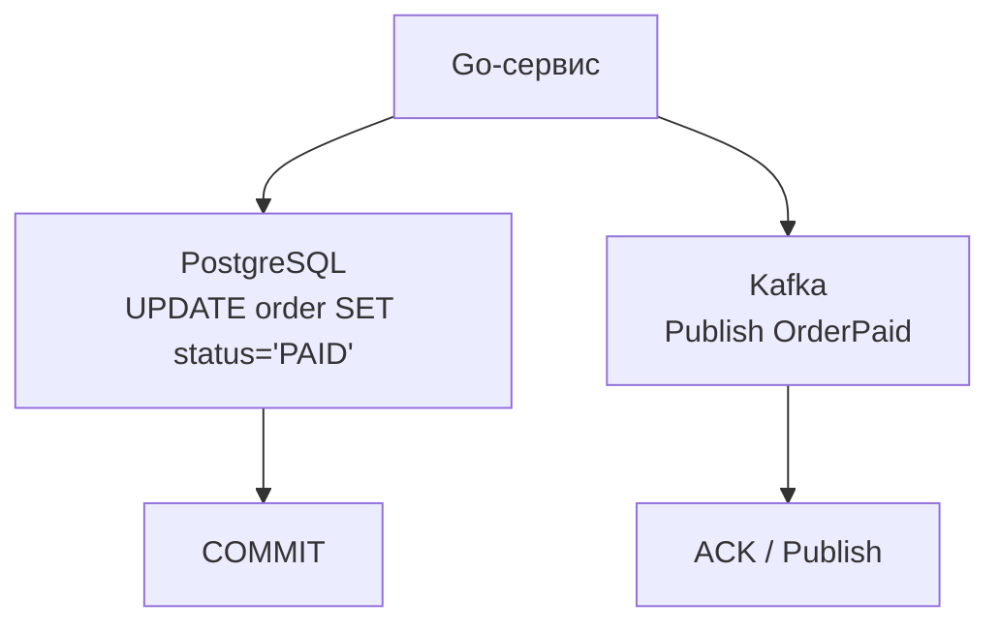
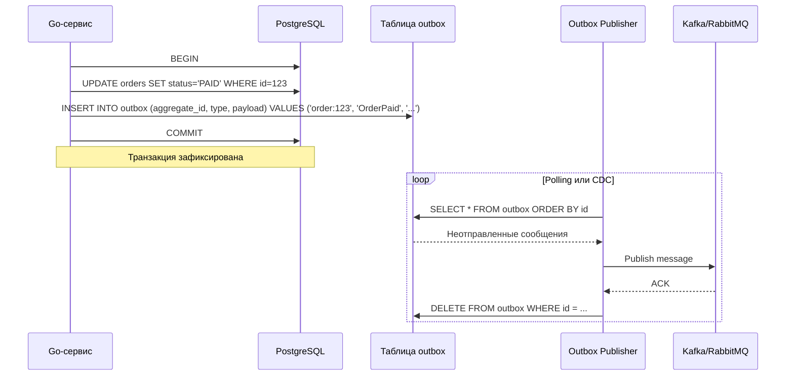

## Введение

Каждый, кто проектировал микросервисную систему, рано или поздно сталкивается с задачей: атомарно обновить базу данных и отправить сообщение в брокер (Kafka, RabbitMQ, NATS). Наивный подход — сначала выполнить `UPDATE` в PostgreSQL, а затем вызвать `Publish` в Kafka. Но что, если после успешной записи в базу сервис упадёт до того, как сообщение ушло в брокер? Система потеряет событие, и смежные сервисы никогда не узнают об изменении. Двойная запись (dual write) без координации — одна из самых опасных ошибок в распределённых системах.

**Outbox Pattern** — это элегантное решение, позволяющее гарантированно доставить событие, не жертвуя атомарностью транзакции в базе данных. Идея проста и гениальна: вместо отправки сообщения напрямую вы записываете его в **специальную таблицу Outbox** внутри той же транзакции, что и бизнес-данные. Отдельный процесс (poller или log reader) читает эту таблицу и публикует сообщения в брокер.

Для Go-инженера Outbox — один из фундаментальных кирпичиков надёжного бэкенда, связывающий воедино реляционную базу и асинхронную шину. В этой статье мы разберём паттерн от идеи до продакшен-имплементации.

## Проблема двойной записи (Dual Write)



Ошибки при dual write:
- Если `COMMIT` прошёл, а брокер ответил ошибкой (или сервис упал), событие потеряно.
- Если брокер отправил, а коммит не прошёл (ошибка БД), получатели увидят несуществующие данные.
- Попытка обернуть оба действия в распределённую транзакцию (2PC) — тяжёлое и часто недоступное решение (см. [[8. Distributed transactions]]).

Outbox решает проблему, делая запись в таблицу сообщений частью локальной ACID-транзакции.

## Как работает Outbox



### Два основных механизма публикации

**1. Polling (опрос таблицы)**
Простой и прозрачный метод: фоновый воркер периодически выполняет `SELECT` из таблицы outbox по записям, которые ещё не отправлены. Отправив в брокер, удаляет запись или помечает как отправленную.

- **Преимущества:** Легко реализовать, работает с любой реляционной БД, не требует дополнительных инструментов.
- **Недостатки:** Постоянная нагрузка на базу (пусть и малая), неизбежная задержка между фиксацией транзакции и отправкой сообщения (типично 100–500 мс при коротком интервале опроса), сложность масштабирования нескольких поллеров (нужно избегать дублирования отправки).

**2. Change Data Capture (CDC) / Transaction Log Tailing**
Использует встроенный механизм репликации БД. В PostgreSQL это логическая репликация (WAL), откуда можно получать поток изменений таблицы outbox через плагины (`pgoutput`, `wal2json`, `test_decoding`). Инструменты: Debezium, Kafka Connect с PostgreSQL source connector.

- **Преимущества:** Практически нулевая задержка (единицы миллисекунд), минимальная нагрузка на базу (чтение WAL — это потоковый обмен), естественная упорядоченность сообщений в порядке коммита.
- **Недостатки:** Требует развёртывания дополнительной инфраструктуры (Debezium, Kafka Connect), настройки репликационных слотов, усложняет эксплуатацию.

> [!info] Под капотом
> При CDC используется `pgoutput` — плагин логической репликации, который читает изменения из WAL (см. [[8. WAL. Write Ahead Log]]) и преобразует их в сообщения. Потребитель (Debezium) подключается через репликационный протокол, создаёт репликационный слот с `RESERVE WAL`, что гарантирует, что WAL-сегменты не удалятся, пока изменения не дойдут до потребителя. С точки зрения Mechanical Sympathy, это последовательное чтение журнала с диска — операция `pread`, не затрагивающая B-Tree индексы и практически не создающая contention с основными транзакциями.

## Реализация на Go: Polling-издатель

Рассмотрим классическую имплементацию с polling, которую можно написать в любом Go-сервисе без внешних зависимостей.

### Схема таблицы outbox

```sql
CREATE TABLE outbox (
    id           BIGSERIAL PRIMARY KEY,
    aggregate_id TEXT        NOT NULL,  -- идентификатор агрегата, например 'order:123'
    event_type   TEXT        NOT NULL,  -- 'OrderPaid', 'UserCreated'
    payload      JSONB       NOT NULL,  -- тело события в JSON
    created_at   TIMESTAMPTZ NOT NULL DEFAULT now()
);
CREATE INDEX ON outbox (id) WHERE deleted_at IS NULL; -- для polling, если используем soft delete
-- или добавим поле sent_at: если NULL — не отправлено.
```

### Запись в outbox внутри бизнес-транзакции

```go
func (s *Service) MarkOrderPaid(ctx context.Context, orderID int64) error {
    tx, err := s.db.BeginTx(ctx, nil)
    if err != nil {
        return fmt.Errorf("begin tx: %w", err)
    }
    defer tx.Rollback()

    _, err = tx.ExecContext(ctx,
        `UPDATE orders SET status = 'PAID' WHERE id = $1`, orderID)
    if err != nil {
        return fmt.Errorf("update order: %w", err)
    }

    event := OrderPaidEvent{OrderID: orderID, PaidAt: time.Now()}
    payload, _ := json.Marshal(event)

    _, err = tx.ExecContext(ctx,
        `INSERT INTO outbox (aggregate_id, event_type, payload)
         VALUES ($1, $2, $3)`,
        fmt.Sprintf("order:%d", orderID), "OrderPaid", payload)
    if err != nil {
        return fmt.Errorf("insert outbox: %w", err)
    }

    if err := tx.Commit(); err != nil {
        return fmt.Errorf("commit: %w", err)
    }
    return nil
}
```

### Polling-издатель

```go
func (p *OutboxPublisher) Run(ctx context.Context) {
    ticker := time.NewTicker(200 * time.Millisecond)
    defer ticker.Stop()
    for {
        select {
        case <-ticker.C:
            p.processBatch(ctx)
        case <-ctx.Done():
            return
        }
    }
}

func (p *OutboxPublisher) processBatch(ctx context.Context) {
    rows, err := p.db.QueryContext(ctx,
        `SELECT id, aggregate_id, event_type, payload
         FROM outbox
         ORDER BY id
         LIMIT 100 FOR UPDATE SKIP LOCKED`) // конкурентный захват
    if err != nil {
        log.Printf("outbox poll error: %v", err)
        return
    }
    defer rows.Close()
    // ... сбор сообщений в слайс
    for _, msg := range messages {
        if err := p.broker.Publish(ctx, msg.EventType, msg.Payload); err != nil {
            log.Printf("publish error: %v", err)
            // здесь нужна стратегия retry или dead letter
            continue
        }
        // Удаление отправленного
        _, err := p.db.ExecContext(ctx, `DELETE FROM outbox WHERE id = $1`, msg.ID)
        if err != nil {
            log.Printf("delete from outbox error: %v", err)
        }
    }
}
```

**Ключевые моменты:**
- `FOR UPDATE SKIP LOCKED` позволяет запускать несколько экземпляров publisher’а, избегая дублирования.
- Удаление после успешной публикации гарантирует at-least-once семантику: если падение после `Publish`, но до `DELETE`, сообщение будет отправлено повторно. Потребитель **обязан** быть идемпотентным (см. [[12. Idempotency и БД]]).
- Batch-обработка (LIMIT 100) амортизирует сетевые обмены. Размер подбирается под throughput.

## Mechanical Sympathy: нагрузка polling vs CDC

**Polling** выполняет `SELECT` каждые N миллисекунд. В терминах ОС это:
- Системный вызов `read`/`write` через TCP: горутина паркуется, передача данных, пробуждение.
- Дисковый ввод-вывод: если outbox таблица не в кэше PostgreSQL, потребуется `pread` для чтения страниц. Даже с пустым outbox’ом запрос `SELECT ... LIMIT 100` может затронуть индекс и страницы heap. При частом опросе это увеличивает статистические счётчики активности, но при индексе на `id` нагрузка минимальна.
- На высоких частотах (10+ опросов в секунду) база начинает тратить заметный процент CPU на обслуживание пустых запросов, особенно в облачных инстансах с лимитированными IOPS.

**CDC** читает WAL: это последовательный поток с диска, аналогичный чтению лог-файла. Ядро ОС предвыбирает блоки, CPU занят лишь распаковкой и сериализацией. Нагрузка на базу на порядки ниже. Однако требуется мониторинг лага репликации: если потребитель отстанет, WAL начнёт расти, что грозит переполнением диска (см. [[8. WAL. Write Ahead Log]]).

> [!tip] Собеседование
> **Вопрос:** Outbox polling или CDC: что выбрать и почему?
> **Ответ:** Если допустима задержка 100-500 мс и нет желания поднимать Debezium/Kafka Connect, выбор — polling. Он прост, легко мониторится и отлаживается. Если критична субсекундная задержка или объём сообщений > 10 000 в секунду, оправдан CDC. На собеседовании Senior-позиции оценят знание обоих подходов и осознание trade-off между эксплуатационной сложностью и latency.

## Гарантии доставки и идемпотентность

Outbox гарантирует **at-least-once** доставку (как минимум один раз). При сбое между отправкой в брокер и удалением/пометкой записи сообщение будет отправлено повторно. Следовательно, потребители обязаны:
- Использовать идемпотентный ключ (например, `aggregate_id` + версия события).
- Реализовать duplicaт detection, храня обработанные ID в своей БД (или используя идемпотентность самого брокера, если он поддерживает).

Без идемпотентности возможны двойные списания средств, дублирующиеся email’ы и прочие катастрофы. Подробнее — [[12. Idempotency и БД]].

## Масштабирование и конкурентные поллеры

Один экземпляр publisher’а может быть узким местом. Можно запустить несколько, но каждый должен независимо читать уникальные записи. `FOR UPDATE SKIP LOCKED` в PostgreSQL решает эту проблему. В MySQL аналогичный механизм — `SKIP LOCKED` с блокировками строк.

Другой подход — партиционирование по хешу от ID и назначение каждому подписчику своего диапазона, но строковый вариант проще и достаточен для большинства.

## Dead Letter Queue и обработка ошибок

Если сообщение не удаётся опубликовать после нескольких попыток (например, брокер недоступен), поллер не может бесконечно держать запись в outbox, так как последующие сообщения будут задерживаться. Обычно заводят колонку `retries` и `next_retry_at`, либо перемещают сообщение в отдельную таблицу dead letter для ручного анализа. Периодически можно повторно обрабатывать dead letter-записи.

## Альтернативы и развитие

- **Transactional Outbox с Debezium** — золотой стандарт для high-throughput систем. Debezium читает WAL напрямую, снижая задержку до единиц миллисекунд и почти не нагружая основную БД. Однако требует эксплуатации Kafka Connect кластера.
- **Outbox без брокера** — в малых системах можно вообще отказаться от брокера, рассылая сообщения прямо из outbox в HTTP-обработчики. Но это связывает сервисы синхронно, нарушая изоляцию.
- **Event Sourcing** — если весь стейт хранится как события, outbox теряет смысл, так как события уже являются первичным источником. Подробнее в [[9. Event sourcing и базы]].

## Итог

Outbox Pattern — это необходимый инструмент в арсенале каждого Go-инженера, строящего микросервисы с гарантией доставки событий. Он использует мощь ACID-транзакций реляционной базы, чтобы разрешить фундаментальное противоречие между стейтом и асинхронным обменом. Реализация polling-издателя на Go проста, но требует внимания к идемпотентности потребителей и обработке ошибок. Для экстремальных нагрузок сообщество движется к CDC-решениям, обеспечивающим минимальную задержку.

Дальнейшее погружение в смежные темы: [[12. Idempotency и БД]] — чтобы ваш потребитель был готов к повторной доставке, [[10. Data consistency в микросервисах]] — для понимания общей картины согласованности данных, и [[9. Event sourcing и базы]] — если вы решите сделать хранение событий основным источником истины.