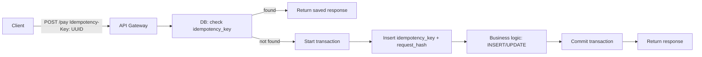

## 1. Что такое идемпотентность (в контексте БД)

**Идемпотентность** — свойство операции: повторный вызов с теми же аргументами даёт тот же результат и не приводит к дополнительным побочным эффектам.

В терминах БД это значит:

- несколько `INSERT/UPDATE/DELETE` с одинаковыми параметрами эквивалентны одному;
- повторная обработка одного и того же сообщения/запроса не ломает данные и бизнес-логику.

В HTTP идемпотентны методы: `GET`, `HEAD`, `PUT`, `DELETE`, `OPTIONS`. Не идемпотентны: `POST`, `PATCH`【turn0search7】. Поэтому именно `POST`/`PATCH`-эндпоинты чаще всего нужно делать идемпотентными вручную.

---

## 2. Где идемпотентность критична для БД

Типовые сценарии:

- **Платежи** — повторный `POST /payments` не должен списывать деньги дважды.
- **Заказы** — повторное создание заказа не должно порождать дубли.
- **Обработка сообщений (Kafka, RabbitMQ)** — брокер может доставить одно сообщение несколько раз; обработчик должен быть идемпотентным【turn0search1】【turn1search3】.
- **Ретраи API** — клиент шлёт один и тот же запрос из-за таймаута/сбоя сети.

В распределённых системах повторы неизбежны; идемпотентность — способ получить **“точно один раз” по эффекту**, даже если запрос/сообщение приходят многократно【turn0search3】【turn0search13】.

---

## 3. Идемпотентность на уровне операций БД

### 3.1. Идемпотентные SQL-операции

Примеры:

- `UPDATE accounts SET balance = balance - 100 WHERE id = 1` — **не идемпотентно**: каждый вызов ещё минус 100.
- `UPDATE accounts SET balance = 900 WHERE id = 1` — **идемпотентно**: повторное выполнение даёт тот же баланс.

Для `INSERT` идемпотентность обычно обеспечивается через:

- уникальные ограничения (unique constraint, первичный ключ);
- upsert-операции (`INSERT … ON CONFLICT … DO UPDATE`, `MERGE`);
- обработку duplicate key error.

---

### 3.2. Использование уникальных ограничений

Паттерн:

1. В таблице бизнес-сущности есть уникальный ключ (например, `order_number`).
2. При `INSERT` ловим нарушение уникальности (duplicate key).
3. При конфликте либо считаем, что «запись уже есть — ок», либо обновляем/возвращаем существующий ID.

Пример (MySQL-стиль):

```sql
INSERT INTO orders (order_number, user_id, amount)
VALUES ('ORD-123', 42, 100.00)
ON DUPLICATE KEY UPDATE order_number = order_number; -- no-op, просто игнорируем повтор
```

Такой подход часто рекомендуют как базовый для идемпотентного создания записей【turn0search10】【turn1search0】.

---

### 3.3. Идемпотентность через транзакции

Для сложных операций (несколько таблиц, внешние сервисы) нужно:

- выполнять все действия **в одной БД-транзакции**;
- внутри транзакции проверять/сохранять идемпотентный ключ (см. ниже);
- при ошибке — откат транзакции, чтобы не оставить “следов” частичной обработки.

---

## 4. Паттерн Idempotency Key и таблица запросов

### 4.1. Общая идея

Клиент генерирует **idempotency key** (например, UUID) и шлёт его с запросом. Сервер:

1. Проверяет, был ли уже такой ключ.
2. Если да — возвращает закэшированный ответ.
3. Если нет — выполняет операцию, сохраняет ключ и результат.

Так делают, например, Stripe: клиент шлёт `Idempotency-Key`, а сервер хранит ключ и параметры запроса, чтобы при повторе вернуть тот же ответ【turn1search12】【turn1search13】.

---

### 4.2. Архитектура с БД

Типовая схема:



**Таблица идемпотентности** (пример структуры):

```sql
CREATE TABLE idempotency_keys (
  id            BIGSERIAL PRIMARY KEY,
  key           VARCHAR(255) NOT NULL UNIQUE,
  user_id       BIGINT NOT NULL,
  request_hash  VARCHAR(64) NOT NULL,     -- хеш от значимых параметров
  response      JSONB,                    -- кэшированный ответ
  created_at    TIMESTAMPTZ NOT NULL,
  expires_at    TIMESTAMPTZ               -- опциональный TTL
);
```

Ключевые моменты:

- `key` уникален — повторный INSERT упадёт с duplicate key, что мы и ловим.
- `request_hash` позволяет проверить, что параметры запроса совпадают с исходными (как у Stripe【turn1search12】).
- `response` можно сохранять, чтобы при повторе вернуть тот же ответ, а не выполнять логику снова.

---

### 4.3. Конкурентные запросы с одним ключом

Если два запроса с одним `Idempotency-Key` приходят одновременно:

1. Первый INSERT в `idempotency_keys` проходит.
2. Второй получает duplicate key violation — значит, запрос уже обрабатывается или обработан.
3. В этом случае либо ждём завершения первой обработки и возвращаем её результат, либо сразу отдаём «in-progress»/ошибку.

Важно: **INSERT ключа + бизнес-операция должны быть в одной транзакции** или как минимум атомарны (чтобы между ними не вклинился другой запрос). Об этом часто пишут в разборах идемпотентности на Spring Boot + MySQL【turn0search13】【turn0search16】.

---

## 5. Idempotent Consumer (сообщения, Kafka, RabbitMQ)

Для асинхронной обработки есть паттерн **Idempotent Consumer**【turn1search3】【turn1search4】:

- В таблице `processed_messages` (или `inbox`) храним уникальные идентификаторы сообщений.
- Внутри одной транзакции:
  - вставляем `message_id` в `processed_messages`;
  - обновляем бизнес-таблицы.
- Уникальный индекс по `message_id` гарантирует, что дубликаты не пройдут.

Пример:

```sql
CREATE TABLE processed_messages (
  message_id    VARCHAR(255) PRIMARY KEY,
  processed_at  TIMESTAMPTZ NOT NULL
);
```

Обработчик:

```sql
BEGIN;
  INSERT INTO processed_messages (message_id, processed_at)
  VALUES ('msg-123', now());
  -- бизнес-логика: update accounts, create orders и т.д.
COMMIT;
```

При повторной доставке того же `message_id` INSERT упадёт по duplicate key → транзакция откатится → дубликат не обработается.

---

## 6. Практические рекомендации по проектированию

### 6.1. Когда идемпотентность важна

- Любые **финансовые операции**.
- Операции с **внешними side-эффектами** (отправка email, SMS, push, вызов внешнего API).
- Создание ресурсов, где дубли недопустимы (пользователи, заказы, платежи).
- Обработка сообщений из брокеров, где возможны дубли【turn0search1】【turn1search3】.

### 6.2. Как проектировать API и БД

1. **Вводите Idempotency-Key для всех критичных POST-запросов**:
   - генерация на клиенте (UUID);
   - хранение в БД с уникальным ограничением;
   - проверка и кэширование ответа.

2. **Ставьте уникальные constraints на естественные ключи**:
   - `order_number`, `transaction_id`, `external_ref` и т.п.
   - это «первый рубеж» идемпотентности на уровне данных.

3. **Используйте upsert-операции**:
   - `INSERT … ON CONFLICT … DO UPDATE` (PostgreSQL, MySQL);
   - `MERGE` (Oracle, MS SQL).

4. **Все шаги, связанные с идемпотентностью, — в одну транзакцию**:
   - вставка idempotency key / message_id;
   - бизнес-изменения;
   - коммит.

5. **Опционально — TTL для ключей идемпотентности**:
   - ключи можно чистить через N часов/дней (как Stripe советует 24 часа【turn1search12】).

---

## 7. Пример: идемпотентное создание заказа (PostgreSQL)

Условие:

- заказы уникальны по `order_number`;
- клиент шлёт `Idempotency-Key`.

Таблицы:

```sql
CREATE TABLE orders (
  id           BIGSERIAL PRIMARY KEY,
  order_number VARCHAR(255) NOT NULL UNIQUE,
  user_id      BIGINT NOT NULL,
  amount       NUMERIC(10,2) NOT NULL,
  created_at   TIMESTAMPTZ NOT NULL
);

CREATE TABLE idempotency_keys (
  id            BIGSERIAL PRIMARY KEY,
  key           VARCHAR(255) NOT NULL UNIQUE,
  order_id      BIGINT,
  request_hash  VARCHAR(64),
  response      JSONB,
  created_at    TIMESTAMPTZ NOT NULL,
  expires_at    TIMESTAMPTZ
);
```

Псевдокод обработки (на уровне приложения):

```sql
BEGIN;

  -- 1. Проверяем/сохраняем idempotency key
  INSERT INTO idempotency_keys (key, request_hash, created_at)
  VALUES ('uuid-...', 'hash-of-body', now())
  RETURNING id INTO _key_id;

  -- 2. Создаём заказ
  INSERT INTO orders (order_number, user_id, amount, created_at)
  VALUES ('ORD-123', 42, 100.00, now())
  RETURNING id INTO _order_id;

  -- 3. Связываем ключ с заказом, сохраняем ответ
  UPDATE idempotency_keys
  SET order_id = _order_id,
      response = jsonb_build_object('order_id', _order_id, 'status', 'created')
  WHERE id = _key_id;

COMMIT;
```

При повторном запросе:

- INSERT в `idempotency_keys` падает по duplicate key;
- по ключу находим `response` и возвращаем клиенту.

---

## 8. Связь с CAP и распределёнными системами

В распределённых системах идемпотентность — один из ключевых инструментов борьбы с:

- сетевыми таймаутами и ретраями;
- дублирующей доставкой сообщений;
- сбоями и перезапусками сервисов【turn0search3】【turn0search13】.

Идемпотентность не даёт “бесплатно” согласованность (C в CAP), но позволяет:

- безопасно ретраить операции;
- проектировать системы, где **по эффекту** каждый запрос выполняется ровно один раз.
