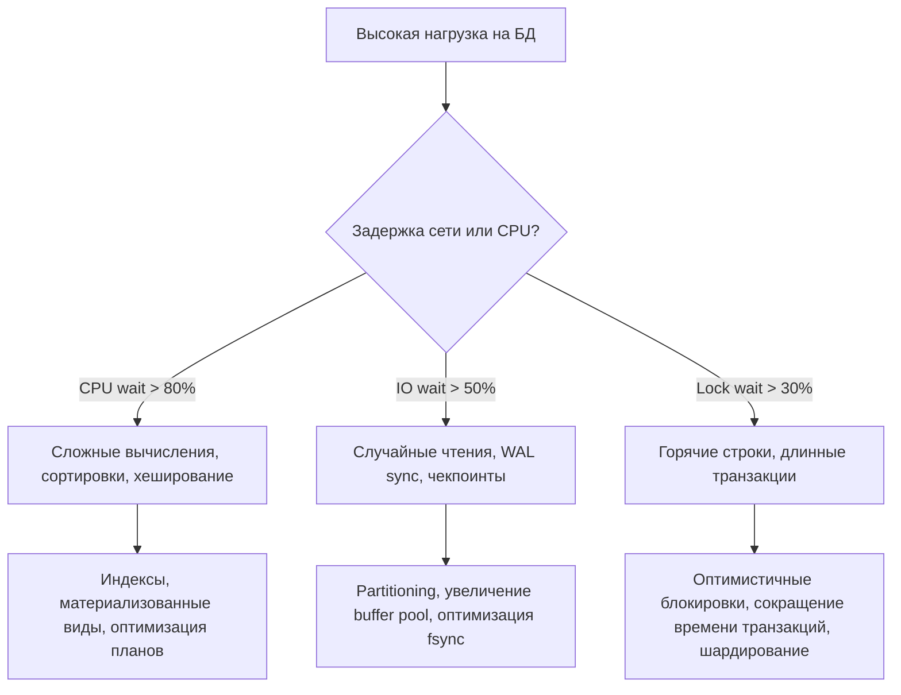

## Введение: Масштабирование как инженерная дисциплина

Термин «Highload» в контексте баз данных часто размывается маркетингом, но для инженера это конкретная метрическая реальность: система обрабатывает от десятков тысяч до миллионов операций в секунду с гарантированной латентностью (обычно `p99 < 50 мс`) и доступностью `99.99%`. При таких нагрузках база данных перестает быть «просто хранилищем» и становится главным ограничителем пропускной способности. Бросить больше CPU или RAM — не решение. Решение — это глубокое понимание узких мест, архитектурное разделение потоков и осознанное управление ресурсами ОС и рантайма.

В этой статье мы разберем:
*   Фундаментальные узкие места высоконагруженных СУБД: I/O, CPU, сеть, блокировки и их проявление в метриках ОС.
*   Архитектурные стратегии масштабирования: репликация, шардирование, пулеры соединений и маршрутизация.
*   Внутреннюю механику обработки тысяч соединений в PostgreSQL и MySQL, и как это влияет на настройки `database/sql` в Go.
*   Идиоматичные паттерны работы с данными под нагрузкой: стриминг, батчинг, избегание GC-давления и управление контекстами.
*   Механику диска и памяти: WAL, чекпоинты, вытеснение страниц из `shared_buffers` и влияние на CPU-кэши.
*   Типичные ловушки, антипаттерны и вопросы с хардовых собеседований.

> [!info] Под капотом
> Высоконагруженная СУБД — это в первую очередь задача управления вводом-выводом. Современные NVMe-диски способны обрабатывать сотни тысяч IOPS, но случайные `4KB` чтения из-за фрагментации индексов или горячих страниц всё равно упираются в задержки контроллера и планировщика ОС. Понимание того, как запрос превращается в последовательность `pread/pwrite`, `fsync` и операций с Page Cache, отличает инженера, который просто пишет `SELECT`, от архитектора, проектирующего устойчивые к нагрузке контуры.

## 1. Идентификация узких мест: I/O, CPU, сеть и блокировки

Прежде чем масштабировать, необходимо точно определить, что тормозит систему. В высоконагруженном контуре всегда доминирует один из четырех факторов.



*   **Диск (Disk I/O):** Проявляется через высокий `iowait`, рост `pg_stat_database.blks_read`. Причина: случайные чтения из-за отсутствия покрывающих индексов, частые чекпоинты, WAL-лаги, разрастание таблиц (bloat).
*   **CPU:** Высокая загрузка ядер при низкой `iowait`. Причина: сложные `JOIN`, `ORDER BY` без индексов, агрессивные вычисления в запросах, избыточная десериализация JSON.
*   **Сеть:** Латентность растет линейно с ростом RPS. Причина: слишком много мелких запросов, отсутствие пайплайнинга, неоптимальный размер TCP-окна, лимиты на файловые дескрипторы.
*   **Блокировки (Locks/Latches):** Резкие скачки латентности при стабильной нагрузке. Причина: `hot rows` (частые `UPDATE` одних и тех же строк), длинные транзакции, удерживающие `SHARE`-локи, `latch contention` в буферном пуле СУБД.

> [!warning] Ловушка / Gotcha
> **Симптом: «База тормозит». Реальная причина: пул соединений в Go.**
> Часто проблема не в СУБД, а в клиенте. Если `db.SetMaxOpenConns(200)` на сервере с 400 ядрами, а нагрузка резко выросла, горутины начинают парковаться в очереди пула. В `pprof` это видно как горутинные ливни и рост `runtime.gopark`. СУБД при этом простаивает, потому что не получает новых запросов.
> **Диагностика:** Сравнивайте `db.Stats().InUse` с `db.Stats().WaitDuration`. Если `WaitDuration` растет экспоненциально, а `Active` соединения в БД низкие — масштабируйте пул или оптимизируйте время выполнения запроса.

## 2. Архитектурные стратегии масштабирования

Когда оптимизация запросов и индексов перестает давать результат, применяется архитектурное масштабирование.

### 2.1. Масштабирование чтения: Реплики и маршрутизация
Чтение обычно в 10-100 раз превосходит запись. Вынос `SELECT` на реплики — первый шаг.
*   **Асинхронная репликация:** Быстро, но допускает лаг. Клиент может не увидеть только что записанные данные.
*   **Синхронная репликация:** Гарантирует консистентность, но увеличивает латентность записи на 1 RTT до самой удаленной реплики.
*   **Маршрутизация в Go:** Используйте прокси (`PgBouncer`, `HAProxy`, `ProxySQL`) или реализуйте логику в приложении через `sql.Open` для нескольких `*sql.DB` (один для записи, другие для чтения). В высоконагруженных системах внешние пулеры предпочтительнее встроенных, так как они экономят память и CPU на стороне приложения.

### 2.2. Масштабирование записи: Шардирование и партиционирование
*   **Партиционирование (Partitioning):** Деление одной большой таблицы на сегменты по диапазону (даты) или хэшу. Уменьшает размер B-Деревьев, повышает `cache hit ratio`, ускоряет `VACUUM` и удаление старых данных (`DROP PARTITION` мгновенно освобождает место).
*   **Шардирование (Sharding):** Распределение данных по разным физическим серверам. Требует маршрутизации на уровне приложения или специализированного прокси (Vitess, Citus). Сложно в поддержке (кросс-шардовые `JOIN`, транзакции), но дает линейное масштабирование записи.

> [!tip] Собеседование
> **Вопрос:** Когда шардирование оправдано, а когда это антипаттерн?
> **Ответ:** Шардирование оправдано, когда один физический узел упирается в лимиты дисковой записи (WAL/IO) или CPU, и вертикальное масштабирование/репликация не помогают. Это антипаттерн, если его применяют «на будущее» или для таблиц < 50 ГБ. Шардирование резко усложняет операции: бэкапы, миграции, аналитические запросы, транзакции. Сначала используйте партиционирование, оптимизацию индексов и выгрузку исторических данных в холодные хранилища (ClickHouse, S3).

## 3. Под капотом: Модель соединений в СУБД и Go

Понимание того, как ОС и рантайм управляют соединениями, критично для предотвращения `connection storm`.

### 3.1. Процессная модель против Потоковой
*   **PostgreSQL:** Один клиент = один ОС-процесс. Каждый процесс потребляет ~5-10 МБ RSS + кэш `shared_buffers`. При `max_connections = 1000` СУБД резервирует гигабайты памяти только на контексты процессов. Это делает PG чувствительным к высокому количеству одновременных соединений.
*   **MySQL (InnoDB):** Потоковая модель. Один поток на соединение. Легче для памяти, но при высокой конкуренции возникает `mutex contention` на уровне `buffer pool latches`.

### 3.2. Взаимодействие с рантаймом Go
Пакет `database/sql` создает пул, который маппируется на системные сокеты. При каждом `Query` происходит:
1.  Выдача соединения из пула (захват `db.mu`).
2.  Отправка запроса через `write()` (syscalls).
3.  Парковка горутины в `netpoll` (ожидание ответа).
4.  Пробуждение, чтение через `read()`, десериализация.

При `N` одновременных запросах к БД, `N` горутин парктуются. Это эффективно, но создает давление на `epoll` ядра и аллокации буферов. Если `N > max_connections` СУБД, запросы блокируются на клиенте, что может привести к `OOM Killer` из-за накопления горутин и их стеков в памяти.

> [!info] Под капотом
> **PgBouncer в режиме `transaction`**
> Для высоконагруженных Go-сервисов рекомендуется ставить пулер перед БД. `PgBouncer` держит пул из 20-50 реальных соединений к PostgreSQL и мультиплексирует тысячи клиентских запросов. При завершении транзакции соединение мгновенно возвращается в пул. Это позволяет настроить `db.SetMaxOpenConns(1000+)` в Go, не перегружая СУБД процессами. Важно: в этом режиме запрещены подготовленные выражения (`PREPARE`) и сессионные переменные, так как соединение меняется после каждого запроса.

## 4. Идиоматичная оптимизация в Go под нагрузку

Код на Go, работающий с высоконагруженной БД, должен минимизировать аллокации, сетевые раунд-трипы и время удержания соединений.

### 4.1. Стриминг больших выборок
Никогда не загружайте миллионы строк в память. Используйте `rows.Next()` итеративно или `pgx` для прямого чтения.

```go
func ProcessLargeDataset(ctx context.Context, db *sql.DB, batchSize int) error {
	rows, err := db.QueryContext(ctx, "SELECT id, payload FROM events ORDER BY created_at ASC")
	if err != nil {
		return fmt.Errorf("query failed: %w", err)
	}
	defer rows.Close() // Гарантированное освобождение соединения

	var id int64
	var payload []byte
	
	// Обработка пакетами для снижения аллокаций и давления на GC
	batch := make([]Event, 0, batchSize)
	
	for rows.Next() {
		if err := rows.Scan(&id, &payload); err != nil {
			return fmt.Errorf("scan failed: %w", err)
		}
		batch = append(batch, Event{ID: id, Payload: payload})
		
		if len(batch) >= batchSize {
			if err := ProcessBatch(ctx, batch); err != nil {
				return err
			}
			batch = batch[:0] // Переиспользование слайса
		}
		
		// Проверка контекста на каждом шаге для быстрого прерывания
		select {
		case <-ctx.Done():
			return ctx.Err()
		default:
		}
	}
	return rows.Err()
}
```

### 4.2. Пакетная вставка и транзакции
Одиночные `INSERT` генерируют избыточный WAL и сетевой трафик. Группируйте операции.

```go
func BatchInsert(ctx context.Context, db *sql.DB, items []Item) error {
	const chunkSize = 1000
	for i := 0; i < len(items); i += chunkSize {
		end := i + chunkSize
		if end > len(items) {
			end = len(items)
		}
		chunk := items[i:end]
		
		tx, err := db.BeginTx(ctx, nil)
		if err != nil {
			return err
		}
		
		stmt, err := tx.PrepareContext(ctx, `
			INSERT INTO logs (ts, level, message) VALUES ($1, $2, $3)
		`)
		if err != nil {
			tx.Rollback()
			return err
		}
		
		for _, item := range chunk {
			if _, err := stmt.ExecContext(ctx, item.Timestamp, item.Level, item.Message); err != nil {
				stmt.Close()
				tx.Rollback()
				return err
			}
		}
		
		stmt.Close()
		if err := tx.Commit(); err != nil {
			return err
		}
	}
	return nil
}
```

> [!info] Под капотом
> При `ExecContext` внутри транзакции драйвер отправляет команды в одном сетевом пакете или пайплайне. СУБД буферизует изменения в `shared_buffers`, записывает их в WAL последовательно и применяет `fsync` только при `COMMIT`. Это снижает количество `fsync` с `N` до `1` на чанк, кардинально уменьшая I/O-нагрузку на диск.

## 5. Механика диска и памяти под высокой нагрузкой

Настройка СУБД и ОС под highload требует понимания того, как данные перемещаются по иерархии памяти.

### 5.1. WAL и Checkpointing
Каждый `COMMIT` в PostgreSQL записывает данные в WAL и ждет `fsync`. Если чекпоинты (`checkpoint_timeout`) срабатывают слишком часто, система начинает массово сбрасывать `dirty pages` на диск, создавая I/O-штормы и задержки.
*   **Оптимизация:** Увеличьте `max_wal_size` (до 2-4 ГБ для highload), настройте `checkpoint_completion_target = 0.9` (распределение записи во времени). Это снижает пиковую нагрузку на диск, но требует больше места на SSD.

### 5.2. Вытеснение страниц и CPU Cache
Индексы в СУБД хранятся в B-Tree. При высокой нагрузке «горячие» страницы индексов держатся в `shared_buffers`. Однако если рабочая выборка превышает объем RAM, начинается вытеснение (`cache churn`).
*   **Влияние на CPU:** Каждая подгруженная с диска страница проходит через Page Cache ОС, копируется в пользовательское пространство, попадает в кучу Go, десериализуется. Это создает случайные обращения к RAM, вызывая `L1/L2 cache miss`. CPU простаивает в ожидании данных (`memory stall`).
*   **Решение:** Сужайте индексы (покрывающие), партиционируйте данные по времени, используйте SSD с низким временем доступа, применяйте `pg_prewarm` для критичных таблиц после перезапуска.

> [!warning] Ловушка / Gotcha
> **UUIDv4 как первичный ключ**
> Генерация случайного UUID для `id` приводит к фрагментации B-Tree. Новые строки вставляются в случайные страницы, что уничтожает локальность данных, снижает эффективность префетчинга и увеличивает I/O. В highload-системах используйте `UUIDv7` (временной, монотонный) или `BIGINT` с последовательностью. Это превращает вставку в последовательный `APPEND`, максимизируя использование кэш-линий CPU и пропускную способность диска.

## 6. Типичные ловушки и вопросы с собеседований

1.  **N+1 под высокой нагрузкой**
    *   *Проблема:* 1000 запросов генерируют 50 000 мелких `SELECT`. Пул соединений исчерпан, БД уходит в своп.
    *   *Решение:* Используйте `JOIN`, `IN (list)` с батчингом или графовую выборку. Профилируйте запросы через `pg_stat_statements`.

2.  **Длинные транзакции и репликационный лаг**
    *   *Проблема:* Транзакция открыта 30 минут. PostgreSQL не может `VACUUM` строки, которые она видит, таблица раздувается. Реплики отстают, пока транзакция не завершится.
    *   *Решение:* Строгие таймауты на уровне сессии (`statement_timeout`, `idle_in_transaction_session_timeout`), разбиение логики на короткие шаги, асинхронная обработка тяжелых операций через очередь.

3.  **Игнорирование prepared statement cache**
    *   *Проблема:* При каждом запросе драйвер отправляет `Parse`, `Bind`, `Execute`. Для идентичных запросов это 3 RTT вместо 1.
    *   *Решение:* Используйте `db.PrepareContext` или `pgxpool` с автоматическим кэшированием. В `database/sql` подготовленные выражения привязаны к конкретному соединению, поэтому в пуле их кэширование менее эффективно, чем в `pgx`, но всё равно даёт выигрыш на частых запросах.

4.  **Сравнение с другими языками**
    *   *Java:* Использует пул соединений (HikariCP) на уровне приложения. Потоки ОС дорогие, поэтому пул ограничивается (~50-100). Высокая нагрузка требует асинхронных драйверов (R2DBC), которые сложнее в отладке.
    *   *PHP:* Stateless модель. Каждое соединение создается заново. Высокая нагрузка обрабатывается только через внешние пулеры (PgBouncer) и кэширование.
    *   *Go:* Горутины дешевые. Приложение может держать тысячи активных соединений в пуле, но лимитом становится `max_connections` СУБД. Преимущество: нативный `netpoll` позволяет обрабатывать ожидание БД с минимальным оверхедом памяти. Главный риск: «съесть» память кучи при неаккуратной обработке больших `rows`.

> [!tip] Собеседование
> **Вопрос:** Как диагностировать и исправить ситуацию, когда p99 латентность запросов к БД выросла с 10 мс до 500 мс, но CPU и Disk I/O в норме?
> **Ответ:** Это классический признак `lock contention` или `latch contention`. 
> 1. Проверить `pg_stat_activity` на наличие `waiting` сессий с типом `Lock` или `LWLock`.
> 2. Проверить `pg_locks` на наличие блокировок таблицы или строк.
> 3. Проанализировать план запроса: возможен `Index Scan` с переходом на `Heap Fetch` из-за раздутия (`bloat`).
> 4. Исправить: оптимизировать порядок индексов, сократить время транзакций, применить `VACUUM`, пересмотреть горячие ключи. Если проблема в Go — проверить блокировки мьютексов в коде перед отправкой запроса, которые держат соединение пула.

## Итог

Высоконагруженные базы данных — это баланс между архитектурой, настройками СУБД и идиоматичным кодом на клиенте. Ключевые принципы для уровня Senior/Lead:
*   Масштабируйте архитектуру, а не железо: репликация для чтения, партиционирование для истории, шардирование только при реальной необходимости.
*   Управляйте пулами соединений осознанно: используйте внешние пулеры (PgBouncer) для процессных СУБД.
*   Пишите код, который стримит, а не загружает: итеративная обработка, батчинг, строгие контекстные таймауты.
*   Оптимизируйте под железо: используйте монотонные ключи (UUIDv7), избегайте случайных вставок, настройте чекпоинты под I/O-профиль диска.
*   Измеряйте всё: `pg_stat_statements`, `EXPLAIN ANALYZE`, метрики пула Go, `iostat`, `vmstat`. Интуиция не заменяет цифры.

Освоив принципы highload, вы сможете удерживать стабильность систем даже при десятикратном росте трафика. Но при шардировании и распределении данных всегда возникает проблема неравномерного распределения нагрузки, когда один узел или сегмент принимает 90% запросов. В следующей статье мы детально разберем эту проблему и стратегии её решения: [[14. Hot partition и skew]].