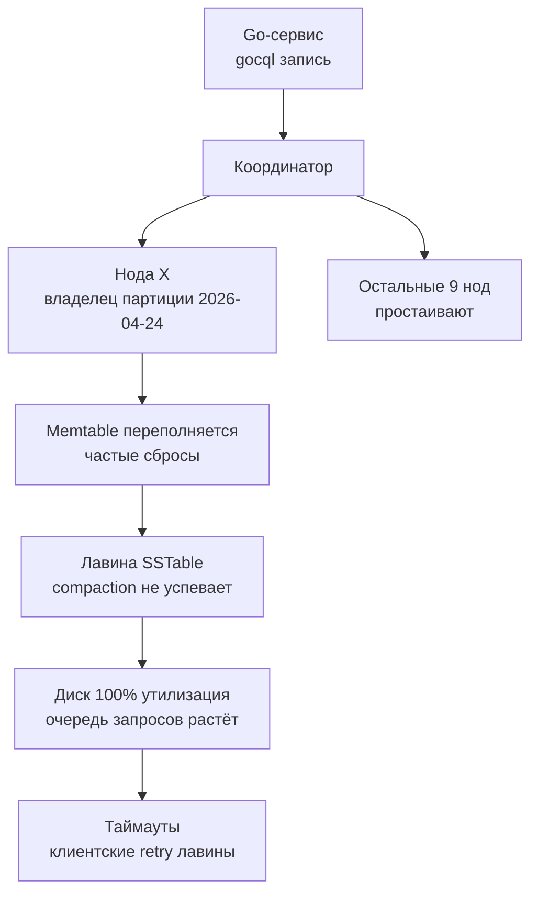

## Введение

В распределённых системах, будь то шардированный PostgreSQL, Cassandra или MongoDB, фундаментальной проблемой остаётся **Hot Partition** — ситуация, когда одна или несколько партиций (шардов) получают непропорционально большую долю трафика, в то время как остальные простаивают. Это явление тесно связано с понятием **Skew** (перекос) — неравномерностью распределения данных или запросов.

Для бэкенд-разработчика на Go, проектирующего сервис с целевой нагрузкой в десятки и сотни тысяч RPS, hot partition — не академическая абстракция, а реальная угроза, способная уронить весь кластер, несмотря на идеально написанный код. В этой статье мы разберём, откуда берётся перекос, как он влияет на железо и как предотвратить катастрофу архитектурными методами.

## Типы перекоса (Skew)

Перекос проявляется в двух основных формах, часто взаимосвязанных.

### Data Skew (перекос данных)
Объём данных, хранимых на разных шардах, существенно различается. Один шард может содержать 500 ГБ, а соседний — 10 ГБ. Это приводит к неравномерному потреблению дискового пространства и усложняет управление ёмкостью. Причины:
- Неудачный ключ шардирования, например, страна «US» против «Люксембург» при шардировании по `country`.
- Естественная неравномерность распределения сущностей (power-law distribution). Классический пример — количество подписчиков у знаменитостей (celebrity problem).

### Workload Skew (перекос нагрузки)
Один шард получает радикально больше запросов чтения/записи, чем остальные. Даже если данные распределены равномерно, «горячий» ключ может собирать 80% трафика. Например, свежая новость в ленте, хештег тренда, товар дня.
Именно **workload skew** — наиболее коварный враг, потому что его трудно предсказать на этапе проектирования.

## Как hot partition разрушает систему: взгляд изнутри

Представьте кластер Cassandra из 10 нод, каждая с SSD NVMe и 64 ГБ RAM. Вся запись идёт в одну партицию, потому что partition key — `event_date`, а сейчас — 2026-04-24. Что происходит физически?



1. **CPU:** Поток, обслуживающий горячую ноду, забит операциями сжатия, сериализации и compaction. Остальные ядра простаивают.
2. **Диск:** Поскольку LSM-дерево под капотом ([[9. Column базы. Cassandra]]), compaction не успевает сливать SSTable, read amplification растёт лавинообразно. SSD упирается в предел IOPS, очередь необработанных запросов `await` в `iostat` взлетает до секунд.
3. **Сеть:** Все клиентские соединения стягиваются к одной ноде, исчерпывая пропускную способность её сетевого интерфейса и переполняя буферы сокетов.
4. **Клиентская сторона (Go-рантайм):** Горутины, пославшие запросы на горячую ноду, зависают в ожидании ответа. Если таймауты не настроены или слишком велики, растёт количество «залипших» горутин, что увеличивает нагрузку на планировщик Go и расход памяти. Retry-логика без exponential backoff порождает шторм повторных запросов, усугубляя проблему (retry storm).

> [!warning] Ловушка / Gotcha
> Hot partition часто маскируется под «медленную базу». Инженеры начинают наращивать ресурсы всему кластеру (вертикальное масштабирование), не понимая, что проблема локализована в одной партиции. Мониторинг **per-node метрик** — обязательное условие для диагностики.

## Механическая симпатия: skew и железо

Рассмотрим профиль загрузки CPU и памяти на примере шардированного Redis Cluster ([[3. Redis. Архитектура и применение]]) или PostgreSQL с декларативным шардированием.

- **Кэш-линии CPU:** Когда hot partition сосредоточена на одном ядре (например, в однопоточном Redis), все операции с данными этой партиции происходят в L1/L2 кэше этого ядра. Это могло бы быть эффективно, но из-за очереди запросов ядро перегружено, возникает pipeline stall. Остальные ядра не могут помочь, так как структуры данных привязаны к конкретному потоку (в Redis) или процессу (в PostgreSQL FDW-шарде).
- **Блокировки и contention:** Внутри базы данных горячая партиция может вызывать повышенный contention на внутренних мьютексах или латчах (latches) страниц. Например, в B-Tree индексе PostgreSQL множественные конкурентные обновления одной страницы вызывают `LWLock` contention, что видно в `pg_stat_activity` как ожидания `BufferMapping` или `lock_manager`. В Go-приложении это проявляется как рост времени выполнения `db.ExecContext`.
- **Страничный кэш и буферный пул:** Горячие страницы вытесняют из общего буферного пула более холодные, но потенциально нужные данные, увеличивая количество дисковых чтений для остальных запросов. Это глобальный деградационный эффект, не ограниченный одной партицией.

## Мониторинг и обнаружение перекоса

Senior-инженер должен настроить метрики, сигнализирующие о skew:

- **Per-shard / per-node метрики:** количество операций в секунду, utilisation CPU/диска/сети. В Cassandra — `nodetool tablestats` и метрики `org.apache.cassandra.metrics`. В MongoDB — `mongostat`, `serverStatus` и метрики отдельных шардов.
- **Размер партиций/чанков:** В Cassandra — размер партиции (partition size) и количество строк. В MongoDB — размер чанков (`sh.status()`). Если 95-й перцентиль размера партиции превышает медиану в 10 раз, возможен data skew.
- **Latency percentiles:** P50 vs P99.9. При hot partition P50 остаётся низким, а P99.9 резко взлетает (latency outliers). В Go-сервисе используйте `Prometheus` + `otel` для гистограмм сэмплов запросов к базе (с тегом `shard_id`, если драйвер позволяет).

## Стратегии предотвращения и устранения

Выбор правильной стратегии зависит от стадии: проектирования, эксплуатации или постмортема.

### 1. Правильный Shard / Partition Key

Это первый эшелон обороны. Принципы выбора (см. [[4. Sharding]] и [[5. Partitioning]]):
- **Высокая кардинальность:** Ключ должен иметь миллионы возможных значений, чтобы обеспечить равномерное распределение. Поле `gender` с тремя значениями категорически не подходит.
- **Избегайте монотонных ключей:** Время создания (`timestamp`) или автоинкрементный ID при range-шардинге отправляют все новые записи на один шард. В Cassandra это вызовет unbounded growth одной партиции.
- **Композитные ключи:** Комбинация высококардинального поля (например, `user_id`) и низкокардинального (`event_type`) может быть эффективной, если `user_id` распределён равномерно.
- **Хеширование:** Функция хеша (MD5, Murmur3) превращает произвольный ключ в равномерный хеш. Используется в Redis Cluster (16384 хеш-слота), Cassandra (Murmur3Partitioner), MongoDB (hashed sharding). Полностью избавляет от sequential hotspot, но теряет локальность по диапазону.

### 2. Salting (добавление соли)

Если бизнес требует поиск по диапазону (например, временному), и хеш-шардинг не подходит, можно добавить «соль» — префикс из небольшого множества (0..N). Запись равномерно размазывается по нескольким партициям, а чтение должно опрашивать все N префиксов и объединять результаты.

```go
// Пример ключа с солью в Cassandra
saltedKey := fmt.Sprintf("%d:%s", rand.Intn(10), userID)
// Запрос чтения: SELECT * FROM events WHERE salt IN (0,1,...,9) AND user_id = ?
```

Недостаток: усложнение запросов, потенциальные scatter-gather операции.

### 3. Перебалансировка (Rebalancing)

Когда дисбаланс обнаружен в работающей системе:
- **Cassandra:** добавление новых узлов и `nodetool decommission` старого с перераспределением токенов. Виртуальные ноды (vnodes) смягчают, но не всегда решают проблему, если skew обусловлен ключом.
- **MongoDB:** автоматический балансировщик (`balancer`) перемещает чанки между шардами. Можно вручную разбить чанк (`splitChunk`), если он стал слишком большим. Но перемещение чанка — дорогая операция, во время которой данные блокируются для записи на короткое время.
- **Redis Cluster:** перераспределение слотов через `CLUSTER SETSLOT`, `CLUSTER MIGRATE`. Данные мигрируют по ключам, что может нагрузить сеть.

### 4. Направление «горячих» ключей в отдельное хранилище

Если skew вызван конкретными сущностями (celebrity problem), архитектурно можно выделить их в отдельный шард с усиленными ресурсами, либо кэшировать агрессивнее ([[7. Кэширование поверх БД]]).

## Примеры реализации в конкретных системах

### Cassandra и wide-column хранилища

Cassandra физически хранит данные одной партиции на одной ноде (с репликами). Если партиция огромна (wide row с миллиардами колонок), это убивает compaction, приводит к `OutOfMemory` на ноде при чтении. Поэтому размер партиции рекомендуется ограничивать 100–200 МБ. Используйте составной первичный ключ `PRIMARY KEY ((high_card_partition_key), clustering_key)`, чтобы дозировать размер.

### MongoDB

MongoDB с range-шардингом по `ObjectId` неизбежно создаст hot partition на последнем шарде (все новые документы идут в один чанк). Решение — `hashed` шардинг или составной ключ. Однако даже с `hashed` возможен workload skew при неравномерном доступе к ключам. Здесь поможет мониторинг и ручное перераспределение для «разогретых» документов за счёт репликации на дополнительный шард.

### Redis Cluster

Redis распределяет ключи по 16384 хеш-слотам. Hot partition эквивалентна «горячему слоту» — одному или нескольким слотам, на которые приходится львиная доля запросов. Hash tags `{user:12345}...` могут усугубить проблему, если вы принудительно загоняете много ключей в один слот. Равномерное распределение обеспечивается отсутствием hash tags и использованием ключей с высокой кардинальностью.

## Как Go-драйверы взаимодействуют с горячими нодами

Современные драйверы (gocql для Cassandra, mongo-go-driver, go-redis) знают топологию и используют пулы соединений:
- **TokenAwareHostPolicy (gocql):** направляет запрос сразу на реплику-владельца, минуя координатора. Если эта реплика — hot, клиент всё равно упирается в неё. Можно задать `HostSelectionPolicy` с учётом задержек (LatencyAwarePolicy), чтобы автоматически переключаться на менее загруженные ноды, но это не спасёт от записи, которая обязана идти на владельца.
- **Connection pooling:** исчерпание пула к горячей ноде вызывает ожидание соединения в клиенте (`wait_timeout`). Настройка таймаутов в драйвере критически важна: `WriteTimeout`, `ReadTimeout`. Без них горутины могут висеть бесконечно.

```go
cluster := gocql.NewCluster("...")
cluster.Timeout = 5 * time.Second
cluster.WriteTimeout = 3 * time.Second
cluster.PoolConfig.HostSelectionPolicy = gocql.TokenAwareHostPolicy(
    gocql.LatencyAwareHostPolicy{
        ExclusionThreshold:    2.0,
        RetryPeriod:           10 * time.Second,
        UpdateRate:            time.Second,
        MinMeasurements:       50,
    },
)
```

В случае обнаружения hot partition Сбой быстрее (fast fail) и retry с exponential backoff + jitter спасут клиент от исчерпания ресурсов.

## Собеседование: типовые вопросы

> [!tip] Собеседование
> **Вопрос:** Вы заметили, что один шард MongoDB постоянно под 100% CPU, а остальные простаивают. Какие шаги предпримете для диагностики и решения?
> **Ответ:**  
> 1. Проверить распределение чанков (`sh.status()`) и размеры чанков на проблемном шарде. Возможно, имеет место data skew.  
> 2. Включить профилировщик (`db.setProfilingLevel(2)`) для анализа медленных запросов — есть ли паттерн доступа к одному и тому же диапазону ключей?  
> 3. Проверить, используется ли `hashed` шардинг или range по монотонному ключу. Если range — мигрировать на hashed или составной ключ.  
> 4. Если skew вызван «горячими» документами (celebrity problem), рассмотреть кэширование на стороне приложения (Redis) или выделение горячих данных в отдельный шард с усиленными ресурсами.  
> 5. Временно перенести часть нагрузки через read preference на secondary ноды (если допустимо ослабление консистентности).  
> 6. Подавить retry storm на клиентской стороне.

## Итог

Hot partition и skew — это обратная сторона медали горизонтального масштабирования. Нельзя просто размазать данные по узлам и забыть; необходим постоянный мониторинг, продуманный выбор ключа шардирования, готовность к перебалансировке и защита клиентской стороны от каскадных сбоев. Для Go-разработчика критически важно видеть за метриками запросов физическую реальность: переполненные очереди диска, вытеснение кэша и борьбу за ядро процессора.

Следующая статья посвящена другому фундаменту живучести данных — стратегиям резервного копирования и восстановления после катастроф: [[15. Бэкапы и восстановление]].