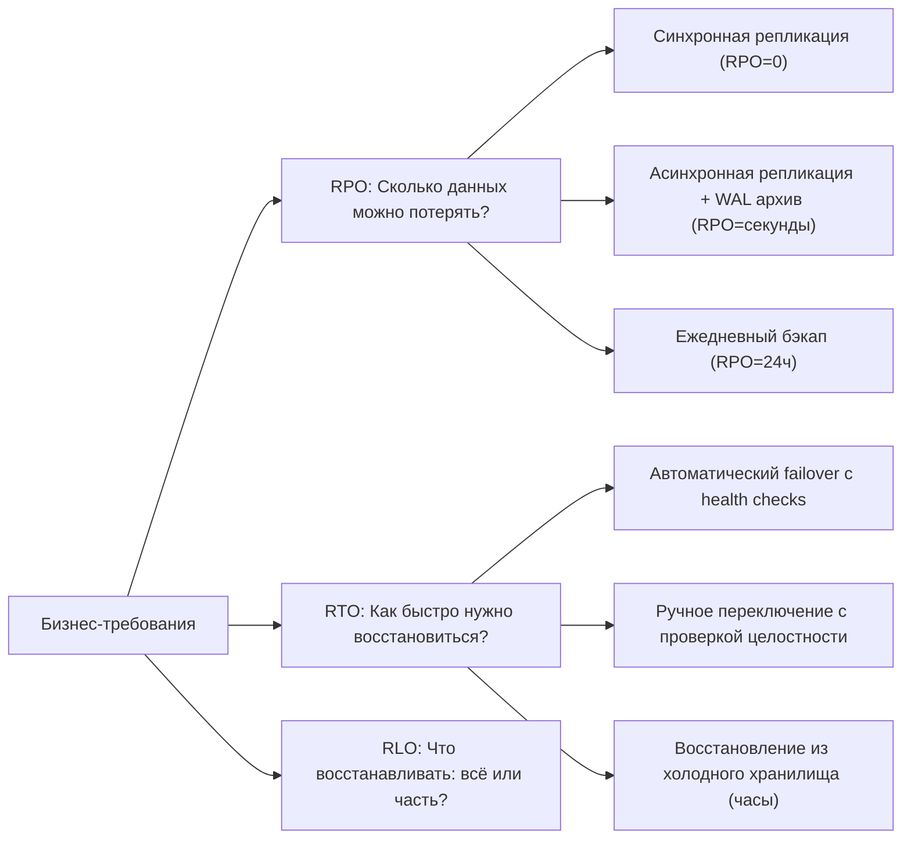
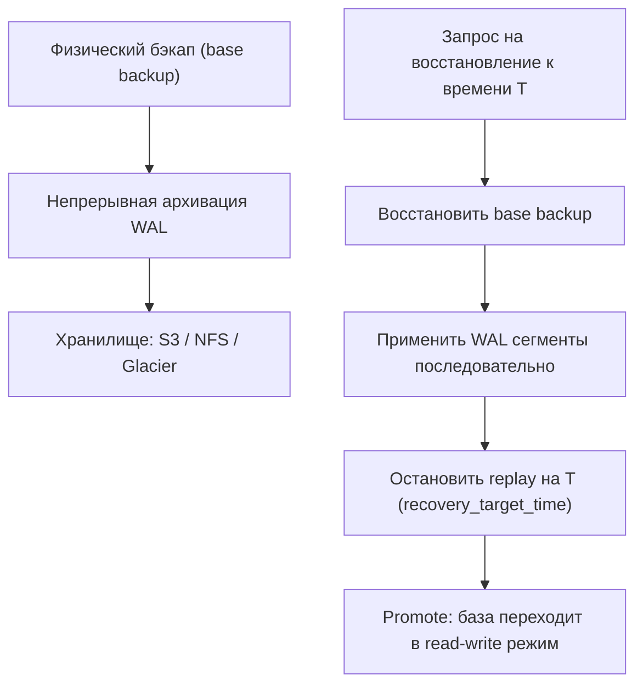
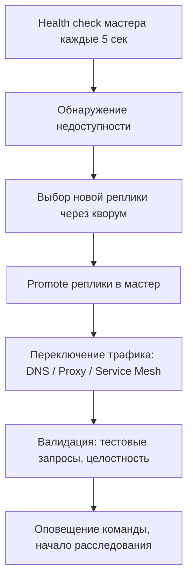

## Введение: Когда отказ — это вопрос «когда», а не «если»

Disaster Recovery (DR, аварийное восстановление) — это не просто «бэкапы». Это комплексная стратегия, гарантирующая, что при катастрофическом сбое (потеря дата-центра, коррупция данных, человеческая ошибка, кибератака) система сможет восстановить работоспособность в приемлемые сроки с минимальной потерей данных. Для инженера уровня Senior/Lead DR — это не опция, а архитектурный контракт, который определяет надежность всего продукта.

Статистика неумолима: 60% компаний, потерявших данные без возможности восстановления, закрываются в течение 6 месяцев. При этом 90% организаций хотя бы раз сталкивались с неудачным восстановлением из бэкапа, который «вроде бы работал». Разница между теорией и практикой — в деталях реализации, тестирования и понимания механики СУБД на уровне дисков, транзакционных логов и сетевого стека.

В этой статье мы разберем:
*   Фундаментальные метрики надежности: RPO, RTO, RLO и их инженерные компромиссы.
*   Архитектуру стратегий резервного копирования: полные, инкрементальные, снапшоты, логические против физических бэкапов.
*   Механику Point-in-Time Recovery (PITR) под капотом: как WAL, чекпоинты и архивация взаимодействуют для восстановления на произвольный момент.
*   Идиоматичную реализацию агентов бэкапа и валидаторов в Go с учетом конкурентности, таймаутов и аллокаций.
*   Процедуры аварийного переключения (failover) и отката (failback): автоматизация, кворумы, предотвращение расщепления мозга (split-brain).
*   Тестирование восстановления: почему «бэкап без проверки восстановления — это не бэкап».
*   Типичные ловушки, антипаттерны и каверзные вопросы с хардовых собеседований.

> [!info] Под капотом
> Аварийное восстановление упирается в фундаментальный закон хранения данных: **любая копия данных — это задержка**. Синхронная репликация гарантирует нулевой RPO, но увеличивает латентность записи на 1 RTT до самой удаленной реплики. Асинхронная репликация дает низкую задержку, но допускает потерю данных при сбое. Инженер должен явно выбирать компромисс между доступностью, согласованностью и производительностью, а не надеяться, что «СУБД сама разберется».

## Фундаментальные метрики: RPO, RTO, RLO

Прежде чем проектировать стратегию, необходимо определить бизнес-требования в измеримых величинах.

| Метрика | Определение | Инженерная интерпретация | Типичные значения |
|---------|-------------|--------------------------|-------------------|
| **RPO (Recovery Point Objective)** | Максимальный период потери данных, допустимый бизнесом | Частота бэкапов / лаг репликации | От 0 (синхронная реплика) до 24 часов (ежедневный бэкап) |
| **RTO (Recovery Time Objective)** | Максимальное время простоя системы до восстановления работоспособности | Скорость развертывания, применения бэкапа, переключения | От секунд (автоматический failover) до дней (ручное восстановление) |
| **RLO (Recovery Level Objective)** | Гранулярность восстановления: вся БД, таблица, строка, транзакция | Поддержка logical backup, point-in-time, частичного восстановления | Таблица/строка для OLTP, вся БД для аналитики |



> [!tip] Собеседование
> **Вопрос:** Можно ли одновременно достичь RPO=0 и RTO=0?
> **Ответ:** Теоретически — нет, практически — крайне дорого и сложно. RPO=0 требует синхронной репликации, которая увеличивает латентность записи и создает единую точку отказа при сетевом разделении. RTO=0 требует мгновенного автоматического переключения, которое рискует расщеплением мозга (split-brain) при нестабильной сети. На практике выбирают баланс: например, RPO=5 секунд (асинхронная реплика + частая архивация WAL) и RTO=30 секунд (автоматический failover с кворумом).

## Стратегии резервного копирования: Полные, инкрементальные, снапшоты

Выбор типа бэкапа определяет скорость создания, размер хранилища и время восстановления.

### Физические против логических бэкапов

| Тип | Инструменты | Плюсы | Минусы | Когда использовать |
|-----|-------------|-------|--------|-------------------|
| **Физический (raw files)** | `pg_basebackup`, `xtrabackup`, LVM/ZFS снапшоты | Быстрое создание/восстановление, точная копия блоков | Требует остановки или режима hot backup, привязан к версии СУБД, большой размер | Большие БД (>100 ГБ), строгий RTO, идентичное железо |
| **Логический (SQL dump)** | `pg_dump`, `mysqldump`, `SELECT INTO OUTFILE` | Портативность, возможность восстановления отдельных таблиц, сжатие | Медленная загрузка/выгрузка, не сохраняет точные блоки, нет PITR без WAL | Малые/средние БД, миграция между версиями, частичное восстановление |
| **Снапшоты ФС** | LVM, ZFS, EBS snapshots, Ceph RBD | Мгновенное создание, консистентность на уровне блоков | Требует поддержки ФС, может блокировать запись на момент снимка | Виртуализированные среды, облачные инфраструктуры |

> [!info] Под капотом
> При создании физического бэкапа в PostgreSQL (`pg_basebackup`) происходит:
> 1.  Установка `backup_label` файла, который сообщает СУБД о начале бэкапа.
> 2.  Копирование всех файлов данных (`base/`, `pg_wal/`, `pg_tblspc/`) через `read()` системные вызовы.
> 3.  Параллельная архивация WAL-сегментов, сгенерированных во время копирования.
> 4.  Удаление `backup_label` после завершения.
> 
> Ключевой момент: бэкап консистентен на момент начала, а все изменения, произошедшие во время копирования, восстанавливаются через replay WAL. Это требует, чтобы `archive_command` был настроен и надежно доставлял сегменты в хранилище.

### Инкрементальные бэкапы и дедупликация

Полный бэкап 1 ТБ базы каждый день — это 30 ТБ в месяц и огромные окна резервирования. Инкрементальные стратегии экономят место и время:

*   **Уровневые бэкапы (Level 0/1/2)**: Полный снимок (L0) раз в неделю, инкрементальные (L1) — ежедневно, дифференциальные (L2) — каждый час.
*   **Дедупликация на уровне блоков**: Инструменты вроде `borgbackup`, `restic`, `pgbackrest` разбивают данные на чанки, хешируют их и хранят только уникальные. Повторяющиеся блоки (например, неизмененные страницы БД) не дублируются.
*   **Copy-on-Write снапшоты**: Файловые системы ZFS/Btrfs создают снапшоты мгновенно, копируя только измененные блоки при записи.

> [!warning] Ловушка / Gotcha
> **Инкрементальная цепочка и точка отказа**
> Инкрементальные бэкапы образуют зависимую цепочку: для восстановления пятничного снапшота нужны все инкрементальные бэкапы с понедельника. Если один файл в цепочке поврежден (битый диск, коррупция при передаче), вся цепочка после него становится бесполезной.
> **Решение:** Регулярно создавайте новые полные бэкапы (например, раз в неделю), храните инкрементальные цепочки в нескольких независимых хранилищах, и обязательно валидируйте восстановление хотя бы одного бэкапа из каждой цепочки еженедельно.

## Point-in-Time Recovery: Механика WAL и архивации

PITR — это «машина времени» для базы данных: возможность восстановить состояние на любой момент в прошлом, а не только на момент создания бэкапа.

### Как работает PITR в PostgreSQL



1.  **Base backup**: Снимок файлов данных на момент `t0`.
2.  **WAL archiving**: Каждый завершенный сегмент WAL (16 МБ по умолчанию) копируется в надежное хранилище через `archive_command`.
3.  **Recovery**: При восстановлении СУБД загружает base backup, затем последовательно применяет WAL-сегменты, останавливаясь на заданном времени, транзакции или метке.

> [!info] Под капотом
> WAL-сегменты — это бинарный журнал изменений на уровне страниц. При replay СУБД не выполняет высокоуровневый SQL, а применяет низкоуровневые операции: «записать байты по смещению Х в странице У». Это делает восстановление быстрым и надежным, но также означает, что коррупция на уровне страниц в base backup может распространиться на всё восстановление. Поэтому критически важно проверять целостность бэкапов через `pg_verifybackup` или `pg_checksums`.

### Настройка архивации и восстановление

```bash
# postgresql.conf
wal_level = replica                    # Минимум для архивации
archive_mode = on
archive_command = 'aws s3 cp %p s3://my-bucket/wal/%f' # Надежная доставка
archive_timeout = 300                  # Принудительная ротация каждые 5 минут

# recovery.conf (или postgresql.auto.conf в новых версиях)
restore_command = 'aws s3 cp s3://my-bucket/wal/%f %p'
recovery_target_time = '2024-06-15 14:30:00 UTC'
recovery_target_action = promote       # После восстановления стать мастером
```

> [!warning] Ловушка / Gotcha
> **Потеря WAL = потеря возможности PITR**
> Если `archive_command` падает (нет места на S3, сетевая ошибка, неправильные права), СУБД продолжает работать, но новые WAL-сегменты не архивируются. При сбое вы сможете восстановиться только до последнего успешно заархивированного сегмента.
> **Решение:** Мониторьте `pg_stat_archiver` на предмет `failed_count`, настройте алерты на ошибки архивации, используйте надежные транспортные механизмы с ретраями (например, `wal-g` с экспоненциальной задержкой).

## Идиоматичная реализация агентов бэкапа в Go

Написание надежного агента бэкапа в Go требует учета конкурентности, обработки ошибок, таймаутов и эффективного использования памяти.

```go
package backup

import (
	"context"
	"database/sql"
	"fmt"
	"io"
	"log"
	"os"
	"path/filepath"
	"time"
	
	"github.com/aws/aws-sdk-go-v2/aws"
	"github.com/aws/aws-sdk-go-v2/config"
	"github.com/aws/aws-sdk-go-v2/service/s3"
)

// BackupAgent управляет созданием и загрузкой бэкапов
type BackupAgent struct {
	db           *sql.DB
	s3Client     *s3.Client
	bucket       string
	retentionDays int
}

func NewBackupAgent(db *sql.DB, bucket string) (*BackupAgent, error) {
	cfg, err := config.LoadDefaultConfig(context.Background())
	if err != nil {
		return nil, fmt.Errorf("load AWS config: %w", err)
	}
	return &BackupAgent{
		db:           db,
		s3Client:     s3.NewFromConfig(cfg),
		bucket:       bucket,
		retentionDays: 30,
	}, nil
}

// RunFullBackup создает физический бэкап и загружает в S3
func (ba *BackupAgent) RunFullBackup(ctx context.Context) error {
	// 1. Создаем временную директорию
	backupDir, err := os.MkdirTemp("", "pg-backup-*")
	if err != nil {
		return fmt.Errorf("create temp dir: %w", err)
	}
	defer os.RemoveAll(backupDir) // Гарантированная очистка

	// 2. Запускаем pg_basebackup через exec (в продакшене лучше использовать libpq bindings)
	cmd := exec.CommandContext(ctx, "pg_basebackup",
		"-D", backupDir,
		"-Ft", // Формат tar
		"-z",  // Сжатие
		"-P",  // Прогресс
	)
	// ... настройка env, аутентификации ...
	
	if err := cmd.Run(); err != nil {
		return fmt.Errorf("pg_basebackup failed: %w", err)
	}

	// 3. Загружаем архив в S3 с прогрессом и ретраями
	archivePath := filepath.Join(backupDir, "base.tar.gz")
	if err := ba.uploadWithRetry(ctx, archivePath, fmt.Sprintf("backups/%s/base.tar.gz", time.Now().Format("2006-01-02"))); err != nil {
		return fmt.Errorf("upload to S3: %w", err)
	}

	// 4. Очищаем старые бэкапы согласно политике хранения
	if err := ba.cleanupOldBackups(ctx); err != nil {
		log.Printf("WARN: cleanup failed: %v", err)
		// Не прерываем основной процесс, но логируем
	}

	return nil
}

// uploadWithRetry загружает файл с экспоненциальной задержкой при ошибках
func (ba *BackupAgent) uploadWithRetry(ctx context.Context, localPath, s3Key string) error {
	const maxRetries = 5
	baseDelay := 1 * time.Second

	for attempt := 0; attempt < maxRetries; attempt++ {
		file, err := os.Open(localPath)
		if err != nil {
			return fmt.Errorf("open file: %w", err)
		}
		
		_, err = ba.s3Client.PutObject(ctx, &s3.PutObjectInput{
			Bucket: aws.String(ba.bucket),
			Key:    aws.String(s3Key),
			Body:   file,
		})
		file.Close()
		
		if err == nil {
			return nil
		}
		
		// Экспоненциальная задержка с джиттером
		delay := baseDelay * time.Duration(1<<attempt)
		jitter := time.Duration(rand.Int63n(int64(delay) / 4))
		select {
		case <-ctx.Done():
			return ctx.Err()
		case <-time.After(delay + jitter):
			// Продолжаем следующий ретрай
		}
	}
	
	return fmt.Errorf("upload failed after %d retries", maxRetries)
}
```

> [!info] Под капотом
> При загрузке больших файлов в S3 через `PutObject` Go-драйвер AWS буферизует данные в памяти перед отправкой. Для файлов >100 МБ это создает давление на GC. Оптимизация: используйте `s3manager.Uploader` с `PartSize`, который разбивает файл на части и загружает их параллельно через multipart upload. Это снижает пиковые аллокации и ускоряет загрузку за счет параллелизма.

## Процедуры аварийного переключения: Failover и Failback

Бэкапы бесполезны, если вы не можете быстро переключиться на резервную инфраструктуру.

### Автоматический failover с кворумом



1.  **Обнаружение**: Не просто `ping`, а проверка `SELECT 1` с таймаутом, репликационного лага, доступности дисков.
2.  **Выбор жертвы**: Не любая реплика подходит. Критерии: минимальный лаг, наличие всех WAL, достаточные ресурсы, географическая близость к пользователям.
3.  **Кворум**: Чтобы избежать split-brain, переключение требует подтверждения от большинства узлов (например, 2 из 3 в кластере Patroni).
4.  **Переключение трафика**: Обновление DNS (с низким TTL), перенастройка HAProxy, или обновление endpoint в Kubernetes Service.

> [!warning] Ловушка / Gotcha
> **Split-brain: два мастера одновременно**
> Если сетевое разделение изолирует старый мастер, а новый уже выбран, оба могут принимать запись. При восстановлении связи данные расходятся, и автоматическое слияние невозможно.
> **Решение:** Используйте механизмы фенсинга (fencing): STONITH (Shoot The Other Node In The Head) — принудительное выключение старого мастера через IPMI, отключение сети, блокировку дисков. В облаках — отзыв прав доступа к хранилищу через IAM.

### Failback: Возврат к нормальной конфигурации

После устранения причины сбоя старый мастер нужно вернуть в строй. Это не просто «запустить сервер».

1.  **Остановка записи на новом мастере** (или переключение в read-only).
2.  **Репликация от нового мастера к старому** (теперь он становится репликой).
3.  **Синхронизация до нулевого лага**.
4.  **Плановое переключение обратно** (или оставление новой топологии, если она стабильнее).

> [!tip] Собеседование
> **Вопрос:** Почему нельзя просто «скопировать данные с нового мастера на старый» при фаилбэке?
> **Ответ:** Прямое копирование файлов (`rsync`, `scp`) не учитывает транзакции, которые могли быть зафиксированы на новом мастере после момента сбоя. Это приведет к потере данных или коррупции. Единственный безопасный способ — настроить старого мастера как реплику нового, дать ему догнать лаг, и только затем выполнять плановое переключение ролей.

## Тестирование восстановления: Почему «бэкап без проверки — это не бэкап»

Самая распространенная ошибка: бэкапы создаются годами, но ни разу не тестировались на восстановление. При реальном инциденте выясняется, что:
*   Архив WAL поврежден.
*   Версия СУБД на новом сервере несовместима.
*   Не хватает места на диске для восстановления.
*   Скрипт восстановления содержит баг, который не проявлялся при сухом запуске.

### Стратегия регулярного тестирования

1.  **Еженедельно**: Восстановление случайного бэкапа в изолированную среду, проверка целостности (`pg_checksums`, `SELECT COUNT(*)`), запуск смоук-тестов приложения.
2.  **Ежемесячно**: Полное восстановление на инфраструктуру, близкую к продакшену, с измерением реального RTO.
3.  **Ежеквартально**: Disaster Recovery Drill — имитация потери дата-центра, переключение на резервный регион, проверка работы всего стека.

```go
// Пример интеграционного теста восстановления в Go
func TestPITRRecovery(t *testing.T) {
	ctx, cancel := context.WithTimeout(context.Background(), 30*time.Minute)
	defer cancel()
	
	// 1. Создаем тестовую БД и наполняем данными
	originalDB := setupTestDB(t)
	insertTestData(ctx, t, originalDB, 10000)
	
	// 2. Создаем бэкап через агент
	agent, _ := NewBackupAgent(originalDB, "test-bucket")
	backupID := time.Now().Format("2006-01-02-15-04-05")
	if err := agent.RunFullBackup(ctx); err != nil {
		t.Fatalf("backup failed: %v", err)
	}
	
	// 3. Эмулируем катастрофу: удаляем оригинал
	originalDB.Close()
	dropTestDB(t)
	
	// 4. Восстанавливаем из бэкапа в новую БД
	restoredDB, err := restoreFromBackup(ctx, "test-bucket", backupID)
	if err != nil {
		t.Fatalf("restore failed: %v", err)
	}
	defer restoredDB.Close()
	
	// 5. Валидируем целостность: счетчики, контрольные суммы, бизнес-инварианты
	var count int
	if err := restoredDB.QueryRow("SELECT COUNT(*) FROM orders").Scan(&count); err != nil {
		t.Errorf("query failed: %v", err)
	}
	if count != 10000 {
		t.Errorf("data loss: expected 10000 rows, got %d", count)
	}
	
	// 6. Проверяем, что можно писать (база в read-write режиме)
	_, err = restoredDB.Exec("INSERT INTO audit_log (event) VALUES ('recovery_test')")
	if err != nil {
		t.Errorf("write test failed: %v", err)
	}
}
```

> [!info] Под капотом
> При восстановлении больших баз данных (`>100 ГБ`) основной узкий место — не сеть, а дисковый ввод-вывод. Восстановление требует:
> *   Чтения сжатых архивов из хранилища (декомпрессия нагружает CPU).
> *   Записи распакованных данных на диск (случайные `write` при восстановлении B-деревьев).
> *   Replay WAL-сегментов (последовательная запись, но с `fsync` на каждом коммите).
> **Оптимизация:** Используйте быстрые SSD для временного хранилища восстановления, настройте `wal_replay_sync_method = open_sync` для более эффективного `fsync`, и параллелизуйте восстановление таблиц, если СУБД поддерживает (например, `pg_restore -j`).

## Ловушки, антипаттерны и вопросы с собеседований

1.  **Бэкапы без шифрования и контроля доступа**
    *   *Проблема:* Бэкап в публичном S3-бакете утекает, и злоумышленник получает полную копию продакшена с персональными данными.
    *   *Решение:* Всегда шифруйте бэкапы на стороне клиента (перед загрузкой), используйте IAM-политики с минимальными привилегиями, включайте логирование доступа к хранилищу.

2.  **Игнорирование размера бэкапа при восстановлении**
    *   *Проблема:* Бэкап 2 ТБ, а на целевом сервере только 1.5 ТБ свободного места. Восстановление падает на 90%, оставляя базу в неработоспособном состоянии.
    *   *Решение:* Всегда проверяйте доступное место перед восстановлением, используйте сжатие, рассмотрите восстановление с фильтрацией (только критичные схемы).

3.  **Отсутствие документации и runbooks**
    *   *Проблема:* При инциденте в 3 часа ночи инженер не помнит, как запустить восстановление, или скрипт зависит от локальных путей, которых нет на новом сервере.
    *   *Решение:* Документируйте процедуры в формате runbooks с пошаговыми командами, храните их в репозитории вместе с кодом, проводите регулярные тренировки.

4.  **Сравнение с другими экосистемами**
    *   *Java:* Часто полагаются на фреймворки вроде Flyway/Liquibase для миграций, но бэкапы остаются за пределами приложения. Инструменты вроде `pgbackrest` имеют Java-клиенты, но основная логика — на уровне СУБД.
    *   *C#/.NET:* Интеграция с Azure Backup, SQL Server Management Studio. Много GUI-инструментов, но меньше гибкости в автоматизации.
    *   *Go:* Философия «явных зависимостей». Вы пишете агентов бэкапа, валидаторов, оркестраторов восстановления как обычные Go-сервисы. Это дает полный контроль над таймаутами, ретраями, логированием и интеграцией с observability-стеком, но требует больше кода и дисциплины.

5.  **Психологический антипаттерн: «У нас же есть бэкапы»**
    *   *Проблема:* Команда успокаивается наличием бэкапов и перестает инвестировать в мониторинг, тестирование и автоматизацию восстановления.
    *   *Решение:* Регулярно проводите post-mortem учений, измеряйте реальные RPO/RTO, делайте метрики восстановления частью SLA.

> [!tip] Собеседование
> **Вопрос:** Как обеспечить восстановление базы данных, если потеряны и мастер, и все реплики, но есть бэкапы в облаке?
> **Ответ:** 
> 1.  Развернуть новую инфраструктуру (виртуалки, Kubernetes) в том же или другом регионе.
> 2.  Установить совместимую версию СУБД.
> 3.  Скачать последний полный бэкап и все архивированные WAL-сегменты из хранилища.
> 4.  Восстановить base backup, затем применить WAL до нужного момента (PITR).
> 5.  Запустить базу в режиме `recovery_target_action=promote`.
> 6.  Переключить приложение на новый endpoint, валидировать целостность данных.
> Ключевые риски: время загрузки больших бэкапов из облака (используйте VPC endpoint для S3), совместимость версий СУБД, наличие достаточного дискового пространства.

## Итог

Disaster Recovery — это не набор скриптов, а культура инженерной ответственности. Ключевые принципы для уровня Senior/Lead:
*   Определяйте RPO/RTO явно и проектируйте архитектуру под эти метрики, а не под «максимальную надежность».
*   Используйте комбинацию стратегий: физические бэкапы для быстрого восстановления, WAL-архивация для PITR, репликация для минимизации лага.
*   Автоматизируйте не только создание, но и проверку восстановления. Бэкап без тестового восстановления — это иллюзия безопасности.
*   Пишите идиоматичный код агентов бэкапа: с контекстами, ретраями, джиттером, контролем аллокаций и интеграцией с observability.
*   Документируйте runbooks и проводите регулярные учения. В момент реального инцидента нет времени на эксперименты.

Освоив принципы аварийного восстановления, вы сможете гарантировать выживаемость системы даже при катастрофических сбоях. Но когда данные распределены географически и должны быть доступны с минимальной задержкой пользователям по всему миру, возникает новая проблема: как балансировать нагрузку и обеспечивать консистентность в глобальном масштабе? В следующей статье мы разберем стратегии работы с гео-распределенными базами данных: [[17. Гео-распределенные базы и репликация]].