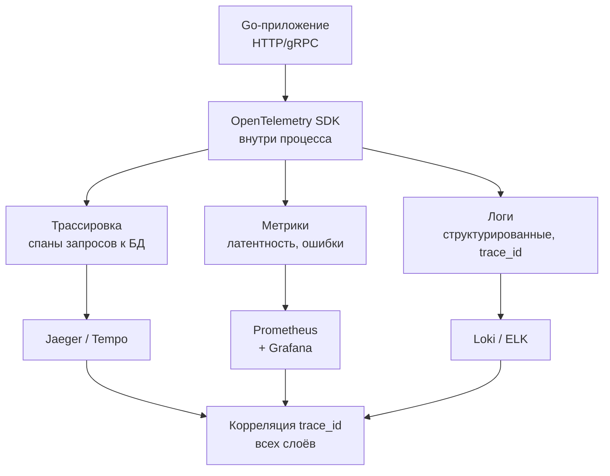

## Введение

Наблюдаемость (observability) — это способность понимать внутреннее состояние системы по её внешним выходам. Если [[17. Мониторинг баз данных|мониторинг]] отвечает на вопрос «что болит?», показывая метрики и алерты, то observability идёт дальше: позволяет исследовать произвольные вопросы без заранее предсказанных дашбордов, особенно в распределённых системах. Для баз данных это три столпа: **трассировка запросов**, **структурированные логи** и **метрики**, склеенные общим контекстом.

В Go-экосистеме полная наблюдаемость БД достигается интеграцией OpenTelemetry (OTel) с драйверами (`database/sql`, `pgx`, `go-redis`) и настройкой серверной части (PostgreSQL, Redis, MongoDB) на экспорт логов и статистики. Эта статья объясняет, как включить три столпа observability для баз данных, как они взаимодействуют под капотом и как не переплатить производительностью за избыточную телеметрию.

## Три столпа observability в контексте БД



Три столпа, собранные с единым `trace_id`, дают полную картину для любого запроса: какие SQL-операторы выполнялись, сколько времени заняли, какие строки были затронуты, и как это коррелирует с действиями пользователя.

## Трассировка запросов к БД

Трассировка — это цепочка спанов, представляющих путь запроса от HTTP-обработчика до строки базы данных. Для БД спаны содержат атрибуты: `db.system`, `db.name`, `db.statement`, `db.user`, `net.peer.name`, `net.transport`. Инструментирование позволяет автоматически создавать спаны вокруг каждого выполнения запроса.

### OpenTelemetry и Go-драйверы

Сообщество Go предлагает обёртки, внедряющие трассировку без изменения кода:

- **`otelpgx`** — оборачивает `pgxpool` и `pgx.Conn`, перехватывая `Query`, `Exec`, `SendBatch`. Работает на основе `pgx.QueryTracer`.
- **`otelsql`** — регистрирует обёртку для стандартного `database/sql`. Перехватывает `db.Prepare`, `db.QueryContext`, `db.ExecContext`, создавая спаны.
- **`go-redis/extra/redisotel`** — добавляет трассировку в команды Redis.

```go
import (
    "github.com/exaring/otelpgx"
    "github.com/jackc/pgx/v5/pgxpool"
    "go.opentelemetry.io/otel"
)

func initDB(ctx context.Context) (*pgxpool.Pool, error) {
    config, _ := pgxpool.ParseConfig("postgres://...")
    config.ConnConfig.Tracer = otelpgx.NewTracer(
        otelpgx.WithTracerProvider(otel.GetTracerProvider()),
        otelpgx.WithLogSQLStatement(true),
    )
    return pgxpool.NewWithConfig(ctx, config)
}
```

Под капотом `otelpgx` внедряет кастомный `pgx.QueryTracer`, который вызывает методы `TraceQueryStart` и `TraceQueryEnd`. В `TraceQueryStart` создаётся спан с атрибутами (SQL, аргументы — если разрешено), устанавливается родительский контекст из переданного `context.Context`. По завершении спана фиксируются длительность и статус.

### Передача контекста трассировки в БД

Для соединения спанов клиента и серверных логов БД используется **SQL комментарий** с `traceparent`. Многие драйверы (включая pgx с настройкой) добавляют заголовок трассировки в начало SQL-запроса, например:
```
/* traceparent='00-4bf92f3577b34da6a3ce929d0e0e4736-00f067aa0ba902b7-01' */ SELECT * FROM users WHERE id=$1
```
PostgreSQL может логировать этот запрос целиком, и `pganalyze`, `pgBadger` или собственный парсер извлекут `trace_id` для стыковки с логами приложения.

## Логирование запросов: от slow query к каждому вызову

Серверный журнал медленных запросов ([[18. Slow query log]]) — основа диагностики проблем производительности. Однако observability требует не только медленные, но и все запросы с контекстом.

### PostgreSQL: auto_explain и log_statement

Расширение `auto_explain` (загружается через `shared_preload_libraries`) автоматически логирует план выполнения запросов, превысивших заданный порог `auto_explain.log_min_duration`. В сочетании с `log_statement = 'all'` и `log_line_prefix = '%m [%p] %q%u@%d '` можно получить полный журнал всех запросов с идентификатором процесса и пользователя.

Для production это слишком дорого. Вместо этого используют **выборочное логирование** из приложения: Go-сервис сам решает, какие вызовы записывать в структурированный лог (например, при ошибке или при превышении порога). `pgx` позволяет подписаться на события через `pgx.Logger`, и можно интегрировать с `slog` / `zerolog`, добавляя `trace_id` и `span_id`.

### Structured logging в Go

Современный Go использует `log/slog` с контекстными атрибутами:

```go
logger := slog.Default().With("trace_id", span.SpanContext().TraceID())
logger.Info("db query", "sql", query, "duration_ms", duration)
```

При экспорте в Loki или ELK такие логи автоматически связываются с трейсами через `trace_id`. В совокупности с трассировкой вы видите: в каком спане родился данный SQL, какие параллельные запросы выполнялись, какие ошибки предшествовали.

## Метрики как фундамент

Метрики остаются необходимым компонентом: латенси запросов (P50/P95/P99), количество ошибок, размер пула соединений. OpenTelemetry SDK для Go может экспортировать метрики автоматически, если включён `otelgrpc`/`otelhttp`, а для БД используются соответствующие инструментации.

Важно объединить метрики с трейсами через **exemplars** — прометеевские метрики могут содержать `trace_id` как пример, позволяя из дашборда Grafana перейти к конкретному трейсу в Jaeger.

## Mechanical Sympathy: цена полной наблюдаемости

Каждый созданный спан, каждое логирование и сбор метрик потребляют CPU, память и генерируют дополнительный сетевой трафик. Понимание этих затрат необходимо Senior-инженеру.

- **Создание спана:** в Go аллокации неизбежны: слайс атрибутов, строка имени спана, временная метка. При 100 000 RPS к БД это может составлять значимую долю нагрузки. OpenTelemetry SDK позволяет настроить **семплинг**: `TraceIDRatioBased(0.01)` — трассировать только 1% запросов.
- **Экспорт спанов:** `BatchSpanProcessor` накапливает спаны и отправляет их пачками, избегая `write` на каждый запрос. Настройка `MaxQueueSize`, `BatchTimeout` критична для баланса между задержкой доставки и нагрузкой.
- **Логирование каждого SQL:** строки SQL и параметры — потенциально большие строки. Логирование в синхронном режиме (запись в файл/сокет) может добавить задержку, если используется блокирующий вызов `write`. Используйте асинхронные логгеры (zerolog с буферизацией).
- **Серверная трассировка БД:** в PostgreSQL расширение `pg_stat_statements` агрегирует статистику, а не логирует всё. Но `pg_query_state` (для активных запросов) может потреблять разделяемую память. Включение `log_statement=all` в продакшене опасно — оно убьёт производительность диска (постоянная запись WAL логов) и процессор (форматирование строк). Поэтому observability на стороне сервера БД часто ограничивается агрегированными метриками и трейсами от клиента.

> [!warning] Ловушка / Gotcha
> Добавление `traceparent` в SQL-комментарий ломает кэширование планов запросов (prepared statements) в PostgreSQL, потому что каждый запрос теперь уникален по тексту. Решение — использовать `pgx` с `QueryTracer`, который не модифицирует SQL, а передаёт контекст через отдельный механизм (например, через параметр `application_name` или кастомную GUC, но это сложно). Лучше оставить трассировку только на клиенте, без внедрения в сам SQL, если это не критично для серверной корреляции.

## Интеграция с инфраструктурой

Экосистема observability для БД включает:

- **Сбор метрик:** `postgres_exporter`, `redis_exporter` отправляют в Prometheus.
- **Трассировка:** OpenTelemetry Collector принимает спаны от Go-сервисов и редиректит в Jaeger или Grafana Tempo.
- **Логи:** Promtail / Filebeat собирает структурированные логи Go-сервисов и самой БД (через `log_destination = csvlog` с разбором `log_line_prefix`) и отправляет в Loki / ELK.
- **Дашборды:** Grafana соединяет все источники. Пример: дашборд "Observability DB" показывает корреляцию метрик TPS, латенси, ошибок, и при клике на аномалию открывает трейс с детализацией SQL-спанов.

Для Go-разработчика важно настроить `OTEL_EXPORTER_OTLP_ENDPOINT` в среде выполнения и обеспечить, чтобы контекст распространения передавался от HTTP-запроса до драйвера БД без разрывов (через `context.Context`).

## Практические рекомендации при внедрении

1. **Начните с метрик** — они дешёвые и дают базовую картину. Добавьте `pg_stat_statements` и Prometheus exporter.
2. **Включите трассировку с низким семплингом** (1%), чтобы не уронить прод. Используйте `otelsql` или `otelpgx`.
3. **Логируйте только ошибки и медленные запросы** на уровне приложения, добавляя `trace_id`. Не включайте `log_statement=all` на сервере.
4. **Маскируйте чувствительные данные**: в атрибутах спана заменяйте значения параметров на `?` с помощью `WithLogSQLStatement(false)` или собственного фильтра.
5. **Объединяйте трейсы и логи через `trace_id`** — это даёт суперсилу при дебаге.

> [!tip] Собеседование
> **Вопрос:** Как вы отладите ситуацию, когда пользователи жалуются на медленные ответы API, а метрики PostgreSQL показывают среднюю задержку 5 мс и никаких алертов?
> **Ответ:**  
> Включу трассировку для проблемного эндпоинта с увеличенным семплингом. В трейсе увижу цепочку спанов: возможно, не один долгий запрос, а много последовательных быстрых запросов в цикле (N+1 проблема). Метрики среднего этого не показывают, а трейс покажет. Затем, используя `trace_id`, найду логи и проверю, какие именно запросы выполнялись. Скорее всего, причина в отсутствии batch-запроса или JOIN'а, из-за чего горутины проводят время в ожидании сети и парсинге, а сама БД быстро отвечает на каждый отдельный запрос.

## Итог

Observability баз данных — это не роскошь, а необходимость в распределённом Go-бэкенде. С помощью OpenTelemetry и структурированного логирования мы превращаем чёрный ящик SQL-запросов в понятную, трассируемую систему, где каждый запрос может быть отслежен от пользователя до дискового ввода-вывода. Ключ к успеху — разумный баланс между полнотой телеметрии и производительностью, достигаемый семплингом, асинхронностью и маскированием данных.

В следующей статье мы перейдём к не менее важному аспекту — защите баз данных от угроз, включая SQL-инъекции и управление доступом: [[20. Безопасность БД]].