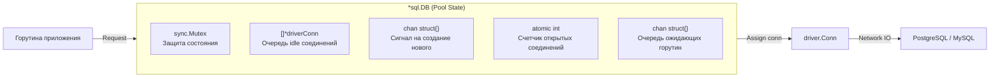
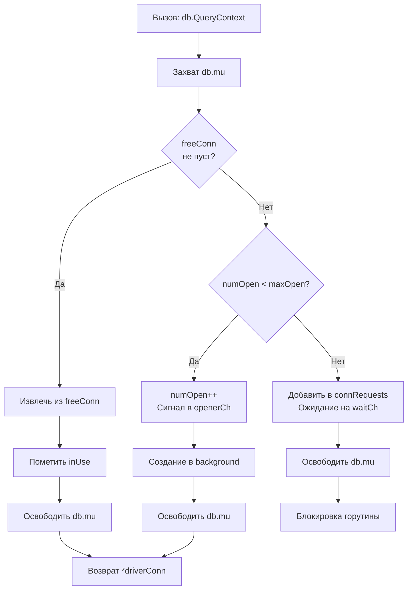

## Введение: Зачем нужен пул соединений

Установка соединения с базой данных — это одна из самых дорогих операций в бэкенд-приложении. Она включает в себя:
*   **TCP handshake** (три пакета, задержка сети)
*   **TLS handshake** (если используется шифрование — дополнительные криптографические вычисления)
*   **Аутентификацию** на стороне СУБД (проверка пароля, прав доступа)
*   **Выделение ресурсов** в памяти сервера БД (буферы, сессия, воркер-процесс)

В высоконагруженной системе, обрабатывающей тысячи запросов в секунду, создание нового соединения для каждого запроса привело бы к катастрофическим задержкам и перегрузке как приложения, так и базы данных.

**Пул соединений (Connection Pool)** — это паттерн, при котором приложение заранее создает и поддерживает набор готовых к работе соединений, переиспользуя их для выполнения запросов. Пакет `database/sql` в Go реализует этот паттерн «из коробки», но его эффективное использование требует глубокого понимания внутренней механики.

> [!info] Под капотом
> Пул соединений в Go — это не просто слайс с объектами. Это сложная конкурентная структура данных, которая синхронно управляет состоянием множества горутин, сетевых сокетов и таймеров. Понимание того, как работает эта синхронизация, критически важно для отладки проблем с производительностью и предотвращения дедлоков в продакшене.

## Архитектура пула в database/sql

Внутренняя структура `*sql.DB` содержит несколько ключевых полей, отвечающих за управление пулом. Хотя точная реализация может меняться между версиями Go, концептуальная модель остается стабильной.



### Состояния соединений: idle, inUse, closed

Каждое физическое соединение (`driverConn`) в пуле находится в одном из трех состояний:

| Состояние | Описание | Где хранится |
|-----------|----------|--------------|
| **idle** | Свободно, готово к использованию | В слайсе `db.freeConn` |
| **inUse** | Выдано горутине, выполняется запрос | Ссылка удерживается в `*sql.conn` |
| **closed** | Закрыто (ошибка, таймаут) | Удаляется из пула, вызывается `driver.Close()` |

> [!info] Под капотом
> Переход между состояниями контролируется мьютексом `db.mu`. Когда горутина запрашивает соединение:
> 1.  Захватывается `db.mu`
> 2.  Проверяется `freeConn`: если есть idle — берем первое, помечаем `inUse`
> 3.  Если `freeConn` пуст, но `numOpen < maxOpen` — инкрементим `numOpen` и отправляем сигнал в `openerCh`
> 4.  Если лимит достигнут — горутина блокируется на канале ожидания (внутренний `waitCh`)
> 5.  Мьютекс освобождается, горутина либо получает соединение, либо ждет

### Внутренние структуры: db.mu, db.freeConn, db.openerCh

```go
// Упрощенная схема внутренней структуры (из исходников database/sql)
type DB struct {
    mu           sync.Mutex // Глобальная блокировка пула
    openerCh     chan struct{} // Сигнал для goroutine-создателя
    closed       bool
    dep          map[finalCloser]depSet
    
    // Статистика и счетчики
    numOpen      atomic.Int[int] // Текущее количество открытых соединений
    maxOpen      int // Лимит из SetMaxOpenConns
    
    // Пул idle соединений
    freeConn     []*driverConn // Слайс доступных соединений
    connRequests map[uint64]*connRequest // Очередь ожидающих запросов
    
    // Таймауты
    connMaxLifetime time.Duration
    connMaxIdleTime time.Duration
}
```

> [!warning] Ловушка / Gotcha
> **Мьютекс `db.mu` — точка конкуренции**
> При очень высокой конкуренции (десятки тысяч горутин одновременно запрашивают соединения) мьютекс пула может стать узким местом. Каждая операция выдачи/возврата соединения требует захвата `db.mu`.
> **Решение:** Увеличивайте `SetMaxIdleConns`, чтобы уменьшить частоту операций с пулом. Если соединение есть в `idle`, его выдача происходит быстрее, чем создание нового. Также используйте адекватные значения `SetMaxOpenConns`, чтобы ограничить конкуренцию.

## Механика выдачи соединений

Алгоритм получения соединения из пула (`DB.conn`) можно представить следующим образом:



### Алгоритм getConnection

1.  **Быстрый путь (Fast Path)**: Если в `freeConn` есть соединения, они выдаются по принципу **LIFO** (Last In, First Out). Это повышает вероятность использования «теплого» соединения, которое еще не успело остыть с точки зрения сетевых таймаутов.
2.  **Медленный путь (Slow Path)**: Если `freeConn` пуст, но лимит не достигнут, увеличивается счетчик `numOpen` и отправляется сигнал в канал `openerCh`. Отдельная горутина `connectionOpener` обрабатывает этот сигнал и асинхронно устанавливает новое соединение.
3.  **Блокировка**: Если лимит `maxOpen` достигнут, текущая горутина добавляется в очередь `connRequests` и блокируется. Когда другое соединение возвращается в пул (`putConn`), оно будит одну из ожидающих горутин.

> [!tip] Собеседование
> **Вопрос:** Почему в Go пул использует LIFO для idle соединений, а не FIFO?
> **Ответ:** LIFO повышает локальность использования: недавно освобожденное соединение с большей вероятностью еще имеет «теплый» TCP-сокет, активный TLS-сеанс и прогретые буферы ОС. Это снижает вероятность того, что соединение окажется «протухшим» (broken pipe) к моменту повторного использования. FIFO мог бы приводить к тому, что соединения долго лежат в пуле без дела и закрываются сетевым оборудованием.

### Блокировка при исчерпании лимита

Когда все соединения `inUse` и лимит `maxOpen` достигнут, новые запросы блокируются. Это поведение настраивается через контекст:

```go
// Если контекст имеет таймаут, блокировка не будет бесконечной
ctx, cancel := context.WithTimeout(context.Background(), 5*time.Second)
defer cancel()

rows, err := db.QueryContext(ctx, "SELECT ...")
// Если за 5 секунд соединение не освободится:
// err = context deadline exceeded
```

> [!warning] Ловушка / Gotcha
> **Бесконечное ожидание**
> Если вы используете `context.Background()` без таймаута, а пул исчерпан и ни одно соединение не возвращается (например, из-за утечки или долгого запроса), ваша горутина будет ждать **бесконечно**. Это может привести к исчерпанию горутин в приложении (goroutine leak).
> **Правило:** Всегда устанавливайте таймаут на контекст для операций с БД в продакшене.

## Создание и закрытие соединений

### Ленивая инициализация и db.opener

Соединения не создаются при вызове `sql.Open`. Они создаются лениво, по мере необходимости. Горутина `connectionOpener` работает в фоне:

```go
// Псевдокод из runtime database/sql
func (db *DB) connectionOpener(ctx context.Context) {
    for {
        select {
        case <-ctx.Done():
            return
        case <-db.openerCh:
            // Асинхронное создание соединения
            go db.openNewConnection()
        }
    }
}

func (db *DB) openNewConnection() {
    // Вызов driver.Open() -> TCP dial -> Auth
    dc, err := driver.Open(dsn)
    db.mu.Lock()
    if err != nil {
        db.numOpen.Add(-1) // Откат счетчика при ошибке
    } else {
        db.putConn(dc, nil, true) // Возврат в пул или выдача ожидающему
    }
    db.mu.Unlock()
}
```

### Ротация соединений: ConnMaxLifetime

Соединения не живут вечно. Параметр `SetConnMaxLifetime` контролирует максимальное время жизни соединения с момента его создания.

> [!info] Под капотом
> При возврате соединения в пул (`putConn`) проверяется условие:
> ```go
> if c.createdAt.Add(db.connMaxLifetime).Before(now()) {
>     // Соединение устарело — закрываем, не возвращаем в idle
>     c.Close()
>     return
> }
> ```
> Это предотвращает использование «протухших» соединений, которые могли быть закрыты на стороне балансировщика, файрвола или самой БД из-за таймаутов простоя.

## Настройка пула: практическое руководство

### SetMaxOpenConns: баланс между конкурентностью и ресурсами

```go
// ❌ Опасно: безлимит по умолчанию
// db, _ := sql.Open("postgres", dsn) // maxOpen = 0 (unlimited)

// ✅ Правильно: явное ограничение
db.SetMaxOpenConns(50)
```

**Как подобрать значение:**
*   **CPU-bound нагрузка**: `maxOpen ≈ (CPU cores * 2) + эффективный диск`
*   **IO-bound нагрузка** (типичный веб-бэкенд): `maxOpen ≈ 50-200`, зависит от латентности БД
*   **Формула Литтла**: `MaxConns = QPS * AvgQueryLatency` (с запасом 20-30%)

> [!tip] Собеседование
> **Вопрос:** Что будет, если выставить `SetMaxOpenConns(1)`?
> **Ответ:** Все запросы к БД будут выполняться строго последовательно. Даже если у вас 1000 горутин, только одна сможет выполнять запрос в любой момент времени. Остальные будут блокироваться в очереди. Это превратит вашу базу данных в последовательное узкое место (serial bottleneck).

### SetMaxIdleConns: теплые соединения vs память

```go
// Рекомендуется: держать 20-50% от maxOpen в idle
db.SetMaxIdleConns(25) // при maxOpen=50
```

*   **Слишком мало**: Частое создание/уничтожение соединений → нагрузка на CPU, TCP handshake, GC.
*   **Слишком много**: Лишнее потребление памяти (буферы сокетов) на стороне приложения и БД, удерживание файловых дескрипторов.

### Конфигурация для разных сценариев нагрузки

| Сценарий | MaxOpen | MaxIdle | MaxLifetime | Комментарий |
|----------|---------|---------|-------------|-------------|
| **Dev / Testing** | 10 | 5 | 30m | Минимальные ресурсы |
| **Web API (средняя нагрузка)** | 50 | 25 | 30m | Баланс скорости и ресурсов |
| **Highload / Batch processing** | 200 | 100 | 15m | Агрессивный пул, частая ротация |
| **Serverless / Lambda** | 10 | 2 | 5m | Короткий жизненный цикл, экономия |

## Мониторинг и метрики пула

Пакет `database/sql` предоставляет встроенный метод `Stats()` для наблюдения за состоянием пула.

```go
func monitorDB(db *sql.DB, interval time.Duration) {
    ticker := time.NewTicker(interval)
    defer ticker.Stop()
    
    for range ticker.C {
        stats := db.Stats()
        
        // Ключевые метрики для алертинга:
        // 1. WaitCount: сколько раз горутины ждали свободное соединение
        if stats.WaitCount > threshold {
            log.Warn("High connection wait count", "count", stats.WaitCount)
        }
        
        // 2. WaitDuration: суммарное время ожидания
        // 3. Idle: сколько соединений простаивает
        // 4. InUse: сколько соединений активно (основной индикатор нагрузки)
        // 5. Open: общее количество открытых (должно быть <= MaxOpen)
        
        prometheus.DBPoolInUse.Set(float64(stats.InUse))
        prometheus.DBPoolIdle.Set(float64(stats.Idle))
        prometheus.DBPoolWaitCount.Set(float64(stats.WaitCount))
    }
}
```

> [!info] Под капотом
> Метод `db.Stats()` использует атомарные операции для чтения счетчиков (`atomic.LoadInt64`), поэтому он безопасен для вызова из любой горутины и не блокирует работу пула. Однако частый вызов (чаще 1 раза в секунду) может создавать небольшой оверхед из-за атомарных операций и аллокации структуры `DBStats`.

### Интерпретация метрик: waitCount, waitDuration, idle

| Метрика | Нормальное значение | Тревожный сигнал | Действие |
|---------|---------------------|------------------|----------|
| **WaitCount** | 0 или рост < 1/мин | Резкий скачок, рост > 10/сек | Увеличить `MaxOpen`, оптимизировать запросы |
| **WaitDuration** | < 1ms в среднем | Рост до 100ms+ | Проверить долгие запросы, утечки |
| **Idle** | 20-80% от MaxOpen | Постоянно 0 | Увеличить `MaxIdle` |
| **InUse** | < 70% от MaxOpen | Постоянно ~MaxOpen | Пул исчерпан, масштабировать |
| **Open** | Стабильно | Частые колебания | Проверить `ConnMaxLifetime`, сеть |

## Проблемы и их диагностика

### Connection pool exhausted: причины и решения

Симптом: ошибки `sql: connection pool exhausted` или бесконечное зависание запросов.

**Чеклист диагностики:**
1.  **Утечка `rows.Close()`**: Проверьте, все ли `Query` имеют `defer rows.Close()`.
2.  **Заброшенные транзакции**: Транзакция без `Commit`/`Rollback` удерживает соединение навсегда.
3.  **Слишком низкий `MaxOpen`**: Увеличьте лимит, если метрики показывают постоянную утилизацию ~100%.
4.  **Долгие запросы**: Используйте `EXPLAIN`, добавьте индексы, разбейте сложные запросы.
5.  **Сетевые проблемы**: Проверьте `dial timeout`, `read timeout` на уровне драйвера.

```go
// Пример правильной обработки с таймаутами
func safeQuery(ctx context.Context, db *sql.DB, query string) error {
    // Таймаут на весь запрос
    ctx, cancel := context.WithTimeout(ctx, 2*time.Second)
    defer cancel()
    
    rows, err := db.QueryContext(ctx, query)
    if err != nil {
        return fmt.Errorf("query failed: %w", err)
    }
    defer rows.Close() // Гарантированный возврат соединения
    
    // Обработка...
    return nil
}
```

### Утечки соединений: rows.Close(), tx.Rollback()

> [!warning] Ловушка / Gotcha
> **Паника внутри транзакции**
> Если в коде между `BeginTx` и `Commit` происходит паника, и вы не обработаете её, транзакция никогда не завершится, а соединение останется в `inUse` навсегда.
> 
> **Решение:** Используйте `defer` с проверкой паники:
> ```go
> tx, err := db.BeginTx(ctx, nil)
> if err != nil { return err }
> 
> defer func() {
>     if p := recover(); p != nil {
>         tx.Rollback()
>         panic(p) // Re-panic после отката
>     }
>     if err != nil {
>         tx.Rollback() // Откат при любой ошибке
>     }
> }()
> 
> // ... бизнес-логика ...
> err = tx.Commit()
> ```

### Долгие запросы и блокировка пула

Один медленный запрос может «заблокировать» одно соединение из пула на все время выполнения. Если таких запросов много, пул быстро исчерпается.

**Стратегии борьбы:**
*   **Query timeout**: Всегда используйте `context.WithTimeout`.
*   **Statement timeout на стороне БД**: Настройте `statement_timeout` в PostgreSQL для принудительного прерывания долгих запросов.
*   **Read-only реплики**: Направляйте аналитические/тяжелые запросы на реплики, чтобы не блокировать пул для критичных `OLTP`-операций.

## Mechanical Sympathy: влияние на производительность

### Syscalls и network I/O при установке соединения

Установка нового TCP-соединения требует как минимум:
*   3 пакета для TCP handshake (SYN, SYN-ACK, ACK)
*   4-7 пакетов для TLS handshake (ClientHello, ServerHello, Certificate, KeyExchange...)
*   Системные вызовы `socket()`, `connect()`, `write()`, `read()`

> [!info] Под капотом
> Каждый `connect()` — это системный вызов, который переключает процессор в Ring 0, выполняет работу ядра сети и возвращает управление. При частом создании соединений (из-за малого `MaxIdle` или короткого `MaxLifetime`) вы тратите значительное время CPU не на бизнес-логику, а на переключение контекста и сетевой стек ОС.
> 
> **Оптимизация:** Держите достаточное количество `idle` соединений, чтобы минимизировать частоту `connect()`.

### Влияние на GC и аллокации

Каждое соединение содержит буферы для чтения/записи (обычно 4-8 КБ каждый). При создании сотен соединений вы аллоцируете мегабайты памяти, которые создают давление на Garbage Collector.

```go
// Пример: оценка памяти пула
// 100 соединений * (8KB read buf + 8KB write buf + overhead ~4KB) = ~2MB
// Это не много, но при частой ротации (создание/удаление) нагрузка на GC растет.
```

### TCP keepalive и таймауты на уровне ОС

По умолчанию драйверы включают TCP keepalive (обычно 30-60 секунд). Это важно для обнаружения «мертвых» соединений, которые были закрыты сетевым оборудованием, но приложение об этом не знает.

> [!tip] Собеседование
> **Вопрос:** Почему соединение может «протухнуть», даже если приложение его не закрывало?
> **Ответ:** Промежуточное сетевое оборудование (файрволы, NAT, балансировщики) часто имеет таймауты неактивных TCP-соединений (обычно 5-15 минут). Если соединение простаивает дольше, оно молча закрывается на уровне сети. Приложение узнает об этом только при следующей попытке записи/чтения, получив ошибку `broken pipe` или `connection reset`. Именно поэтому `ConnMaxLifetime` должен быть меньше таймаутов сетевого оборудования.

## Сравнение подходов: пул в Go vs другие языки

| Язык / Экосистема | Модель пула | Особенности |
|-------------------|-------------|-------------|
| **Go (database/sql)** | Встроенный, универсальный | LIFO, асинхронное создание, контекст-ориентированный |
| **Java (HikariCP)** | Отдельная библиотека | Очень быстрый, использует `Unsafe` для оптимизаций |
| **Python (SQLAlchemy)** | Опциональный (QueuePool) | Гибкая настройка, но оверхед из-за GIL |
| **Node.js (pg-pool)** | Встроенный в драйвер | Простой, но менее гибкий в настройке |

> [!info] Под капотом
> Пул в Go выигрывает за счет нативной поддержки конкурентности (горутины) и отсутствия GIL. Однако он проигрывает специализированным пулам вроде HikariCP в «сырой» скорости выдачи соединения из-за использования мьютексов вместо `Unsafe`-оптимизаций. Для 99% приложений разница незаметна, но в экстремальных бенчмарках это может иметь значение.

## Чеклист для продакшена

1.  [ ] `SetMaxOpenConns` установлен в значение, соответствующее нагрузке и ресурсам БД.
2.  [ ] `SetMaxIdleConns` составляет 30-50% от `MaxOpen` для баланса между скоростью и памятью.
3.  [ ] `SetConnMaxLifetime` настроен (15-30 минут) для ротации соединений и предотвращения «протухания».
4.  [ ] Все запросы используют `context.WithTimeout` для защиты от бесконечного ожидания.
5.  [ ] `defer rows.Close()` и `defer tx.Rollback()` используются повсеместно.
6.  [ ] Метрики `db.Stats()` экспортируются в Prometheus/Grafana для мониторинга.
7.  [ ] На стороне БД настроены `statement_timeout` и `idle_in_transaction_session_timeout` как последняя линия обороны.
8.  [ ] Проведено нагрузочное тестирование для подбора оптимальных параметров пула.

## Итог

Пул соединений в `database/sql` — это мощный механизм, который при правильной настройке обеспечивает высокую производительность и отказоустойчивость вашего приложения. Ключевые принципы:
*   **Ограничивайте** (`MaxOpen`) — чтобы не перегрузить БД.
*   **Кэшируйте** (`MaxIdle`) — чтобы избежать накладных расходов на создание.
*   **Ротируйте** (`MaxLifetime`) — чтобы избегать сетевых артефактов.
*   **Мониторьте** (`Stats`) — чтобы вовремя реагировать на проблемы.
*   **Защищайте** (`Context`) — чтобы запросы не висели вечно.

Понимание внутренней механики пула позволяет не просто «настроить по гайду», а осознанно диагностировать и решать проблемы производительности на уровне системного дизайна.

В следующей статье мы сравним два фундаментальных подхода к работе с данными в Go: написание «сырого» SQL через `database/sql` и использование ORM-библиотек. Разберем компромиссы между контролем, производительностью и скоростью разработки. Читайте далее: [[3. ORM vs SQL]].