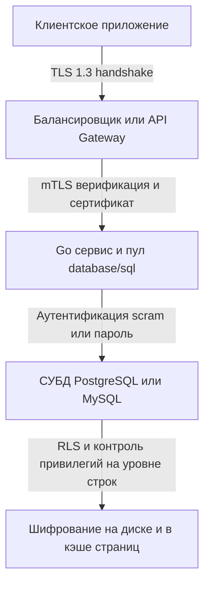

## Введение: Многоуровневая защита и нулевое доверие

Безопасность баз данных — это не отдельный модуль или настройка в конфигурации. Это архитектурная дисциплина, пронизывающая весь стек: от сетевых протоколов и криптографических примитивов ОС до управления памятью в рантайме Go и политик доступа на уровне движка хранения. В эпоху Zero Trust архитектура должна предполагать, что периметр уже нарушен, а внутренняя сеть не является доверенной зоной. База данных становится последней линией обороны, и её компрометация равносильна потере бизнеса.

Для инженера уровня Senior/Lead понимание безопасности БД означает способность проектировать системы, устойчивые не только к внешним атакам, но и к внутренним угрозам, утечкам через логи, сайд-каналы и ошибки в бизнес-логике. Это требует глубокого знания того, как работает шифрование на уровне CPU, как рантайм управляет чувствительными данными в памяти, как парсеры СУБД разделяют код и данные, и как правильно настроить пулы соединений без потери производительности.

В этой статье мы разберем:
*   Механику аутентификации и управления секретами в рантайме Go.
*   Шифрование в транзите: TLS 1.3, mTLS, сессионные тикеты и аппаратное ускорение (AES-NI).
*   Защиту от инъекций: как работают серверные подготовленные выражения и почему строковая конкатенация разрушает парсер.
*   Принцип наименьших привилегий, RBAC и изоляцию на уровне СУБД.
*   Взаимодействие криптографии с Garbage Collector: очистка памяти, постоянные сравнения и сайд-каналы.
*   Аудит, маскирование данных и безопасное логирование в production.
*   Типичные ловушки, антипаттерны и каверзные вопросы с хардовых собеседований.



1. **Управление секретами и аутентификация в рантайме Go**
DSN строка подключения содержит критически важные данные. В Go она передается в `database/sql` как обычный `string`, который размещается в куче. Сборщик мусора не гарантирует очистку памяти после освобождения объекта, поэтому строка может оставаться в дампе памяти процесса. Это создает вектор атаки через `/proc/<pid>/mem`, core-dumps или аллокации в shared memory.

```go
import (
	"database/sql"
	"fmt"
	"log"
	"os"
)

func OpenSecureDB() (*sql.DB, error) {
	// ❌ Опасно: жестко закодированные креды или передача из env без контроля
	// dsn := fmt.Sprintf("postgres://admin:SuperSecret123@db:5432/prod")
	
	// ✅ Безопасно: загрузка из защищенного источника, валидация, быстрый сброс
	password := os.Getenv("DB_PASSWORD")
	if password == "" {
		return nil, fmt.Errorf("DB_PASSWORD not set")
	}
	
	// Явное указание SSL-режима и таймаутов аутентификации
	dsn := fmt.Sprintf(
		"postgres://app_user:%s@db-prod.internal:5432/appdb?sslmode=verify-full&sslrootcert=/etc/ssl/certs/ca.crt&connect_timeout=5",
		password,
	)
	
	// После создания пула переменную рекомендуется очистить (хотя это не панацея в Go)
	// password = "" // Сборщик мусора позже освободит память, но содержимое может остаться в куче
	
	db, err := sql.Open("postgres", dsn)
	if err != nil {
		return nil, fmt.Errorf("open db: %w", err)
	}
	
	// Обязательно проверяем соединение с таймаутом, чтобы не держать висящие горутины
	if err := db.Ping(); err != nil {
		db.Close()
		return nil, fmt.Errorf("ping db: %w", err)
	}
	
	return db, nil
}
```

> [!warning] Ловушка / Gotcha
> **Пароли в логах и метриках**
> Драйверы и пулеры часто логируют ошибки подключения, включая DSN. Если не отключить `log` или не использовать `log` с фильтрацией, пароль попадет в `stdout`, `journald` или централизованное логирование (см. [[17. Мониторинг баз данных]]). Всегда используйте редаторы логов или структуры с `fmt.Stringer`, который маскирует секреты.

2. **Шифрование в транзите: TLS 1.3, mTLS и аппаратное ускорение**
Шифрование сетевого трафика между приложением и БД обязательно. Современный стандарт — TLS 1.3, который убирает устаревшие алгоритмы, сокращает handshake до 1 RTT (или 0 RTT с ресумпшном) и использует AEAD шифры.

В Go конфигурация `crypto/tls` задается через `tls.Config`. При работе с `database/sql` драйверы используют эту конфигурацию при создании каждого физического соединения. Пул соединений переиспользует уже установленный TLS-туннель, что снижает накладные расходы.

```go
import (
	"crypto/tls"
	"crypto/x509"
	"database/sql"
	"fmt"
	"os"
	"time"
	
	"github.com/lib/pq"
)

func setupTLS(dsn string) (*sql.DB, error) {
	rootCAs, _ := x509.SystemCertPool()
	if rootCAs == nil {
		rootCAs = x509.NewCertPool()
	}
	
	// Загрузка кастомного CA сертификата
	certs, _ := os.ReadFile("/etc/ssl/certs/db-ca.pem")
	if ok := rootCAs.AppendCertsFromPEM(certs); !ok {
		return nil, fmt.Errorf("failed to append CA cert")
	}
	
	tlsConfig := &tls.Config{
		RootCAs:            rootCAs,
		MinVersion:         tls.VersionTLS12, // TLS 1.3 предпочтительнее, но 1.2 часто требуется для совместимости
		CipherSuites:       []uint16{
			tls.TLS_AES_128_GCM_SHA256,
			tls.TLS_CHACHA20_POLY1305_SHA256,
		},
		SessionTicketsDisabled: false, // Ресумпшн сессий снижает CPU нагрузку при реконнектах
	}
	
	// Регистрация конфигурации в pq драйвере
	pq.RegisterTLSConfig("secure", tlsConfig)
	
	dsnWithTLS := dsn + "&sslmode=verify-full&sslinline=true&tlsconfig=secure"
	return sql.Open("postgres", dsnWithTLS)
}
```

> [!info] Под капотом
> TLS handshake требует криптографических вычислений (RSA/ECDSA для аутентификации, DH для обмена ключами). Современные CPU поддерживают инструкции `AES-NI` и `SHA-NI`, которые ускоряют симметричное шифрование в 5-10 раз. Если ваше приложение работает на старом железе без аппаратного ускорения, TLS может потреблять до 30% CPU на высоконагруженных сервисах. Выбор шифра `ChaCha20` вместо `AES` рекомендуется на устройствах без `AES-NI` или в мобильных средах, так как он быстрее работает в программной реализации. В продакшене на x86_64 `AES-128-GCM` оптимален по балансу скорости и безопасности.

3. **SQL-инъекции: Парсеры, подготовленные выражения и риски ORM**
SQL-инъекция возникает, когда данные пользователя интерпретируются как часть SQL-кода. Парсер СУБД не видит границы между кодом и данными, если они передаются через строковую конкатенацию.

Единственная надежная защита — серверные подготовленные выражения (`PREPARE` + `EXECUTE`). При этом запрос разбирается, компилируется в план выполнения и кэшируется в СУБД. Параметры передаются отдельно в бинарном формате и привязываются к уже готовому плану. Парсер никогда не смешивает данные с кодом.

```go
// ❌ Критически опасно: конкатенация или форматирование
query := fmt.Sprintf("SELECT * FROM users WHERE email = '%s'", userInput)
rows, err := db.QueryContext(ctx, query) // user может передать: ' OR 1=1 --

// ✅ Безопасно: параметризация через $1, $2
query := "SELECT id, name FROM users WHERE email = $1 AND status = $2"
rows, err := db.QueryContext(ctx, query, userInput, "active")
```

> [!warning] Ловушка / Gotcha
> **Динамические идентификаторы (таблицы, колонки, ORDER BY)**
> Подготовленные выражения могут параметризовать только значения (`WHERE col = $1`). Они не работают для имен таблиц, колонок или направления сортировки. Попытка сделать `ORDER BY $1` приведет к синтаксической ошибке или сортировке по литералу, а не по колонке.
> **Решение:** Для динамических структур используйте белый список (whitelist) допустимых значений. Никогда не подставляйте ввод пользователя напрямую в SQL-структуру. Если требуется гибкая сортировка, используйте `sql.Named` или маппинг в коде:
> ```go
> allowedCols := map[string]string{"name": "last_name", "date": "created_at"}
> col, ok := allowedCols[userInput]
> if !ok { col = "created_at" } // Fallback
> query := fmt.Sprintf("SELECT * FROM orders ORDER BY %s", col) // Safe
> ```

4. **Принцип наименьших привилегий и изоляция на уровне СУБД**
Приложение не должно подключаться к БД под учетной записью `SUPERUSER` или `ADMIN`. Это золотое правило, нарушение которого превращает любую инъекцию или уязвимость в полный компромисс инфраструктуры.

*   **Создание отдельных ролей:** `app_reader` (только `SELECT`), `app_writer` (`INSERT`, `UPDATE`, `DELETE`), `app_migrator` (`CREATE`, `ALTER`, `DROP`).
*   **Row-Level Security (RLS):** Включение `ALTER TABLE ... ENABLE ROW LEVEL SECURITY` позволяет СУБД фильтровать строки на основе контекста сессии (`current_user`, `tenant_id`). Это особенно эффективно в мультитенантных архитектурах.
*   **Изоляция схем:** Разные микросервисы должны работать в отдельных схемах (`search_path`), чтобы избежать случайного доступа к чужим таблицам.

> [!tip] Собеседование
> **Вопрос:** Как защитить данные при компрометации учетной записи приложения?
> **Ответ:** Комбинация RLS, обязательной параметризации, отключения `FILE` и `COPY TO` прав, использования мьютексов для транзакций и шифрования чувствительных колонок на уровне приложения (client-side encryption). Также критически важно настроить `pg_stat_statements` для мониторинга аномальных запросов и включить аудит через `pgaudit`. Если приложение должно читать только свои данные, RLS + отдельные роли сводят риск горизонтального перемещения к нулю. Подробнее о реализации прав: [[22. RBAC в БД]].

5. **Механика памяти, GC и криптографические примитивы**
Безопасность в Go упирается в управление памятью. Сборщик мусора перемещает объекты в куче, оставляет копии в старых поколениях и не затирает память при освобождении. Это означает, что пароли, ключи шифрования или токены могут оставаться в памяти часами после использования.

Для борьбы с этим:
*   Используйте `crypto/subtle` для постоянных по времени сравнений (защита от timing-атак):
```go
import "crypto/subtle"

func VerifyToken(input, expected []byte) bool {
	// subtle.ConstantTimeCompare выполняется за одинаковое время
	// независимо от позиции первого несовпадающего байта
	return subtle.ConstantTimeCompare(input, expected) == 1
}
```
*   Для высокочувствительных данных рассмотрите `mlock()` через `unix.Mlock` (Linux), чтобы заблокировать страницы в RAM и запретить своппинг на диск.
*   При работе с криптографическими контекстами переиспользуйте буферы через `sync.Pool`, чтобы снизить давление на GC и минимизировать время жизни секретов в куче.

> [!info] Под капотом
> Функция `bcrypt.GenerateFromPassword` или `argon2.IDKey` создают большие буферы (по умолчанию 32 КБ для argon2). При высокой нагрузке это создает `Gen 0` аллокации, которые быстро продвигаются в `Gen 1`. Если хеширование вызывается синхронно в HTTP-обработчике, горутина блокируется, а буферы висят в памяти. Оптимальный паттерн: асинхронная обработка через воркер-пул, переиспользование буферов и строгие лимиты на параллельные вычисления (`runtime.GOMAXPROCS`).

6. **Аудит, маскирование и безопасное логирование**
Аудит в БД — это запись всех операций: кто, когда, что делал и какой был результат. В PostgreSQL для этого используется расширение `pgaudit` или системные таблицы `pg_log`. Однако аудит создает значительный I/O-оверхед, так как каждое событие записывается в журнал синхронно.

В Go логирование должно быть безопасным по умолчанию:
*   Никогда не логировать DSN, пароли, полные тела запросов с PII.
*   Использовать `slog` с атрибутом `slog.LevelInfo` для бизнес-событий и `slog.LevelDebug` только в dev.
*   Маскировать данные в логах: `card_number=************4242`.

```go
import (
	"context"
	"log/slog"
)

func LogQueryStart(ctx context.Context, logger *slog.Logger, query string) {
	// Маскируем параметры или используем структурированное логирование
	logger.InfoContext(ctx, "db query started",
		slog.String("query_type", extractQueryType(query)),
		slog.String("correlation_id", ctx.Value("request_id").(string)),
	)
}
```

> [!warning] Ловушка / Gotcha
> **Аудит и производительность**
> Включение `pgaudit.log = 'read, write'` на высоконагруженной OLTP базе может снизить пропускную способность на 15-30%. Аудит записывает каждый `SELECT` в текстовый лог, создавая тысячи мелких `fsync` операций.
> **Решение:** Включайте детальный аудит только для критичных таблиц (`pgaudit.log_relation`), используйте асинхронную доставку логов через `syslog` или JSON-потоки, и периодически ротируйте файлы. Для compliance (PCI DSS, GDPR) часто достаточно аудита DDL и изменений в таблицах пользователей.

7. **Ловушки, антипаттерны и вопросы с собеседований**

8. **TLS в пуле соединений**
   *   *Проблема:* Разработчик настраивает `tls.Config` для `database/sql`, но драйвер создает новое соединение при каждом `Open`, а пул не переиспользует TLS-контекст правильно.
   *   *Решение:* Убедитесь, что драйвер поддерживает `tls.Config` пулинг (современные `pgx` и `lib/pq` делают это). Не пересоздавайте `*tls.Config` при каждом запросе.

2. **Хранение хешей паролей**
   *   *Проблема:* Приложение отправляет пароль в БД для проверки там, или использует `MD5`/`SHA1`.
   *   *Решение:* Никогда не передавайте сырые пароли. Хешируйте на стороне приложения (`argon2id`), передавайте хеш, сравнивайте в БД или используйте `SCRAM-SHA-256` для аутентификации к самой СУБД.

3. **Уязвимости в ORM**
   *   *Проблема:* Динамическая сборка запросов через `Where("name = ?", userInput)` безопасна, но `Where(fmt.Sprintf("name = '%s'", userInput))` — нет. Многие разработчики путают эти подходы.
   *   *Решение:* Включите статический анализ (`gosec`) в CI. Он ловит конкатенацию строк в `Query`/`Exec`.

4. **Сравнение с другими экосистемами**
   *   *Java:* Использует `JDBC` с пулами соединений (`HikariCP`). TLS настраивается через системные свойства или `SSLContext`. Много готовых решений для аудита, но тяжелый стек.
   *   *C#/.NET:* `System.Data.SqlClient` / `Npgsql`. Интеграция с Azure Key Vault, Always Encrypted. Удобно в облаках, но привязка к экосистеме.
   *   *Go:* Явный контроль над `crypto/tls`, ручное управление секретами, отсутствие встроенного KMS-клиента в стандартной библиотеке. Требует больше кода, но дает полный контроль над аллокациями, таймаутами и поведением при обрыве сети. Идеально для compliance-критичных микросервисов.

> [!tip] Собеседование
> **Вопрос:** Как защититься от timing-атак при сравнении хешей или токенов в Go?
> **Ответ:** Обычное сравнение `==` или `bytes.Equal` прерывается на первом несовпадающем байте, что позволяет атакующему измерять время ответа и подбирать значение посимвольно. В Go нужно использовать `crypto/subtle.ConstantTimeCompare`, который всегда выполняет полное сравнение массивов за фиксированное время, независимое от содержимого. Это критично для проверки JWT-подписей, API-ключей и криптографических хешей.

## Итог

Безопасность баз данных в Go-экосистеме строится на явном контроле над каждым слоем: от настроек TLS и управления секретами в памяти до параметризации запросов и гранулярных прав доступа в СУБД. Ключевые принципы для уровня Senior/Lead:
*   Никогда не доверяйте периметру. Используйте mTLS, RLS и принцип наименьших привилегий.
*   Защищайте память: избегайте хранения секретов в строках, используйте `subtle` для сравнений, контролируйте аллокации криптографии.
*   Параметризируйте всё. Конкатенация строк в SQL — это гарантированная уязвимость.
*   Аудит и логирование должны быть безопасными по умолчанию: маскируйте PII, ротируйте логи, мониторьте аномалии.
*   Понимайте цену безопасности: TLS и аудит создают нагрузку. Балансируйте защиту и производительность через аппаратное ускорение и асинхронные воркеры.

Освоив принципы безопасности, вы сможете проектировать системы, устойчивые к компрометации. Но даже при идеальной защите самая распространенная вектор атаки остается человеческим фактором и ошибками в генерации запросов. В следующей статье мы детально разберем механизм, который превращает строковый ввод в критическую уязвимость, и научимся его полностью нейтрализовать: [[21. SQL Injection]].