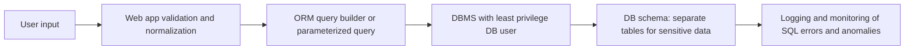

## 1. Что такое SQL Injection

OWASP определяет SQLi как вставку или «инъекцию» SQL‑запроса через входные данные от клиента к приложению【turn0search1】.  
Классический сценарий:

- приложение формирует SQL как строку с подстановкой пользовательского ввода;
- злоумышленник подбирает вход так, чтобы изменить логику запроса;
- СУБД выполняет изменённый запрос, который может:
  - читать/изменять/удалять данные;
  - обходить авторизацию;
  - выполнять административные команды (shutdown, load_file и т.п.)【turn0search3】【turn0search7】.

---

## 2. Типичные сценарии и примеры

### 2.1. Простая инъекция в авторизации

Пример (опасный код):

```python
# небезопасно
login = request.POST['login']
password = request.POST['password']

query = "SELECT * FROM users WHERE login = '" + login + "' AND password = '" + password + "'"
```

Если передать:

- `login = "admin' --"`
- `password = "anything"`

получится:

```sql
SELECT * FROM users
WHERE login = 'admin' --' AND password = 'anything'
```

Всё после `--` — комментарий. Проверка пароля отключается, злоумышленник входит как `admin`【turn0search1】【turn0search7】.

### 2.2. Извлечение данных через `UNION`

```sql
SELECT id, title FROM articles WHERE id = '1'
UNION SELECT id, password FROM users --
```

Если приложение выводит результат запроса, атакующий может вытащить данные из любой таблицы.

### 2.3. Изменение данных

```sql
UPDATE users SET email = 'hacker@evil.com'
WHERE id = 1; --
```

При успешной инъекции можно:
- менять балансы, роли, флаги админки;
- удалять таблицы (`DROP TABLE users`);
- создавать новых пользователей и т.п.【turn0search3】【turn0search4】.

---

## 3. Виды SQL‑инъекций

### 3.1. Классические (in-band)

Результат инъекции виден в ответе приложения:

- **Error-based** — ошибки СУБД выводятся пользователю, и по их тексту злоумышленник подбирает структуру запроса.
- **UNION-based** — атакующий объединяет свой запрос с основным через `UNION` и читает данные.

### 3.2. Blind (слепые) инъекции

Прямого вывода данных нет, но:

- приложение по‑разному отвечает на `true/false` условия;
- либо меняется время ответа при задержках.

OWASP выделяет:

- **Boolean-based blind** — по разному содержимому страницы можно понять, истинно ли условие【turn0search2】.
- **Time-based blind** — условие с `SLEEP()` / `WAITFOR` и т.п.; по задержке ответа делается вывод об истинности условия【turn0search2】.

### 3.3. Out-of-band

Используются внешние каналы: DNS, HTTP‑запросы, почта и т.д., если СУБД может инициировать запросы наружу. Часто применяются, когда прямого вывода нет, а blind‑инъекция слишком медленная.

---

## 4. Почему SQLi до сих пор актуален

- Ошибки в коде: конкатенация строк, динамический SQL без параметров.
- ORM и фреймворки не гарантируют безопасность: в них тоже находят уязвимости и небезопасные паттерны【turn0search12】【turn0search13】.
- Legacy‑код, самописные движки, «быстрые» решения без фреймворков.
- SQLi стабильно входит в топ уязвимостей по OWASP и другим обзорам【turn0search1】【turn0search11】.

---

## 5. Основные меры защиты

### 5.1. Parameterized queries / prepared statements

Главный способ защиты, рекомендуемый OWASP: **не строить SQL как строку, а использовать параметры**【turn0search0】.

Примеры безопасного кода:

- **Python (psycopg2 / SQLAlchemy core)**

```python
# безопасно
cursor.execute(
    "SELECT * FROM users WHERE login = %s AND password = %s",
    (login, password)
)
```

- **Java (JDBC)**

```java
PreparedStatement stmt = conn.prepareStatement(
    "SELECT * FROM users WHERE login = ? AND password = ?"
);
stmt.setString(1, login);
stmt.setString(2, password);
```

- **PHP (PDO)**

```php
$stmt = $pdo->prepare('SELECT * FROM users WHERE login = :login AND password = :password');
$stmt->execute(['login' => $login, 'password' => $password]);
```

СУБД сама экранирует и типизирует параметры, поэтому даже если в `login` будет `' OR '1'='1`, это не изменит логику SQL.

### 5.2. ORM и Query Builder

Использование ORM (Django ORM, Hibernate, EF Core и др.) не даёт иммунитета, но:

- уменьшает количество ручного SQL;
- снижает вероятность «забыть про параметры».

При этом нужно:

- избегать raw‑запросов с конкатенацией;
- внимательно работать с native SQL, HQL, JPQL и т.п., где возможна инъекция, если подставлять параметры в строку【turn0search12】.

### 5.3. Хранимые процедуры

Хранимые процедуры могут:

- инкапсулировать логику доступа;
- ограничить операции, которые может выполнять приложение.

Но:

- процедуры сами по себе не защищают от SQLi, если внутри них есть динамический SQL с конкатенацией;
- их нужно писать с параметрами, а не формировать SQL как строку.

### 5.4. Валидация и whitelist входных данных

- Проверять, что формат данных соответствует ожидаемому (id — число, email — паттерн, enum — только разрешённые значения).
- Использовать whitelist (разрешённые значения) вместо blacklist.

Валидация — **дополнительный слой**, а не замена параметризованным запросам【turn0search0】【turn0search5】.

### 5.5. Принцип минимальных привилегий (least privilege)

Ограничить учётную запись приложения:

- только нужные таблицы/представления;
- только нужные операции (SELECT/INSERT/UPDATE/DELETE, но не DDL);
- запрет на файловые операции, системные процедуры и т.д.【turn0search14】

Это уменьшает «blast radius» при успешной инъекции.

### 5.6. Изоляция и архитектура

- Выносить чувствительные данные в отдельные схемы/БД.
- Использовать отдельные учётки для разных сервисов/микросервисов.
- Не соединяться с БД под `root`/`sa` из приложения.

---

## 6. Defense in depth: уровень архитектуры БД

Представим типичный путь запроса и уровни защиты:



На каждом уровне:

- **App level**: валидация, whitelist, использование ORM/параметризованных запросов.
- **DB user**: минимальные права.
- **Schema**: ограничение доступа к критичным данным.
- **Monitoring**: логирование аномальных запросов, алерты на типичные паттерны SQLi.

---

## 7. Типичные ошибки и мифы

1. **«Достаточно экранировать кавычки»**  
   Экранирование вручную ненадёжно: есть разные контексты, кодировки, не только кавычки, но и другие спецсимволы. OWASP прямо рекомендует не писать собственные «эскейп‑функции» вместо параметров【turn0search0】.

2. **«ORM полностью защищает от SQLi»**  
   Есть CVE и реальные атаки через raw‑запросы, небезопасные HQL/JPQL, динамический SQL внутри фреймворков【turn0search12】【turn0search13】.

3. **«Хранимые процедуры решают проблему»**  
   Если внутри процедуры динамический SQL с конкатенацией, инъекция возможна. Важно: **безопасный код внутри**, а не просто наличие процедур.

4. **«Нужно шифровать все данные, чтобы защититься от SQLi»**  
   Шифрование уменьшает последствия утечки, но не защищает от инъекций как таковых. Атакующий может всё равно выполнить `DROP TABLE`, изменить данные и т.д.

---

## 8. Практические шаги для архитектора и DBA

1. **Проверить весь код, использующий динамический SQL**:
   - поиск конкатенации пользовательского ввода в запросах;
   - замена на параметризованные запросы/ORM.

2. **Настроить права доступа**:
   - отдельный DB‑пользователь для приложения;
   - запрет `DROP`, `TRUNCATE`, `GRANT`, файловых функций и т.п.

3. **Внедрить мониторинг**:
   - логировать ошибки СУБД;
   - отслеживать аномально частые ошибки, типичные паттерны (`OR 1=1`, `UNION SELECT`, `SLEEP` и т.д.).

4. **Обучить разработчиков**:
   - OWASP Cheat Sheet по SQLi должен быть в стандартах разработки【turn0search0】【turn0search5】.
   - code review с фокусом на SQL‑запросы.

5. **Регулярно тестировать**:
   - использовать SAST/DAST инструменты;
   - проводить ручное тестирование по OWASP Testing Guide【turn0search3】.

---

## 9. Резюме

- SQL Injection — классическая, но до сих пор массовая уязвимость.
- Главная защита: **parameterized queries / prepared statements** и отказ от конкатенации SQL.
- Дополнительные слои: валидация, ORM/хранимые процедуры, минимальные привилегии, изоляция данных, мониторинг.
- Защита должна быть заложена в архитектуру приложения и БД, а не добавляться «в конце» патчами.