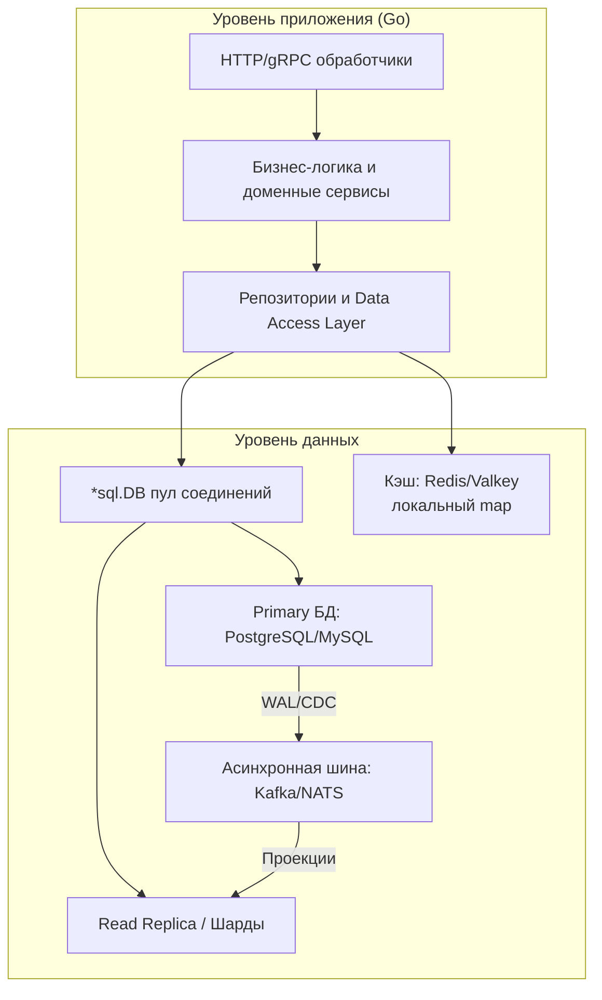
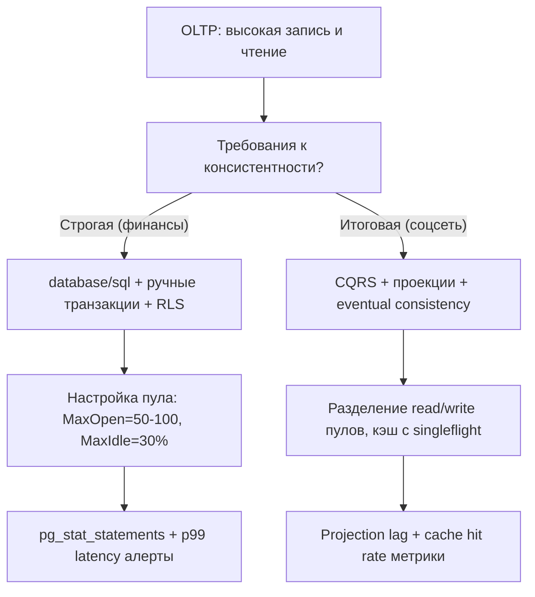
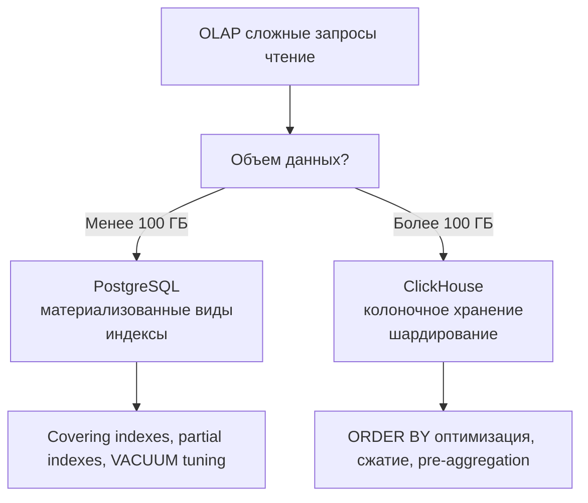
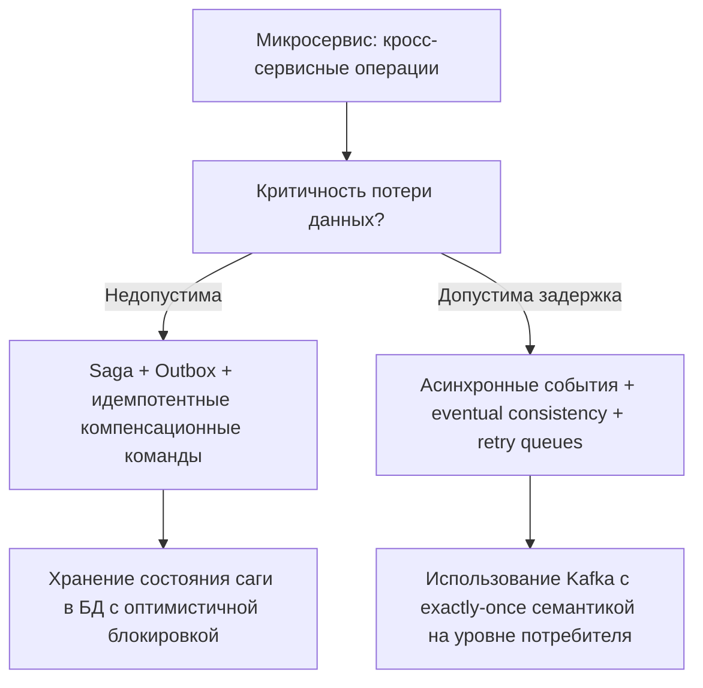

## Введение: От отдельных компонентов к целостной системе

Завершая раздел «Практика и архитектура», мы собираем разрозненные пазлы в единую картину работы с базами данных в экосистеме Go. Для инженера уровня Senior/Lead важно не просто знать, как написать `SELECT` или настроить пул соединений. Критически важно понимать, как все компоненты взаимодействуют под нагрузкой, как компромиссы в одном слое влияют на другие, и как проектировать систему, которая остается надежной, производительной и безопасной при масштабировании.

В этой итоговой статье мы:
*   Синтезируем ключевые принципы работы с БД в Go от подключения до распределенных транзакций.
*   Предоставим архитектурные чеклисты и decision framework для выбора подходов под разные сценарии.
*   Покажем, как механика рантайма Go (G-M-P, GC, netpoll) влияет на взаимодействие с СУБД.
*   Обобщим паттерны обеспечения надежности: от идемпотентности до disaster recovery.
*   Сформулируем вопросы для самопроверки и направления для углубленного изучения.

> [!info] Под капотом
> Работа с базами данных в Go — это постоянный баланс между явностью и абстракцией, контролем и продуктивностью, производительностью и безопасностью. Понимание того, как `*sql.DB` маппируется на системные сокеты, как `rows.Scan` аллоцирует память в куче, как `context.Context` прерывает сетевые вызовы через `epoll`, позволяет принимать осознанные архитектурные решения, а не следовать шаблонам слепо.

## Архитектурная матрица: Компоненты и их взаимодействие

Современная бэкенд-система на Go, работающая с данными, строится из следующих взаимосвязанных слоев:



1.  **HTTP/gRPC слой**: Принимает внешние запросы, валидирует входные данные, извлекает `context.Context` для управления временем жизни операции.
2.  **Бизнес-логика**: Содержит инварианты домена, координирует вызовы репозиториев, управляет транзакционными границами.
3.  **Data Access Layer (DAL)**: Абстрагирует доступ к данным, инкапсулирует SQL, обеспечивает маппинг между доменными моделями и строками БД.
4.  **Пул соединений (`*sql.DB`)**: Управляет жизненным циктом физических подключений, балансирует нагрузку, применяет настройки `SetMaxOpenConns`, `SetConnMaxLifetime`.
5.  **Кэш**: Снижает нагрузку на БД для часто читаемых данных, требует стратегий инвалидации и защиты от `stampede`.
6.  **Primary БД**: Источник истины для записи, обеспечивает ACID-транзакции, строгую консистентность.
7.  **Read Replica / Шарды**: Масштабируют чтение, допускают eventual consistency, требуют маршрутизации запросов.
8.  **Асинхронная шина**: Развязывает запись и чтение через события, обеспечивает проекции для CQRS, компенсирующие транзакции для Saga.

> [!tip] Собеседование
> **Вопрос:** Почему в Go не рекомендуется использовать один `*sql.DB` для read и write операций в высоконагруженной системе?
> **Ответ:** Write-операции обычно требуют более строгих таймаутов, меньшего размера пула (чтобы не блокировать критичные транзакции) и иных настроек `SetConnMaxLifetime`. Read-операции могут использовать агрессивный пул, чтение без блокировок, кэширование планов. Разделение пулов позволяет независимо масштабировать и тюнить каждый поток нагрузки. Кроме того, при сбое реплики read-пул можно перенаправить, не затрагивая write-соединения.

## Принципы работы с данными в Go: Сводная таблица

| Принцип | Реализация в Go | Механика «под капотом» | Когда нарушать |
|---------|-----------------|------------------------|----------------|
| **Явность превыше магии** | `database/sql` + ручной SQL / `sqlc` | Прямой контроль над запросами, планами, аллокациями | При прототипировании, внутренних инструментах |
| **Контекст для всего** | `QueryContext`, `ExecContext`, `BeginTx` | `context.Done()` интегрирован с `netpoll`, паркует горутины без блокировки тредов | Только для фоновых задач с собственным управлением отменой |
| **Пул — это ресурс** | `SetMaxOpenConns`, `SetMaxIdleConns`, `Stats()` | Мьютексы, атомарные счетчики, каналы ожидания в `*sql.DB` | Для одноразовых скриптов миграции/сидинга |
| **Транзакции — короткие** | `tx, err := db.BeginTx(ctx, opts)` + быстрый `Commit` | Удержание соединения в `inUse`, блокировки в БД, рост `temp_buffers` | Для batch-загрузок, где атомарность важнее латентности |
| **Идемпотентность — закон** | `ON CONFLICT`, `idempotency_key`, `event_id` | Уникальные индексы, хеши, проверки перед вставкой | Для чисто аппенд-логов, где дубли допустимы и отфильтровываются позже |
| **Кэш — оптимизация, не хранилище** | `singleflight`, `TTL + jitter`, `Redis Pipeline` | Аллокации при десериализации, давление на GC, сетевые RTT | Для критичных данных, где консистентность важнее скорости |
| **Безопасность по умолчанию** | Параметризация, `crypto/subtle`, `tls.Config` | Парсер СУБД разделяет код и данные, постоянное время сравнения | Для внутренних инструментов в изолированном контуре с доверенным вводом |

> [!warning] Ловушка / Gotcha
> **Игнорирование `rows.Close()` и `tx.Rollback()`**
> Самая распространенная утечка ресурсов в Go-приложениях с БД. Невозвращенное соединение остается в `inUse`, пул исчерпывается, новые запросы блокируются. Всегда используйте `defer` сразу после проверки ошибки:
> ```go
> rows, err := db.QueryContext(ctx, query, args...)
> if err != nil { return err }
> defer rows.Close() // Гарантирует возврат в пул даже при панике
> ```
> Аналогично для транзакций: `defer func() { if err != nil { tx.Rollback() } }()`.

## Механика рантайма: Как Go влияет на работу с БД

Понимание внутренней механики рантайма позволяет писать код, который эффективно использует ресурсы и предсказуемо ведет себя под нагрузкой.

### Конкурентность: Горутины, треды и netpoll

Когда горутина выполняет `db.QueryContext`:
1.  Выдается соединение из пула (захват `db.mu`).
2.  Отправляется запрос через `write()` (syscall).
3.  Если данные не готовы, горутина паркуется в `netpoll` (интеграция с `epoll`/`kqueue`).
4.  Системный тред `M` освобождается для других горутин.
5.  При готовности данных горутина возвращается в очередь `runq`, продолжает выполнение.

> [!info] Под капотом
> Эта модель позволяет одному системному треду обслуживать тысячи ожидающих БД горутин. Однако каждый `epoll_wait` и пробуждение создают оверхед. При очень высокой конкуренции (десятки тысяч одновременных запросов) может возникнуть `thundering herd` на уровне планировщика. Оптимизация: увеличивайте `GOMAXPROCS`, используйте пулы соединений адекватного размера, применяйте `sync.Pool` для переиспользования буферов запросов.

### Garbage Collector и аллокации при работе с данными

Каждая операция с БД создает аллокации:
*   `rows.Scan(&var)` — указатели «убегают» в кучу (Escape Analysis).
*   Десериализация `json.Unmarshal`, `pgtype` — временные структуры в `Gen 0`.
*   Буферы для сетевых запросов/ответов — `[]byte` аллокации.

При нагрузке 10 000 RPS с средним ответом 2 КБ вы создаете ~20 МБ/сек новых объектов. Это запускает частые сборщики `Gen 0`, которые при переполнении продвигают объекты в `Gen 1`, увеличивая паузы.

**Оптимизации:**
*   Переиспользуйте буферы через `sync.Pool` для чтения из `rows`.
*   Используйте бинарные форматы (Protobuf) вместо JSON для снижения аллокаций парсинга.
*   Избегайте `interface{}` в горячих путях — типизация помогает компилятору оптимизировать.
*   Профилируйте аллокации через `pprof -alloc_space`.

> [!tip] Собеседование
> **Вопрос:** Почему `rows.Scan(&[]byte)` может быть опасен для производительности?
> **Ответ:** При сканировании в `[]byte` драйвер аллоцирует новый слайс для каждой колонки, копируя данные из внутреннего буфера. При миллионах строк это создает огромное давление на GC. Оптимизация: используйте `pgx` с доступом к сырому буферу (`conn.PgConn().ReadBuffer()`) для zero-copy парсинга, или сканируйте напрямую в переиспользуемые структуры.

## Паттерны надежности: От идемпотентности до Disaster Recovery

Надежная система строится на композиции паттернов, каждый из которых закрывает определенный класс отказов.


1.  **Идемпотентность**: Гарантия, что повторный запрос не изменит состояние. Реализуется через `idempotency_key`, `ON CONFLICT`, уникальные `event_id`.
2.  **Безопасные ретраи**: Экспоненциальная задержка с джиттером, лимит попыток, идемпотентные операции.
3.  **Таймауты**: `context.WithTimeout` на уровне запроса, `statement_timeout` в БД, `read_timeout` в драйвере.
4.  **Circuit breaker**: Прекращение вызовов к деградировавшей зависимости, чтобы не усугублять сбой.
5.  **Fallback**: Возврат кэшированных данных, упрощенной логики или понятной ошибки вместо `500`.
6.  **Мониторинг**: Метрики `db.Stats()`, `pg_stat_statements`, трейсинг запросов, алерты на аномалии.
7.  **Disaster Recovery**: Бэкапы, PITR, автоматический failover, регулярные учения восстановления.

> [!warning] Ловушка / Gotcha
> **Ретраи без идемпотентности = дублирование данных**
> Если вы ретраите `INSERT` без проверки уникальности, при сетевом таймауте (когда запрос на самом деле выполнился) вы создадите дубликат. Всегда комбинируйте ретраи с идемпотентными ключами или используйте `INSERT ... ON CONFLICT DO NOTHING`.

## Decision Framework: Какой подход выбрать?

Не существует универсального решения. Выбор зависит от контекста: нагрузки, требований к консистентности, команды, сроков.

### Сценарий 1: Высоконагруженный OLTP-сервис (10 000+ RPS)



**Рекомендации:**
*   Используйте `pgx` вместо `lib/pq` для лучшей производительности и поддержки `COPY`.
*   Настройте `SetConnMaxLifetime=15-30m` для ротации соединений и предотвращения `stale connections`.
*   Применяйте партиционирование по времени для таблиц с историческими данными.
*   Мониторьте `WaitDuration` в `db.Stats()` — рост сигнализирует о нехватке соединений или медленных запросах.

### Сценарий 2: Аналитика и отчетность (сложные SELECT, малая запись)



**Рекомендации:**
*   Выносите тяжелые запросы на read replica, чтобы не блокировать primary.
*   Используйте `EXPLAIN ANALYZE` для каждого нового запроса, проверяйте `Buffers: hit/read`.
*   Для агрегаций применяйте материализованные виды с инкрементальным обновлением через триггеры или воркеры.
*   Кэшируйте результаты отчетов с коротким TTL, если допустима небольшая задержка актуальности.

### Сценарий 3: Микросервис с распределенными транзакциями



**Рекомендации:**
*   Проектируйте каждый шаг саги как идемпотентную операцию с уникальным `correlation_id`.
*   Используйте паттерн Outbox для атомарной записи бизнес-данных и события в одну транзакцию.
*   Мониторьте `projection_lag` и `saga_execution_time`, настраивайте алерты на аномалии.
*   Документируйте компенсирующие действия для каждого шага и тестируйте их в isolation.

## Чеклист для продакшена: Готовность к нагрузке и сбоям

Перед деплоем в production убедитесь, что выполнены следующие пункты:

### Конфигурация и подключение
- [ ] `*sql.DB` создается один раз при старте и передается через зависимости.
- [ ] Настроены `SetMaxOpenConns`, `SetMaxIdleConns`, `SetConnMaxLifetime` под нагрузку.
- [ ] Используется `context.Context` с таймаутами для всех операций с БД.
- [ ] Настроен `pgbouncer` или аналогичный пулер для процессных СУБД при высокой конкуренции.

### Запросы и транзакции
- [ ] Все запросы параметризованы, нет строковой конкатенации с пользовательским вводом.
- [ ] Транзакции максимально короткие, не содержат внешних вызовов или сложной логики.
- [ ] Используется `defer rows.Close()` и `defer tx.Rollback()` повсеместно.
- [ ] Для массовых операций применяется батчинг и `COPY`/`INSERT ... VALUES (...), (...)`.

### Надежность и отказоустойчивость
- [ ] Реализована идемпотентность для всех операций записи.
- [ ] Настроены ретраи с экспоненциальной задержкой и джиттером.
- [ ] Используется circuit breaker для вызовов внешних зависимостей.
- [ ] Есть fallback-логика на случай недоступности БД или кэша.

### Безопасность
- [ ] Подключение к БД использует TLS с `verify-full` и валидацией сертификатов.
- [ ] Учетная запись приложения имеет минимально необходимые привилегии (принцип наименьших прав).
- [ ] Чувствительные данные шифруются на уровне приложения или БД.
- [ ] Секреты не попадают в логи, используются редаторы или структурированное логирование.

### Мониторинг и наблюдаемость
- [ ] Экспортируются метрики `db.Stats()`: `InUse`, `Idle`, `WaitCount`, `WaitDuration`.
- [ ] Включен `pg_stat_statements` для анализа медленных запросов.
- [ ] Настроены алерты на рост `p99 latency`, `error rate`, `connection pool exhaustion`.
- [ ] Реализован распределенный трейсинг (OpenTelemetry) для сквозной трассировки запросов.

### Аварийное восстановление
- [ ] Настроены регулярные бэкапы с проверкой восстановления.
- [ ] Реализована архивация WAL для Point-in-Time Recovery.
- [ ] Есть документированный runbook для failover и failback процедур.
- [ ] Проводятся регулярные учения по восстановлению (Disaster Recovery Drill).

> [!tip] Собеседование
> **Вопрос:** Как бы вы диагностировали ситуацию, когда приложение внезапно начало получать ошибки `connection pool exhausted`, хотя нагрузка не выросла?
> **Ответ:** 
> 1. Проверить метрики `db.Stats()`: если `WaitCount` и `WaitDuration` резко выросли, а `InUse` близко к `MaxOpen` — пул исчерпан.
> 2. Проанализировать `pg_stat_activity`: есть ли долгие запросы, блокировки, транзакции в состоянии `idle in transaction`.
> 3. Проверить логи приложения на утечки `rows.Close()` или забытые транзакции.
> 4. Использовать `pprof` для анализа горутин: нет ли ливня паркованных на ожидании пула горутин.
> 5. Возможные причины: медленный запрос заблокировал соединение, утечка ресурсов, сетевая задержка увеличила время удержания соединения.

## Направления для углубленного изучения

Освоив основы, вы можете углубиться в следующие темы:

1.  **Внутреннее устройство СУБД**: Изучите исходный код PostgreSQL (`src/backend`), чтобы понимать, как реализованы индексы, транзакции, репликация.
2.  **Продвинутое профилирование**: Освойте `pprof`, `trace`, `eBPF` для глубокого анализа производительности на уровне ядра.
3.  **Распределенные системы**: Изучите алгоритмы консенсуса (Raft, Paxos), распределенные транзакции (2PC, Saga), теорему CAP на практике.
4.  **Специализированные СУБД**: Погрузитесь в особенности ClickHouse (колоночное хранение), TimescaleDB (временные ряды), CockroachDB (распределенный SQL).
5.  **Безопасность на уровне железа**: Изучите Intel SGX, AMD SEV, TPM для защиты данных в использовании (confidential computing).

## Итог: Путь от кода к архитектуре

Работа с базами данных в экосистеме Go — это путь от написания отдельных запросов к проектированию надежных, масштабируемых и безопасных систем хранения. Ключевые принципы для инженера уровня Senior/Lead:

*   **Понимайте механику**: Знание того, как `*sql.DB` управляет пулом, как `rows.Scan` аллоцирует память, как `context` прерывает сетевые вызовы, позволяет принимать осознанные решения.
*   **Балансируйте компромиссы**: Явность против абстракции, производительность против безопасности, консистентность против доступности. Нет правильных ответов, есть контекстно-оптимальные.
*   **Проектируйте для отказа**: Предполагайте, что сеть ненадежна, диск заполнится, БД упадет. Идемпотентность, таймауты, ретраи, circuit breakers — не опции, а необходимость.
*   **Измеряйте всё**: Интуиция обманчива. Метрики, логи, трейсы — ваши главные инструменты для понимания поведения системы в реальном мире.
*   **Документируйте и тестируйте**: Архитектурные решения, runbooks для восстановления, тесты на идемпотентность и отказоустойчивость — это инвестиции в будущую стабильность.

Освоив эти принципы, вы сможете не просто писать код, который работает, а проектировать системы, которые выдерживают рост, адаптируются к изменениям и восстанавливаются после сбоев. Это и есть суть инженерного мастерства в области работы с данными.

Данный раздел закрывает тему практической архитектуры работы с базами данных. Для дальнейшего развития рекомендуется перейти к изучению распределенных систем и алгоритмов консенсуса, которые лежат в основе современных кластерных решений. Следующий логический шаг — раздел [[14. Распределенные системы на Go]], где мы разберем, как обеспечивать согласованность и доступность в масштабах кластера.