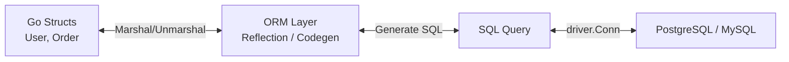
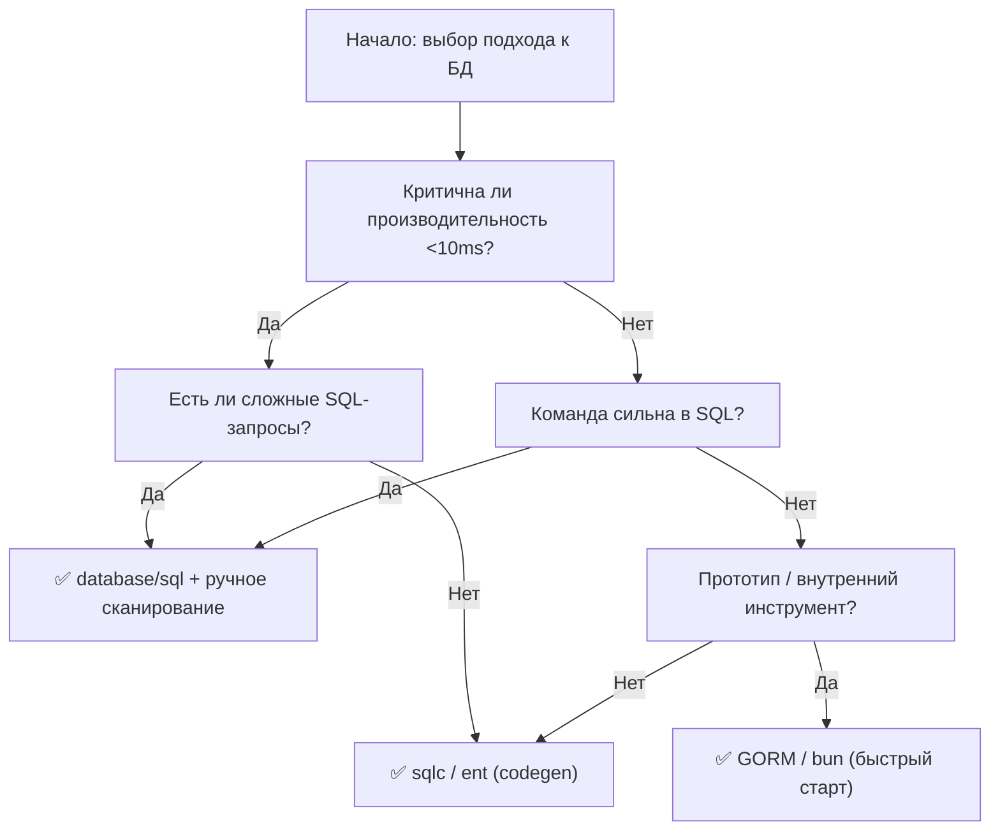

## Введение: Вечный спор инженерии

Выбор между «сырым» SQL и ORM (Object-Relational Mapping) — это не просто вопрос предпочтений в синтаксисе. Это фундаментальное архитектурное решение, которое влияет на производительность, поддерживаемость, тестируемость и даже на то, как ваша команда мыслит о данных.

В экосистеме Go этот выбор стоит особенно остро. Язык, созданный для простоты, явности и производительности, часто вступает в конфликт с философией классических ORM, которые стремятся к «магии», абстракции и автоматизации.

В этой статье мы беспристрастно разберем:
*   Что такое ORM и какие реализации популярны в Go (GORM, ent, bun, sqlc).
*   Механику работы «под капотом»: рефлексия, аллокации, генерация запросов.
*   Компромиссы между контролем, производительностью и скоростью разработки.
*   Идиоматические паттерны для гибридного подхода.
*   Типичные ловушки (N+1, утечки транзакций) и вопросы с собеседований.

> [!tip] Собеседование
> **Вопрос:** Почему в высоконагруженных системах на Go часто отказываются от «классических» ORM в пользу `database/sql` или codegen-инструментов?
> **Ответ:** Классические ORM (особенно с активной рефлексией) создают значительный оверхед на аллокации памяти и работу GC из-за динамического анализа типов в рантайме. В Go, где производительность и предсказуемость латентности критичны, разработчики предпочитают явный контроль над запросами (`database/sql`) или генерацию типобезопасного кода на этапе компиляции (`sqlc`), чтобы избежать непредсказуемых пауз GC и скрытых медленных запросов.

## Что такое ORM: Абстракция и её цена

ORM (Object-Relational Mapping) — это прослойка, которая автоматически преобразует данные между реляционными таблицами и объектами в языке программирования.



### Основные функции ORM:
1.  **Маппинг схем**: Таблица `users` ↔ структура `type User struct`.
2.  **CRUD-генерация**: `user.Save()` → `INSERT INTO users ...`.
3.  **Query Builder**: Построение запросов через цепочки методов вместо строк.
4.  **Отношения**: Автоматическая загрузка связанных данных (`Preload`, `Joins`).
5.  **Миграции**: Управление схемой БД через код на Go.

### Популярные решения в Go

| Инструмент | Тип | Ключевые особенности |
|------------|-----|---------------------|
| **GORM** | Runtime ORM | Полноценный, «магический», богатый функционал, высокая рефлексия |
| **ent** | Codegen ORM | Типобезопасный, генерирует код, графовая модель, от Facebook |
| **bun** | Runtime + Codegen | Гибридный, быстрый, совместим с `database/sql`, от автора go-pg |
| **sqlc** | Codegen (SQL-first) | Пишете чистый SQL → получаете типобезопасный Go-код, нет рантайм-оверхеда |
| **xorm** | Runtime ORM | Поддержка множества БД, активная запись, кэширование |

> [!info] Под капотом
> Различие между **Runtime ORM** (GORM) и **Compile-time Codegen** (sqlc, ent) фундаментально:
> *   **Runtime**: Анализирует структуру `reflect.Type` во время выполнения, динамически строит запросы. Гибко, но дорого для CPU и GC.
> *   **Codegen**: Анализирует схему БД или SQL-запросы на этапе сборки, генерирует статический, типобезопасный код. Нет рефлексии, компилятор проверяет типы, производительность как у ручного кода.

## Производительность: Рефлексия, аллокации и GC

### Механика рефлексии в Runtime ORM

Когда вы вызываете `db.Create(&user)` в GORM, происходит следующее:

```go
// Упрощенная схема работы рефлексии
func (db *DB) Create(value interface{}) *DB {
    // 1. Получаем отражение типа
    rv := reflect.ValueOf(value)
    rt := rv.Type()
    
    // 2. Итерируем по полям, ищем теги
    for i := 0; i < rt.NumField(); i++ {
        field := rt.Field(i)
        tag := field.Tag.Get("gorm") // Парсинг тегов
        // ...
    }
    
    // 3. Динамически строим запрос
    // 4. Выполняем через database/sql
}
```

> [!info] Под капотом: Цена рефлексии
> Каждый вызов `reflect.ValueOf`, `field.Tag.Get`, `rv.Field(i)` — это:
> *   **Аллокации в куче**: `reflect` часто создает промежуточные объекты.
> *   **Отсутствие инлайна**: Компилятор не может оптимизировать код, использующий рефлексию.
> *   **Нагрузка на GC**: При обработке тысяч запросов в секунду временные объекты рефлексии создают значительное давление на сборщик мусора.
>
> Бенчмарки показывают, что простой `db.Raw().Scan()` может быть в 2-5 раз быстрее и создавать на 80% меньше аллокаций, чем эквивалентный вызов через GORM с рефлексией.

### Сравнительный бенчмарк (концептуальный)

```go
// Benchmark: Вставка 1000 записей
// ❌ GORM (с рефлексией)
for i := 0; i < 1000; i++ {
    db.Create(&User{Name: fmt.Sprintf("user%d", i)})
}
// Время: ~150ms, Аллокации: ~5000, GC-паузы: заметные

// ✅ database/sql + ручное сканирование
stmt, _ := db.Prepare("INSERT INTO users (name) VALUES ($1)")
for i := 0; i < 1000; i++ {
    stmt.Exec(fmt.Sprintf("user%d", i))
}
// Время: ~45ms, Аллокации: ~200, GC-паузы: минимальные

// ✅ sqlc (сгенерированный код)
for i := 0; i < 1000; i++ {
    queries.InsertUser(ctx, fmt.Sprintf("user%d", i))
}
// Время: ~50ms, Аллокации: ~250, Типобезопасность: полная
```

> [!warning] Ловушка / Gotcha
> **N+1 проблема в ORM**
> Классическая ошибка:
> ```go
> // GORM пример
> var users []User
> db.Find(&users) // 1 запрос: SELECT * FROM users
> 
> for _, u := range users {
>     var orders []Order
>     db.Where("user_id = ?", u.ID).Find(&orders) // N запросов!
> }
> ```
> Вместо 1 запроса выполняется 1 + N запросов к БД. При N=1000 это катастрофа для производительности.
> 
> **Решение:** Использовать `Preload` / `Joins` для eager loading:
> ```go
> db.Preload("Orders").Find(&users) // 1 запрос с JOIN или 2 оптимизированных запроса
> ```
> В `database/sql` эта проблема очевидна сразу, так как вы явно пишете каждый `JOIN`.

## Контроль и гибкость: Преимущества сырого SQL

### Полный контроль над запросом

```go
// ✅ database/sql: Вы видите и контролируете каждый байт запроса
query := `
    SELECT u.id, u.name, COUNT(o.id) as order_count
    FROM users u
    LEFT JOIN orders o ON o.user_id = u.id AND o.created_at > $1
    WHERE u.active = true
    GROUP BY u.id, u.name
    HAVING COUNT(o.id) > $2
    ORDER BY order_count DESC
    LIMIT $3
`
rows, err := db.QueryContext(ctx, query, since, minOrders, limit)
```

**Преимущества:**
*   **Оптимизация**: Вы можете использовать специфичные фичи БД (CTE, оконные функции, JSON-операторы).
*   **План выполнения**: Легче анализировать через `EXPLAIN`, так как запрос явный.
*   **Рефакторинг**: Поиск и замена запросов через текстовый поиск по коду.
*   **Миграция БД**: При смене СУБД легче переписать чистый SQL, чем абстракции ORM.

> [!tip] Собеседование
> **Вопрос:** Когда стоит использовать сырой SQL вместо ORM?
> **Ответ:**
> 1.  Сложные аналитические запросы с оконными функциями, CTE, рекурсией.
> 2.  Высоконагруженные эндпоинты, где критична каждая миллисекунда и аллокация.
> 3.  Работа с устаревшей схемой БД, которую сложно отмапить на чистые структуры.
> 4.  Необходимость использовать специфичные фичи конкретной СУБД (PostGIS, full-text search).
> 5.  Команда с сильными знаниями SQL, но слабой экспертизой в конкретной ORM.

### Обратная сторона: Вероятность ошибок

```go
// ❌ Риск SQL-инъекции при неправильном использовании
query := fmt.Sprintf("SELECT * FROM users WHERE name = '%s'", userInput) // Уязвимо!

// ✅ Всегда используйте параметризацию
query := "SELECT * FROM users WHERE name = $1"
db.QueryContext(ctx, query, userInput) // Безопасно
```

> [!warning] Ловушка / Gotcha
> **Ручной маппинг и дрейф схемы**
> При использовании `database/sql` вы вручную сканируете колонки:
> ```go
> rows.Scan(&user.ID, &user.Name, &user.Email)
> ```
> Если схема БД изменится (добавится колонка, изменится порядок), код может молча начать работать неверно или упасть с `sql: expected 3 destination arguments in Scan, got 4`.
> 
> **Решение:** Используйте `rows.Columns()` для валидации или инструменты вроде `sqlc`, которые проверяют соответствие схемы и кода на этапе компиляции.

## Типобезопасность и поддерживаемость: Преимущества ORM

### Compile-time проверка с Codegen ORM

Инструменты вроде `sqlc` и `ent` предлагают «лучшее из двух миров»: вы пишете чистый SQL или декларативную схему, а инструмент генерирует типобезопасный Go-код.

```sql
-- query.sql (для sqlc)
-- name: GetUserByEmail :one
SELECT id, name, email FROM users WHERE email = $1;
```

```go
// Сгенерированный код (queries.sql.go)
func (q *Queries) GetUserByEmail(ctx context.Context, email string) (User, error) {
    row := q.db.QueryRowContext(ctx, getUserByEmail, email)
    var u User
    err := row.Scan(&u.ID, &u.Name, &u.Email) // Типы проверены компилятором
    return u, err
}
```

**Преимущества:**
*   **Типобезопасность**: Компилятор поймает ошибку, если вы передадите `int` вместо `string`.
*   **Рефакторинг**: Переименовали поле в структуре → компилятор покажет все места использования.
*   **Нет рефлексии**: Производительность как у ручного кода.
*   **Явный SQL**: Вы контролируете запросы, но не пишете бойлерплейт сканирования.

> [!info] Под капотом
> `sqlc` парсит ваши SQL-запросы с помощью настоящего SQL-парсера (например, `pgquery-go` для PostgreSQL), анализирует типы колонок по схеме БД и генерирует соответствующие поля в структурах. Это позволяет обнаружить ошибку типа «вы пытаетесь сканировать `BIGINT` в `int32`» еще до запуска программы.

### Продуктивность разработки

Для типовых CRUD-операций ORM может ускорить разработку в разы:

```go
// GORM: Создание пользователя в 1 строку
db.Create(&User{Name: "Alice", Email: "alice@example.com"})

// database/sql: ~10 строк кода
query := "INSERT INTO users (name, email, created_at) VALUES ($1, $2, $3) RETURNING id"
err := db.QueryRowContext(ctx, query, name, email, time.Now()).Scan(&id)
```

**Когда ORM выигрывает:**
*   Прототипирование и MVP, где скорость важнее оптимизации.
*   Внутренние инструменты, админ-панели, где нагрузка низкая.
*   Команды с доминированием разработчиков, сильных в бизнес-логике, но слабых в SQL.
*   Проекты с частым изменением схемы, где миграции и маппинг через ORM упрощают жизнь.

## Гибридные подходы: Практические паттерны

Опытные команды часто не выбирают «или/или», а комбинируют подходы.

### Паттерн 1: Repository с raw SQL для сложных запросов

```go
type UserRepository interface {
    GetByID(ctx context.Context, id int64) (*User, error) // Простой → можно через ORM
    SearchActiveWithStats(ctx context.Context, opts SearchOpts) ([]UserStat, error) // Сложный → raw SQL
}

type pgUserRepo struct {
    db *sql.DB // или *ent.Client для простых случаев
}

func (r *pgUserRepo) SearchActiveWithStats(ctx context.Context, opts SearchOpts) ([]UserStat, error) {
    // Пишем оптимизированный SQL вручную
    query := `
        WITH active_users AS (
            SELECT id, name FROM users 
            WHERE active = true AND last_seen > $1
        )
        SELECT u.id, u.name, COUNT(o.id) as orders
        FROM active_users u
        LEFT JOIN orders o ON o.user_id = u.id
        GROUP BY u.id, u.name
        ORDER BY orders DESC
        LIMIT $2
    `
    rows, err := r.db.QueryContext(ctx, query, opts.Since, opts.Limit)
    // ... ручное сканирование в специализированную структуру
}
```

### Паттерн 2: sqlc для 90% запросов, raw SQL для 10% экстремальных

```yaml
# sqlc.yaml
version: "2"
sql:
  - engine: "postgresql"
    queries: "queries/"
    schema: "schema/"
    gen:
      go:
        package: "db"
        # Генерируем типобезопасный код для большинства запросов
```

```go
// Для 90% случаев используем сгенерированные методы
user, err := queries.GetUserByID(ctx, db, id)

// Для 10% сложных случаев пишем raw SQL в отдельном пакете
results, err := analytics.RawComplexReport(ctx, db, params)
```

### Паттерн 3: Query Builder как компромисс

Библиотеки вроде `squirrel` или `masterminds/squirrel` позволяют строить запросы программно, но без магии ORM:

```go
import sq "github.com/Masterminds/squirrel"

query, args, err := sq.
    Select("u.id", "u.name", "COUNT(o.id) as order_count").
    From("users u").
    LeftJoin("orders o ON o.user_id = u.id").
    Where(sq.Gt{"o.created_at": since}).
    GroupBy("u.id", "u.name").
    OrderBy("order_count DESC").
    Limit(uint64(limit)).
    ToSql()

rows, err := db.QueryContext(ctx, query, args...)
```

**Плюсы:** Типобезопасность аргументов, удобство композиции, явный итоговый SQL.
**Минусы:** Все еще рантайм-генерация, сложнее отлаживать динамически собранные запросы.

## Ловушки и антипаттерны

### 1. Lazy loading и скрытые запросы

```go
// ❌ GORM: Непонятно, когда выполнится запрос
var user User
db.First(&user, 1)
// ... позже в коде ...
fmt.Println(user.Profile.Bio) // Может вызвать новый запрос, если профиль не был preload!

// ✅ Явная загрузка
db.Preload("Profile").First(&user, 1)
// Теперь все данные загружены, дальнейший доступ к user.Profile не делает запросов
```

> [!warning] Ловушка / Gotcha
> **Транзакции и ORM**
> В runtime ORM сессия (session) может кэшировать изменения объектов. Если вы меняете поле `user.Name = "New"` и не вызываете `Save()`, изменения могут не попасть в БД, или попасть с задержкой.
> 
> В `database/sql` состояние явно: нет `Exec` — нет изменения. Это проще для понимания и отладки в конкурентной среде.

### 2. Маппинг сложных типов

```go
// Проблема: JSON-колонка в PostgreSQL
type User struct {
    Settings map[string]interface{} `db:"settings"` // interface{} — потеря типобезопасности
}

// ✅ Решение: Строгий тип
type UserSettings struct {
    Theme string `json:"theme"`
    Notifications bool `json:"notifications"`
}

type User struct {
    Settings UserSettings `db:"settings"` // Типизировано, компилятор помогает
}
```

### 3. Миграции и версионирование схемы

ORM часто предлагают авто-миграции (`db.AutoMigrate()` в GORM). Это удобно для разработки, но опасно для продакшена.

> [!tip] Собеседование
> **Вопрос:** Почему не стоит использовать `AutoMigrate` в продакшене?
> **Ответ:**
> 1.  **Непредсказуемость**: Сложно предугадать, какой именно SQL сгенерирует ORM, особенно при рефакторинге структур.
> 2.  **Блокировки таблиц**: Некоторые изменения (добавление индекса, изменение типа колонки) могут блокировать таблицу на длительное время.
> 3.  **Откат**: Сложно или невозможно откатить авто-миграцию, если что-то пошло не так.
> 4.  **Аудит**: Нет явного файла миграции, который можно заревьювить в PR.
> 
> **Best practice:** Использовать инструменты миграций вроде `golang-migrate` или `goose` с явными SQL-файлами.

## Сравнительная таблица: Когда что выбирать

| Критерий | database/sql (Raw) | Runtime ORM (GORM) | Codegen (sqlc/ent) |
|----------|-------------------|-------------------|-------------------|
| **Производительность** | ⭐⭐⭐⭐⭐ | ⭐⭐⭐ | ⭐⭐⭐⭐⭐ |
| **Типобезопасность** | ⭐⭐ | ⭐⭐⭐ | ⭐⭐⭐⭐⭐ |
| **Скорость разработки** | ⭐⭐ | ⭐⭐⭐⭐⭐ | ⭐⭐⭐⭐ |
| **Контроль над запросом** | ⭐⭐⭐⭐⭐ | ⭐⭐⭐ | ⭐⭐⭐⭐ |
| **Сложность обучения** | Высокая | Низкая | Средняя |
| **Поддержка рефакторинга** | Низкая | Средняя | Высокая |
| **Риск скрытых багов** | Низкий (явно) | Высокий (магия) | Низкий (статика) |

### Рекомендации по выбору



## Итог: Прагматичный выбор инженера

Не существует «серебряной пули». Выбор между ORM и сырым SQL — это управление компромиссами:

*   **Выбирайте `database/sql`**, если:
    *   Вам нужен максимальный контроль и производительность.
    *   Запросы сложные, аналитические, специфичные для БД.
    *   Команда готова писать и поддерживать больше бойлерплейта ради явности.

*   **Выбирайте Runtime ORM (GORM)**, если:
    *   Скорость разработки и итераций важнее микро-оптимизаций.
    *   Проект на ранней стадии (MVP) или это внутренний инструмент.
    *   Команда имеет слабый опыт в SQL, но сильна в бизнес-логике.

*   **Выбирайте Codegen (sqlc, ent)**, если:
    *   Вы хотите типобезопасность и производительность без жертв в контроле.
    *   Готовы добавить шаг генерации кода в свой билд-пайплайн.
    *   Цените явность запросов, но не хотите писать `rows.Scan` вручную.

> [!tip] Собеседование
> **Финальный вопрос:** Какой подход вы бы выбрали для высоконагруженного микросервиса обработки платежей?
> **Сильный ответ:** «Я бы начал с `sqlc` или `database/sql` для критичных путей (списания, зачисления), чтобы гарантировать предсказуемую производительность и полный контроль над транзакциями. Для вспомогательных операций (логирование, аналитика, админка) мог бы использовать более высокоуровневый подход. Ключ — не догма, а прагматичное разграничение: критичный код требует критичного контроля».

В следующей статье мы разберем один из самых болезненных аспектов работы с БД в реальных проектах: как управлять изменениями схемы, версионировать миграции и безопасно деплоить изменения в продакшен без даунтайма. Читайте далее: [[4. Миграции базы данных]].