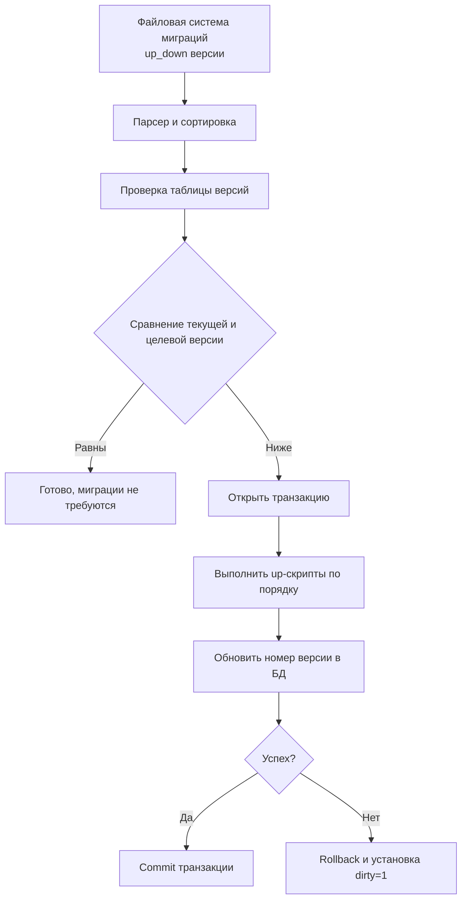

## Введение: Контроль версий для схемы БД

Миграции базы данных — это механизм версионирования изменений схемы (таблиц, индексов, представлений, ограничений) и структуры данных. В современной архитектуре бэкенда, где код деплоится автоматически через CI/CD, база данных часто становится главным узким местом. Неуправляемые изменения схемы ведут к рассинхрону кода и БД, потере данных и даунтайму.

Для инженера уровня Senior/Lead понимание миграций — это не просто умение запускать `migrate up`. Это глубокое знание того, как СУБД обрабатывает DDL-команды, как транзакции взаимодействуют с блокировками таблиц, как минимизировать влияние на продакшен и как спроектировать стратегию безопасного изменения схемы без остановки сервиса.

В этой статье мы разберем:
*   Архитектуру системы миграций и внутреннюю логику трекинга версий.
*   Различия в обработке DDL в PostgreSQL и MySQL (транзакционность против имплисит-коммитов).
*   Идиоматическую интеграцию миграций в Go-приложение через `embed.FS` и `golang-migrate`.
*   Механику блокировок, генерации WAL и влияние на диск при изменении больших таблиц.
*   Паттерны Zero-Downtime развертывания: Expand-Contract, `CONCURRENTLY` и пакетная обработка.
*   Типичные ловушки, антипаттерны и вопросы с хардовых собеседований.

> [!info] Под капотом
> Система миграций работает поверх двух фундаментальных концепций СУБД: **каталога схемы** (где хранятся метаданные о таблицах и индексах) и **журнала транзакций (WAL/redo log)**. Любое изменение схемы, даже простое `ADD COLUMN`, требует обновления системных таблиц и генерации записей в WAL, чтобы гарантировать восстановление после сбоя. Понимание этой цены — ключ к написанию безопасных миграций.

## 1. Архитектура механизма миграций

Любой современный инструмент миграций строится вокруг единой концептуальной модели:



### Таблица трекинга: `schema_migrations`

Обычно инструмент создает служебную таблицу:
```sql
CREATE TABLE schema_migrations (
    version BIGINT PRIMARY KEY,
    dirty     BOOLEAN DEFAULT FALSE,
    applied_at TIMESTAMP DEFAULT NOW()
);
```
*   **version**: Уникальный номер или хеш миграции.
*   **dirty**: Флаг, указывающий на частичное выполнение. Если `dirty = TRUE`, дальнейшие миграции блокируются до ручного вмешательства.
*   **applied_at**: Аудит времени применения.

> [!warning] Ловушка / Gotcha
> **Dirty State**
> Если скрипт падает посередине (например, из-за `syntax error` или `lock timeout`), флаг `dirty` устанавливается в `TRUE`. Инструмент откажется запускать следующие миграции, чтобы не наложить изменения на нестабильную схему.
> **Решение:** Внимательно читайте логи, исправляйте SQL, вручную сбрасывайте флаг или откатывайте частично примененные изменения. Никогда не игнорируйте `dirty` в продакшене.

## 2. Под капотом: Транзакции, DDL-блокировки и поведение СУБД

Поведение DDL (Data Definition Language) команд фундаментально различается в реляционных СУБД, что напрямую влияет на стратегии миграций.

### PostgreSQL: Транзакционный DDL

PostgreSQL поддерживает транзакционный DDL. Это означает, что `CREATE TABLE`, `ALTER COLUMN`, `CREATE INDEX` можно обернуть в `BEGIN` / `COMMIT` или `ROLLBACK`.

```sql
BEGIN;
ALTER TABLE users ADD COLUMN last_login TIMESTAMP;
-- Если следующая команда упадет, вся миграция откатится!
CREATE INDEX idx_users_last_login ON users(last_login);
COMMIT;
```

> [!info] Под капотом
> При транзакционном DDL в PostgreSQL изменения системных каталогов и структуры таблицы записываются в WAL, но становятся видимыми для других сессий только после `COMMIT`. До этого момента запросы продолжают использовать старую схему. Это обеспечивает атомарность, но может приводить к **блокировкам на уровне таблицы** (например, `ACCESS EXCLUSIVE LOCK` при `ALTER TABLE`), которые ставят в очередь все `SELECT`, `INSERT`, `UPDATE`.

### MySQL: Имлисит-коммиты

В MySQL (движок InnoDB) большинство DDL-команд **не поддерживают транзакции**. Выполнение `ALTER TABLE` автоматически завершает текущую транзакцию (`COMMIT`) и применяет изменения немедленно. Если скрипт упадет на второй команде, первая уже применится и не откатится.

> [!tip] Собеседование
> **Вопрос:** Как обеспечить атомарность миграций в MySQL?
> **Ответ:** Полную атомарность на уровне нескольких DDL-команд в MySQL получить невозможно. Приходится проектировать миграции так, чтобы каждая из них была идемпотентной и безопасной по отдельности, либо использовать инструменты, которые имитируют откат через компенсирующие `ALTER TABLE ... DROP`-команды. В `pressly/goose` для этого есть поддержка Go-миграций, где можно явно вызвать `Rollback`.

## 3. Идиоматическая интеграция в Go

В Go 1.16+ появился пакет `embed`, который позволяет встраивать файлы миграций прямо в бинарник. Это устраняет зависимость от внешних путей к файлам при деплое.

### 3.1. Использование golang-migrate с embed

```go
package db

import (
    "database/sql"
    "embed"
    "fmt"
    "log"
    
    "github.com/golang-migrate/migrate/v4"
    "github.com/golang-migrate/migrate/v4/database/postgres"
    _ "github.com/golang-migrate/migrate/v4/source/file" // Требуется для парсинга embed
    "github.com/golang-migrate/migrate/v4/source/iofs"
)

//go:embed migrations/*.sql
var migrationFS embed.FS

func RunMigrations(dsn string) error {
    db, err := sql.Open("postgres", dsn)
    if err != nil {
        return fmt.Errorf("open db for migration: %w", err)
    }
    defer db.Close()
    
    driver, err := postgres.WithInstance(db, &postgres.Config{})
    if err != nil {
        return fmt.Errorf("create migration driver: %w", err)
    }
    
    src, err := iofs.New(migrationFS, "migrations")
    if err != nil {
        return fmt.Errorf("create source: %w", err)
    }
    
    m, err := migrate.NewWithInstance("iofs", src, "postgres", driver)
    if err != nil {
        return fmt.Errorf("init migrate: %w", err)
    }
    
    // Запуск всех ожидающих миграций
    if err := m.Up(); err != nil && err != migrate.ErrNoChange {
        return fmt.Errorf("run migrations: %w", err)
    }
    
    log.Println("Migrations applied successfully")
    return nil
}
```

> [!info] Под капотом
> `m.Up()` блокирующая операция. Она поочередно считывает файлы из `embed.FS`, выполняет их через `*sql.DB` и обновляет `schema_migrations`. Если вы вызываете `RunMigrations()` в `main()` при старте сервиса, ваш процесс не начнет обслуживать HTTP-трафик, пока все миграции не завершатся. В микросервисной архитектуре это часто выносят в отдельный Job или init-контейнер.

### 3.2. Go-миграции для сложной логики

Когда чистого SQL недостаточно (нужно прочитать данные, преобразовать, вставить обратно), `goose` и `golang-migrate` поддерживают миграции на чистом Go.

```go
// migration_002_backfill_user_status.go
package migrations

import (
    "database/sql"
    "github.com/pressly/goose/v3"
)

func init() {
    goose.AddMigration(Up002, Down002)
}

func Up002(tx *sql.Tx) error {
    // Пакетная обработка для больших таблиц
    // Читаем старые записи, вычисляем новый статус, обновляем
    _, err := tx.Exec(`
        UPDATE users SET status = 'active' 
        WHERE last_login > NOW() - INTERVAL '30 days'
    `)
    return err
}

func Down002(tx *sql.Tx) error {
    _, err := tx.Exec(`
        UPDATE users SET status = 'unknown' 
        WHERE last_login > NOW() - INTERVAL '30 days'
    `)
    return err
}
```

## 4. Стратегии Zero-Downtime: Expand-Contract

Прямое удаление колонки или переименование поля в высоконагруженной системе приведет к ошибкам в старых версиях приложения, которые еще не обновились. Решением является паттерн **Expand-Contract**.


### Пример: Переименование колонки `name` -> `full_name`

1.  **Deploy v1**: Добавляем `full_name`. Приложение продолжает читать/писать в `name`.
2.  **Деплой мигратора**: Копируем данные из `name` в `full_name` (пакетно, чтобы не блокировать).
3.  **Deploy v2**: Приложение пишет в обе колонки, читает из `full_name`.
4.  **Deploy v3**: Приложение перестает писать в `name`.
5.  **Миграция**: `ALTER TABLE users DROP COLUMN name`.

> [!warning] Ловушка / Gotcha
> **Индексы и блокировки при добавлении**
> `CREATE INDEX idx ON users(column)` в PostgreSQL по умолчанию блокирует `INSERT/UPDATE/DELETE` на таблице до завершения сканирования. На таблице в 100 млн строк это может занять минуты.
> **Решение:** Используйте `CREATE INDEX CONCURRENTLY idx ON users(column)`. Он не блокирует запись, но работает в 2-3 прохода и требует больше времени. В миграциях это обязательно!

## 5. Mechanical Sympathy: Диск, WAL и нагрузка при миграциях

Понимание того, что происходит на уровне железа при миграциях, отделяет инженера от новичка.

### 5.1. Table Rewrite и I/O

В старых версиях PostgreSQL и в MySQL (InnoDB) команда `ALTER TABLE ADD COLUMN` с `DEFAULT` или изменением типа данных (например, `INT` -> `BIGINT`) часто вызывает **полную перезапись таблицы**.
*   СУБД читает каждую страницу диска.
*   Создает временную таблицу с новой структурой.
*   Копирует данные.
*   Меняет системные указатели.
*   **Результат:** Колоссальная нагрузка на диск, генерация гигабайтов WAL, блокировка чтения/записи.

### 5.2. Генерация WAL и MVCC-оверхед

Любое `UPDATE` в PostgreSQL не меняет данные на месте. Оно создает новую версию строки (tuple), а старую помечает как мертвую. При миграции-бэкилле на 10 млн строк вы:
*   Создаете 10 млн новых версий в куче.
*   Генерируете огромный объем WAL.
*   Заставляете `VACUUM` в будущем чистить 10 млн мертвых кортежей.
*   **Влияние на кэш:** При массовой записи вы вымываете полезные данные из `shared_buffers` и Page Cache ОС, что замедляет обычные пользовательские запросы.

> [!tip] Собеседование
> **Вопрос:** Как безопасно добавить колонку с дефолтным значением в большую таблицу без блокировок?
> **Ответ:** В современных PostgreSQL (11+) `ADD COLUMN ... DEFAULT` не вызывает переписывание таблицы, если значение статическое. Метаданные просто обновляются в системном каталоге. Однако если вы обновляете существующие строки (`UPDATE table SET col = val`), это уже DML-операция. Её нужно выполнять пакетами (например, по 1000-5000 строк) с задержкой между пачками, чтобы не перегрузить WAL и не вызвать `disk full` из-за генерации временных файлов.

## 6. Типичные ошибки и антипаттерны

1.  **Одна гигантская миграция**: Файл на 500 строк, меняющий 10 таблиц. Если что-то упадет, откат сложнейший. Разбивайте на атомарные шаги.
2.  **Игнорирование таймаутов**: Длительные `ALTER` или `UPDATE` без `statement_timeout` блокируют пул соединений и ждут вечно. Всегда устанавливайте таймаут на сессию миграции.
3.  **Неидемпотентные скрипты**: `CREATE TABLE users` без `IF NOT EXISTS` упадет при повторном запуске. Используйте защитные конструкции или доверяйте инструменту трекинга версий.
4.  **Запуск миграций из нескольких подов**: В кластере K8s несколько реплик сервиса могут одновременно попытаться применить миграции. Используйте `advisory locks` (PostgreSQL: `SELECT pg_try_advisory_lock(...)`) или `leader election`, чтобы миграции запускались только на одной ноде.

## 7. Итог

Миграции базы данных — это критический компонент жизненного цикла приложения. Их правильное проектирование требует баланса между скоростью разработки, безопасностью данных и влиянием на продакшен.

Ключевые принципы для уровня Senior/Lead:
*   Атомарность и идемпотентность — основа надежности.
*   Понимание разницы между транзакционным DDL (PostgreSQL) и имплисит-коммитами (MySQL).
*   Избегание блокировок через `CONCURRENTLY` и пакетную обработку.
*   Стратегия Expand-Contract для Zero-Downtime развертывания.
*   Встраивание миграций в бинарник через `embed.FS` и четкое разделение ответственности (миграции как отдельный процесс/Job).

Освоив механику миграций, вы сможете безопасно изменять схему БД, не боясь рассинхрона кода и потери данных. Но миграции — это лишь одна часть жизненного цикла. Как правильно версионировать саму схему, управлять историей изменений и интегрировать это с CI/CD пайплайном? В следующей статье мы разберем принципы и инструменты для этого: [[5. Версионирование схемы]].