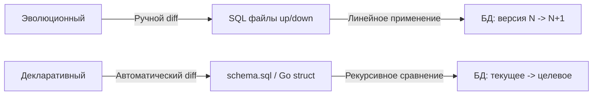

## Введение: Версионирование как инженерная дисциплина

Версионирование схемы базы данных — это практика управления изменениями структуры БД (таблиц, индексов, ограничений, типов) с тем же уровнем строгости, что и версионированием исходного кода. Для инженера уровня Senior/Lead это не просто запуск скрипта `migrate up`. Это архитектурный контракт, который гарантирует воспроизводимость сред (dev, staging, prod), безопасность развертывания и согласованность между кодом приложения и состоянием хранилища данных.

В микросервисной архитектуре, где десятки сервисов могут обращаться к общей БД или иметь собственные изолированные схемы, отсутствие четкой стратегии версионирования приводит к «снежинкам» в продакшене, невозможности отката (rollback) и скрытому рассинхрону, который проявляется только под нагрузкой.

В этой статье мы разберем:
*   Два фундаментальных подхода: эволюционный (миграции) и декларативный (состояние).
*   Архитектуру пайплайна доставки изменений от локальной разработки до продакшена.
*   Механику работы «под капотом»: как инструменты сравнивают схемы, читают системные каталоги и генерируют DDL.
*   Стратегии ветвления, разрешения конфликтов и интеграцию с CI/CD.
*   Идиоматичные паттерны тестирования схемы в Go с использованием `testcontainers` и `embed.FS`.
*   Типичные ловушки и каверзные вопросы с собеседований.

> [!info] Под капотом
> Версионирование схемы упирается в фундаментальное ограничение: **код можно откатить атомарно через перезапуск бинарника, а данные — нельзя**. Изменение схемы БД — это мутация состояния на диске. Любой подход к версионированию должен учитывать эту асимметрию и гарантировать, что переход между версиями схемы либо успешен полностью, либо оставляет БД в консистентном состоянии, пригодном для повторного применения.

## Подходы к управлению схемой: Миграции против Состояния

Существует две доминирующие парадигмы, каждая из которых имеет свои инженерные компромиссы.

### 1. Эволюционный подход (Migration-based)

История изменений хранится как линейная последовательность скриптов. Каждый файл описывает дельту (`up`) и откат (`down`) относительно предыдущей версии.

```
migrations/
├── 001_create_users.sql
├── 002_add_email_index.sql
└── 003_add_status_column.sql
```

**Инструменты в Go:** `golang-migrate`, `pressly/goose`, `rubenv/sql-migrate`.
**Плюсы:** Полный контроль над каждым байтом SQL, предсказуемая производительность, явная история изменений, легко интегрируется с ручным аудитом.
**Минусы:** Сложность при ветвлении, конфликты нумерации, необходимость писать `down`-скрипты вручную, линейная зависимость.

### 2. Декларативный подход (State-based)

Вы описываете желаемое состояние схемы в одном или нескольких файлах (чистый SQL, конфигурация, или Go-структуры). Инструмент сам вычисляет дельту между текущим состоянием БД и желаемым, генерируя необходимые `ALTER`-команды.

**Инструменты в Go/экосистеме:** `ariga/atlas`, `ent` (из коробки генерирует схему), `Prisma` (кросс-языковой).
**Плюсы:** Естественное разрешение конфликтов через Git-merge (сливаются файлы состояния, а не скрипты), проще поддерживать в командах с параллельной разработкой, не требует `down`-скриптов.
**Минусы:** «Магия» генерации DDL (сложно предсказать точный план выполнения), оверхед на сравнение схем, риск генерации неоптимальных или опасных команд (например, `DROP` вместо `ALTER` при неточной настройке).



> [!tip] Собеседование
> **Вопрос:** Когда следует выбирать декларативный подход вместо миграций?
> **Ответ:** Декларативный подход идеален для проектов с несколькими параллельными ветками разработки, где разработчики часто меняют одни и те же сущности. Git-merge для файлов состояния работает надежно, тогда как ручное разрешение конфликтов в пронумерованных миграциях требует координации. Однако для высоконагруженных OLTP-систем, где критичен контроль над блокировками и точный план выполнения `ALTER`, эволюционный подход предпочтительнее, так как генерируемый автоматически DDL может не учитывать нюансы вроде `CONCURRENTLY` или пакетной обработки.

## Архитектура пайплайна: От коммита к продакшену

Безопасное версионирование требует автоматизированного конвейера, который гарантирует идемпотентность и изоляцию.

```mermaid
flowchart LR
    Dev["Локальная разработка"] -->|git commit| PR["Pull Request"]
    PR -->|Trigger| CI["CI Job: Spin Up Test DB"]
    CI -->|migrate up + test| Validate["Валидация схемы и тесты"]
    Validate -->|Merge to main| Release["Release Pipeline"]
    Release -->|Pre-flight check| Deploy["Apply to Prod<br>(Advisory Lock + Backup)"]
    Deploy -->|Verify| Monitor["Observability + Rollback Plan"]
```



1.  **Локальная разработка**: Разработчик запускает `goose up` или аналогичную команду против локальной БД. Схема применяется мгновенно.
2.  **CI Валидация**: При открытии PR создается эфемерный контейнер с БД (например, через `testcontainers-go`). Миграции применяются, запускаются интеграционные тесты. Это отлавливает синтаксические ошибки и конфликты типов до мержа.
3.  **Прод-развертывание**: Миграции запускаются не как часть основного сервиса, а как отдельный Job или init-контейнер. Обязательно используется `pg_try_advisory_lock` (или аналог), чтобы только один под применял изменения в кластере.

> [!warning] Ловушка / Gotcha
> **Запуск миграций из пода приложения**
> Никогда не запускайте `m.Up()` внутри `main()` вашего HTTP-сервера в кластере K8s. Если одновременно поднимутся 3 реплики нового деплоя, все три попытаются применить миграции параллельно. Без распределенной блокировки это приведет к `deadlock`, `dirty state` или дублирующим изменениям.
> **Решение:** Выносите применение миграций в отдельный `Job` или используйте `initContainers` с последовательным запуском, либо применяйте `goose` с флагом `-allow-missing`, если деплой происходит построчно.

## Под капотом: Системные каталоги, diff и цена валидации

Как инструменты вроде `atlas` или `goose` понимают текущее состояние схемы? Они не гадают. Они опрашивают системные каталоги СУБД.

### Чтение каталога: `information_schema` и `pg_catalog`

При старте декларативного инструмента или проверке версии происходит последовательность запросов:
```sql
-- Пример запроса к системным каталогам PostgreSQL
SELECT table_name, column_name, data_type, is_nullable
FROM information_schema.columns
WHERE table_schema = 'public';

-- Получение индексов и констрейнтов
SELECT indexname, indexdef FROM pg_indexes WHERE schemaname = 'public';
```

> [!info] Под капотом
> Эти запросы читают системные таблицы, которые лежат в той же таблице, что и пользовательские данные, но обслуживаются отдельными кэшами (`relcache` в PostgreSQL). При первой загрузке после рестарта БД кэш пуст, и чтение каталога генерирует дополнительные `read`-syscall к диску.
> Декларативные инструменты загружают всё в память, строят граф зависимостей и вычисляют diff с помощью алгоритмов обхода деревьев (AST сравнение). Это требует значительного CPU и памяти на стороне клиента, особенно для схем с 500+ таблицами. В эволюционном подходе этого оверхеда нет: инструмент просто читает `schema_migrations` и применяет следующий файл.

### Цена валидации и сетевые задержки

В CI/CD пайплайне каждая валидация схемы означает:
1.  `dial()` к тестовой БД (сетевое рукопожатие).
2.  Несколько раунд-трипов для чтения каталога.
3.  Применение миграций (генерация WAL, обновление системных таблиц).
4.  Закрытие соединения.

Если ваш пайплайн запускает валидацию 50 раз в день, эти операции суммируются. Оптимизация: использовать `pgbouncer` в transaction-mode для кэширования соединений, или запускать валидацию в параллельных контейнерах с общим кэшем образа БД.

## Стратегии ветвления и разрешение конфликтов

В команде из 5+ разработчиков параллельная работа над схемой неизбежно создает конфликты.

### Конфликт нумерации в эволюционном подходе
Разработчик А создает `105_add_avatar.sql`, разработчик Б в другой ветке тоже создает `105_add_settings.sql`. При мерже возникает дубликат.
**Решения:**
1.  **Timestamp-based naming**: `20240520103000_add_avatar.sql`. Уникальность гарантируется временем.
2.  **Каталоги по фичам**: Каждый мержит свою папку, скрипт-агрегатор собирает их в хронологическом порядке перед деплоем.
3.  **CI Check**: Пайплайн проверяет монотонность версий и падает на `PR` при обнаружении дублей, заставляя разработчика переименовать файл.

### Декларативный подход и Git-merge
Файл `schema.sql` конфликтует как обычный текстовый файл. Разработчики решают конфликт в Git, после чего инструмент рассчитывает новый diff относительно продакшена. Это выглядит проще, но таит риск: если разработчик А удалил индекс, а Б добавил колонку, итоговый diff может сгенерировать `DROP INDEX` до `ADD COLUMN`, что нарушит зависимости.
**Защита:** Современные инструменты (`atlas`) имеют режим `--dev`, который применяет изменения к временной БД и проверяет целостность перед генерацией финального плана.

> [!tip] Собеседование
> **Вопрос:** Как безопасно мержить параллельные ветки с изменениями схемы?
> **Ответ:** Используйте стратегию «последний выигрывает с валидацией». Мержите изменения, затем запускайте `diff`-расчет против чистой копии продакшн-схемы (дампа). Просматривайте сгенерированный план миграции в ручном ревью. Никогда не применяйте автоматически сгенерированный DDL на прод без верификации человеком. Автоматизация полезна для генерации, но ответственность за блокировки и откат лежит на инженере.

## Интеграция с CI/CD и тестирование схемы в Go

Для надежной работы версионирование должно быть частью тестовой стратегии. Вот идиоматичный пример на Go с использованием `testcontainers` и `embed.FS`:

```go
package migrations_test

import (
    "context"
    "embed"
    "testing"
    "time"
    
    "github.com/golang-migrate/migrate/v4"
    _ "github.com/golang-migrate/migrate/v4/database/postgres"
    _ "github.com/golang-migrate/migrate/v4/source/iofs"
    "github.com/testcontainers/testcontainers-go"
    "github.com/testcontainers/testcontainers-go/wait"
)

//go:embed migrations/*.sql
var migrationFS embed.FS

func TestMigrationsApplyAndRollback(t *testing.T) {
    ctx, cancel := context.WithTimeout(context.Background(), 2*time.Minute)
    defer cancel()
    
    // Запуск эфемерного PostgreSQL
    req := testcontainers.ContainerRequest{
        Image:        "postgres:16-alpine",
        Env:          map[string]string{"POSTGRES_PASSWORD": "test"},
        ExposedPorts: []string{"5432/tcp"},
        WaitingFor:   wait.ForLog("database system is ready to accept connections"),
    }
    pgC, err := testcontainers.GenericContainer(ctx, testcontainers.GenericContainerRequest{
        ContainerRequest: req,
        Started:          true,
    })
    if err != nil {
        t.Fatalf("failed to start container: %s", err)
    }
    defer pgC.Terminate(ctx)
    
    connStr, _ := pgC.Endpoint(ctx)
    dsn := "postgres://postgres:test@" + connStr + "/postgres?sslmode=disable"
    
    // Применение миграций
    src, _ := iofs.New(migrationFS, "migrations")
    m, _ := migrate.NewWithSourceInstance("iofs", src, "postgres://"+dsn)
    
    if err := m.Up(); err != nil {
        t.Fatalf("migration failed: %s", err)
    }
    
    // Тест: откат последней миграции
    if err := m.Steps(-1); err != nil {
        t.Fatalf("rollback failed: %s", err)
    }
    
    // Тест: повторное применение (проверка идемпотентности и консистентности)
    if err := m.Up(); err != nil {
        t.Fatalf("re-apply failed: %s", err)
    }
}
```

> [!info] Под капотом
> `testcontainers` создает полноценный процесс БД в Docker. При `migrate.Up()` происходит реальное взаимодействие с `pg_catalog`, запись в WAL и проверка констрейнтов. Это не моки. Затраты на запуск контейнера ~1-2 секунды, что допустимо для CI, но слишком дорого для `go test -short`. Используйте `t.Skip()` или теги `//go:build integration` для локального запуска.

## Ловушки и вопросы собеседований

1.  **Гонка версий (Race Condition)**: Два сервиса на разных версиях кода обращаются к одной БД.
    *   *Решение:* Миграции должны быть **backward-compatible**. Добавлять можно всегда. Удалять или переименовывать только после перехода 100% трафика на новую версию кода (паттерн Expand-Contract из предыдущей статьи).
2.  **Неидемпотентные `up`-скрипты**: `CREATE TABLE` без `IF NOT EXISTS`.
    *   *Решение:* Доверяйте трекингу версий (`schema_migrations`). Не добавляйте защиту в каждый скрипт, иначе усложните отладку. Инструмент гарантирует запуск ровно один раз.
3.  **Потеря `down`-скрипта**: Разработчик пишет `up`, но забывает `down`. При `migrate down` инструмент падает.
    *   *Решение:* Настройте CI-линтер, который проверяет наличие парных файлов, или используйте инструменты, генерирующие `down` автоматически на основе реверса `up` (работает только для простых `CREATE`/`ADD`).

> [!tip] Собеседование
> **Вопрос:** Что делать, если миграция на продакшене зависла и заблокировала таблицу?
> **Ответ:** 
> 1.  Не паниковать. Найдите сессию через `pg_stat_activity` или `SHOW PROCESSLIST`.
> 2.  Проверьте `wait_event` или `state`. Если это `LOCK` на `ACCESS EXCLUSIVE`, значит `ALTER` ждет завершения транзакций.
> 3.  Отмените блокирующие транзакции (через `pg_terminate_backend`), но только после анализа бизнес-влияния.
> 4.  Для предотвращения: всегда используйте `CONCURRENTLY` для индексов, `statement_timeout` на сессии миграции, и применяйте изменения в часы низкой нагрузки. В идеале — разбивайте тяжелый `ALTER` на серию легких шагов.

## Итог

Версионирование схемы базы данных — это мост между скоростью разработки и стабильностью продакшена. Эволюционный подход дает контроль и прозрачность, декларативный упрощает ветвление и слияние. Ни один инструмент не отменяет необходимости инженерной дисциплины: обратная совместимость изменений, изолированная валидация в CI, распределенные блокировки при деплое и четкий план отката.

Освоив механику версионирования, вы получите предсказуемый процесс доставки изменений в хранилище. Но любая схема в итоге наполняется данными. Как правильно инициализировать базы тестовыми и демо-данными, чтобы не загрязнить прод и обеспечить быстрый старт локальной разработки? В следующей статье мы разберем паттерны работы с начальными данными: [[6. Seed данные]].