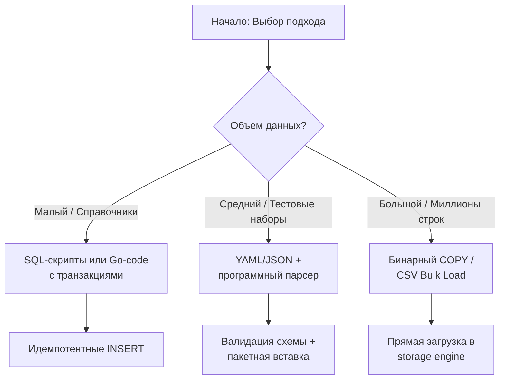
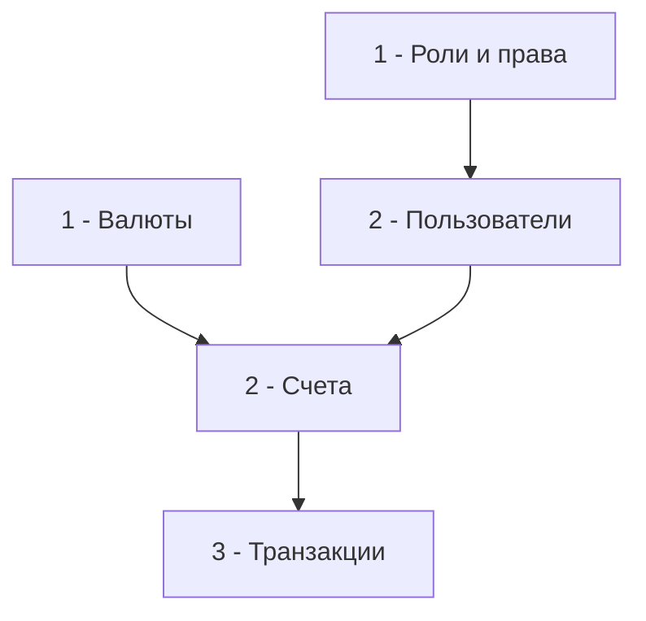

## Введение: Зачем нужны Seed-данные и почему это не просто "INSERT"

Seed-данные (начальные или справочные данные) — это предопределенный набор записей, необходимых для работы приложения, проведения тестов или демонстрации функционала. В отличие от миграций, которые меняют структуру схемы, сиды наполняют её содержимым: пользователи по умолчанию, справочники валют, ролевые модели, конфигурационные флаги или наборы данных для нагрузочного тестирования.

Для инженера уровня Senior/Seed управление сидингом — это задача воспроизводимости, предсказуемости и производительности. Ручные `INSERT`-ы в консоли или разрозненные SQL-файлы в репозитории быстро превращаются в источник рассинхрона между разработчиками, падения тестов в CI и, в худшем случае, порчи продакшен-данных.

В этой статье мы разберем:
*   Архитектурные подходы к сидингу: от чистого SQL до программной генерации в Go.
*   Механику массовой вставки на уровне движка хранения: WAL-буферизация, обновление B-деревьев, поведение `shared_buffers`.
*   Идиоматичную реализацию пакетной загрузки с использованием `database/sql` и низкоуровневого протокола `COPY`.
*   Стратегии обеспечения идемпотентности, работы с внешними ключами и транзакционными ограничениями.
*   Интеграцию с `testcontainers` и CI/CD для воспроизводимых тестовых сред.
*   Типичные ловушки, антипаттерны и вопросы с хардовых собеседований.

> [!info] Под капотом
> Сидинг — это по своей природе операция **последовательной записи** с периодической **случайной индексацией**. Понимание того, как СУБД балансирует между буферизацией в памяти и сбросом на диск, а также как Go-драйверы маппируют структуры данных в сетевые пакеты, позволяет ускорить загрузку в десятки раз и избежать исчерпания журналов транзакций.

## 1. Архитектурные подходы к инициализации данных

Выбор стратегии сидинга зависит от объема данных, частоты применения и требований к изоляции.



*   **SQL-скрипты**: Просты, декларативны, но негибки. Нет условной логики, сложно обрабатывать ошибки на уровне приложения, трудно параметризировать под разные окружения.
*   **Go-код с `database/sql`**: Полный контроль, возможность использовать бизнес-валидацию, генерацию UUID, хеширование паролей. Цена — накладные расходы на сериализацию и сетевые раунд-трипы.
*   **Форматы данных (CSV/YAML/JSON) + парсеры**: Хороший баланс между читаемостью и автоматизацией. Позволяют версионировать данные в Git и применять валидацию на этапе `unmarshal`.
*   **Интеграция с миграциями**: Некоторые инструменты (`goose`, `flyway`) позволяют миксовать DDL и DML. Удобно для маленьких справочников, но опасно для больших объемов, так как смешивает изменение схемы и данных в одном контексте.

## 2. Механика под капотом: Как СУБД переваривает массовую вставку

Когда вы отправляете `INSERT`, СУБД выполняет не одну операцию, а сложный конвейор.

### 2.1. Журнал транзакций (WAL) и физическая запись

Каждая модификация данных должна быть записана в WAL до сброса на диск (Write-Ahead Logging). При одиночных `INSERT` в рамках одной транзакции:
1.  Генерируется запись `INSERT` в WAL-буфер.
2.  Обновляется страница данных в `shared_buffers` (PostgreSQL) или Buffer Pool (InnoDB).
3.  Обновляются связанные B-Tree индексы (случайный доступ к страницам индексов).
4.  При `COMMIT` WAL-буфер сбрасывается на диск через `fsync`.

При **пакетной вставке** (`INSERT ... VALUES (...), (...)` или `COPY`):
*   WAL-записи группируются. СУБД применяет оптимизацию `wal_level` и может использовать `HEAP INSERT` без немедленного обновления индексов.
*   В PostgreSQL при загрузке через `COPY` индексы часто не обновляются построчно. Вместо этого таблица помечается как "неиндексированная", данные сбрасываются на диск, и только после завершения транзакции запускается `IndexBuildScan` — последовательное сканирование кучи для построения индексов. Это кардинально меняет паттерн IO со случайного на последовательный.

> [!info] Под капотом: Mechanical Sympathy
> Последовательная запись в кучу таблицы гораздо эффективнее случайной. При `COPY` данные попадают в новые страницы, которые еще не были вытеснены из кэша ОС. CPU кэширует последовательные блоки памяти, prefetcher предзагружает данные, а диск (даже SSD) обрабатывает большие последовательные блоки эффективнее, чем множество мелких `4KB random writes`. Использование `COPY` снижает количество системных вызовов `write()` и `fsync()`, разгружая ядро ОС и планировщик IO.

### 2.2. Проверка ограничений и Foreign Keys

Каждая вставка требует проверки `UNIQUE`, `NOT NULL` и `FOREIGN KEY`. В PostgreSQL проверка внешних ключей по умолчанию синхронная: для каждой строки выполняется поиск в родительской таблице. При миллионах строк это генерирует тысячи `IndexScan` запросов.
**Оптимизация:** В современных версиях можно использовать `SET constraints TO DEFERRED` внутри транзакции. Проверка FK переносится на момент `COMMIT`, что позволяет СУБД выполнить один массовый `HashJoin` или `MergeJoin` вместо построчных проверок.

## 3. Идиоматичная реализация в Go

Написание эффективного сидера требует учета аллокаций, пулинга соединений и контроля транзакций.

### 3.1. Пакетная вставка через `database/sql`

```go
package seeder

import (
	"context"
	"database/sql"
	"fmt"
	"strings"
	"time"
)

type User struct {
	ID    int
	Name  string
	Email string
}

// SeedUsers выполняет пакетную вставку с транзакцией и разбивкой на чанки
func SeedUsers(ctx context.Context, db *sql.DB, users []User) error {
	const batchSize = 1000 // Оптимальный размер для баланса между памятью и сетью

	tx, err := db.BeginTx(ctx, &sql.TxOptions{Isolation: sql.LevelReadCommitted})
	if err != nil {
		return fmt.Errorf("begin tx: %w", err)
	}
	defer func() {
		if err != nil {
			tx.Rollback()
		}
	}()

	stmt, err := tx.PrepareContext(ctx, `
		INSERT INTO users (id, name, email, created_at) 
		VALUES ($1, $2, $3, $4) 
		ON CONFLICT (email) DO NOTHING
	`)
	if err != nil {
		return fmt.Errorf("prepare stmt: %w", err)
	}
	defer stmt.Close()

	for i := 0; i < len(users); i += batchSize {
		end := i + batchSize
		if end > len(users) {
			end = len(users)
		}
		batch := users[i:end]

		for _, u := range batch {
			_, execErr := stmt.ExecContext(ctx, u.ID, u.Name, u.Email, time.Now())
			if execErr != nil {
				return fmt.Errorf("exec batch at offset %d: %w", i, execErr)
			}
		}
	}

	if err = tx.Commit(); err != nil {
		return fmt.Errorf("commit tx: %w", err)
	}
	return nil
}
```

> [!warning] Ловушка / Gotcha
> **Один огромный `INSERT`**
> Генерация строки `INSERT INTO t VALUES (...), (...), (...)` с 100 000 кортежей приведет к аллокации гигабайтной строки в памяти, превышению лимитов сетевого пакета (`max_allowed_packet` в MySQL) и огромному давлению на GC. Всегда разбивайте данные на чанки (обычно 500-5000 строк).

### 3.2. Экстремальная производительность: `pgx.CopyFrom`

Для загрузки сотен тысяч строк стандартный `database/sql` проигрывает протоколу `COPY`. Библиотека `github.com/jackc/pgx/v5` предоставляет нативную поддержку:

```go
import "github.com/jackc/pgx/v5/pgxpool"

func SeedBulk(ctx context.Context, pool *pgxpool.Pool, rows [][]interface{}) error {
	conn, err := pool.Acquire(ctx)
	if err != nil {
		return err
	}
	defer conn.Release()

	_, err = conn.Conn().CopyFrom(
		ctx,
		pgx.Identifier{"users"},
		[]string{"id", "name", "email"},
		pgx.CopyFromRows(rows),
	)
	return err
}
```

> [!info] Под капотом
> `COPY` использует бинарный протокол PostgreSQL, минуя текстовый парсер. Данные сериализуются напрямую в байтовый буфер, отправляются одним потоком, а на стороне сервера проходят минимальную валидацию. Аллокации в Go сводятся к созданию слайсов `[]byte` под чанки, которые переиспользуются через `sync.Pool`. Это снижает нагрузку на GC и ускоряет загрузку в 5-15 раз по сравнению с `ExecContext`.

## 4. Идемпотентность и управление зависимостями

Сидеры должны запускаться многократно без побочных эффектов.

### 4.1. Стратегии идемпотентности

| Подход | SQL | Когда использовать |
|--------|-----|-------------------|
| `ON CONFLICT DO NOTHING` | `INSERT ... ON CONFLICT (pk) DO NOTHING` | Справочники, демо-данные, допустимо пропускать существующие |
| `ON CONFLICT DO UPDATE` | `... DO UPDATE SET name = EXCLUDED.name` | Конфигурации, требующие синхронизации с кодом |
| `DELETE + INSERT` | `TRUNCATE table; INSERT ...` | Тестовые среды, где нужно чистое состояние |
| `UPSERT` через `MERGE` | Зависит от СУБД | Сложные бизнес-правила обновления |

### 4.2. Порядок загрузки и Foreign Keys

Сиды должны применяться в топологическом порядке графа зависимостей:
1.  Справочники без зависимостей (`currencies`, `roles`).
2.  Сущности с ссылками на справочники (`users` -> `roles`).
3.  Связи и транзакционные таблицы (`user_permissions`, `orders`).



> [!warning] Ловушка / Gotcha
> **Блокировки при параллельном сидинге**
> Если вы запускаете сидер из нескольких горутин, пытающихся вставить данные в связанные таблицы, легко получить `deadlock` или `unique violation`. В тестах используйте `sync.Once` или синхронизуйте сидеры через `context` и мьютексы, либо применяйте `pg_advisory_lock` для сериализации инициализации.

## 5. Интеграция с CI/CD и тестированием

Воспроизводимость тестов — главный критерий качества сидинга.

### 5.1. `testcontainers` и эфемерные БД

```go
// testhelper/db.go
func SetupTestDB(ctx context.Context) (*sql.DB, func()) {
    req := testcontainers.ContainerRequest{
        Image: "postgres:16-alpine",
        Env: map[string]string{
            "POSTGRES_USER":     "test",
            "POSTGRES_PASSWORD": "test",
            "POSTGRES_DB":       "testdb",
        },
        WaitingFor: wait.ForLog("database system is ready to accept connections"),
    }
    ctr, _ := testcontainers.GenericContainer(ctx, testcontainers.GenericContainerRequest{
        ContainerRequest: req,
        Started:          true,
    })
    
    endpoint, _ := ctr.Endpoint(ctx)
    dsn := fmt.Sprintf("postgres://test:test@%s/testdb?sslmode=disable", endpoint)
    
    db, _ := sql.Open("postgres", dsn)
    db.SetMaxOpenConns(5) // Тестам не нужен огромный пул
    
    // Применение миграций и сидов
    RunMigrations(ctx, db)
    SeedReferenceData(ctx, db)
    
    cleanup := func() {
        db.Close()
        ctr.Terminate(ctx)
    }
    return db, cleanup
}
```

> [!tip] Собеседование
> **Вопрос:** Как тестировать сидеры без реального подключения к БД?
> **Ответ:** Юнит-тестирование сидеров бессмысленно без СУБД, так как проверяется именно взаимодействие с движком хранения. Правильный подход — интеграционные тесты с `testcontainers`. Для ускорения в CI используйте предварительно забилженный образ (`docker commit` или `docker build` с сид-данными), либо запускайте сидер один раз в `TestMain` и используйте транзакции с `ROLLBACK` после каждого теста для изоляции.

## 6. Ловушки и вопросы собеседований

1.  **Исчерпание WAL / `disk full`**
    *   *Проблема:* Огромная транзакция генерирует больше WAL, чем доступно на диске или в `max_wal_size`.
    *   *Решение:* Разбивайте сиды на несколько транзакций, настройте `checkpoint_timeout` и `max_wal_size`, используйте `COPY`, который оптимизирует генерацию журналов.

2.  **Дрейф данных между версиями**
    *   *Проблема:* Сиды в Git устарели, а локальные БД разработчиков уже "жили своей жизнью".
    *   *Решение:* Никогда не полагайтесь на сиды как на источник истины для бизнес-данных. Используйте их только для **статических справочников**. Динамические данные должны создаваться бизнес-логикой или миграциями с `INSERT ... SELECT`.

3.  **Секреты в сид-файлах**
    *   *Проблема:* Пароли, API-ключи или тестовые пользователи с привилегиями попадают в репозиторий.
    *   *Решение:* Сиды должны содержать только обезличенные или явно публичные данные. Секреты и административные аккаунты должны создаваться через отдельные защищенные скрипты или Secret Manager.

4.  **Разница подходов: Go vs PHP/C#**
    *   *PHP (Laravel Seeders):* Активно используют Eloquent ORM, удобны, но медленны из-за рефлексии и N+1.
    *   *C# (EF Core `HasData`):* Генерирует миграции на основе данных. Удобно, но фиксирует данные в истории миграций, что сложно при ветвлении.
    *   *Go:* Явная, императивная модель. Больше бойлерплейта, но полный контроль над транзакциями, памятью и скоростью. Инженер сам решает, когда использовать `Exec`, когда `COPY`, а когда вообще отказаться от сидов в пользу фабрик данных в тестах.

> [!tip] Собеседование
> **Вопрос:** Можно ли запускать сиды на продакшене?
> **Ответ:** В общем случае — нет. Продакшен управляется миграциями и пользовательским вводом. Сиды на прод допустимы только для первичной инициализации конфигурационных справочников при первом запуске нового микросервиса, и должны выполняться строго один раз с проверкой `IF NOT EXISTS`. Любой автоматический `TRUNCATE` или `UPDATE` на прод-данных из сид-скрипта — критическая архитектурная ошибка.

## Итог

Seed-данные — это фундамент воспроизводимой разработки. Правильный сидинг в Go строится на трех китах:
1.  **Идемпотентность и безопасность**: `ON CONFLICT`, явный порядок зависимостей, отсутствие секретов.
2.  **Производительность**: Пакетная обработка, чанкирование транзакций, использование `COPY` для больших объемов, контроль аллокаций.
3.  **Изоляция**: Интеграция с `testcontainers`, эфемерные окружения, транзакционный `ROLLBACK` в тестах.

Понимание того, как массовая вставка взаимодействует с WAL, кэшем страниц и планировщиком диска, позволяет писать сидеры, которые загружают миллионы строк за секунды, не блокируя продакшен и не исчерпывая ресурсы.

Освоив инициализацию данных, мы переходим к следующей фундаментальной проблеме производительности: как уменьшить нагрузку на СУБД, вынеся чтение в быстрые хранилища. В следующей статье мы детально разберем паттерны и стратегии кэширования поверх баз данных: [[7. Кэширование поверх БД]].