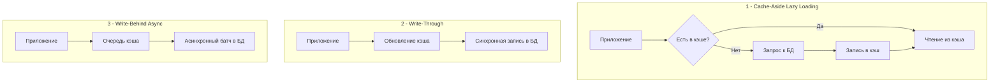

## Введение: Иллюзия бесплатной скорости и архитектурная цена

Кэширование поверх базы данных — один из самых мощных, но и самых опасных паттернов в проектировании высоконагруженных систем. Для инженера уровня Senior/Lead кэш — это не просто «хранилище в памяти», а дополнительный слой сложности, который вносит задержки на инвалидацию, риски потери согласованности и давление на GC. Неправильно спроектированный кэш превращается в источник скрытых багов, которые проявляются только под реальной нагрузкой или при сбоях сети.

В этой статье мы разберем:
*   Фундаментальные паттерны кэширования: Cache-Aside, Write-Through, Write-Behind, Read-Through.
*   Внутреннюю механику доступа: от сетевого стека и syscalls до аллокаций и работы GC в Go.
*   Идиоматичную реализацию локального кэша с защитой от stampede через `golang.org/x/sync/singleflight`.
*   Распределенные проблемы: Thundering Herd, Cache Penetration, Cache Avalanche и методы их подавления.
*   Стратегии инвалидации: TTL, версияция, CDC через WAL и паттерн Outbox.
*   Интеграцию с Redis: пайплайнинг, атомарность через Lua, оптимизация сериализации.
*   Типичные ловушки, антипаттерны и вопросы с хардовых собеседований.

> [!info] Под капотом
> Кэш — это всегда компромисс между **латентностью**, **консистентностью** и **потреблением памяти**. Операция чтения из RAM занимает ~100 наносекунд, в то время как сетевой запрос к БД или распределенному кэшу — от 0.1 до 5 миллисекунд. Но каждая операция записи в кэш требует синхронизации состояния, сериализации и часто — сетевого вызова. Инженер должен четко понимать, когда ускорение чтения перевешивает издержки на поддержание согласованности и управление памятью.

## Паттерны доступа: Cache-Aside, Write-Through и Write-Behid

Выбор паттерна определяет, как данные перемещаются между приложением, кэшем и БД.



### 1. Cache-Aside (Lazy Loading)
Самый распространенный паттерн. Приложение сначала проверяет кэш. При промахе идет в БД, получает данные и самостоятельно кладет их в кэш.
*   **Плюсы:** Отказоустойчивость к падению кэша (БД остается источником истины), простота реализации.
*   **Минусы:** Задержка при промахе (cold start), риск выдачи устаревших данных до инвалидации.

### 2. Write-Through
Запись сначала идет в кэш, который синхронно подтверждает запись и сам обновляет БД.
*   **Плюсы:** Гарантия согласованности, данные в кэше всегда актуальны.
*   **Минус:** Высокая латентность записи (сеть до кэша + сеть до БД), усложнение логики кэша.

### 3. Write-Behind (Write-Back)
Запись подтверждается сразу после попадания в кэш, а обновление БД происходит асинхронно, пакетами.
*   **Плюсы:** Максимальная производительность записи, группировка IO в БД.
*   **Минус:** Риск потери данных при падении кэша, сложность реализации отложенной синхронизации и обработки ошибок.

> [!tip] Собеседование
> **Вопрос:** Почему в 90% микросервисов на Go используется Cache-Aside, а не Write-Through?
> **Ответ:** В распределенных системах горутины работают с `database/sql` напрямую, а кэш выступает как вспомогательный слой ускорения чтения. Write-Through требует, чтобы кэш обладал бизнес-логикой маршрутизации в БД, что нарушает принцип разделения ответственности. Кроме того, синхронная запись в БД через кэш добавляет задержку, превращая быстрый кэш в узкое горлышко. Cache-Aside проще деплоить, масштабировать и отлаживать.

## Под капотом: Сетевой стек, syscalls и влияние на GC

Кэширование меняет профиль нагрузки на систему. Вместо редких тяжелых запросов к БД появляются частые легкие запросы к кэшу. Это имеет серьезные последствия на уровне ОС и рантайма Go.

### Сетевые вызовы и epoll
Каждое обращение к удаленному кэшу (например, Redis) требует:
1.  Системного вызова `write()` для отправки команды.
2.  Системного вызова `read()` или работы через `epoll`/`kqueue` для получения ответа.
3.  Сериализации/десериализации данных (обычно RESP, JSON, MessagePack или Protobuf).

При 10 000 RPS это десятки тысяч syscalls в секунду. Современные Go-драйверы используют `netpoll` (планировщик горутин, интегрированный с epoll), чтобы горутины не блокировали системные треды на ожидании ответа. Но переключение контекста и копирование данных из сокетного буфера ядра в пользовательское пространство (`copy_from_user`) всё равно потребляет циклы CPU.

> [!info] Под капотом: Влияние на Garbage Collector
> При чтении из кэша вы десериализуете данные в структуры Go. Каждая строка, слайс или мапа, созданная из байтового ответа, аллоцируется в куче. Если кэш обслуживает 50 000 запросов в секунду и каждый ответ весит 2 КБ, вы создаете ~100 МБ новых объектов в секунду. Это создает **высокое давление на GC**.
> **Оптимизация:** Используйте переиспользуемые буферы (`sync.Pool`), сериализуйте в бинарные форматы с нулевым копированием (например, `unsafe.Slice` при работе с байтами), или храните в кэше уже готовые байтовые представления, отдавая их клиентам напрямую через `io.Reader` без десериализации в структуры.

### Локальный кэш и CPU Cache Locality
Распределенный кэш (Redis) решает проблему памяти, но добавляет сетевую латентность. Локальный кэш (in-memory map в Go) работает за ~50 наносекунд, но:
*   Не синхронизирован между подами.
*   Требует мьютексов для конкурентного доступа, что может создать contention.
*   Хранит указатели на объекты в куче. При больших размерах локального кэша ссылки разбросаны по памяти, что приводит к **промахам кэш-линий CPU (L1/L2 cache miss)**. CPU тратит время на ожидание подгрузки страниц из RAM.

## Локальное кэширование в Go: RWMutex, TTL и Singleflight

Идиоматичная реализация локального кэша должна учитывать конкурентность, устаревание данных и защиту от многократной загрузки.

```go
package cache

import (
	"context"
	"sync"
	"time"

	"golang.org/x/sync/singleflight"
)

// Item хранит значение и время истечения
type Item struct {
	Value      interface{}
	Expiration time.Time
}

// LocalCache потокобезопасный кэш с TTL
type LocalCache struct {
	mu      sync.RWMutex
	items   map[string]*Item
	group   singleflight.Group
	defaultTTL time.Duration
}

func NewLocalCache(ttl time.Duration) *LocalCache {
	return &LocalCache{
		items:      make(map[string]*Item),
		defaultTTL: ttl,
	}
}

// GetOrLoad получает из кэша или загружает через loadFn с защитой от stampede
func (c *LocalCache) GetOrLoad(ctx context.Context, key string, loadFn func(ctx context.Context) (interface{}, error)) (interface{}, error) {
	// Быстрый путь: чтение без блокировки записи
	c.mu.RLock()
	item, exists := c.items[key]
	c.mu.RUnlock()

	if exists && time.Now().Before(item.Expiration) {
		return item.Value, nil
	}

	// Защита от Thundering Herd: только одна горутина выполнит loadFn
	val, err, _ := c.group.Do(key, func() (interface{}, error) {
		// Проверка внутри singleflight, т.к. другая горутина могла уже загрузить
		c.mu.RLock()
		item, exists = c.items[key]
		c.mu.RUnlock()
		if exists && time.Now().Before(item.Expiration) {
			return item.Value, nil
		}

		// Загрузка из источника
		data, err := loadFn(ctx)
		if err != nil {
			return nil, err
		}

		// Запись в кэш
		c.mu.Lock()
		c.items[key] = &Item{
			Value:      data,
			Expiration: time.Now().Add(c.defaultTTL),
		}
		c.mu.Unlock()
		return data, nil
	})

	if err != nil {
		return nil, err
	}
	return val, nil
}

// Delete явно удаляет ключ
func (c *LocalCache) Delete(key string) {
	c.mu.Lock()
	delete(c.items, key)
	c.mu.Unlock()
}
```

> [!info] Под капотом: singleflight
> `golang.org/x/sync/singleflight` — это примитив, который группирует идентичные вызовы функции по ключу. Если 100 горутин одновременно запрашивают `user:123`, только одна выполнит `loadFn`, остальные дождутся результата и получат его. Это критически важно для защиты БД от каскадных промахов при сбросе кэша или после деплоя.

## Распределенные проблемы: Stampede, Penetration и Avalanche

В продакшене локального кэша недостаточно. Используется Redis/Memcached, что приносит свои классические проблемы.

### 1. Cache Stampede (Thundering Herd)
Ключ истекает одновременно для миллионов запросов. Все идут в БД параллельно.
*   **Решение:** `singleflight` (для локального кэша), `SETNX` с блокировкой в Redis, Jitter в TTL (добавление случайного отклонения к времени жизни), асинхронная подгрузка до истечения (refresh-ahead).

### 2. Cache Penetration (Проход мимо кэша)
Запросы по несуществующим ключам (например, удаленные пользователи) всегда промахиваются и идут в БД.
*   **Решение:** Кэшировать "пустышки" (nil-значения) с коротким TTL, использовать Bloom Filter на входе для быстрой проверки существования ключа без обращения к БД.

### 3. Cache Avalanche (Обрушение)
Массовое истечение ключей в одно время или падение кластера кэша. Все запросы уходят в БД.
*   **Решение:** Рандомизация TTL при записи, настройка graceful degradation в приложении (возвращать заглушки или старые данные при недоступности кэша), резервный пул соединений к БД с ограниченным размером.

> [!warning] Ловушка / Gotcha
> **Jitter TTL обязателен**
> ```go
> // ❌ Опасно: все ключи истекут ровно через 300 секунд
> ttl := 300 * time.Second
> 
> // ✅ Безопасно: равномерное распределение сброса в диапазоне +-10%
> jitter := time.Duration(rand.Intn(60)) * time.Second
> ttl := (300 * time.Second) + jitter - (30 * time.Second)
> ```

## Стратегии инвалидации и согласованность данных

Инвалидация кэша — самая сложная часть паттерна. Есть три основных подхода:

### 1. TTL-базиоанная инвалидация
Данные живут фиксированное время. Просто, но допускает чтение устаревших данных (eventual consistency).
*   **Когда использовать:** Аналитика, лента новостей, справочники, где допустима задержка актуализации в секунды/минуты.

### 2. Явная инвалидация (Explicit Delete)
При обновлении в БД приложение удаляет ключ из кэша. Следующий запрос загрузит свежие данные.
*   **Проблема:** Гонка между записью в БД и удалением из кэша. Если `DB Write` -> `Cache Delete`, в момент между ними читатель может получить старые данные из кэша, которые сразу же закэшируются снова.
*   **Решение:** Паттерн `Write Invalidate` с задержкой или `Write Behind` с гарантированной очередью.

### 3. CDC (Change Data Capture) и WAL Stream
Приложение не инвалидирует кэш напрямую. Отдельный воркер слушает WAL БД (например, через Logical Replication PostgreSQL) и пушит события в шину, которая обновляет кэш.
*   **Плюсы:** Отказоустойчивость, гарантия доставки, полное разделение кода БД и кэша.
*   **Минусы:** Сложность инфраструктуры (Debezium, Kafka/Wal2json), eventual consistency.

> [!tip] Собеседование
> **Вопрос:** Как обеспечить строгую согласованность между БД и кэшем в распределенной системе?
> **Ответ:** Строгая (сильная) согласованность в распределенном кэше невозможна без блокировок, что убивает производительность. На практике используют **сессионную консистентность** (пользователь видит свои же изменения) или **линейную консистентность только для критичных полей** (баланс, статус заказа). Для всего остального — eventual consistency с TTL < 5 секунд и компенсационными механизмами. Если нужна строгая согласованность, кэш вообще не используется, запросы идут напрямую в БД с индексами.

## Интеграция с Redis: Пайплайнинг, Lua и пул соединений

В Go стандартом является `github.com/redis/go-redis`. Его эффективное использование требует понимания сетевой механики.

```go
import (
	"context"
	"encoding/json"
	"fmt"
	"time"
	"github.com/redis/go-redis/v9"
)

type RedisCache struct {
	rdb *redis.Client
}

func NewRedisCache(addr string) *RedisCache {
	return &RedisCache{
		rdb: redis.NewClient(&redis.Options{
			Addr:         addr,
			PoolSize:     100,             // Конкурентность
			MinIdleConns: 10,              // Теплый пул
			MaxConnAge:   30 * time.Minute, // Ротация для избежания stale conns
		}),
	}
}

// GetAndCache с пайплайнингом для групповых запросов
func (c *RedisCache) GetBatch(ctx context.Context, keys []string) (map[string]interface{}, error) {
	pipe := c.rdb.Pipeline()
	cmds := make([]*redis.StringCmd, len(keys))
	
	for i, k := range keys {
		cmds[i] = pipe.Get(ctx, k)
	}
	
	_, err := pipe.Exec(ctx)
	if err != nil && err != redis.Nil {
		return nil, fmt.Errorf("pipeline exec: %w", err)
	}
	
	results := make(map[string]interface{})
	for i, cmd := range cmds {
		val, err := cmd.Result()
		if err == redis.Nil {
			continue // Пропуск отсутствующих
		} else if err != nil {
			return nil, err
		}
		var data interface{}
		if jerr := json.Unmarshal([]byte(val), &data); jerr != nil {
			results[keys[i]] = val // Fallback как строка
		} else {
			results[keys[i]] = data
		}
	}
	return results, nil
}
```

> [!info] Под капотом: Пайплайнинг и RTT
> Обычный последовательный вызов `GET` для 10 ключей = 10 сетевых пакетов, 10 RTT (Round-Trip Time). Пайплайнинг собирает команды в один буфер, отправляет за один `write()`, сервер выполняет их последовательно, возвращает ответы в одном `read()`. Это сокращает задержку с `10 * RTT` до `1 * RTT + execution_time`. Аллокации буфера управляются драйвером, но при огромных пачках стоит контролировать размер чанка, чтобы не забить сетевой стек ОС.

## Ловушки и антипаттерны

1.  **Кэш как источник истины:** Никогда не храните в кэше данные, которые не могут быть восстановлены из БД. Кэш должен быть вычисляемым или кэшируемым состоянием.
2.  **Игнорирование размера ключа/значения:** Хранение огромных JSON-объектов или сериализованных структур приводит к фрагментации памяти Redis (jemalloc) и высоким сетевым задержкам. Используйте нормализацию: кэшируйте только часто читаемые поля, остальное загружайте из БД.
3.  **Отсутствие мониторинга:** Если вы не трекаете `hit/miss ratio`, `latency p99` и `memory usage` кэша, вы слепы. Падение hit rate ниже 70% обычно сигнализирует о неправильном TTL, изменении паттерна доступа или проблемах с ключами.
4.  **Сравнение с PHP/C#:** В PHP (без RoadRunner/Swoole) кэш всегда внешний (Redis), так как процесс умирает после запроса. В C# (.NET) популярен `MemoryCache` с `IMemoryCache`, который живет в пуле процессов, но требует ручной синхронизации в кластере. В Go горутины живут долго, что делает локальный кэш с `singleflight` высокоэффективным дополнением к распределенному.

> [!tip] Собеседование
> **Вопрос:** Что произойдет, если кэш станет медленнее БД?
> **Ответ:** Это классический антипаттерн, но он случается (например, при сетевых проблемах, фрагментации памяти Redis или сложных Lua-скриптах). Приложение начнет накапливать очереди горутин, ждать таймаутов, потреблять память и в итоге упадет по OOM или исчерпанию файловых дескрипторов. Защита: всегда настраивать агрессивные таймауты на клиенте кэша, иметь circuit breaker (например, через `sony/gobreaker`) и fallback на прямое чтение из БД при деградации кэша.

## Итог

Кэширование поверх БД — это архитектурный рычаг, который требует точной настройки и глубокого понимания распределенных систем. Идиоматичный подход в Go строится на комбинации локального кэша с `singleflight` для защиты от stampede и распределенного кэша (Redis) для шаринга состояния. Ключевые принципы для уровня Senior/Lead:
*   Кэш — это ускоритель, а не хранилище. БД всегда остается источником истины.
*   Используйте Jitter в TTL и пайплайнинг для сетевых вызовов.
*   Защищайте БД от каскадных промахов через `singleflight` и circuit breakers.
*   Выбирайте стратегию инвалидации, исходя из требований к консистентности, а не из удобства.
*   Мониторьте hit rate, latency и потребление памяти как критичные метрики.

Освоив кэширование, вы сможете строить системы с латентностью чтения < 5 мс даже при миллионах RPS. Но когда требования к чтению и записи радикально различаются, монолитная модель БД перестает масштабироваться. В следующей статье мы разберем, как разделить эти потоки на уровне архитектуры и реализовать паттерн, лежащий в основе современных высоконагруженных систем: [[8. CQRS и базы данных]].