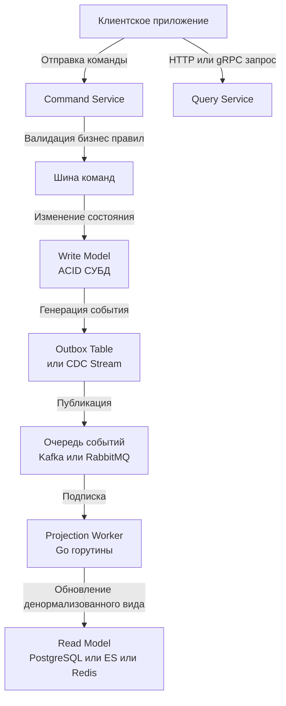

## Введение: Фундаментальное разделение моделей

CQRS (Command Query Responsibility Segregation) — это архитектурный паттерн, который разделяет операции записи (Commands) и чтения (Queries) на уровне доменной модели, кода и часто физических хранилищ данных. В отличие от классического CRUD, где одна сущность и одна таблица обслуживают оба потока, C постулирует, что требования к мутациям и выборкам фундаментально различны по семантике, нагрузке и структуре данных.

Для инженера уровня Senior/Lead CQRS — это не попытка усложнить систему, а инструмент управления асимметрией требований. Он оправдан в высоконагруженных контурах с соотношением чтения к записи 100:1, в системах со сложной бизнес-логикой или когда разные потребители требуют кардинально разных представлений одних и тех же данных. Но паттерн приносит с собой распределенную сложность, задержки согласованности и новые точки отказа.

В этой статье мы разберем:
*   Архитектурные границы паттерна: разделение моделей, потоки данных, уровни изоляции.
*   Механику синхронизации: проекции, eventual consistency, CDC и outbox.
*   Внутреннюю работу «под капотом»: влияние на паттерны IO, кэширование, аллокации и GC в Go.
*   Идиоматичную реализацию проекционных воркеров, идемпотентность и обработку отказов.
*   Стратегии выбора СУБД: полиглотное хранение и оптимизация под задачи чтения/записи.
*   Типичные ловушки, антипаттерны и каверзные вопросы с собеседований.

> [!info] Под капотом
> Разделение чтения и записи меняет физический профиль нагрузки на диск и сеть. Запись в CQRS обычно превращается в **последовательный аппенд** (быстрый, минимальные блокировки, высокая пропускная способность), тогда как чтение использует **индексированные выборки** или денормализованные структуры (быстрый поиск, но требующие поддержания сложных индексов). Понимание этого сдвига критично для настройки пулов соединений, мониторинга WAL и проектирования схем.

## Архитектура: Разделение ответственности и потоки данных

В чистом CQRS команда и запрос никогда не пересекаются в одном потоке выполнения или транзакции.



### Ключевые компоненты
1.  **Command Side**: Принимает намерения, валидирует бизнес-правила, применяет изменения к Write Model. Гарантирует целостность и атомарность через транзакции.
2.  **Query Side**: Отвечает на запросы чтения. Работает исключительно с Read Model, оптимизированной под конкретные сценарии (материализованные представления, денормализованные таблицы, поисковые индексы).
3.  **Projection Layer**: Асинхронный механизм, который слушает события изменений и обновляет Read Model. Обеспечивает согласованность между двумя мирами.

> [!tip] Собеседование
> **Вопрос:** CQRS и Event Sourcing — это одно и то же?
> **Ответ:** Нет. CQRS — это про разделение моделей чтения и записи. Event Sourcing — это про хранение состояния как последовательности неизменяемых событий. Их часто используют вместе, но они независимы. Можно реализовать CQRS без Event Sourcing, просто публикуя события изменений в шину после каждой транзакции в Write Model. И наоборот, можно использовать Event Sourcing без CQRS, восстанавливая состояние прямо из событий по запросу (хотя это медленно).

## Под капотом: Механика проекций и Eventual Consistency

Синхронизация между Write и Read моделями — сердце паттерна. Она всегда асинхронна, что означает **eventual consistency**. Данные в кэше или read-реплике могут отставать от write-модели на миллисекунды или секунды.

### Паттерны доставки событий
1.  **Outbox Pattern**: Команда пишет в основную таблицу и в служебную `outbox` в одной транзакции. Отдельный воркер (или CDC-инструмент типа Debezium) читает `outbox`, публикует события и удаляет записи. Гарантирует `at-least-once`.
2.  **Logical Replication / CDC**: Чтение бинарного журнала (WAL в PostgreSQL, binlog в MySQL) на уровне СУБД. Нулевое влияние на бизнес-транзакции, но требует сложной инфраструктуры.
3.  **Публикация из кода**: `db.Exec` -> `kafka.Publish`. Рискует потерей события при краше после коммита, но проще в реализации. Требует транзакционного outbox для надежности.

> [!info] Под капотом: Влияние на рантайм Go и GC
> Projection воркеры в Go — это типичные потребители очередей, работающие в цикле `for range` по каналу или брокеру. Каждое событие десериализуется (обычно JSON/Protobuf), что создает аллокации в куче. При нагрузке 10 000 событий/сек секунду вы генерируете десятки мегабайт временных структур, которые создают давление на **Garbage Collector**.
> **Оптимизация:**
> *   Используйте `sync.Pool` для переиспользования буферов десериализации.
> *   Применяйте бинарные форматы (Protobuf, MessagePack) вместо JSON.
> *   Батчьте обновления в Read Model: накапливайте 100-500 событий в памяти, затем выполняйте один `INSERT ... ON CONFLICT UPDATE` или транзакцию. Это сокращает количество сетевых раунд-трипов и транзакционных оверхедов в БД.

### Механика согласованности и задержки
Задержка проекции (`projection lag`) неизбежна. Она складывается из:
*   Времени публикации события в очередь (сетевой вызов, `fsync` брокера).
*   Времени доставки до воркера (latency сети, задержки потребителей).
*   Времени обработки в воркере (десериализация, бизнес-логика, запись в Read DB).
*   Времени применения транзакции в Read DB (генерация WAL, обновление индексов).

Для высоконагруженных систем нормальный лаг составляет `10-500 мс`. Если он растет, воркеры не справляются, и нужно горизонтально масштабировать группу потребителей или оптимизировать запросы проекции.

## Идиоматичная реализация в Go: Проекционный воркер

Ниже приведен пример устойчивого воркера проекции с идемпотентностью, батчингом и корректной обработкой контекста.

```go
package projection

import (
	"context"
	"database/sql"
	"errors"
	"fmt"
	"log"
	"time"
)

// Event представляет событие из шины
type Event struct {
	ID        string
	Type      string
	Payload   []byte
	Timestamp time.Time
}

// ProjectionWorker обрабатывает события и обновляет Read Model
type ProjectionWorker struct {
	db     *sql.DB
	batch  []Event
	batchSize int
	maxDelay  time.Duration
}

func NewProjectionWorker(db *sql.DB, batchSize int, maxDelay time.Duration) *ProjectionWorker {
	return &ProjectionWorker{
		db:        db,
		batchSize: batchSize,
		maxDelay:  maxDelay,
	}
}

// Run запускает цикл обработки. Блокирующий метод.
func (pw *ProjectionWorker) Run(ctx context.Context, eventCh <-chan Event) error {
	ticker := time.NewTicker(pw.maxDelay)
	defer ticker.Stop()

	for {
		select {
		case <-ctx.Done():
			return pw.flushBatch(ctx) // Финальный сброс перед выходом
		case ev := <-eventCh:
			pw.batch = append(pw.batch, ev)
			if len(pw.batch) >= pw.batchSize {
				if err := pw.flushBatch(ctx); err != nil {
					return fmt.Errorf("flush batch on event: %w", err)
				}
			}
		case <-ticker.C:
			if len(pw.batch) > 0 {
				if err := pw.flushBatch(ctx); err != nil {
					return fmt.Errorf("flush batch by ticker: %w", err)
				}
			}
		}
	}
}

// flushBatch применяет накопленные события в транзакции с идемпотентностью
func (pw *ProjectionWorker) flushBatch(ctx context.Context) error {
	if len(pw.batch) == 0 {
		return nil
	}
	defer func() { pw.batch = pw.batch[:0] }() // Переиспользование слайса

	tx, err := pw.db.BeginTx(ctx, nil)
	if err != nil {
		return err
	}
	defer tx.Rollback()

	// Подготовка идемпотентного запроса
	// Используем ON CONFLICT DO NOTHING, так как ID события уникален
	stmt, err := tx.PrepareContext(ctx, `
		INSERT INTO event_log (event_id, event_type, payload, applied_at)
		VALUES ($1, $2, $3, $4)
		ON CONFLICT (event_id) DO NOTHING
	`)
	if err != nil {
		return fmt.Errorf("prepare stmt: %w", err)
	}
	defer stmt.Close()

	for _, ev := range pw.batch {
		_, err := stmt.ExecContext(ctx, ev.ID, ev.Type, ev.Payload, ev.Timestamp)
		if err != nil {
			// В реальном коде здесь нужна стратегия повторных попыток
			// или переход в Dead Letter Queue
			log.Printf("failed to apply event %s: %v", ev.ID, err)
			return err
		}
		
		// Здесь идет логика обновления конкретных Read таблиц
		// например: updateReadTableView(tx, ev.Payload)
	}

	return tx.Commit()
}
```

> [!warning] Ловушка / Gotcha
> **Неидемпотентность проекций**
> Если воркер упадет после `Commit` в Write DB, но до коммита в Read DB, событие будет обработано повторно. Без защиты по `event_id` это приведет к дублированию данных или некорректным счетчикам. Всегда проектируйте проекции так, чтобы повторное применение одного и того же события не меняло состояние системы (используйте уникальные констрейнты, хеши или версионирование строк).

## Выбор СУБД: Полиглотное хранение

Одна из главных сил CQRS — возможность использовать разные хранилища для чтения и записи.

| Сторона | Требования | Рекомендуемые СУБД в Go | Почему |
|---------|------------|--------------------------|--------|
| **Write** | ACID, транзакции, FK, строгая консистентность | PostgreSQL, MySQL | Надежность, поддержка сложных транзакций, экосистема миграций |
| **Read (Структурированные)** | Быстрые JOIN, денормализация, сложные фильтры | PostgreSQL (материализованные виды), ClickHouse | Оптимизация под `SELECT`, покрывающие индексы, колоночное хранение для аналитики |
| **Read (Поиск/Текст)** | Полнотекстовый поиск, фасеты, ранжирование | Elasticsearch, OpenSearch | Инвертированные индексы, встроенные алгоритмы релевантности |
| **Read (Кэш/Сессии)** | Латентность <1 мс, простые ключ-значение | Redis, Valkey | In-memory, атомарные операции, публикация/подписка для live-обновлений |

> [!info] Под капотом: Разделение пулов соединений
> В Go при использовании `database/sql` для Write и Read моделей **нельзя использовать один `*sql.DB`**. Write пул должен быть консервативным (меньше `MaxOpenConns`, строгие таймауты), так как транзакции удерживают соединения долго. Read пул может быть агрессивным (больше соединений, чтение без блокировок), так как запросы обычно быстрые и не блокируют запись. Создавайте два независимых экземпляра `*sql.DB` с разными настройками пула и мониторингом метрик.

## Сложности, ловушки и антипаттерны

1.  **Игнорирование задержки согласованности в UI**
    Пользователь создает заказ, но сразу переходит на страницу истории и не видит его. Система "сломалась"? Нет, это проекция еще не применилась.
    **Решение:** Оптимистичный апдейт в UI, WebSocket/SSE для пуша обновлений, или "sticky routing" (чтение всегда идет на ту же реплику, что и запись).

2.  **Монструозные проекции**
    Попытка обновить 10 таблиц в одном событии делает транзакцию проекции долгой и блокирующей.
    **Решение:** Разделяйте проекции по доменным агрегатам. Пусть один воркер обновляет `user_profile`, другой `order_stats`. Это повышает параллелизм и упрощает откат.

3.  **Попытка сделать CQRS "на всякий случай"**
    Для типового CRUD-приложения с нагрузкой 100 RPS CQRS добавляет операционные издержки без отдачи.
    **Правило:** Начинайте с монолитной модели. Выделяйте CQRS только когда метрики показывают, что чтение блокирует запись, или когда разные потребители требуют несовместимых схем данных.

4.  **Сравнение с другими экосистемами**
    В Java/C# фреймворки вроде Axon или MassTransit берут на себя много магии проекций и саг. В Go принят подход **явной инженерии**: вы сами пишете воркеры, управляете контекстами и транзакциями. Это требует больше кода, но дает полный контроль над ресурсами, поведением при отказах и отсутствием скрытых оверхедов фреймворка.

> [!tip] Собеседование
> **Вопрос:** Как гарантировать, что событие не потеряется, если проекционный воркер упал посередине обработки батча?
> **Ответ:** Использовать паттерн `at-least-once` с идемпотентным применением. Воркер коммитит смещение потребления (например, в Kafka `consumer.commit()` или в БД чекпоинт) **только после** успешного коммита транзакции проекции. При рестарте воркер читает последнее закоммиченное смещение, получает те же события, но благодаря `event_id` уникальности и `ON CONFLICT DO NOTHING` (или проверяющим запросам) состояние системы не меняется. Для критичных систем добавляют Dead Letter Queue для событий, которые падают после 3-5 ретраев.

## Мониторинг и наблюдаемость

Без метрик CQRS слеп. Обязательно экспортируйте:
*   `projection_lag_seconds`: разница между `MAX(write_timestamp)` и `MAX(applied_at)`.
*   `events_processed_total`, `events_failed_total`.
*   `read_db_query_duration_seconds`, `write_db_query_duration_seconds`.
*   `batch_flush_duration_seconds`, `consumer_group_lag` (если используется Kafka).

```go
// Пример метрики лага
func TrackLag(ctx context.Context, dbWrite, dbRead *sql.DB) error {
	var writeTS, readTS time.Time
	// Читаем последние таймстампы...
	// Вычисляем разницу...
	// Отправляем в Prometheus
	return nil
}
```

> [!warning] Ловушка / Gotcha
> **Схема миграций в CQRS**
> Миграции Write и Read моделей должны быть раздельными. Изменение схемы в Read DB не должно блокировать или требовать отката изменений в Write DB. Используйте независимые папки миграций и разные инструменты версионирования, если это возможно. Это соответствует принципу [[5. Версионирование схемы]], но с изоляцией доменов.

## Итог

CQRS — это мощный архитектурный рычаг для разделения асимметричных нагрузок. В экосистеме Go он реализуется через явные проекционные воркеры, независимые пулы соединений `*sql.DB`, асинхронные очереди и строгую идемпотентность. Ключевые принципы для уровня Senior/Lead:
*   Разделяйте модели, когда требования к чтению и записи конфликтуют.
*   Всегда проектируйте проекции как идемпотентные операции.
*   Используйте батчинг и `sync.Pool` для снижения давления на GC и сеть.
*   Мониторьте проекционный лаг как критичную метрику бизнес-здоровья.
*   Не применяйте паттерн без доказанной необходимости в профилировании.

Освоив CQRS, вы получаете архитектуру, способную масштабировать чтение и запись независимо. Но как хранить состояние, если сами события становятся единственным источником истины, а транзакционные таблицы исчезают? В следующей статье мы перейдем к фундаментальному паттерну, который часто идет в паре с CQRS и меняет парадигму хранения данных: [[9. Event sourcing и базы]].