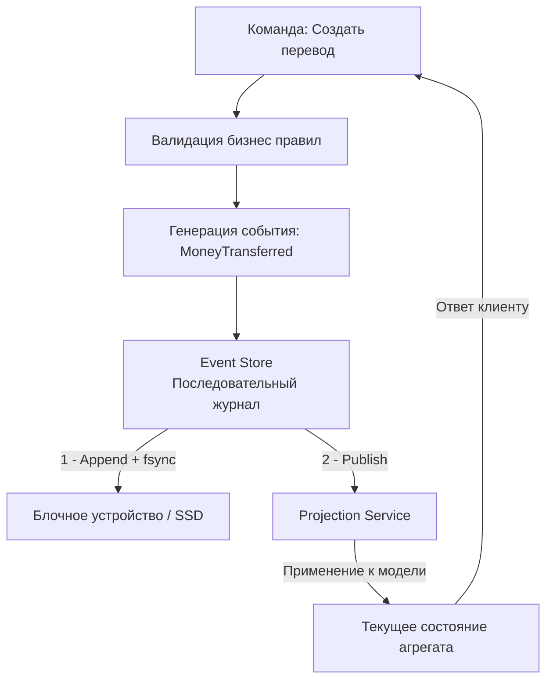

## Введение: Состояние как последовательность фактов

Event Sourcing (ES) — это архитектурный паттерн хранения данных, при котором состояние приложения представляется не как текущий снимок (как в классических CRUD-системах), а как неизменяемая последовательность событий (фактов), которые привели систему в это состояние. Вместо `UPDATE users SET balance = 100` вы записываете `BalanceDeposited { amount: 50, transaction_id: "abc" }`.

Для инженера уровня Senior/Lead ES — это не просто модная альтернатива таблицам. Это строгий контракт на неизменяемость, полный аудиторский трейл из коробки, возможность воспроизвести состояние на любой момент времени и естественная интеграция с асинхронной архитектурой. Однако паттерн привносит фундаментальные изменения в работу с хранилищем, требования к памяти и стратегии миграции.

В этой статье мы разберем:
*   Архитектуру Event Store: паттерн Append-Only, последовательные журналы и отличие от WAL.
*   Механику ввода-вывода под капотом: как ОС и диск обрабатывают последовательную запись, роль `fsync`, `O_APPEND` и page cache.
*   Идиоматичную реализацию хранилища в Go: загрузка состояния, применение снапшотов, обработка дубликатов.
*   Эволюцию схемы событий: upcasters, версионирование и толерантное чтение.
*   Влияние на рантайм Go: аллокации при реплее миллионов событий, давление на GC и оптимизации через `sync.Pool`.
*   Типичные ловушки, вопросы с хардовых собеседований и сравнение с другими экосистемами.

> [!info] Под капотом
> В реляционных СУБД данные хранятся в B-Tree структурах, оптимизированных под случайный доступ и быстрые обновления. Event Sourcing превращает хранилище в логически аналогичный WAL (Write Ahead Log), но на уровне приложения. Это кардинально меняет паттерн доступа к диску: вместо тысяч случайных `read/write` на 4 КБ страницах система выполняет крупные последовательные операции. Понимание этого сдвига критично для настройки I/O планировщика ОС, параметров файловой системы и выбора движка хранения.

## 1. Архитектура хранилища событий и паттерн Append-Only

Классическая СУБД оптимизирована под актуальное состояние. Event Store оптимизирован под хронологию изменений.



### Основные компоненты
1.  **Event Stream**: Логический контейнер событий для одного агрегата (например, `order-123`). Имеет монотонно возрастающую версию (позицию).
2.  **Global Sequence**: Глобальный счетчик всех событий в системе. Используется для шардирования, репликации и проекций.
3.  **Snapshots**: Периодические снимки состояния агрегата, позволяющие не реплеить историю с самого начала.

> [!warning] Ловушка / Gotcha
> **Изменение событий запрещено**
> События в ES — это исторические факты. Их **нельзя** редактировать или удалять после фиксации. Если допущена ошибка в бизнес-логике, вы записываете компенсационное событие (`TransactionCorrected`), но оригинал остается в логе навсегда. Попытка `UPDATE` или `DELETE` в хранилище событий разрушает аудит и ломает все существующие проекции.

## 2. Под капотом: Механика последовательной записи и IO

Почему Event Sourcing часто быстрее классических `INSERT/UPDATE` на высоких нагрузках? Потому что он эксплуатирует физику дисков и ОС.

### Последовательная запись и Page Cache
При вызове `INSERT` в B-Tree СУБД выполняет:
*   Поиск страницы в памяти (`Buffer Pool`).
*   Модификацию и пометку страницы как `dirty`.
*   При необходимости: чтение других страниц с диска для балансировки дерева (сложность `O(log N)`).

При Append-Only записи:
*   Данные добавляются в конец файла или журнала.
*   ОС (через Page Cache в Linux) буферизует запись последовательно.
*   `fsync` сбрасывает данные на диск одним непрерывным блоком.
*   Сложность записи `O(1)`, независимо от размера базы.

> [!info] Под капотом
> Современные SSD и NVMe драйверы оптимизированы под последовательные запросы. При случайных `4KB` записях контроллер диска выполняет больше операций `garbage collection` и `wear leveling`, что снижает срок службы и увеличивает задержки. При последовательном потоке событий диск работает в режиме конвейера, пропускная способность ограничена только шиной PCIe и скоростью хоста, а не механикой ячеек памяти.

### Файловые дескрипторы и O_APPEND
В Go при открытии файла для логов событий используется флаг `O_APPEND`. Это атомарная операция на уровне ядра: каждое `write()` автоматически позиционирует указатель в конец файла перед записью. Это гарантирует, что даже при параллельных горутинах, пишущих в один файл (что не рекомендуется для высоконагруженных систем), данные не перетрутся. Однако для продакшена предпочтительнее использовать специализированные Event Store СУБД или реляционные БД с `INSERT ... RETURNING position`, так как файловые журналы требуют ручного управления ротацией, блокировками и репликацией.

## 3. Идиоматичная реализация в Go

Реализация Event Store в Go требует аккуратной работы с контекстами, транзакциями и конкурентностью. Ниже показан паттерн загрузки состояния агрегата с учетом снапшотов и идемпотентности.

```go
package eventstore

import (
	"context"
	"database/sql"
	"encoding/json"
	"errors"
	"fmt"
	"time"
)

// StoredEvent представляет запись в хранилище
type StoredEvent struct {
	ID        string
	StreamID  string
	Version   int64
	Type      string
	Payload   []byte
	CreatedAt time.Time
}

// LoadAggregate загружает состояние, начиная со снапшота или начала истории
func LoadAggregate(ctx context.Context, db *sql.DB, streamID string, snapshotLoader func(context.Context, string) (*AggregateState, int64, error), applier func(*AggregateState, StoredEvent) error) (*AggregateState, error) {
	// 1. Проверяем снапшот
	state, baseVersion, err := snapshotLoader(ctx, streamID)
	if err != nil && !errors.Is(err, sql.ErrNoRows) {
		return nil, fmt.Errorf("load snapshot: %w", err)
	}
	if state == nil {
		state = &AggregateState{} // Начальное состояние
		baseVersion = 0
	}

	// 2. Загружаем события после снапшота
	query := `
		SELECT id, stream_id, version, type, payload, created_at 
		FROM events 
		WHERE stream_id = $1 AND version > $2 
		ORDER BY version ASC
	`
	rows, err := db.QueryContext(ctx, query, streamID, baseVersion)
	if err != nil {
		return nil, fmt.Errorf("query events: %w", err)
	}
	defer rows.Close()

	for rows.Next() {
		var ev StoredEvent
		if err := rows.Scan(&ev.ID, &ev.StreamID, &ev.Version, &ev.Type, &ev.Payload, &ev.CreatedAt); err != nil {
			return nil, fmt.Errorf("scan event: %w", err)
		}
		if err := applier(state, ev); err != nil {
			return nil, fmt.Errorf("apply event v%d: %w", ev.Version, err)
		}
	}
	if err := rows.Err(); err != nil {
		return nil, fmt.Errorf("iterate rows: %w", err)
	}
	return state, nil
}
```

### Сохранение с оптимистичной блокировкой (Version Check)
Конкурентность в ES решается через проверку версии потока. Это аналог `SELECT ... FOR UPDATE`, но быстрее и без блокировок на чтение.

```go
func SaveEvents(ctx context.Context, db *sql.DB, streamID string, expectedVersion int64, events []StoredEvent) error {
	tx, err := db.BeginTx(ctx, nil)
	if err != nil {
		return err
	}
	defer tx.Rollback()

	// Проверка версии одной транзакцией
	var currentVersion int64
	err = tx.QueryRowContext(ctx, 
		"SELECT COALESCE(MAX(version), 0) FROM events WHERE stream_id = $1 FOR UPDATE", 
		streamID,
	).Scan(&currentVersion)
	if err != nil {
		return err
	}

	if currentVersion != expectedVersion {
		return errors.New("concurrency conflict: stream version mismatch")
	}

	stmt, _ := tx.PrepareContext(ctx, `
		INSERT INTO events (id, stream_id, version, type, payload, created_at)
		VALUES ($1, $2, $3, $4, $5, $6)
	`)
	defer stmt.Close()

	for i, ev := range events {
		ev.Version = expectedVersion + int64(i) + 1
		if _, err := stmt.ExecContext(ctx, ev.ID, streamID, ev.Version, ev.Type, ev.Payload, time.Now()); err != nil {
			return err
		}
	}
	return tx.Commit()
}
```

> [!tip] Собеседование
> **Вопрос:** Зачем нужен `FOR UPDATE` при проверке версии в ES, если мы используем оптимистичную блокировку?
> **Ответ:** `FOR UPDATE` здесь используется не для пессимистичной блокировки всей таблицы, а для создания точки сериализации транзакций в PostgreSQL. Он гарантирует, что две параллельные транзакции, пытающиеся записать в один `stream_id`, не пройдут проверку версии одновременно. Вторая транзакция заблокируется на `SELECT ... FOR UPDATE`, дождется коммита первой, перечитает версию, увидит несоответствие и вернет ошибку конфликта. Это дешевле, чем `SERIALIZABLE`, и надежнее, чем чистый `SELECT` без блокировки.

## 4. Эволюция схемы событий и Upcasters

События неизменяемы, но бизнес-логика меняется. Как добавить поле `currency` в событие 3-летней давности? Никогда не меняйте оригинал. Используйте Upcasters.

### Механика Upcasting
При чтении событий из хранилища применяется слой трансформации, который конвертирует старые версии структуры в текущую схему агрегата.

```go
func UpcastEvent(ev StoredEvent) (interface{}, error) {
	switch ev.Type {
	case "OrderCreated":
		// v1 не имел поля Currency
		if !strings.Contains(string(ev.Payload), "currency") {
			// Встраиваем дефолтное значение в JSON до десериализации
			payload := strings.Replace(string(ev.Payload), "}", `,"currency":"USD"}`, 1)
			return json.Unmarshal([]byte(payload), &OrderCreatedEvent{})
		}
		return json.Unmarshal(ev.Payload, &OrderCreatedEvent{})
	default:
		return json.Unmarshal(ev.Payload, nil)
	}
}
```

> [!warning] Ловушка / Gotcha
> **Хранение сырых байтов против строгой типизации**
> В Go легко хранить события как `interface{}` или `map[string]any`. Это ведет к потере безопасности типов и сложному рефакторингу. Лучшая практика: хранить `Payload` как `[]byte` (обычно JSON или Protobuf), а десериализацию выносить в строго типизированные обработчики с явным маппингом версий. Никогда не полагайтесь на `reflection` для парсинга исторических событий в продакшене — это медленно и нестабильно при миграции схем.

## 5. Производительность, память и GC при реплее

Восстановление состояния (replay) — самая ресурсоемкая операция в ES. При загрузке агрегата с 10 000 событий вы десериализуете 10 000 структур, применяете их к объекту и создаете тысячи временных аллокаций.

### Давление на Garbage Collector
Каждое `json.Unmarshal` или `proto.Unmarshal` выделяет память в куче. При холодном старте сервиса, который реплеит сотни агрегатов, GC может потреблять до 20-30% CPU времени.

**Оптимизации в Go:**
1.  **`sync.Pool` для буферов**: Переиспользуйте `[]byte` буферы для чтения из `rows.Scan`.
2.  **Компактная сериализация**: Используйте Protobuf или Avro вместо JSON. Они создают меньше аллокаций и имеют предсказуемый размер.
3.  **Пакетное чтение**: Вместо `SELECT ... ORDER BY version` для каждого агрегата, используйте курсоры или `pgx.CopyFrom`-подобные механизмы для пакетной загрузки событий нескольких агрегатов, затем группируйте их в памяти.
4.  **Снапшоты как барьер для GC**: Настраивайте создание снапшотов каждые `N` событий или `T` времени. Это сокращает длину цепочки реплея и, соответственно, количество объектов, живущих в памяти одновременно.

> [!info] Под капотом
> При `rows.Scan(&[]byte)` Go аллоцирует новый слайс для каждой строки. Если вы используете `pgx` в режиме `Rows.Next()`, можно получить прямой доступ к внутреннему буферу драйвера через `conn.PgConn().ReadBuffer()` (в unsafe-режиме), что позволяет парсить данные с нулевым копированием (`zero-copy`). Однако это требует глубокого понимания жизненного цикла буфера: данные валидны только до вызова следующего `Next()`.

## 6. Ловушки, антипаттерны и вопросы с собеседований

1.  **Отсутствие стратегии снапшотов**
    *   *Проблема:* Агрегат растет годами. Время загрузки с 10 мс доходит до 2 секунд.
    *   *Решение:* Автоматический триггер снапшота при превышении лимита событий. Снапшот должен храниться в том же хранилище с привязкой к версии потока.

2.  **Попытка использовать ES для аналитики**
    *   *Проблема:* Запросы `COUNT`, `SUM`, `GROUP BY` по событиям выполняются через полный скан лога.
    *   *Решение:* ES — источник истины для состояния, не для отчетов. Всегда проецируйте события в оптимизированные Read Model (ClickHouse, Elasticsearch, материализованные виды).

3.  **Поздние события (Late Events)**
    *   *Проблема:* Событие с таймстампом вчера приходит сегодня из-за сетевых задержек. Проекция применяет его в конец, нарушая хронологию.
    *   *Решение:* Проекции должны быть идемпотентными и поддерживать версионирование по времени. При получении позднего события пересчитывайте сегмент состояния или используйте компенсирующие транзакции.

4.  **Сравнение с C#/PHP**
    *   *C# (.NET):* Фреймворки вроде EventStore.Client или Akka.NET берут на себя управление соединениями, снапшотами и проекциями. Много "магии", но быстрая разработка.
    *   *PHP:* Stateless модель запросов делает ES крайне неудобным. Каждое восстановление состояния требует полной загрузки из БД, что убивает производительность. В PHP ES используют редко, преимущественно через внешние шины (Kafka) и легковесные проекторы.
    *   *Go:* Требует явной реализации реплея, снапшотов и конкурентности. Это больше кода, но дает полный контроль над памятью, пулами соединений и поведением при сбоях. Идеально для высоконагруженных микросервисов.

> [!tip] Собеседование
> **Вопрос:** Как обеспечить exactly-once семантику в проекциях при использовании ES?
> **Ответ:** В распределенных системах true exactly-once невозможен без глобальных блокировок, которые убивают производительность. На практике используется **at-least-once с идемпотентностью проекции**. Проекция хранит `last_processed_global_sequence` или `processed_event_ids`. При рестарте или дубликатах она проверяет этот чекпоинт. Если событие уже применено, оно игнорируется. Комбинация `outbox` на стороне записи и идемпотентного потребителя на стороне чтения дает детерминированный результат, неотличимый от exactly-once.

## 7. Сравнение подходов и выбор стека

| Характеристика | Реляционная БД (PG/MySQL) | EventStoreDB / Kafka | Файловые журналы |
|----------------|---------------------------|----------------------|------------------|
| **Производительность записи** | Высокая (с батчингом) | Очень высокая (аппенд-лог) | Максимальная (прямой диск) |
| **Запросы по событиям** | Полнотекстовые, сложные | Ограниченные, по потоку | Только последовательный скан |
| **Транзакционность** | ACID, надежная | Eventual или строгая (зависит от конфига) | Отсутствует (требует ручной реализации) |
| **Интеграция с Go** | `database/sql`, `pgx` | Клиентские SDK, gRPC | `os.OpenFile`, `io.Reader` |
| **Рекомендация** | Стартапы, малые/средние нагрузки, простота поддержки | Высоконагруженные системы, строгий аудит, микросервисы | Встраиваемые системы, офлайн-режим, максимальный контроль |

## Итог

Event Sourcing — это мощный архитектурный выбор, который превращает данные из пассивного хранилища состояния в активный журнал бизнес-фактов. В экосистеме Go он реализуется через явные паттерны загрузки, оптимистичную блокировку версий, снапшоты и идемпотентные проекции. Ключевые принципы для уровня Senior/Lead:
*   События неизменяемы. Ошибки исправляются новыми событиями, а не правкой истории.
*   Используйте оптимистичную блокировку (`version check`) для гарантии порядка.
*   Управляйте памятью и GC через снапшоты, компактную сериализацию и переиспользование буферов.
*   Проецируйте состояние в специализированные Read Model, никогда не используйте Event Store для аналитики.
*   Проектируйте upcasters для эволюции схем без нарушения исторических данных.

Освоив Event Sourcing, вы получаете систему с полным аудитом, возможностью отката во времени и естественной асинхронностью. Но когда данные распределены между несколькими микросервисами и каждый из них поддерживает свою локальную консистентность, как гарантировать, что бизнес-процесс в целом не нарушит инварианты? В следующей статье мы разберем стратегии обеспечения согласованности данных в распределенных системах: [[10. Data consistency в микросервисах]].